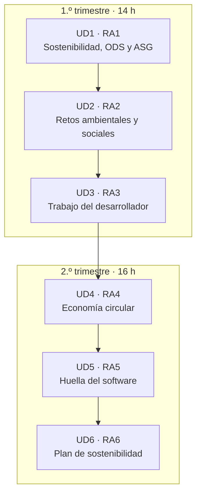

# El curso de un vistazo

> Esta página responde de una vez a **qué vas a aprender, cómo se trabaja y cómo se aprueba**. Si te pierdes en algún momento del curso, vuelve aquí.

## ¿De qué va este módulo?

**Sostenibilidad aplicada al sistema productivo (1708)** es un módulo transversal de **30 horas** que tienen todos los ciclos de FP. En cada ciclo se aplica a su sector; en el nuestro, al **desarrollo de aplicaciones web**. La pregunta de fondo es sencilla: **¿qué impacto tiene lo que construimos sobre las personas y el planeta, y cómo podemos reducirlo?**

No vamos a memorizar listas de buenas intenciones. Vamos a **medir y decidir**: calcular la huella de carbono de una aplicación, averiguar a qué hora la electricidad es más limpia, alargar la vida de los equipos con criterios de economía circular o construir el plan de sostenibilidad de una empresa. Y lo hacemos con **Java 21 y Spring Boot 4**, lo mismo que usas en *Desarrollo Web en Entorno Servidor* (DWES).

!!! info "Idea central"
    Cada unidad termina con **algo que tú programas y se corrige solo**, más **una interpretación** de lo que significan tus resultados. El código es la herramienta; la decisión sostenible es el objetivo.

## Cómo está organizado: dos trimestres, seis unidades



| Trimestre | Unidades | Horas | Proyectos |
|:---:|---|:---:|---|
| **1.º** | UD1 · UD2 · UD3 + examen | 12 h + 2 h | Radar ASG · observatorio energético · auditor web |
| **2.º** | UD4 · UD5 · UD6 + examen | 14 h + 2 h | ReUsa · laboratorio de huella · plan de sostenibilidad |

Las unidades encadenan resultados: la **intensidad de carbono** que calculas en la UD2 es la que usas para estimar la huella de tu software en la UD5, y los **indicadores ASG** de la UD1 reaparecen en el plan de sostenibilidad de la UD6.

## Cómo se trabaja cada unidad

Todas las unidades siguen el mismo ritmo, para que siempre sepas dónde estás:

<div class="annotate" markdown>

1. **Lees la teoría**, corta y con ejemplos de código Java que puedes ejecutar. (1)
2. **Resuelves actividades** cortas con la solución desplegable al lado. (2)
3. **Haces el proyecto** de la unidad: tú programas el servicio, los **tests** dicen si va bien. (3)
4. **Interpretas** tus resultados en `INTERPRETACION.md`. (4)
5. **Laboratorio**: uno guiado (resuelto) y otro para entregar, sobre la aplicación arrancada. (5)

</div>

1.  Cada bloque trae un *reto rápido* para comprobar que lo has entendido.
2.  Intenta la actividad **antes** de mirar la solución; aprendes mucho más.
3.  El proyecto **no** trae solución a la vista: los tests son la especificación.
4.  Tres apartados: resultado, impacto y acción propuesta. Es lo que convierte un número en una decisión.
5.  Siempre sobre tus propias aplicaciones y con datos abiertos oficiales.

!!! tip "Y además: Retos de programación"
    Aparte de las unidades tienes una colección de [**Retos de programación**](retos/index.md): calcular la huella de una web, programar tareas en la hora más limpia, cazar consultas N+1, comprobar si un hosting usa energía renovable… Problemas reales para pasarlo bien programando.

## Cómo se aprueba

La nota **no** sale de la impresión de quien corrige: sale de **criterios medibles**. Cada RA se evalúa con una **tarea práctica** (completar un servicio Spring Boot que cumpla una especificación e interpretar su resultado) sobre **10 puntos**:

| Criterio | Qué mide **exactamente** | Puntos |
|---|---|:---:|
| **1 · Funcionamiento** | `puntos = (tests que pasan ÷ total) × 7`. Es **proporcional**: si pasas 14 de 20, son `14÷20×7 = 4,9`. | 0 – 7 |
| **2 · Criterio del RA** | **Todo o nada.** Que tu código use la técnica propia del RA (ver tabla abajo). Se comprueba leyendo el código. | 0 **o** 1 |
| **3 · Documentación** | **Todo o nada.** Al menos **2** comentarios Javadoc (`/** … */`) o comentarios con contenido real escritos por ti (los `// TODO` no cuentan). | 0 **o** 1 |
| **4 · Interpretación** | **Todo o nada.** `INTERPRETACION.md` tiene los apartados **Resultado**, **Impacto** y **Acción propuesta**, cada uno con al menos **40 palabras** propias que usan los números de tu programa. | 0 **o** 1 |

**El criterio 2, RA por RA:**

| RA | Se te da el punto si tu código… |
|:--:|---|
| RA1 | usa un **`EnumMap`** para agregar por dimensión ASG |
| RA2 | usa la **API de Streams** (`.stream()`) para agregar los datos energéticos |
| RA3 | activa la compresión HTTP con **`server.compression.enabled=true`** |
| RA4 | lanza **`IllegalStateException`** ante una transición no permitida del ciclo de vida |
| RA5 | programa la tarea *carbon-aware* con **`@Scheduled`** |
| RA6 | ordena los aspectos prioritarios con un **`Comparator`** |

!!! reto "Ejemplo de nota"
    Pasas **18 de 21** tests, activas la compresión, escribes 3 comentarios Javadoc, pero en *Impacto* solo pones dos frases: `6,0 + 1 + 1 + 0 = ` **8,0**. Con un apartado de 40 palabras habrían sido 9,0.

!!! warning "La regla que hay que tener clarísima"
    Para superar el módulo necesitas **todos los RA con nota ≥ 5**. **No hay compensación**: un RA suspenso no se salva con otro muy alto. La nota final es la **media ponderada** con los pesos de la tabla de inicio.

Al final de cada trimestre hay **una sesión de examen práctico de 2 horas** con una tarea por cada RA del trimestre; cada tarea se califica por separado. Si suspendes algún RA, tienes las convocatorias **ordinaria** y **extraordinaria**, donde te examinas **solo de los RA pendientes**.

### Cómo se corrige tu tarea

Entregas **el fichero del servicio** (`src/main/java/…/servicio/…Service.java`), el fichero del criterio 2 si es distinto (por ejemplo `application.properties` en el RA3) y tu `INTERPRETACION.md`. El profesor los coloca en un proyecto con una **batería de tests** equivalente a la que ya conoces y lo corrige con un script, así que la nota es **la misma la corrija quien la corrija**. Recibes un **informe** con:

- la salida real de los tests (cuáles pasaron, cuáles no y por qué),
- y el desglose de los 4 criterios con tu puntuación en cada uno.

!!! tip "Cómo llegar con ventaja al examen"
    El examen usa el **mismo mecanismo** que el proyecto de la unidad. Si tu proyecto pasa `./mvnw test`, está documentado y tu interpretación cumple el formato, ya sabes exactamente cómo se verá tu examen.

## Qué necesitas para empezar

=== "Software"

    - **JDK 21** (o superior) y un IDE: IntelliJ IDEA Community o VS Code con el *Extension Pack for Java*.
    - **No hace falta instalar Maven**: cada proyecto trae el **Maven Wrapper** (`mvnw`).
    - Un navegador con herramientas de desarrollo (F12) y, opcionalmente, `curl`.
    - Comprueba que todo está listo con:

    ```bash title="Comprobación del entorno"
    java -version        # (1)!
    ./mvnw -v            # (2)!
    ```

    1. Debe ser 21 o superior. Si sale 17 o menos, instala un JDK más moderno.
    2. Dentro de la carpeta de un proyecto. La primera vez descarga Maven: necesita conexión.

=== "Actitud"

    - **Rigor**: cada dato con su fuente. Un «más o menos» sin fuente no vale en un informe de sostenibilidad.
    - **Espíritu crítico**: sospecha de lo que suena demasiado verde. Pregunta siempre *¿comparado con qué?* y *¿medido cómo?*
    - **Constancia**: 15 minutos de práctica diaria valen más que 3 horas la víspera del examen.

## El mapa del repositorio

- **1.º y 2.º trimestre** → las seis unidades, con teoría, actividades, proyecto y laboratorio.
- **Recursos** → [entorno de trabajo](recursos/entorno.md), [rigor, datos y greenwashing](recursos/rigor-y-fuentes.md) y [Java y Spring Boot sostenibles](recursos/java-spring-sostenible.md).
- **Proyectos** → [índice de los seis proyectos](proyectos/index.md) con su plantilla y sus tests.
- **Retos de programación** → [la colección extra](retos/index.md).
- **Todo el material (PDF)** → una página con todo junto, lista para imprimir o guardar.

!!! note "Cómo leer las cajas de color"
    A lo largo del curso verás cajas como estas: una **diana** marca un *reto rápido*, una **bombilla** una *analogía* que ayuda a entenderlo, y las cajas de **aviso** señalan errores típicos o datos que hay que manejar con cuidado.
