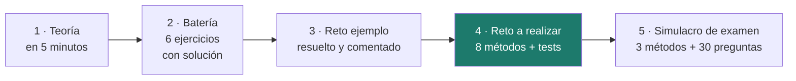

# 1708 · Sostenibilidad aplicada al sistema productivo

Módulo de **30 horas** del ciclo de Desarrollo de Aplicaciones Web. Aquí la sostenibilidad no se estudia: **se calcula**. Vas a escribir 48 métodos en Java que responden preguntas reales: cuánto CO₂ emite una web, a qué hora conviene lanzar un proceso, si compensa reparar un portátil o comprar otro.

## Cómo funciona

Un único proyecto Maven con seis clases, una por unidad. En cada una completas **8 métodos** y unos tests te dicen si están bien.

```bash
cd proyecto
mvn test                        # 192 tests: al principio fallan todos
mvn test -Dtest=Ut1AsgTest      # solo los de la unidad 1
```

| Unidad | Tema | Clase | Horas | Peso |
|:-:|---|---|:-:|:-:|
| [**1**](ut1/index.md) | Sostenibilidad, ODS y criterios ASG | `Ut1Asg` | 4 h | 12 % |
| [**2**](ut2/index.md) | Retos ambientales y huella de la electricidad | `Ut2Energia` | 4 h | 15 % |
| [**3**](ut3/index.md) | Sostenibilidad en tu trabajo y en tu vida | `Ut3Desarrollo` | 4 h | 15 % |
| [**4**](ut4/index.md) | Economía circular y ecodiseño | `Ut4Circular` | 4 h | 16 % |
| [**5**](ut5/index.md) | La huella de carbono del software | `Ut5Huella` | 5 h | 22 % |
| [**6**](ut6/index.md) | El plan de sostenibilidad de una empresa | `Ut6Plan` | 4 h | 20 % |
| | Exámenes prácticos (dos sesiones de 2 h) | | 4 h | |
| | **TOTAL** | | **30 h** | **100 %** |

Cada unidad tiene siempre la misma estructura:



La **batería** es para aprender: cada ejercicio trae su solución desplegable. El **reto ejemplo** te enseña el resultado completo con código y salida real. El **reto a realizar** es lo que entregas. Y el **simulacro de examen** es la evaluación de la unidad: tiene el formato del examen, y **las preguntas de test del examen salen de su banco**.

## Antes de empezar

Necesitas **JDK 21** o superior y un IDE (IntelliJ IDEA Community o VS Code con el *Extension Pack for Java*). Maven va incluido en los dos. Comprueba que todo funciona:

```bash
cd proyecto
mvn -q test -Dtest=Ut1AsgTest
```

Si ves fallos de tests, perfecto: es lo que debe pasar antes de escribir nada. Si ves errores de compilación o de Maven, revisa [el entorno](entorno.md).

## Cómo se aprueba

Cada unidad se califica sobre 10 con la misma regla:

| Criterio | Puntos |
|---|:-:|
| Tests que pasan: `(superados ÷ total) × 8` | 0 – 8 |
| Caso práctico resuelto e interpretado | 0 – 2 |

**Se aprueba cada unidad con 5 y hay que aprobarlas todas**: no se compensan entre sí. Más detalle en [cómo se evalúa](evaluacion.md).
