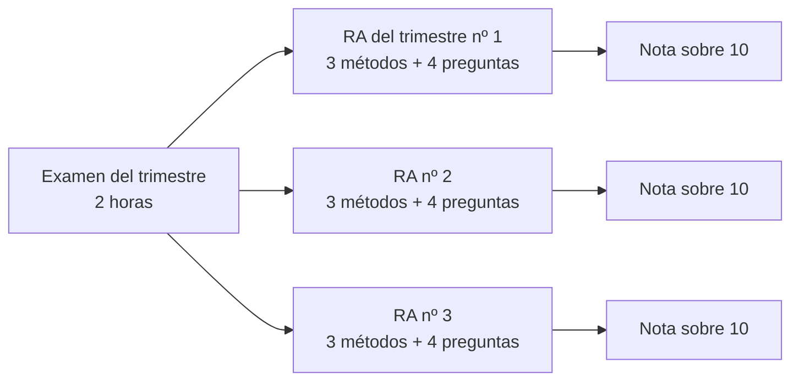

# Simulacro del trimestre

El examen de cada trimestre evalúa **los tres RA a la vez**, pero **da una nota por cada uno**. No se compensan: puedes sacar un 9 en un RA y suspender otro.

## Cómo es el examen

| Por cada RA | Qué es | Puntos |
|---|---|:-:|
| **Práctica** | 3 métodos con reglas **parecidas pero no iguales** a las de clase | 8 |
| **Test** | 4 preguntas sacadas del banco del simulacro de la unidad | 2 |

## Cómo hacer el simulacro completo

Junta los tres simulacros del trimestre y hazlos **seguidos, en 2 horas**:

| Trimestre | Simulacros | Comando |
|---|---|---|
| **1.º** | RA1 + RA2 + RA3 | `mvn test -Dtest="SimulacroRa1Test,SimulacroRa2Test,SimulacroRa3Test"` |
| **2.º** | RA4 + RA5 + RA6 | `mvn test -Dtest="SimulacroRa4Test,SimulacroRa5Test,SimulacroRa6Test"` |

Las preguntas de test están al final de cada unidad, en el apartado **5. Simulacro de examen**: 30 por unidad, y **las del examen salen de ahí**.

## Reparto del tiempo

| Minuto | Qué hacer |
|---|---|
| 0 – 10 | **Leer los nueve Javadoc** y subrayar lo que cambia respecto a clase. No escribas nada todavía |
| 10 – 90 | Métodos, del más fácil al más difícil. Lanza los tests cada poco |
| 90 – 110 | Las 12 preguntas de test |
| 110 – 120 | Repasar los métodos que aún fallan |

!!! tip "Tres métodos de cada examen son iguales que en clase"
    Empieza por ellos: son puntos seguros. Los reconocerás porque su Javadoc no avisa de ningún cambio.

## Errores que cuestan el aprobado

| Error | Cómo evitarlo |
|---|---|
| Usar los pesos o umbrales de clase | Leer el Javadoc entero antes de escribir |
| Redondear a los decimales de clase | Buscar la palabra «redondea» en cada enunciado |
| No lanzar la excepción pedida | Cada enunciado dice cuándo; hay tests que lo comprueban |
| Dejar un método que no compila | Si no te sale, deja el `throw` original: un método que no compila **tumba todos los tests del RA** |
