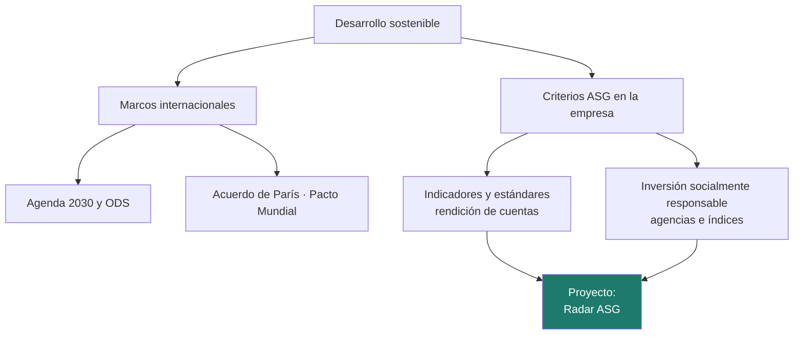

# Unidad 1 · Sostenibilidad, ODS y criterios ASG

> **Módulo:** 1708 · Sostenibilidad aplicada al sistema productivo · **Resultado de aprendizaje:** RA1 · **Duración:** 4 h · **Peso:** 12 %
> **Herramienta principal:** Java 21 + Spring Boot (`enum`, `record`, `EnumMap`) · **Ciclo:** DAW

Esta es la unidad de cimientos. Aquí entiendes **qué significa que algo sea sostenible**, qué **marcos internacionales** orientan a gobiernos y empresas (la Agenda 2030 con sus ODS, el Acuerdo de París, el Pacto Mundial) y cómo se traduce todo eso al lenguaje con el que se evalúa a una empresa: los criterios **ASG**, ambientales, sociales y de gobernanza. Y lo haces como trabaja hoy un analista: **con datos y con código**. Al terminar habrás construido un **Radar ASG** que clasifica temas, mide el cumplimiento de los indicadores de una empresa y le asigna un rating.

!!! info "Resultado de aprendizaje 1"
    Identifica los aspectos ambientales, sociales y de gobernanza (ASG) relativos a la sostenibilidad teniendo en cuenta el concepto de desarrollo sostenible y los marcos internacionales que contribuyen a su consecución.

---

## Mapa de la unidad



### Qué vas a saber hacer al terminar

- [ ] Explicar el concepto de **desarrollo sostenible** y sus tres dimensiones.
- [ ] Situar los principales **marcos internacionales**: Agenda 2030, Acuerdo de París, Pacto Mundial y Pacto Verde Europeo.
- [ ] Relacionar los **ODS** con la actividad de una empresa tecnológica.
- [ ] Clasificar asuntos de una organización en **ambientales, sociales y de gobernanza**.
- [ ] Reconocer los **estándares de métricas** y la obligación de informar sobre sostenibilidad.
- [ ] Describir la **inversión socialmente responsable** y el papel de analistas, agencias e índices.
- [ ] Modelar todo lo anterior en Java con `enum`, `record` y `EnumMap`, y comprobarlo con tests.

### Cómo se trabaja esta unidad

| | Paso | Dónde |
|:---:|---|---|
| **1** | El profesor **explica** el concepto y ejecuta los ejemplos. | secciones 1–6 |
| **2** | Tú **lees** el apartado y **ejecutas los ejemplos** en tu equipo. | tu IDE |
| **3** | Haces los **retos rápidos** que aparecen entre la teoría. | en el texto |
| **4** | Practicas con **actividades que tienen la solución desplegable**. | sección 8 |
| **5** | Trabajas el **proyecto** hasta tener los tests en verde e interpretas el resultado. | `proyectos/ud1/` |
| **6** | Tarea práctica de evaluación, con la misma mecánica del paso 5. | examen del trimestre |

---

## 1. ¿Qué es el desarrollo sostenible?

La definición más citada procede del **Informe Brundtland** (*Nuestro futuro común*, Naciones Unidas, 1987): es el desarrollo que atiende las necesidades de las generaciones actuales **sin poner en peligro** que las generaciones futuras puedan atender las suyas.

La idea se apoya en **tres dimensiones** que tienen que avanzar a la vez:

| Dimensión | Pregunta que plantea | Ejemplo en una empresa de software |
|---|---|---|
| **Ambiental** | ¿Consumimos recursos a un ritmo que el planeta puede reponer? | Electricidad de los servidores, residuos electrónicos |
| **Social** | ¿Las personas viven y trabajan con dignidad e igualdad? | Condiciones laborales, accesibilidad de las aplicaciones |
| **Económica** | ¿La actividad es viable a largo plazo y reparte valor? | Modelo de negocio, proveedores locales, empleo estable |

!!! analogia "Analogía"
    Imagina una cuenta de ahorro que genera intereses. Vivir de forma sostenible es gastar **solo los intereses**. Si empiezas a gastar el capital (bosques, acuíferos, un clima estable) puedes vivir mejor unos años, pero cada año el capital es menor y los intereses también.

!!! reto "Reto rápido 1"
    Una empresa reduce a la mitad el consumo eléctrico de su centro de datos despidiendo a la mitad de la plantilla y cerrando el servicio de soporte. ¿Es una decisión sostenible? Justifícalo con las tres dimensiones.

---

## 2. Los marcos internacionales

Nadie mide la sostenibilidad «a ojo». Existen marcos acordados internacionalmente que fijan **objetivos comunes** y un **vocabulario compartido**.

### 2.1 La Agenda 2030 y los ODS

En 2015 la Asamblea General de Naciones Unidas aprobó la **Agenda 2030**, con **17 Objetivos de Desarrollo Sostenible (ODS)** y **169 metas**. Implican a gobiernos, empresas y ciudadanía. Estos son algunos de los más relacionados con el sector digital:

| ODS | Nombre abreviado | Relación con el desarrollo web |
|:---:|---|---|
| **4** | Educación de calidad | Plataformas de formación, brecha digital |
| **5** | Igualdad de género | Presencia de mujeres en tecnología, sesgos en algoritmos |
| **7** | Energía asequible y no contaminante | Consumo de centros de datos, contratar renovables |
| **8** | Trabajo decente y crecimiento económico | Condiciones laborales, teletrabajo |
| **9** | Industria, innovación e infraestructura | Infraestructura digital resiliente |
| **10** | Reducción de las desigualdades | Accesibilidad web, servicios para todas las personas |
| **12** | Producción y consumo responsables | Vida útil del hardware, residuos electrónicos |
| **13** | Acción por el clima | Huella de carbono del software |
| **16** | Paz, justicia e instituciones sólidas | Transparencia, ética, protección de datos |

### 2.2 Otros marcos que conviene conocer

- **Acuerdo de París** (2015): compromiso de mantener el aumento de la temperatura media global muy por debajo de 2 °C respecto a los niveles preindustriales y de esforzarse por limitarlo a 1,5 °C.
- **Pacto Mundial de Naciones Unidas** (*Global Compact*): iniciativa voluntaria para empresas con **10 principios** sobre derechos humanos, normas laborales, medio ambiente y lucha contra la corrupción.
- **Pacto Verde Europeo** (2019): estrategia de la UE para alcanzar la **neutralidad climática en 2050**. En España lo concreta, entre otras, la **Ley 7/2021 de cambio climático y transición energética**.

!!! analogia "Analogía"
    Los ODS son como el **plan de estudios** del planeta: dicen qué hay que conseguir. El Acuerdo de París es un **examen con nota mínima** en un tema concreto (el clima), y el Pacto Mundial es el **código de conducta** que una empresa firma voluntariamente.

!!! reto "Reto rápido 2"
    Elige tres ODS de la tabla y escribe, para cada uno, una funcionalidad concreta de una aplicación web que contribuya a él.

---

## 3. De la sostenibilidad a la empresa: los criterios ASG

Cuando se evalúa a una **organización**, las tres dimensiones del desarrollo sostenible se concretan en los criterios **ASG** (en inglés, **ESG**: *Environmental, Social, Governance*). La dimensión económica no desaparece: se sustituye por la **gobernanza**, es decir, **cómo se toman las decisiones** y quién las controla.

| Dimensión | Asuntos típicos | Ejemplo en una empresa tecnológica |
|---|---|---|
| **A · Ambiental** | Emisiones, energía, agua, residuos, biodiversidad | Electricidad renovable del CPD, reciclaje de equipos |
| **S · Social** | Empleo, igualdad, salud laboral, formación, comunidad | Brecha salarial, horas de formación, accesibilidad |
| **G · Gobernanza** | Ética, anticorrupción, consejo, transparencia, cumplimiento | Código ético, canal de denuncias, independencia del consejo |

!!! warning "Casos frontera"
    Algunos asuntos pueden encajar en más de una dimensión según el marco que se use. La **protección de datos personales**, por ejemplo, unos marcos la tratan como asunto social (afecta a las personas usuarias) y otros como gobernanza (cumplimiento normativo). Lo importante es **justificar** la clasificación y usar la misma de forma coherente.

!!! reto "Reto rápido 3"
    Clasifica en A, S o G: (a) consumo de agua para refrigerar servidores; (b) porcentaje de mujeres en puestos técnicos; (c) política contra sobornos con proveedores; (d) número de equipos donados a entidades sociales.

---

## 4. Modelar ASG en Java

En el proyecto vas a representar las dimensiones con un **`enum`** y cada indicador con un **`record`**. Así el compilador te impide escribir `"Ambiental"`, `"ambiental"` y `"AMBIENTAL"` como si fueran cosas distintas.

```java title="Contar indicadores por dimensión"
public enum Dimension { AMBIENTAL, SOCIAL, GOBERNANZA }            // (1)!

public record Indicador(String codigo, String nombre, Dimension dimension,
                        double valor, double meta) { }            // (2)!

Map<Dimension, Integer> contar(List<Indicador> indicadores) {
    Map<Dimension, Integer> cuenta = new EnumMap<>(Dimension.class);  // (3)!
    for (Dimension d : Dimension.values()) {
        cuenta.put(d, 0);                                          // (4)!
    }
    for (Indicador i : indicadores) {
        cuenta.merge(i.dimension(), 1, Integer::sum);
    }
    return cuenta;
}
```

1.  Un `enum` define un conjunto **cerrado** de valores. No puede existir una cuarta dimensión «por error».
2.  Un `record` es una clase inmutable con constructor, *getters* (`i.valor()`), `equals` y `toString` generados. Perfecto para datos.
3.  `EnumMap` es un mapa optimizado para claves `enum`: guarda las claves **en el orden de declaración** y ocupa menos memoria que un `HashMap`. Es el **criterio del RA1**.
4.  Inicializar las tres dimensiones evita que una dimensión sin indicadores «desaparezca» del resultado, lo que en un informe se leería como que no se ha evaluado.

!!! warning "Atención"
    Compara `enum` con `==` (`i.dimension() == Dimension.SOCIAL`), pero **nunca** compares `String` con `==`: usa `equals`. Con `==` dos textos iguales pueden dar `false`.

---

## 5. Medir y rendir cuentas: indicadores y estándares

Lo que no se mide no se gestiona. Una empresa sostenible fija **indicadores** con una **línea base** y una **meta**, y publica sus avances. Para que las cifras de distintas empresas sean comparables existen **estándares**:

| Estándar o norma | Qué es |
|---|---|
| **GRI** (*Global Reporting Initiative*) | Estándares voluntarios muy extendidos para elaborar memorias de sostenibilidad |
| **GHG Protocol** | Método de referencia para calcular emisiones en **alcance 1** (directas), **alcance 2** (electricidad comprada) y **alcance 3** (resto de la cadena de valor) |
| **Ley 11/2018** | Obliga a determinadas empresas en España a publicar el **estado de información no financiera** (EINF) |
| **CSRD y ESRS** | Directiva europea de información corporativa sobre sostenibilidad y sus normas de reporte (ESRS), que introducen la **doble materialidad** (UD6) |

!!! warning "Normativa en movimiento"
    En 2025 la UE aprobó un paquete de simplificación («Ómnibus») que **retrasa y reduce** el número de empresas obligadas por la CSRD. Antes de afirmar si una empresa concreta está obligada a informar, consulta la situación vigente.

El cálculo básico de un indicador es **cuánto se ha avanzado hacia la meta**. Hay que distinguir si conviene que el valor **suba** (porcentaje de renovables) o que **baje** (toneladas emitidas):

```java title="¿Se ha cumplido la meta?"
boolean metaCumplida(double valor, double meta, boolean mayorEsMejor) {
    return mayorEsMejor ? valor >= meta : valor <= meta;
}
```

!!! reto "Reto rápido 4"
    Un indicador de emisiones tiene una meta de 350 t y la empresa ha emitido 410 t. Otro de renovables tiene meta 100 % y la empresa está en 72 %. ¿Cuál está más cerca de su meta? Explica cómo lo has calculado.

---

## 6. Inversión socialmente responsable: analistas, agencias e índices

La **inversión socialmente responsable (ISR)** tiene en cuenta los criterios ASG además de la rentabilidad. Esto crea un incentivo muy potente: si una empresa puntúa mal en ASG, le puede costar más financiarse.

| Actor | Papel |
|---|---|
| **Inversores y gestoras** | Deciden dónde invertir aplicando estrategias ASG |
| **Analistas** | Estudian la información ASG de las empresas |
| **Agencias de rating ASG** | Puntúan a las empresas; por ejemplo, MSCI usa una escala de letras de AAA a CCC y Sustainalytics mide el riesgo ASG |
| **Índices de sostenibilidad** | Agrupan empresas que cumplen criterios ASG: familia Dow Jones Sustainability Indices, FTSE4Good (con su versión FTSE4Good IBEX para España) |
| **Reguladores** | En la UE, el Reglamento SFDR obliga a los fondos a informar de sus características de sostenibilidad |

Estrategias habituales de ISR:

- **Exclusión**: no invertir en ciertos sectores (armas, carbón…).
- **Integración ASG**: incluir los criterios en el análisis financiero.
- **Implicación** (*engagement*): usar el voto como accionista para cambiar la empresa desde dentro.
- **Inversión de impacto**: buscar un efecto social o ambiental medible, además de rentabilidad.

!!! analogia "Analogía"
    Un rating ASG funciona como la **nota de solvencia** que te piden para un préstamo, pero midiendo cómo gestiona la empresa sus riesgos ambientales, sociales y de gobernanza. Distintas agencias usan métodos distintos, por eso la misma empresa puede tener notas diferentes.

!!! reto "Reto rápido 5"
    ¿Por qué dos agencias pueden dar ratings ASG muy distintos a la misma empresa? Piensa en qué indicadores elige cada una y cuánto pesa cada dimensión.

---

## 7. Errores frecuentes (para tener a mano)

| Error | Causa | Solución |
|---|---|---|
| Una dimensión no aparece en el resultado | No se inicializó en el mapa | Recorre `Dimension.values()` y pon 0.0 |
| Cumplimiento mayor que 100 % | No se acota el resultado | `Math.min(1.0, …)` |
| Emisiones «mejoran» al subir | Tratar un indicador *menor es mejor* como *mayor es mejor* | Usa el campo `mayorEsMejor` |
| `ArithmeticException` o `Infinity` | Dividir entre una meta 0 | Trata el caso límite antes de dividir |
| Clasificación que falla con tildes | «Formación» ≠ «formacion» | Normaliza: minúsculas y sin tildes |
| Afirmar que una empresa es «sostenible» | Confundir un indicador con el conjunto | Habla de dimensiones e indicadores concretos, con fuente |

---

## 8. Practica **con** solución a la vista

> Estas actividades trabajan con los **mismos datos y formatos** que el proyecto de la unidad: líneas del CSV de indicadores, metas de una memoria de sostenibilidad, puntuaciones ASG. Intenta cada una y, cuando la tengas (o te atasques de verdad), despliega la solución y compárala.

Para todas ellas usa estos tipos, que son los del proyecto:

```java
public enum Dimension { AMBIENTAL, SOCIAL, GOBERNANZA }

public record Indicador(String codigo, String nombre, Dimension dimension,
                        double valor, double meta, boolean mayorEsMejor, Set<Integer> ods) { }
```

#### Actividad 1 — Leer una línea del informe
El departamento de sostenibilidad exporta sus indicadores en líneas como esta:

```text
A-01;Electricidad renovable consumida en el CPD (%);AMBIENTAL;72;100;true;7|13
```

Escribe `Indicador parsear(String linea)` que la convierta en un `Indicador`. Los ODS vienen separados por `|`.

<details class="sol"><summary>Solución</summary>

```java
Indicador parsear(String linea) {
    String[] c = linea.split(";");
    Set<Integer> ods = Arrays.stream(c[6].split("\\|"))     // \\| porque | es especial en regex
            .map(String::trim)
            .map(Integer::valueOf)
            .collect(Collectors.toSet());
    return new Indicador(c[0], c[1], Dimension.valueOf(c[2]),
            Double.parseDouble(c[3]), Double.parseDouble(c[4]),
            Boolean.parseBoolean(c[5]), ods);
}
```

Si `c[2]` trae un texto que no es ninguna constante del enum, `Dimension.valueOf` lanza `IllegalArgumentException`: es justo lo que quieres, porque avisa de un dato mal exportado en vez de colarlo silenciosamente.
</details>

#### Actividad 2 — Emisiones: cuando menos es mejor
La empresa emitió **410 t CO₂e** y su meta era **350 t**. Con el mismo `Indicador`, escribe `double cumplimiento(Indicador i)` que devuelva un valor entre 0 y 1 teniendo en cuenta el campo `mayorEsMejor`. Si se alcanza una meta de las que hay que bajar, el cumplimiento es 1.

<details class="sol"><summary>Solución</summary>

```java
double cumplimiento(Indicador i) {
    if (i.mayorEsMejor()) {
        if (i.meta() == 0) return 1.0;
        return Math.min(1.0, i.valor() / i.meta());
    }
    if (i.valor() <= i.meta()) return 1.0;
    return i.meta() / i.valor();
}
// Emisiones 410 con meta 350 -> 350/410 = 0.854 (85,4 % de cumplimiento)
// Renovable 72 con meta 100  ->  72/100 = 0.72
```

Ojo con el caso «cero accidentes» o «cero residuos a vertedero»: la meta es 0 y *menor es mejor*. Si el valor real es 10, `meta / valor` da 0, que es lo correcto.
</details>

#### Actividad 3 — Semáforo para el cuadro de mando
La dirección quiere ver cada indicador en verde, ámbar o rojo. Escribe `String semaforo(double cumplimiento)`: **verde** a partir del 90 %, **ámbar** a partir del 70 % y **rojo** por debajo. Si el cumplimiento no está entre 0 y 1, lanza `IllegalArgumentException`.

<details class="sol"><summary>Solución</summary>

```java
String semaforo(double cumplimiento) {
    if (cumplimiento < 0 || cumplimiento > 1) {
        throw new IllegalArgumentException("Cumplimiento fuera de rango: " + cumplimiento);
    }
    if (cumplimiento >= 0.90) return "VERDE";
    if (cumplimiento >= 0.70) return "AMBAR";
    return "ROJO";
}
// Emisiones (0.854) -> AMBAR ; renovable (0.72) -> AMBAR ; residuos (38/60 = 0.633) -> ROJO
```

Fíjate en que los umbrales son una **decisión de la empresa**, no una norma: en el informe hay que decir cuáles se han usado.
</details>

#### Actividad 4 — Auditoría de calidad de los datos
Antes de publicar nada, hay que revisar el fichero. Escribe `List<String> errores(List<Indicador> lista)` que devuelva un mensaje por cada problema encontrado:

- un indicador sin ningún ODS asignado,
- un indicador con algún ODS fuera del rango 1–17,
- dos indicadores con el mismo código.

<details class="sol"><summary>Solución</summary>

```java
List<String> errores(List<Indicador> lista) {
    List<String> problemas = new ArrayList<>();
    Set<String> vistos = new HashSet<>();
    for (Indicador i : lista) {
        if (i.ods().isEmpty()) {
            problemas.add(i.codigo() + ": sin ODS asignado");
        }
        for (int n : i.ods()) {
            if (n < 1 || n > 17) {
                problemas.add(i.codigo() + ": ODS inválido " + n);
            }
        }
        if (!vistos.add(i.codigo())) {                       // add devuelve false si ya estaba
            problemas.add(i.codigo() + ": código duplicado");
        }
    }
    return problemas;
}
```

Este tipo de comprobación es lo primero que hace un verificador externo cuando revisa una memoria de sostenibilidad.
</details>

#### Actividad 5 — Puntuación ASG con pesos configurables
La empresa quiere poder cambiar el peso de cada dimensión sin tocar el código. Escribe `double puntuacionAsg(Map<Dimension, Double> porDimension, Map<Dimension, Double> pesos)` que devuelva la media ponderada redondeada a 1 decimal, y que lance `IllegalArgumentException` si los pesos no suman 1 (con un margen de 0,001).

<details class="sol"><summary>Solución</summary>

```java
double puntuacionAsg(Map<Dimension, Double> porDimension, Map<Dimension, Double> pesos) {
    double sumaPesos = pesos.values().stream().mapToDouble(Double::doubleValue).sum();
    if (Math.abs(sumaPesos - 1.0) > 0.001) {                 // (1)
        throw new IllegalArgumentException("Los pesos suman " + sumaPesos + " y deben sumar 1");
    }
    double total = 0;
    for (Dimension d : Dimension.values()) {
        total += porDimension.getOrDefault(d, 0.0) * pesos.getOrDefault(d, 0.0);
    }
    return Math.round(total * 10) / 10.0;
}
// (1) Con double nunca se compara con == : 0.4 + 0.3 + 0.3 puede dar 0.9999999999999999
```

Cambiar los pesos cambia el rating. Por eso las agencias publican su metodología: si no, nadie puede interpretar la nota.
</details>

#### Actividad 6 — Comparar dos años
Una memoria compara siempre con el ejercicio anterior. Escribe `boolean haMejorado(Indicador anterior, Indicador actual)` que diga si el indicador ha mejorado, teniendo en cuenta si conviene que suba o que baje. Los dos indicadores tienen el mismo código.

<details class="sol"><summary>Solución</summary>

```java
boolean haMejorado(Indicador anterior, Indicador actual) {
    if (!anterior.codigo().equals(actual.codigo())) {
        throw new IllegalArgumentException("Son indicadores distintos");
    }
    return actual.mayorEsMejor()
            ? actual.valor() > anterior.valor()
            : actual.valor() < anterior.valor();
}
// Renovable 65 -> 72 : ha mejorado
// Emisiones 380 -> 410 : ha empeorado, aunque el número sea mayor
```

Este es el error de lectura más típico de una memoria: ver un número que sube y dar por hecho que es una buena noticia.
</details>

#### Actividad 7 — Normalizar para poder comparar empresas
Las emisiones absolutas de una empresa de 2000 personas y una de 50 no son comparables. Escribe `double intensidadPorEmpleado(double toneladas, int personas)` que devuelva las toneladas por persona con 2 decimales, y `String masEficiente(String empresaA, double tA, int pA, String empresaB, double tB, int pB)` que devuelva el nombre de la que menos emite por persona (o `"EMPATE"`).

<details class="sol"><summary>Solución</summary>

```java
double intensidadPorEmpleado(double toneladas, int personas) {
    if (personas <= 0) throw new IllegalArgumentException("Plantilla no válida");
    return Math.round(toneladas / personas * 100) / 100.0;
}

String masEficiente(String empresaA, double tA, int pA, String empresaB, double tB, int pB) {
    double a = intensidadPorEmpleado(tA, pA);
    double b = intensidadPorEmpleado(tB, pB);
    if (a < b) return empresaA;
    if (b < a) return empresaB;
    return "EMPATE";
}
// A: 410 t con 120 personas -> 3.42 t/persona
// B: 900 t con 400 personas -> 2.25 t/persona  ->  B es más eficiente pese a emitir más en total
```

Estos indicadores «por unidad» se llaman **de intensidad**, y son los que permiten comparar. Volverán en la UD5 con el SCI.
</details>

#### Actividad 8 — Cuadro resumen por dimensión
Escribe `Map<Dimension, String> resumen(List<Indicador> lista)` que devuelva, para cada una de las tres dimensiones, un texto como `"2 de 3 en meta"`. Usa un `EnumMap` para que las dimensiones salgan siempre en el mismo orden.

<details class="sol"><summary>Solución</summary>

```java
Map<Dimension, String> resumen(List<Indicador> lista) {
    Map<Dimension, String> cuadro = new EnumMap<>(Dimension.class);
    for (Dimension d : Dimension.values()) {
        List<Indicador> suyos = lista.stream().filter(i -> i.dimension() == d).toList();
        long enMeta = suyos.stream().filter(i -> cumplimiento(i) >= 1.0).count();
        cuadro.put(d, enMeta + " de " + suyos.size() + " en meta");
    }
    return cuadro;
}
```

Con `HashMap` el orden de las claves no está garantizado y el informe podría salir hoy con la gobernanza primero y mañana con la social. `EnumMap` respeta el orden de declaración del enum.
</details>

---

## Proyecto de la unidad

Toda la práctica gruesa de la unidad se hace sobre un **proyecto real**: el **Radar ASG**. Lee los indicadores de una empresa desde un CSV, clasifica temas en A, S o G, calcula el grado de cumplimiento de cada indicador, la puntuación por dimensión, una puntuación global ponderada, un rating de letras y los ODS a los que contribuye. Una API REST lo expone para que cualquier panel lo pueda consultar.

**[Proyecto Radar ASG →](../proyectos/ud1/README.md)**

```
proyecto-ud1/
├── src/main/java/…/servicio/AsgService.java   ← tu código (métodos con TODO)
├── src/test/java/…/AsgServiceTest.java        ← los tests que comprueban tu trabajo
└── INTERPRETACION.md                          ← tu análisis del resultado
```

```bash
./mvnw test              # al principio falla casi todo: aún no has escrito nada
./mvnw spring-boot:run   # cuando esté en verde, prueba http://localhost:8080/api/radar
```

!!! warning "Los tests son la especificación"
    No los modifiques para que pasen: describen exactamente lo que tu código debe hacer, y el examen usará una batería equivalente.

---

## Retos de ampliación

- **R1.** Añade un endpoint `GET /api/indicadores/pendientes` que devuelva los indicadores con cumplimiento menor del 100 %, ordenados de peor a mejor.
- **R2.** Permite cambiar los pesos A/S/G desde `application.properties` con `@Value` y comprueba cuánto cambia el rating.
- **R3.** Crea un `enum Ods` con los 17 objetivos y su nombre, y muestra los nombres en `/api/radar` en lugar de los números.
- **R4.** Haz una página HTML sencilla que dibuje el radar con las tres puntuaciones (barras con CSS, sin librerías).

---

## Más práctica

#### Actividad 9 — Alcances de emisiones
Una empresa lista sus fuentes de emisión. Crea `enum Alcance { ALCANCE_1, ALCANCE_2, ALCANCE_3 }` y escribe `Alcance alcanceDe(String fuente)` para: `"caldera de gas de la oficina"`, `"flota propia de furgonetas"`, `"electricidad del centro de datos"`, `"fabricación de los portátiles comprados"` y `"viajes de trabajo en avión"`.

<details class="sol"><summary>Solución</summary>

```java
enum Alcance { ALCANCE_1, ALCANCE_2, ALCANCE_3 }

Alcance alcanceDe(String fuente) {
    return switch (fuente) {
        case "caldera de gas de la oficina", "flota propia de furgonetas" -> Alcance.ALCANCE_1;
        case "electricidad del centro de datos" -> Alcance.ALCANCE_2;
        default -> Alcance.ALCANCE_3;   // resto de la cadena de valor
    };
}
```

En una empresa de software el **alcance 3** (hardware comprado, servicios en la nube, viajes) suele ser con diferencia el mayor, y es el que más cuesta calcular.
</details>

#### Actividad 10 — Filtro de exclusión de un fondo ISR
Un fondo excluye los sectores `"carbón"` y `"armamento"`, exige rating `"AAA"`, `"AA"` o `"A"` y descarta a las empresas que no publican memoria de sostenibilidad. Escribe `boolean apta(String sector, String rating, boolean publicaMemoria)`.

<details class="sol"><summary>Solución</summary>

```java
private static final Set<String> EXCLUIDOS = Set.of("carbón", "armamento");
private static final Set<String> RATINGS_ACEPTADOS = Set.of("AAA", "AA", "A");

boolean apta(String sector, String rating, boolean publicaMemoria) {
    return publicaMemoria
            && !EXCLUIDOS.contains(sector)
            && RATINGS_ACEPTADOS.contains(rating);
}
```
</details>

#### Actividad 11 — Ranking de proveedores
Tu empresa quiere elegir proveedor de alojamiento con criterios ASG. Con `record Proveedor(String nombre, double puntuacionAsg, double precioMensual)`, escribe `List<String> top(List<Proveedor> lista, int n)` que devuelva los `n` mejores por puntuación ASG y, a igualdad, los más baratos.

<details class="sol"><summary>Solución</summary>

```java
List<String> top(List<Proveedor> lista, int n) {
    return lista.stream()
            .sorted(Comparator.comparingDouble(Proveedor::puntuacionAsg).reversed()
                    .thenComparingDouble(Proveedor::precioMensual))
            .limit(n)
            .map(Proveedor::nombre)
            .toList();
}
```

El desempate por precio evita que el orden cambie entre ejecuciones y deja explícito qué se prioriza cuando dos proveedores empatan.
</details>

#### Actividad 12 — ¿Esta afirmación se puede publicar?
Una empresa quiere poner una frase en su web. Escribe `boolean afirmacionSostenible(String texto, boolean tieneDatoPublico, boolean tieneFuente)`: solo se puede publicar si la afirmación tiene dato público **y** fuente. Además, si el texto contiene una palabra genérica sin más (`"ecológico"`, `"verde"`, `"respetuoso"`), devuelve `false` aunque tenga dato y fuente.

<details class="sol"><summary>Solución</summary>

```java
private static final Set<String> GENERICAS = Set.of("ecológico", "verde", "respetuoso");

boolean afirmacionSostenible(String texto, boolean tieneDatoPublico, boolean tieneFuente) {
    String t = texto.toLowerCase();
    boolean generica = GENERICAS.stream().anyMatch(t::contains);
    return tieneDatoPublico && tieneFuente && !generica;
}
// "Hosting ecológico" -> false
// "El 72 % de la electricidad de nuestro CPD fue renovable en 2025 (memoria, p. 34)" -> true
```

Es una versión muy simplificada de lo que persigue la normativa europea contra las afirmaciones ambientales genéricas.
</details>

---

## Laboratorio

> El laboratorio se hace sobre la **aplicación arrancada** (`./mvnw spring-boot:run`). Necesitas tener el proyecto con los tests en verde.

### Laboratorio guiado (resuelto) — El radar de NubeVerde

El CSV del proyecto contiene 8 indicadores de una empresa inventada. Vamos a obtener su radar y a leerlo con criterio.

**1) Arranca y consulta el radar**

```bash
./mvnw spring-boot:run
curl http://localhost:8080/api/radar
```

**2) Prueba el clasificador con temas que no están en el CSV**

```bash
curl "http://localhost:8080/api/clasificar?tema=Consumo%20de%20agua%20en%20refrigeración"
curl "http://localhost:8080/api/clasificar?tema=Independencia%20del%20consejo"
```

<details class="sol"><summary>Qué debe salir y por qué</summary>

```json
{"porDimension":{"AMBIENTAL":73.6,"SOCIAL":60.2,"GOBERNANZA":85.5},
 "puntuacion":73.2,"rating":"AA","odsCubiertos":[4,5,7,8,10,12,13,16]}
```

- **Ambiental 73,6**: las emisiones (410 t frente a 350 t de meta) y la reutilización de residuos (38 % frente a 60 %) tiran hacia abajo.
- **Social 60,2**: es la dimensión más débil, por la brecha salarial (9 % frente a 5 %) y la accesibilidad (55 % frente a 100 %).
- **Gobernanza 85,5**: la más fuerte.
- **73,2 → AA**: la puntuación global esconde que lo social está bastante peor. Por eso nunca basta con mirar el rating: hay que leer las dimensiones.

El clasificador devuelve `AMBIENTAL` para el agua y `GOBERNANZA` para el consejo, aunque esos textos no aparecen en el CSV: busca raíces de palabras (`agua`, `consejo`) en el tema normalizado.
</details>

### Laboratorio propuesto (entregable) — El radar de una empresa real

Elige una **empresa tecnológica que publique su informe de sostenibilidad** o su estado de información no financiera y construye su radar.

**Criterios de aceptación**

- Sustituyes el CSV por **al menos 6 indicadores reales** (mínimo 2 por dimensión) con su valor, su meta y sus ODS, tomados del informe.
- Cada indicador lleva en un comentario del CSV o en `INTERPRETACION.md` la **página o apartado** del informe de donde sale.
- Si la empresa no publica una meta para un indicador, lo indicas y justificas la meta que usas.
- `INTERPRETACION.md` completo: resultado, impacto y acción propuesta, con al menos 40 palabras cada apartado.

---

## Banco de preguntas

> De aquí salen las preguntas cortas y de tipo test de los exámenes. Responde **antes** de desplegar.

### Tipo test

<details><summary><b>1.</b> El Informe Brundtland define el desarrollo sostenible como aquel que… <br>a) elimina por completo las emisiones · b) atiende las necesidades actuales sin comprometer las de las generaciones futuras · c) prioriza siempre lo ambiental sobre lo económico · d) solo aplica a los países desarrollados</summary><b>b</b>. Las otras tres no aparecen en la definición: no exige eliminar emisiones, no jerarquiza las dimensiones y es de alcance global.</details>

<details><summary><b>2.</b> ¿Cuántos objetivos y metas tiene la Agenda 2030?<br>a) 15 y 100 · b) 17 y 169 · c) 20 y 200 · d) 17 y 100</summary><b>b</b>. 17 ODS y 169 metas, aprobados en 2015.</details>

<details><summary><b>3.</b> En los criterios ASG, la «G» sustituye a la dimensión económica clásica y se refiere a…<br>a) la gestión de gastos · b) la globalización · c) la gobernanza: cómo se dirige y controla la organización · d) las garantías de los productos</summary><b>c</b>. Ética, transparencia, órganos de decisión y cumplimiento.</details>

<details><summary><b>4.</b> «Porcentaje de mujeres en puestos técnicos» es un indicador principalmente…<br>a) ambiental · b) social · c) de gobernanza · d) financiero</summary><b>b</b>. Es un asunto de igualdad y condiciones de las personas.</details>

<details><summary><b>5.</b> «Plantilla formada en el código ético» es un indicador principalmente…<br>a) ambiental · b) social · c) de gobernanza · d) no es un indicador ASG</summary><b>c</b>. Aunque afecta a personas, mide el cumplimiento y la ética, que es gobernanza.</details>

<details><summary><b>6.</b> El acuerdo internacional que fija mantener el calentamiento muy por debajo de 2 °C y esforzarse por limitarlo a 1,5 °C es…<br>a) el Pacto Mundial · b) el Acuerdo de París · c) la Agenda 2030 · d) el Pacto Verde Europeo</summary><b>b</b>. El Acuerdo de París, de 2015.</details>

<details><summary><b>7.</b> La electricidad comprada para el centro de datos son emisiones de…<br>a) alcance 1 · b) alcance 2 · c) alcance 3 · d) no se contabilizan</summary><b>b</b>. Alcance 1 son las directas (calderas, flota propia) y alcance 3 el resto de la cadena de valor.</details>

<details><summary><b>8.</b> Un indicador de emisiones pasa de 380 a 410 t. Esto significa que…<br>a) ha mejorado, porque el valor es mayor · b) ha empeorado, porque en emisiones menos es mejor · c) no se puede saber sin conocer la meta · d) es indiferente</summary><b>b</b>. En los indicadores donde *menor es mejor*, subir es empeorar. La meta sirve para medir el cumplimiento, no para saber la dirección.</details>

<details><summary><b>9.</b> Un indicador con valor 95 y meta 80, donde mayor es mejor, tiene un grado de cumplimiento de…<br>a) 1,19 · b) 1,0 · c) 0,84 · d) 0,0</summary><b>b</b>. Se acota a 1,0: superar la meta no puede dar más del 100 % de cumplimiento.</details>

<details><summary><b>10.</b> ¿Por qué se usa `EnumMap` y no `HashMap` para agregar por dimensión ASG?<br>a) porque es el único que admite claves enum · b) porque mantiene el orden de declaración y es más eficiente con claves enum · c) porque ordena alfabéticamente · d) porque permite claves nulas</summary><b>b</b>. `HashMap` también admite enums, pero no garantiza el orden; `EnumMap` sí y ocupa menos.</details>

<details><summary><b>11.</b> Si una dimensión no tiene indicadores, en el cuadro por dimensión debe…<br>a) desaparecer del mapa · b) aparecer con 0.0 · c) aparecer con 100.0 · d) lanzar una excepción</summary><b>b</b>. Si desaparece, quien lea el informe puede pensar que no se ha evaluado o que va perfecta.</details>

<details><summary><b>12.</b> El GHG Protocol es…<br>a) una ley española · b) un método de referencia para calcular emisiones por alcances · c) un índice bursátil · d) una agencia de rating</summary><b>b</b>.</details>

<details><summary><b>13.</b> La Ley 11/2018 obliga a determinadas empresas en España a publicar…<br>a) su plan de igualdad · b) el estado de información no financiera · c) sus cuentas anuales · d) su huella hídrica</summary><b>b</b>.</details>

<details><summary><b>14.</b> Dos agencias dan ratings ASG distintos a la misma empresa. Lo más probable es que…<br>a) una de las dos se haya equivocado · b) usen indicadores y ponderaciones distintas · c) la empresa haya mentido · d) los ratings no sirvan para nada</summary><b>b</b>. Cada agencia tiene su metodología: por eso hay que leerla antes de comparar notas.</details>

<details><summary><b>15.</b> ¿Cuál de estas **no** es una estrategia de inversión socialmente responsable?<br>a) exclusión de sectores · b) integración ASG en el análisis · c) implicación como accionista · d) compra apalancada para trocear la empresa</summary><b>d</b>.</details>

<details><summary><b>16.</b> Una empresa tiene puntuación ambiental 50, social 80 y gobernanza 90, con pesos 0,4 / 0,3 / 0,3. Su puntuación global es…<br>a) 73,3 · b) 71,0 · c) 80,0 · d) 66,7</summary><b>b</b>. 50×0,4 + 80×0,3 + 90×0,3 = 20 + 24 + 27 = 71,0. La opción a) es la media simple, que no es lo que pide la ponderación.</details>

<details><summary><b>17.</b> Un indicador tiene meta 0 («cero residuos a vertedero», menor es mejor) y el valor real es 10. Su cumplimiento es…<br>a) 1,0 · b) 0,0 · c) error de división entre cero · d) 0,5</summary><b>b</b>. Hay que tratar el caso límite antes de dividir para no obtener `Infinity` o `NaN`.</details>

<details><summary><b>18.</b> Comparar las emisiones absolutas de una empresa de 50 personas con las de otra de 2000 es…<br>a) correcto, porque el planeta cuenta toneladas · b) engañoso si se quiere comparar su eficiencia: hacen falta indicadores de intensidad · c) imposible de calcular · d) válido solo si son del mismo país</summary><b>b</b>. Para el impacto total sí importan las toneladas; para comparar gestión se usan indicadores por persona, por euro facturado o por unidad de servicio.</details>

### Preguntas cortas

<details><summary><b>1.</b> Define desarrollo sostenible y nombra sus tres dimensiones.</summary>Desarrollo que atiende las necesidades actuales sin comprometer la capacidad de las generaciones futuras de atender las suyas. Dimensiones: ambiental, social y económica.</details>

<details><summary><b>2.</b> Explica la diferencia entre la dimensión económica del desarrollo sostenible y la «G» de ASG.</summary>La económica se refiere a la viabilidad y el reparto de valor de la actividad; la gobernanza se refiere a cómo se dirige y controla la organización: ética, transparencia, órganos de decisión y cumplimiento normativo.</details>

<details><summary><b>3.</b> Cita tres ODS especialmente relacionados con el desarrollo web y justifica uno de ellos en una frase.</summary>Por ejemplo el 7 (energía), el 12 (consumo responsable) y el 13 (clima). El 10 también: una web inaccesible excluye a personas con discapacidad, lo que aumenta la desigualdad.</details>

<details><summary><b>4.</b> ¿Qué son los alcances 1, 2 y 3 del GHG Protocol? Pon un ejemplo de cada uno en una empresa de software.</summary>Alcance 1, emisiones directas (caldera de la oficina, flota propia); alcance 2, energía comprada (electricidad del CPD); alcance 3, resto de la cadena de valor (fabricación de los portátiles, servicios en la nube, viajes).</details>

<details><summary><b>5.</b> Explica cómo se calcula el grado de cumplimiento de un indicador donde «menor es mejor».</summary>Si el valor alcanzado es menor o igual que la meta, el cumplimiento es 1. Si la supera, es meta dividida entre valor, acotado entre 0 y 1.</details>

<details><summary><b>6.</b> ¿Por qué conviene inicializar las tres dimensiones en el mapa de puntuaciones?</summary>Porque si una dimensión sin indicadores desaparece del resultado, el informe da a entender que no existe o que no se ha evaluado, cuando lo correcto es mostrar 0 y explicar la ausencia de datos.</details>

<details><summary><b>7.</b> Una empresa presume de rating AA. ¿Qué le preguntarías antes de darlo por bueno?</summary>Qué agencia lo emite y con qué metodología, qué indicadores incluye, cómo pondera cada dimensión y cuál es el detalle por dimensión, porque una nota global puede ocultar una dimensión muy débil.</details>

<details><summary><b>8.</b> Explica qué es la inversión socialmente responsable y nombra dos de sus estrategias.</summary>Es la que incorpora criterios ASG además de la rentabilidad. Estrategias: exclusión de sectores, integración ASG en el análisis financiero, implicación como accionista e inversión de impacto.</details>

<details><summary><b>9.</b> ¿Qué es un indicador de intensidad y para qué sirve?</summary>Un indicador normalizado por una unidad (por persona empleada, por euro facturado, por petición). Sirve para comparar organizaciones o versiones de distinto tamaño, cosa que las cifras absolutas no permiten.</details>

<details><summary><b>10.</b> Enumera tres comprobaciones de calidad que harías sobre un fichero de indicadores antes de publicarlo.</summary>Que no haya códigos duplicados, que todos los ODS estén entre 1 y 17, que cada indicador tenga meta y unidad, y que se indique la fuente de cada dato.</details>

<details><summary><b>11.</b> ¿Por qué no se comparan números `double` con `==` al validar que unos pesos suman 1?</summary>Porque la representación en coma flotante produce pequeños errores: 0,4 + 0,3 + 0,3 puede dar 0,9999999999999999. Se compara la diferencia absoluta contra una tolerancia.</details>

<details><summary><b>12.</b> Una empresa publica «somos una empresa verde». ¿Qué le falta a esa afirmación para ser válida?</summary>Un dato concreto y medible, el método de cálculo, el periodo y una fuente verificable. Las afirmaciones ambientales genéricas sin pruebas son greenwashing y la normativa europea las persigue.</details>

---

## Glosario

| Término | Definición |
|---|---|
| **Desarrollo sostenible** | Desarrollo que cubre las necesidades actuales sin comprometer las de las generaciones futuras. |
| **ODS** | Los 17 Objetivos de Desarrollo Sostenible de la Agenda 2030. |
| **ASG / ESG** | Criterios ambientales, sociales y de gobernanza para evaluar organizaciones. |
| **Gobernanza** | Forma en que se dirige y controla una organización: ética, transparencia, órganos de decisión. |
| **Indicador** | Medida cuantitativa de un aspecto, con línea base y meta. |
| **Alcances 1, 2 y 3** | Clasificación de emisiones del GHG Protocol: directas, energía comprada y cadena de valor. |
| **ISR** | Inversión socialmente responsable: tiene en cuenta criterios ASG además de la rentabilidad. |
| **Rating ASG** | Calificación que otorga una agencia al desempeño o al riesgo ASG de una empresa. |
| **EINF** | Estado de información no financiera exigido por la Ley 11/2018. |

---

## Cómo se evalúa esta unidad (RA1)

Se evalúa con una **tarea práctica**: completar en Java un servicio que cumpla una especificación e interpretar su resultado, corregida con la rúbrica pública.

| # | Qué se valora | Cómo se mide | Puntos |
|:---:|---|---|:---:|
| 1 | **Que el programa funcione** | `(tests superados ÷ total) × 7` | **7,0** |
| 2 | **Agregación por dimensión ASG** | Usa `EnumMap` | **1,0** |
| 3 | **Documentación** | Al menos 2 Javadoc o comentarios con contenido | **1,0** |
| 4 | **Interpretación** | `INTERPRETACION.md` con los 3 apartados y ≥ 40 palabras cada uno | **1,0** |
| | | **TOTAL** | **10** |

**Se supera con 5.** Los criterios 2–4 son **todo o nada**. La rúbrica no cambia: la conoces desde el primer día.
