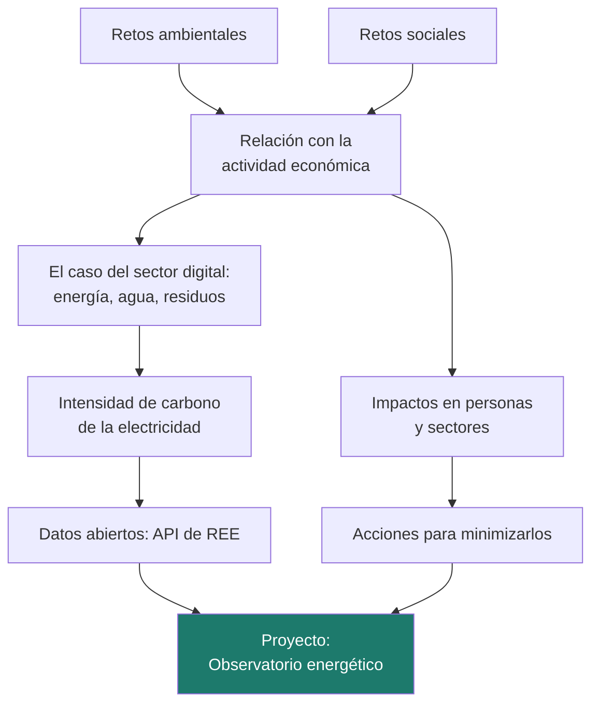
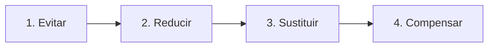

# Unidad 2 · Retos ambientales y sociales

> **Módulo:** 1708 · Sostenibilidad aplicada al sistema productivo · **Resultado de aprendizaje:** RA2 · **Duración:** 4 h · **Peso:** 15 %
> **Herramienta principal:** Java 21 + Spring Boot (API de Streams, `RestClient`) · **Ciclo:** DAW

En la UD1 aprendiste el vocabulario. Ahora toca mirar los problemas de frente: **cuáles son los grandes retos ambientales y sociales**, cómo se relacionan con la **actividad económica** (y con el sector digital en particular), a quién afectan y **qué acciones** pueden reducirlos. Para que no se quede en un listado, trabajarás con **datos reales**: la electricidad que mueve internet no emite siempre lo mismo, y con la API pública de Red Eléctrica vas a calcular cuánto CO₂ hay detrás de cada kWh. Al terminar tendrás un **Observatorio energético** que mide la intensidad de carbono de la red día a día.

!!! info "Resultado de aprendizaje 2"
    Caracteriza los retos ambientales y sociales a los que se enfrenta la sociedad, describiendo los impactos sobre las personas y los sectores productivos y proponiendo acciones para minimizarlos.

---

## Mapa de la unidad



### Qué vas a saber hacer al terminar

- [ ] Identificar los principales **retos ambientales** y **sociales** actuales.
- [ ] Relacionar esos retos con la **actividad económica** y con el sector digital.
- [ ] Analizar el efecto de los impactos sobre las **personas** y los **sectores productivos**.
- [ ] Explicar qué es la **intensidad de carbono** de la electricidad y por qué varía.
- [ ] Consumir **datos abiertos** oficiales desde Spring Boot con `RestClient`.
- [ ] Agregar series de datos con la **API de Streams** de Java.
- [ ] **Proponer acciones** de mitigación justificadas con cifras.

### Cómo se trabaja esta unidad

| | Paso | Dónde |
|:---:|---|---|
| **1** | El profesor **explica** el concepto y ejecuta los ejemplos. | secciones 1–7 |
| **2** | Tú **lees** el apartado y **ejecutas los ejemplos** en tu equipo. | tu IDE |
| **3** | Haces los **retos rápidos** que aparecen entre la teoría. | en el texto |
| **4** | Practicas con **actividades que tienen la solución desplegable**. | sección 9 |
| **5** | Trabajas el **proyecto** hasta tener los tests en verde e interpretas el resultado. | `proyectos/ud2/` |
| **6** | Tarea práctica de evaluación, con la misma mecánica del paso 5. | examen del trimestre |

---

## 1. Los grandes retos ambientales

| Reto | En qué consiste | Causas principales |
|---|---|---|
| **Cambio climático** | Calentamiento global por la acumulación de gases de efecto invernadero | Quema de combustibles fósiles, deforestación, agricultura intensiva |
| **Pérdida de biodiversidad** | Desaparición de especies y degradación de ecosistemas | Cambios de uso del suelo, sobreexplotación, contaminación, especies invasoras |
| **Contaminación** | Del aire, del agua y del suelo, incluidos plásticos y residuos peligrosos | Industria, transporte, residuos mal gestionados |
| **Escasez de agua** | Menos agua disponible y de peor calidad | Sobreexplotación de acuíferos, sequías más frecuentes |
| **Agotamiento de recursos** | Materias primas y minerales que se extraen más rápido de lo que se reponen o reciclan | Modelo de producción lineal: extraer, usar, tirar |

Un marco muy usado para verlos juntos es el de los **límites planetarios**, propuesto por un grupo de científicos encabezado por Johan Rockström en 2009: nueve procesos (clima, biodiversidad, ciclos del nitrógeno y el fósforo, agua dulce…) que definen un «espacio seguro» para la humanidad. Las evaluaciones posteriores indican que **varios de esos límites ya se han sobrepasado**.

!!! analogia "Analogía"
    Los límites planetarios son como los **indicadores del salpicadero de un coche**. Uno en rojo ya es un problema; varios a la vez significan que el coche puede fallar de formas difíciles de predecir, porque unos sistemas afectan a otros.

!!! reto "Reto rápido 1"
    Elige dos retos de la tabla y explica cómo empeora uno al otro (por ejemplo, cómo el cambio climático afecta a la escasez de agua).

---

## 2. Los grandes retos sociales

| Reto | En qué consiste | ODS relacionados |
|---|---|---|
| **Desigualdad y pobreza** | Diferencias crecientes de renta y oportunidades | 1, 10 |
| **Brecha digital** | Personas sin acceso, sin dispositivos o sin competencias digitales | 4, 9, 10 |
| **Trabajo precario** | Empleo inestable, mal pagado o sin protección | 8 |
| **Desigualdad de género** | Brecha salarial, falta de mujeres en puestos técnicos y directivos | 5 |
| **Salud y bienestar** | Enfermedades ligadas a la contaminación, al calor o al estrés laboral | 3 |
| **Envejecimiento y despoblación** | Territorios que pierden servicios y población | 11 |

Los retos sociales y ambientales están conectados: los impactos ambientales **no afectan a todo el mundo por igual**. Las personas con menos recursos suelen vivir en viviendas peor aisladas, trabajar al aire libre o no poder cambiar de residencia. De ahí la idea de **transición justa**: descarbonizar la economía sin dejar atrás a los trabajadores y territorios que dependen de las actividades que desaparecen.

!!! reto "Reto rápido 2"
    Una administración traslada todos sus trámites a una web. ¿Qué reto social puede agravar? ¿Qué harías como desarrollador para evitarlo?

---

## 3. Retos y actividad económica: el caso del sector digital

Toda actividad económica consume recursos y genera impactos. El sector digital parece «inmaterial», pero se apoya en una infraestructura muy física.

| Impacto | Qué ocurre | Dato de referencia |
|---|---|---|
| **Electricidad** | Centros de datos, redes y dispositivos consumen energía de forma continua | La Agencia Internacional de la Energía estimó que los centros de datos usaron en torno al **1,5 % de la electricidad mundial en 2024**, con previsión de que su consumo se duplique hacia 2030 (informe *Energy and AI*, 2025) |
| **Emisiones** | Las de la electricidad y las de fabricar el hardware | Las estimaciones para el conjunto de las TIC van aproximadamente del **1,5 % al 4 %** de las emisiones mundiales, según el estudio y lo que incluya |
| **Agua** | Muchos centros de datos usan agua para refrigerar | Relevante en zonas con estrés hídrico |
| **Residuos electrónicos** | Equipos que se desechan cada vez antes | Según el *Global E-waste Monitor 2024*, en 2022 se generaron **62 millones de toneladas** y solo el **22,3 %** se recogió y recicló de forma documentada |
| **Materias primas** | Minerales como cobalto, litio o tierras raras | Extracción con impactos ambientales y, en ocasiones, sociales graves |

!!! warning "Las cifras se citan con su fuente"
    Estos datos cambian cada año y dependen del método. Si los usas en un trabajo, indica **organismo, informe y año**, y comprueba si hay una edición más reciente. Ver [Rigor, datos y greenwashing](../recursos/rigor-y-fuentes.md).

!!! reto "Reto rápido 3"
    Piensa en la aplicación que desarrollas en DWES. ¿En qué momentos consume electricidad, aunque nadie la esté usando? ¿Qué hardware hace falta para que exista?

---

## 4. La electricidad no emite siempre lo mismo

Buena parte de la huella del software depende de **cómo se genera la electricidad** que consume. No es lo mismo un kWh producido con viento que uno producido quemando carbón.

- El **mix eléctrico** es el reparto de la generación entre tecnologías (eólica, solar, hidráulica, nuclear, ciclo combinado, carbón…).
- Cada tecnología tiene un **factor de emisión**: toneladas de CO₂ por MWh generado. Eólica, solar, hidráulica y nuclear no emiten CO₂ al generar; el carbón es el que más emite.
- La **intensidad de carbono** de la red es la media ponderada: gramos de CO₂ por kWh consumido.

```text
                 Σ (MWh de cada tecnología × factor en t CO₂/MWh)
intensidad = ─────────────────────────────────────────────────────── × 1000   → g CO₂/kWh
                          Σ MWh de todas las tecnologías
```

¿Por qué el `× 1000`? Una tonelada son 1 000 000 g y un MWh son 1000 kWh, así que **1 t/MWh = 1000 g/kWh**.

La intensidad **cambia de un día a otro y de una hora a otra**: un día de mucho viento y sol la red es mucho más limpia que una noche sin viento en la que hay que tirar de ciclos combinados. Esa variación es la base de la computación *carbon-aware* que programarás en la UD5.

!!! analogia "Analogía"
    La red eléctrica es como una **gran cazuela de sopa** a la que cada central echa su ingrediente. Tú no puedes elegir qué cucharada te llega, pero sí **cuándo** te sirves: hay momentos en los que la sopa lleva mucha más verdura que otros.

!!! reto "Reto rápido 4"
    Un día se generan 300 MWh eólicos, 200 MWh en ciclo combinado (0,37 t/MWh) y 500 MWh nucleares. Calcula la intensidad en g CO₂/kWh sin ordenador.

---

## 5. Calcular con la API de Streams

Las series de generación son listas largas de registros. La **API de Streams** permite expresar los cálculos casi como la fórmula: filtrar, transformar y agregar.

```java title="Intensidad de carbono con Streams"
public record Generacion(LocalDate fecha, String tecnologia, double mwh) { }

double intensidad(List<Generacion> datos) {
    double toneladas = datos.stream()                                   // (1)!
            .mapToDouble(g -> g.mwh() * factorEmision(g.tecnologia()))  // (2)!
            .sum();
    double totalMwh = datos.stream().mapToDouble(Generacion::mwh).sum(); // (3)!
    if (totalMwh == 0) {
        return 0.0;                                                      // (4)!
    }
    return toneladas / totalMwh * 1000;
}
```

1.  `stream()` convierte la lista en una secuencia de elementos sobre la que encadenar operaciones. Es el **criterio del RA2**.
2.  `mapToDouble` transforma cada registro en un número (sus toneladas) y `sum()` los suma. Sin bucles ni variables acumuladoras.
3.  Una **referencia a método** (`Generacion::mwh`) equivale a la lambda `g -> g.mwh()`.
4.  Sin datos no hay intensidad: devolver 0 evita una división entre cero que daría `NaN`.

Para agrupar por día se usa `Collectors.groupingBy`. Pasando `TreeMap::new` el resultado sale **ordenado por fecha**:

```java title="Agrupar por día"
Map<LocalDate, List<Generacion>> porDia = datos.stream()
        .collect(Collectors.groupingBy(Generacion::fecha, TreeMap::new, Collectors.toList()));
```

!!! warning "Atención"
    Un `Stream` **solo se puede recorrer una vez**. Si necesitas dos resultados (toneladas y MWh), crea dos streams a partir de la lista, como en el ejemplo.

---

## 6. Datos abiertos: la API de Red Eléctrica

Red Eléctrica publica los datos del sistema eléctrico español a través de **REData**, una API REST pública y gratuita. Una de sus consultas devuelve la **estructura de generación** por tecnología:

```text
GET https://apidatos.ree.es/es/datos/generacion/estructura-generacion
    ?start_date=2026-03-02T00:00&end_date=2026-03-08T23:59&time_trunc=day
```

La respuesta sigue el formato JSON:API. La parte que nos interesa es `included`: una entrada por tecnología, con sus valores diarios.

```json
{ "included": [
    { "type": "Eólica",
      "attributes": { "title": "Eólica",
                      "values": [ { "value": 229661.0, "percentage": 0.31,
                                    "datetime": "2026-03-02T00:00:00.000+01:00" } ] } } ] }
```

En Spring Boot la consumes con `RestClient` y conviertes el JSON en **records**:

```java title="Cliente de REData"
@JsonIgnoreProperties(ignoreUnknown = true)                   // (1)!
record Valor(double value, double percentage, String datetime) { }

ReeRespuesta respuesta = RestClient.create("https://apidatos.ree.es")
        .get()
        .uri(uri -> uri.path("/es/datos/generacion/estructura-generacion")
                .queryParam("start_date", desde + "T00:00")
                .queryParam("end_date", hasta + "T23:59")
                .queryParam("time_trunc", "day")
                .build())
        .retrieve()
        .body(ReeRespuesta.class);                            // (2)!
```

1.  La API devuelve muchos más campos de los que necesitamos; esta anotación hace que se ignoren en lugar de dar error.
2.  Spring convierte el JSON en el record automáticamente. El cliente completo está ya hecho en el proyecto (`ReeCliente.java`).

!!! tip "Sin conexión también se trabaja"
    El proyecto incluye un CSV con una semana de ejemplo. Los tests usan datos fijos: nunca dependen de que la API responda.

!!! reto "Reto rápido 5"
    ¿Por qué es mejor que los tests del proyecto usen datos fijos en lugar de llamar a la API de REE?

---

## 7. Impactos y acciones para minimizarlos

### 7.1 A quién afecta

| Impacto | Personas | Sectores productivos |
|---|---|---|
| **Olas de calor** | Riesgos para la salud, sobre todo mayores y trabajo al aire libre | Más demanda eléctrica para refrigerar, también en centros de datos |
| **Sequía** | Restricciones de agua | Agricultura, turismo, industria y refrigeración de instalaciones |
| **Precio de la energía** | Pobreza energética | Costes de producción; los servicios digitales intensivos en cómputo lo notan |
| **Residuos electrónicos mal gestionados** | Contaminación y riesgos para la salud donde se desmontan sin control | Pérdida de materias primas valiosas |
| **Brecha digital** | Exclusión de servicios públicos, empleo y formación | Menos clientes potenciales y menos talento |

### 7.2 Qué se puede hacer

Las acciones frente al cambio climático se agrupan en **mitigación** (reducir las emisiones) y **adaptación** (prepararse para los impactos que ya no se pueden evitar). Para reducir impactos se sigue un orden de preferencia:



| Paso | En el sector digital |
|---|---|
| **Evitar** | No construir funcionalidades que nadie usa; no guardar datos que no hacen falta |
| **Reducir** | Optimizar consultas, comprimir, cachear, alargar la vida del hardware |
| **Sustituir** | Contratar electricidad renovable, elegir regiones de la nube con red más limpia |
| **Compensar** | Financiar proyectos que absorben CO₂, **solo** para lo que no se ha podido evitar |

!!! warning "Compensar no es reducir"
    Presentar como «neutra en carbono» una actividad que solo compensa, sin reducir, es una forma de greenwashing. Compensar es el **último** paso, no el primero.

!!! reto "Reto rápido 6"
    Tu empresa tiene un proceso nocturno que tarda 3 horas y se ejecuta todas las noches a las 2:00. Propón una acción de cada tipo (evitar, reducir, sustituir) para reducir su impacto.

---

## 8. Errores frecuentes (para tener a mano)

| Error | Causa | Solución |
|---|---|---|
| Intensidades de miles de g/kWh | Olvidar convertir t/MWh a g/kWh (o multiplicar dos veces) | 1 t/MWh = 1000 g/kWh |
| `NaN` en la intensidad | Dividir entre 0 MWh | Comprueba el total antes de dividir |
| La eólica aparece con factor 0 pero el carbón también | Buscar «Carbón» en un mapa con clave «carbon» | Normaliza: minúsculas y sin tildes |
| `IllegalStateException: stream has already been operated upon` | Reutilizar un stream | Crea uno nuevo desde la lista |
| Días desordenados | Agrupar con `HashMap` | `groupingBy(…, TreeMap::new, …)` |
| Contar «Generación total» como una tecnología | Sumar todas las series de la API | Filtrar esa serie |

---

## 9. Practica **con** solución a la vista

> Estas actividades usan los **mismos datos y formatos** que el proyecto: registros de generación por tecnología y día, factores de emisión e intensidades en g CO₂/kWh. Intenta cada una antes de desplegar la solución.

Tipos del proyecto que necesitarás:

```java
public record Generacion(LocalDate fecha, String tecnologia, double mwh) { }

// Factores didácticos en t CO2/MWh, con las claves normalizadas (minúsculas, sin tildes)
Map<String, Double> FACTORES = Map.of("carbon", 0.95, "ciclo combinado", 0.37,
        "cogeneracion", 0.38, "motores diesel", 0.77, "turbina de gas", 0.62,
        "residuos no renovables", 0.24);
```

#### Actividad 1 — Nombres que vienen como vienen
La API de Red Eléctrica devuelve `"Eólica"`, `"Solar fotovoltaica"`, `"COGENERACIÓN"`… y tu tabla de factores usa claves sin tildes y en minúsculas. Escribe `String normalizar(String tecnologia)`.

<details class="sol"><summary>Solución</summary>

```java
String normalizar(String tecnologia) {
    String sinTildes = Normalizer.normalize(tecnologia, Normalizer.Form.NFD)   // (1)
            .replaceAll("\\p{M}", "");                                          // (2)
    return sinTildes.toLowerCase().trim();
}
// (1) NFD separa la letra de su tilde: "ó" pasa a ser "o" + acento
// (2) \p{M} son las marcas diacríticas: al quitarlas queda "o"
```

Sin este paso, `"Eólica"` no encuentra la clave `"eolica"` y la tecnología se trata como si emitiera 0… o al revés, el carbón se queda sin su factor y las emisiones salen ridículamente bajas.
</details>

#### Actividad 2 — Emisiones de un día
Con una lista de `Generacion` de un día, escribe `double toneladas(List<Generacion> datos)` usando la API de Streams. Las tecnologías que no están en la tabla emiten 0.

<details class="sol"><summary>Solución</summary>

```java
double toneladas(List<Generacion> datos) {
    return datos.stream()
            .mapToDouble(g -> g.mwh() * FACTORES.getOrDefault(normalizar(g.tecnologia()), 0.0))
            .sum();
}
// 300 MWh eólicos + 200 de ciclo combinado + 500 nucleares -> 200 x 0.37 = 74 t
```
</details>

#### Actividad 3 — De toneladas por MWh a gramos por kWh
Escribe `double intensidad(List<Generacion> datos)` que devuelva los g CO₂/kWh con 1 decimal. Si no hay datos o el total de MWh es 0, devuelve 0.

<details class="sol"><summary>Solución</summary>

```java
double intensidad(List<Generacion> datos) {
    double totalMwh = datos.stream().mapToDouble(Generacion::mwh).sum();
    if (totalMwh == 0) return 0.0;                       // sin esto saldría NaN
    return Math.round(toneladas(datos) / totalMwh * 1000 * 10) / 10.0;
}
// 74 t en 1000 MWh -> 0.074 t/MWh -> 74.0 g/kWh
```

El `× 1000` sale de que 1 t/MWh = 1 000 000 g / 1000 kWh = 1000 g/kWh.
</details>

#### Actividad 4 — ¿Cuánto emite lo que consumo?
Tu servidor de prácticas consume 3,3 kWh al día. Escribe `double kgCo2Mes(double kwhDia, double gramosPorKwh, int dias)` con 2 decimales.

<details class="sol"><summary>Solución</summary>

```java
double kgCo2Mes(double kwhDia, double gramosPorKwh, int dias) {
    double gramos = kwhDia * dias * gramosPorKwh;
    return Math.round(gramos / 1000 * 100) / 100.0;      // gramos -> kilos
}
// kgCo2Mes(3.3, 91.5, 30) = 9.06 kg al mes
```
</details>

#### Actividad 5 — La semana, día a día
Escribe `Map<LocalDate, Double> intensidadDiaria(List<Generacion> datos)` con los días **ordenados** y la intensidad de cada uno.

<details class="sol"><summary>Solución</summary>

```java
Map<LocalDate, Double> intensidadDiaria(List<Generacion> datos) {
    Map<LocalDate, List<Generacion>> porDia = datos.stream()
            .collect(Collectors.groupingBy(Generacion::fecha, TreeMap::new, Collectors.toList()));
    Map<LocalDate, Double> resultado = new TreeMap<>();
    porDia.forEach((dia, lista) -> resultado.put(dia, intensidad(lista)));
    return resultado;
}
```

El `TreeMap::new` es lo que garantiza el orden por fecha. Con el `HashMap` por defecto, la tabla del informe saldría desordenada.
</details>

#### Actividad 6 — El mejor y el peor día
Con ese mapa, escribe `String resumenSemana(Map<LocalDate, Double> porDia)` que devuelva un texto como `"Más limpio: 2026-03-07 (64,4) · Más sucio: 2026-03-05 (131,9) · Diferencia: 2,0 veces"`, con la diferencia redondeada a 1 decimal.

<details class="sol"><summary>Solución</summary>

```java
String resumenSemana(Map<LocalDate, Double> porDia) {
    if (porDia.isEmpty()) return "Sin datos";
    var mejor = Collections.min(porDia.entrySet(), Map.Entry.comparingByValue());
    var peor = Collections.max(porDia.entrySet(), Map.Entry.comparingByValue());
    double veces = Math.round(peor.getValue() / mejor.getValue() * 10) / 10.0;
    return String.format("Más limpio: %s (%s) · Más sucio: %s (%s) · Diferencia: %s veces",
            mejor.getKey(), mejor.getValue(), peor.getKey(), peor.getValue(), veces);
}
```

Esa «diferencia en veces» es el argumento más potente para justificar mover una tarea pesada de día u hora.
</details>

#### Actividad 7 — Decidir cuándo lanzar el proceso nocturno
Un proceso consume 40 kWh. Escribe `String decision(double intensidadHoy, double intensidadManana, double kwh)` que devuelva `"HOY"` o `"MAÑANA"` y los kg de CO₂ que se ahorran, por ejemplo `"MAÑANA (ahorro 2,7 kg)"`.

<details class="sol"><summary>Solución</summary>

```java
String decision(double intensidadHoy, double intensidadManana, double kwh) {
    double ahorro = Math.abs(intensidadHoy - intensidadManana) * kwh / 1000;
    String cuando = intensidadManana < intensidadHoy ? "MAÑANA" : "HOY";
    return String.format("%s (ahorro %.1f kg)", cuando, ahorro);
}
// decision(131.9, 64.4, 40) -> "MAÑANA (ahorro 2,7 kg)"
```

Esta es la semilla de la computación *carbon-aware* que programarás en la UD5.
</details>

#### Actividad 8 — Leer el CSV que te pasan
Escribe `List<Generacion> leerCsv(List<String> lineas)` para un fichero `fecha;tecnologia;mwh` con cabecera, que ignore las líneas en blanco y avise con `IllegalArgumentException` si una línea no tiene 3 campos.

<details class="sol"><summary>Solución</summary>

```java
List<Generacion> leerCsv(List<String> lineas) {
    List<Generacion> datos = new ArrayList<>();
    for (String linea : lineas.stream().skip(1).toList()) {   // salta la cabecera
        if (linea.isBlank()) continue;
        String[] c = linea.split(";");
        if (c.length != 3) {
            throw new IllegalArgumentException("Línea mal formada: " + linea);
        }
        datos.add(new Generacion(LocalDate.parse(c[0].trim()), c[1].trim(),
                Double.parseDouble(c[2].trim())));
    }
    return datos;
}
```

Fallar con un mensaje claro es mucho mejor que colar un dato corrupto: una línea mal partida puede desplazar una columna y multiplicar tus emisiones por mil.
</details>

---

## Proyecto de la unidad

La práctica gruesa de la unidad se hace sobre el **Observatorio energético**: una aplicación Spring Boot que lee la estructura de generación (del CSV de ejemplo o de la API de REE), calcula emisiones, intensidad de carbono, porcentaje renovable, intensidad diaria y día más limpio, pone un semáforo y estima los kg de CO₂ de un consumo.

**[Proyecto Observatorio energético →](../proyectos/ud2/README.md)**

```
proyecto-ud2/
├── src/main/java/…/servicio/IntensidadService.java   ← tu código (métodos con TODO)
├── src/main/java/…/web/ReeCliente.java               ← cliente de la API de REE (ya hecho)
├── src/test/java/…/IntensidadServiceTest.java        ← los tests
└── INTERPRETACION.md
```

```bash
./mvnw test
./mvnw spring-boot:run   # http://localhost:8080/api/intensidad
```

!!! warning "Los tests son la especificación"
    No los modifiques para que pasen: describen exactamente lo que tu código debe hacer, y el examen usará una batería equivalente.

---

## Retos de ampliación

- **R1.** Añade `diaMasSucio` al servicio y al resumen de la API, con su test.
- **R2.** Pide a REE los datos con `time_trunc=hour` y calcula la **mejor hora** de cada día para ejecutar una tarea (lo usarás en la UD5).
- **R3.** REData publica también series de emisiones del sistema eléctrico. Búscalas y compara sus valores con los que calcula tu observatorio. ¿Por qué no coinciden exactamente?
- **R4.** Crea una página HTML con una tabla de la semana y el semáforo de cada día coloreado.

---

## Más práctica

#### Actividad 9 — Tendencia con media móvil
Escribe `List<Double> mediaMovil(List<Double> serie, int ventana)` para suavizar la intensidad diaria y ver si la semana mejora o empeora.

<details class="sol"><summary>Solución</summary>

```java
List<Double> mediaMovil(List<Double> serie, int ventana) {
    if (ventana <= 0 || ventana > serie.size()) throw new IllegalArgumentException("Ventana no válida");
    List<Double> medias = new ArrayList<>();
    for (int i = 0; i + ventana <= serie.size(); i++) {
        medias.add(serie.subList(i, i + ventana).stream()
                .mapToDouble(Double::doubleValue).average().orElse(0.0));
    }
    return medias;
}
```
</details>

#### Actividad 10 — Reparto del mix
Escribe `Map<String, Double> porcentajePorTecnologia(List<Generacion> datos)` con el porcentaje que aporta cada tecnología, ordenado de mayor a menor aportación.

<details class="sol"><summary>Solución</summary>

```java
Map<String, Double> porcentajePorTecnologia(List<Generacion> datos) {
    double total = datos.stream().mapToDouble(Generacion::mwh).sum();
    if (total == 0) return Map.of();
    return datos.stream()
            .collect(Collectors.groupingBy(Generacion::tecnologia,
                    Collectors.summingDouble(Generacion::mwh)))
            .entrySet().stream()
            .sorted(Map.Entry.<String, Double>comparingByValue().reversed())
            .collect(Collectors.toMap(e -> e.getKey(),
                    e -> Math.round(e.getValue() / total * 1000) / 10.0,
                    (a, b) -> a, LinkedHashMap::new));      // LinkedHashMap conserva el orden
}
```
</details>

#### Actividad 11 — ¿Cuántos hogares equivalen?
Los números grandes no dicen nada sin comparación. Sabiendo que un hogar medio en España consume del orden de 3 300 kWh al año (fuente: IDAE; compruébala antes de usarla), escribe `double equivalenteHogares(double kwhAnuales)`.

<details class="sol"><summary>Solución</summary>

```java
public static final double KWH_HOGAR_ANUAL = 3300;   // IDAE, valor orientativo

double equivalenteHogares(double kwhAnuales) {
    return Math.round(kwhAnuales / KWH_HOGAR_ANUAL * 10) / 10.0;
}
// 45 000 kWh de un servicio -> 13.6 hogares
```

Las equivalencias ayudan a comunicar, pero hay que citar la fuente del valor de referencia y decir que es orientativo.
</details>

#### Actividad 12 — Alerta de datos sospechosos
Al consumir una API real aparecen huecos y valores raros. Escribe `List<String> avisos(List<Generacion> datos)` que señale registros con MWh negativos, días sin ningún dato de una tecnología presente el resto de días, y valores nulos.

<details class="sol"><summary>Solución</summary>

```java
List<String> avisos(List<Generacion> datos) {
    List<String> lista = new ArrayList<>();
    for (Generacion g : datos) {
        if (g.tecnologia() == null || g.tecnologia().isBlank()) lista.add("Tecnología vacía en " + g.fecha());
        if (g.mwh() < 0) lista.add("MWh negativos: " + g.tecnologia() + " el " + g.fecha());
    }
    Set<String> todas = datos.stream().map(Generacion::tecnologia).collect(Collectors.toSet());
    Map<LocalDate, Set<String>> porDia = datos.stream().collect(Collectors.groupingBy(
            Generacion::fecha, TreeMap::new, Collectors.mapping(Generacion::tecnologia, Collectors.toSet())));
    porDia.forEach((dia, presentes) -> todas.stream()
            .filter(t -> !presentes.contains(t))
            .forEach(t -> lista.add("Falta " + t + " el " + dia)));
    return lista;
}
```

Revisar los datos antes de calcular es parte del trabajo: un hueco no detectado cambia la media de la semana.
</details>

---

## Laboratorio

> El laboratorio se hace sobre la **aplicación arrancada** (`./mvnw spring-boot:run`). Necesitas tener el proyecto con los tests en verde.

### Laboratorio guiado (resuelto) — Una semana de marzo

El CSV de ejemplo contiene una semana **ficticia** con días de mucho viento y días de calma. Vamos a leerla con el observatorio.

**1) Resumen de la semana**

```bash
curl http://localhost:8080/api/intensidad
```

**2) ¿Cuánto emite un consumo concreto?** Un pequeño servidor que consume 250 kWh al mes con una intensidad de 120 g/kWh:

```bash
curl "http://localhost:8080/api/consumo?kwh=250&intensidad=120"
```

<details class="sol"><summary>Qué debe salir y por qué</summary>

```json
{"intensidadMedia_gCO2kWh":91.5, "semaforo":"VERDE", "renovable_pct":54.1,
 "emisiones_t":429341,
 "porDia":{"2026-03-02":72.1,"2026-03-03":83.8,"2026-03-04":113.0,"2026-03-05":131.9,
           "2026-03-06":104.8,"2026-03-07":64.4,"2026-03-08":78.8},
 "diaMasLimpio":"2026-03-07"}
```

- La **media semanal** (91,5 g/kWh, verde) oculta que hubo **tres días en ámbar**.
- El día más sucio (5 de marzo, 131,9) emite **más del doble** por kWh que el más limpio (7 de marzo, 64,4). Coinciden con los días de menos y más viento: cuando no sopla, la eólica la sustituyen los ciclos combinados.
- El servidor de 250 kWh a 120 g/kWh emite **30 kg de CO₂**. El mismo consumo el día más limpio serían unos 16 kg.

La conclusión práctica: **cuándo** se consume importa. Es lo que aprovecharás en la UD5.
</details>

### Laboratorio propuesto (entregable) — Invierno frente a verano

Con la API real de REE, compara **una semana de enero y una de julio** del último año completo.

**Criterios de aceptación**

- Obtienes ambas semanas con `GET /api/intensidad/ree?desde=…&hasta=…` y guardas las respuestas JSON.
- Comparas intensidad media, porcentaje renovable y diferencia entre el día más limpio y el más sucio de cada semana.
- En `INTERPRETACION.md` explicas las diferencias con al menos **un reto ambiental y uno social** de la unidad, y propones **una acción** para una empresa de servicios digitales, con su ahorro estimado en kg de CO₂.
- Citas la fuente de los datos (REE, conjunto de datos y fechas) y aclaras que los factores de emisión son didácticos.

---

## Banco de preguntas

> De aquí salen las preguntas cortas y de tipo test de los exámenes. Responde **antes** de desplegar.

### Tipo test

<details><summary><b>1.</b> Los límites planetarios son…<br>a) los países que más emiten · b) nueve procesos del sistema Tierra que delimitan un espacio seguro para la humanidad · c) el tope legal de emisiones de la UE · d) las fronteras de las zonas protegidas</summary><b>b</b>. Propuestos en 2009; varios ya se consideran sobrepasados.</details>

<details><summary><b>2.</b> «Transición justa» significa…<br>a) repartir las emisiones por igual entre países · b) descarbonizar sin dejar atrás a trabajadores y territorios afectados · c) que cada empresa pague una tasa · d) juzgar a los responsables del cambio climático</summary><b>b</b>.</details>

<details><summary><b>3.</b> Según el *Global E-waste Monitor 2024*, del residuo electrónico generado en 2022 se recogió y recicló de forma documentada en torno al…<br>a) 5 % · b) 22 % · c) 50 % · d) 78 %</summary><b>b</b>. Unos 62 millones de toneladas generadas y un 22,3 % recogido formalmente.</details>

<details><summary><b>4.</b> La intensidad de carbono de la red eléctrica se mide en…<br>a) kWh por GB · b) g CO₂ por kWh · c) toneladas por año · d) euros por MWh</summary><b>b</b>.</details>

<details><summary><b>5.</b> 0,37 t CO₂/MWh equivalen a…<br>a) 3,7 g/kWh · b) 37 g/kWh · c) 370 g/kWh · d) 3700 g/kWh</summary><b>c</b>. 1 t/MWh = 1000 g/kWh.</details>

<details><summary><b>6.</b> Un día con mucho viento la intensidad de la red…<br>a) sube, porque hay que regular más · b) baja, porque la eólica desplaza a la generación fósil · c) no cambia · d) depende solo de la demanda</summary><b>b</b>.</details>

<details><summary><b>7.</b> En el proyecto, una tecnología que no está en la tabla de factores…<br>a) provoca un error · b) se trata como si emitiera 0 · c) se descarta del total de MWh · d) usa el factor del carbón</summary><b>b</b>. Por eso se usa `getOrDefault(..., 0.0)`: nuclear, eólica o solar no emiten CO₂ al generar.</details>

<details><summary><b>8.</b> ¿Qué devuelve `intensidad(List.of())` bien programada?<br>a) `NaN` · b) 0.0 · c) lanza una excepción · d) `Infinity`</summary><b>b</b>. Hay que comprobar el total antes de dividir.</details>

<details><summary><b>9.</b> `Collectors.groupingBy(Generacion::fecha, TreeMap::new, Collectors.toList())` sirve para…<br>a) ordenar por MWh · b) agrupar por día con las claves ordenadas · c) eliminar duplicados · d) filtrar renovables</summary><b>b</b>.</details>

<details><summary><b>10.</b> Reutilizar un mismo `Stream` dos veces provoca…<br>a) un resultado duplicado · b) `IllegalStateException` · c) un `NullPointerException` · d) nada, es correcto</summary><b>b</b>. Un stream se consume una sola vez; hay que crear otro desde la lista.</details>

<details><summary><b>11.</b> La API REData de Red Eléctrica es…<br>a) de pago y privada · b) pública y gratuita, con datos del sistema eléctrico español · c) una base de datos de empresas · d) un registro de huella de carbono</summary><b>b</b>.</details>

<details><summary><b>12.</b> ¿Por qué los tests del proyecto usan datos fijos y no llaman a la API real?<br>a) porque la API es de pago · b) para que sean rápidos, repetibles y no dependan de la red ni de que los datos cambien · c) porque la API no tiene datos históricos · d) porque los datos reales son secretos</summary><b>b</b>.</details>

<details><summary><b>13.</b> El orden correcto de preferencia para reducir impactos es…<br>a) compensar, sustituir, reducir, evitar · b) evitar, reducir, sustituir, compensar · c) reducir, evitar, compensar, sustituir · d) sustituir, compensar, evitar, reducir</summary><b>b</b>.</details>

<details><summary><b>14.</b> Una empresa que compra créditos de compensación sin reducir sus emisiones y se anuncia como «neutra en carbono» está…<br>a) cumpliendo la jerarquía correctamente · b) haciendo greenwashing · c) aplicando adaptación · d) haciendo mitigación de alcance 3</summary><b>b</b>.</details>

<details><summary><b>15.</b> Mitigación y adaptación se diferencian en que…<br>a) son sinónimos · b) mitigar es reducir emisiones y adaptarse es prepararse para los impactos inevitables · c) mitigar es para empresas y adaptarse para gobiernos · d) adaptarse es compensar</summary><b>b</b>.</details>

<details><summary><b>16.</b> Un proceso de 40 kWh se ejecuta a 131,9 g/kWh en lugar de a 64,4. La diferencia es de…<br>a) 0,27 kg · b) 2,7 kg · c) 27 kg · d) 270 kg</summary><b>b</b>. 40 × 67,5 g = 2700 g = 2,7 kg.</details>

<details><summary><b>17.</b> «Los centros de datos consumieron en torno al 1,5 % de la electricidad mundial en 2024» es una cifra que…<br>a) se puede usar sin más · b) debe citarse con organismo, informe y año, y comprobarse si hay edición más reciente · c) es una ley física · d) no se puede usar en trabajos académicos</summary><b>b</b>. Procede del informe *Energy and AI* de la IEA (2025) y cambia cada año.</details>

<details><summary><b>18.</b> Una brecha digital se agrava cuando una administración…<br>a) publica sus datos abiertos · b) traslada todos sus trámites a una web sin alternativa presencial ni criterios de accesibilidad · c) usa software libre · d) contrata electricidad renovable</summary><b>b</b>.</details>

### Preguntas cortas

<details><summary><b>1.</b> Nombra tres retos ambientales y dos sociales, y explica una conexión entre un reto ambiental y uno social.</summary>Ambientales: cambio climático, pérdida de biodiversidad, contaminación, escasez de agua, agotamiento de recursos. Sociales: desigualdad, brecha digital, trabajo precario, desigualdad de género. Conexión: las olas de calor afectan más a quien trabaja al aire libre o vive en viviendas mal aisladas, así que el impacto ambiental amplifica la desigualdad.</details>

<details><summary><b>2.</b> Explica qué es el mix eléctrico y por qué hace variar la intensidad de carbono.</summary>Es el reparto de la generación entre tecnologías. Como cada una tiene un factor de emisión distinto, un mix con más renovables da menos g CO₂/kWh que uno con más carbón o ciclo combinado.</details>

<details><summary><b>3.</b> Escribe la fórmula de la intensidad de carbono a partir de los MWh y los factores por tecnología.</summary>Suma de (MWh × factor en t/MWh), dividida entre la suma de MWh, multiplicada por 1000 para pasar a g/kWh.</details>

<details><summary><b>4.</b> ¿Por qué hay que normalizar los nombres de las tecnologías antes de buscar su factor?</summary>Porque la fuente los envía con tildes y mayúsculas variables; si no se normalizan, no coinciden con las claves de la tabla y el cálculo asigna factor 0 a tecnologías que sí emiten.</details>

<details><summary><b>5.</b> Cita tres impactos del sector digital sobre el medio ambiente.</summary>Consumo eléctrico de centros de datos y redes, emisiones asociadas a la electricidad y a la fabricación del hardware, uso de agua para refrigeración, residuos electrónicos y extracción de minerales.</details>

<details><summary><b>6.</b> ¿A quién afecta principalmente la subida del precio de la energía y a qué sectores?</summary>A los hogares con menos recursos (pobreza energética) y a los sectores intensivos en energía, incluidos los servicios digitales con mucho cómputo.</details>

<details><summary><b>7.</b> Explica el orden evitar, reducir, sustituir, compensar con un ejemplo del sector digital en cada paso.</summary>Evitar: no construir una funcionalidad que nadie usa. Reducir: optimizar consultas y comprimir. Sustituir: contratar electricidad renovable. Compensar: financiar absorción de CO₂ solo para lo que queda.</details>

<details><summary><b>8.</b> ¿Qué diferencia hay entre un dato absoluto («emitimos 430 000 t») y uno comparable?</summary>El absoluto no permite juzgar nada por sí solo. Hace falta compararlo con un periodo anterior, con una meta o normalizarlo (por kWh, por persona, por petición).</details>

<details><summary><b>9.</b> Describe qué devuelve la consulta de estructura de generación de REData y qué parte del JSON usa el proyecto.</summary>Devuelve la generación por tecnología para el intervalo pedido, en formato JSON:API. El proyecto usa el array `included`: cada entrada es una tecnología con su `title` y su lista de `values` (valor, porcentaje y fecha).</details>

<details><summary><b>10.</b> Al procesar la respuesta de REE se descarta la serie «Generación total». ¿Por qué?</summary>Porque no es una tecnología: es la suma de todas. Si se incluyera, los MWh totales se contarían dos veces y la intensidad saldría a la mitad.</details>

<details><summary><b>11.</b> Un compañero afirma que su web «emite 0 porque está alojada en un hosting verde». ¿Qué le responderías?</summary>Que contratar electricidad renovable reduce las emisiones de alcance 2, pero no las deja en cero: quedan la fabricación de los servidores, la red y los dispositivos de los usuarios. Y habría que ver qué significa exactamente «verde» y con qué prueba.</details>

<details><summary><b>12.</b> Propón una acción concreta para una empresa de servicios digitales basada en la variación diaria de la intensidad, y di cómo medirías su efecto.</summary>Desplazar los procesos por lotes (informes, copias, reindexados) a las horas o días de menor intensidad. Se mide comparando los kWh consumidos por esos procesos multiplicados por la intensidad real del momento, antes y después del cambio.</details>

---

## Glosario

| Término | Definición |
|---|---|
| **Límites planetarios** | Umbrales de nueve procesos del sistema Tierra dentro de los cuales la humanidad puede desarrollarse con seguridad. |
| **Transición justa** | Transformación hacia una economía baja en carbono que protege a las personas y territorios afectados. |
| **Mix eléctrico** | Reparto de la generación eléctrica entre tecnologías. |
| **Factor de emisión** | Emisiones por unidad de actividad; aquí, t CO₂ por MWh generado. |
| **Intensidad de carbono** | Gramos de CO₂ por kWh de electricidad. |
| **Mitigación / adaptación** | Reducir emisiones / prepararse para los impactos. |
| **Datos abiertos** | Datos publicados para que cualquiera los reutilice, como REData de Red Eléctrica. |
| **Stream** | Secuencia de elementos de Java sobre la que se encadenan operaciones de filtrado, transformación y agregación. |

---

## Cómo se evalúa esta unidad (RA2)

Se evalúa con una **tarea práctica**: completar en Java un servicio que cumpla una especificación e interpretar su resultado, corregida con la rúbrica pública.

| # | Qué se valora | Cómo se mide | Puntos |
|:---:|---|---|:---:|
| 1 | **Que el programa funcione** | `(tests superados ÷ total) × 7` | **7,0** |
| 2 | **Agregación de datos** | Usa la API de Streams (`.stream()`) | **1,0** |
| 3 | **Documentación** | Al menos 2 Javadoc o comentarios con contenido | **1,0** |
| 4 | **Interpretación** | `INTERPRETACION.md` con los 3 apartados y ≥ 40 palabras cada uno | **1,0** |
| | | **TOTAL** | **10** |

**Se supera con 5.** Los criterios 2–4 son **todo o nada**. La rúbrica no cambia: la conoces desde el primer día.
