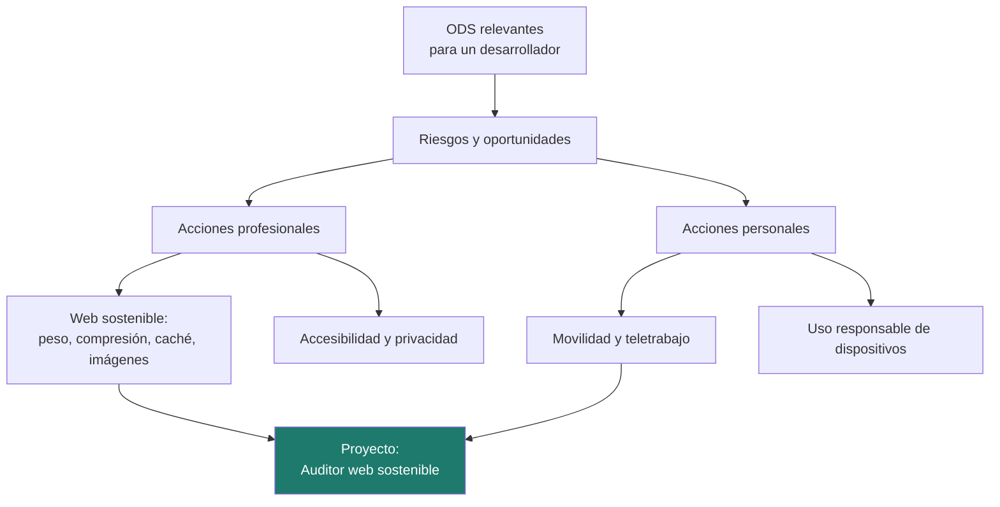

# Unidad 3 · Sostenibilidad en el trabajo del desarrollador

> **Módulo:** 1708 · Sostenibilidad aplicada al sistema productivo · **Resultado de aprendizaje:** RA3 · **Duración:** 4 h · **Peso:** 15 %
> **Herramienta principal:** Java 21 + Spring Boot (compresión HTTP, caché, `application.properties`) · **Ciclo:** DAW

Hasta ahora has mirado la sostenibilidad desde fuera: el planeta, la sociedad, las empresas. Esta unidad la trae **a tu puesto de trabajo y a tu vida diaria**. ¿Qué ODS toca un desarrollador web? ¿Qué riesgos y oportunidades le plantean? ¿Qué puede hacer mañana mismo, en su código y fuera de él? Aprenderás a **auditar una web** con criterios de sostenibilidad (peso, compresión, caché, imágenes), a configurar tu propia aplicación Spring Boot para que envíe menos bytes y a calcular el impacto de algo tan personal como ir a trabajar. Al terminar tendrás un **Auditor web sostenible**.

!!! info "Resultado de aprendizaje 3"
    Establece la aplicación de criterios de sostenibilidad en el desempeño profesional y personal, identificando los elementos necesarios.

---

## Mapa de la unidad



### Qué vas a saber hacer al terminar

- [ ] Identificar los **ODS más relevantes** para la actividad profesional de un desarrollador web.
- [ ] Analizar los **riesgos y oportunidades** que plantean los ODS a una empresa de software.
- [ ] Aplicar **buenas prácticas de desarrollo web sostenible**: peso, compresión, caché e imágenes.
- [ ] Relacionar **accesibilidad** y **privacidad** con la sostenibilidad social y la gobernanza.
- [ ] **Auditar** los recursos de una web con las herramientas del navegador y `curl`.
- [ ] Configurar la **compresión HTTP** y la caché en Spring Boot.
- [ ] Calcular el impacto de **acciones personales** como el desplazamiento al trabajo.

### Cómo se trabaja esta unidad

| | Paso | Dónde |
|:---:|---|---|
| **1** | El profesor **explica** el concepto y ejecuta los ejemplos. | secciones 1–6 |
| **2** | Tú **lees** el apartado y **pruebas los ejemplos** en tu equipo. | tu IDE y el navegador |
| **3** | Haces los **retos rápidos** que aparecen entre la teoría. | en el texto |
| **4** | Practicas con **actividades que tienen la solución desplegable**. | sección 8 |
| **5** | Trabajas el **proyecto** hasta tener los tests en verde e interpretas el resultado. | `proyectos/ud3/` |
| **6** | Tarea práctica de evaluación, con la misma mecánica del paso 5. | examen del trimestre |

---

## 1. Los ODS de un desarrollador web

No todos los ODS tocan igual a todas las profesiones. Estos son los que un desarrollador web influye **directamente con su trabajo**:

| ODS | Cómo lo toca tu trabajo | Una decisión concreta |
|:---:|---|---|
| **7** Energía | Cada petición hace trabajar servidores, redes y dispositivos | Comprimir respuestas y evitar consultas repetidas |
| **12** Producción y consumo responsables | Webs pesadas obligan a renovar dispositivos antes | Que la aplicación funcione bien en equipos y móviles antiguos |
| **13** Clima | La electricidad y el hardware tienen huella de carbono | Medir y reducir la huella del software (UD5) |
| **10** Reducción de desigualdades | Una web inaccesible excluye a personas con discapacidad | Cumplir las pautas de accesibilidad WCAG |
| **5** Igualdad de género | Equipos, datos y algoritmos pueden reproducir sesgos | Revisar sesgos en formularios y datos de entrenamiento |
| **8** Trabajo decente | Condiciones del equipo de desarrollo, horas extra, teletrabajo | Estimaciones realistas, desconexión digital |
| **16** Instituciones sólidas | Protección de datos, transparencia, seguridad | Recoger solo los datos imprescindibles |

!!! reto "Reto rápido 1"
    Elige la aplicación que estás desarrollando en DWES y escribe, para tres ODS de la tabla, una decisión que ya hayas tomado (bien o mal) que les afecte.

---

## 2. Riesgos y oportunidades

Los ODS no son solo buenas intenciones: para una empresa de software suponen **riesgos** si los ignora y **oportunidades** si los aprovecha.

| Ámbito | Riesgo | Oportunidad |
|---|---|---|
| **Normativo** | Sanciones por no cumplir la normativa de accesibilidad o de protección de datos | Llegar antes que la competencia a lo que la ley va a exigir |
| **Económico** | Facturas de nube y energía crecientes | El código eficiente **reduce costes** a la vez que emisiones |
| **Reputacional** | Perder clientes o talento por prácticas poco éticas o por greenwashing | Diferenciarse con compromisos medibles y creíbles |
| **Mercado** | Quedarse fuera de concursos públicos y clientes que exigen criterios ASG | Nuevos servicios: medición de huella, accesibilidad, reacondicionado |

!!! info "Accesibilidad: ya no es opcional"
    La **Ley 11/2023** traspuso a España la Directiva europea de accesibilidad (*European Accessibility Act*), cuyas obligaciones se aplican desde el **28 de junio de 2025** a muchos productos y servicios digitales dirigidos a consumidores, como el comercio electrónico o la banca. El sector público ya estaba obligado por el **Real Decreto 1112/2018**. Comprueba el alcance exacto para cada caso.

!!! analogia "Analogía"
    Una web eficiente es como un **coche que consume poco**: contamina menos, pero lo primero que nota su dueño es que gasta menos en gasolina. Por eso la sostenibilidad bien planteada rara vez va contra el negocio.

!!! reto "Reto rápido 2"
    Para la empresa donde te gustaría hacer las prácticas, escribe un riesgo y una oportunidad relacionados con los ODS. ¿Cuál crees que le preocupa más a su dirección y por qué?

---

## 3. Buenas prácticas profesionales: la web sostenible

El W3C publica las **Directrices de Sostenibilidad Web** (*Web Sustainability Guidelines*, WSG), que recogen prácticas para el diseño, el desarrollo y el alojamiento. Estas son las que más impacto tienen en el día a día de un desarrollador de servidor:

| Práctica | Qué ahorra | Cómo en Spring Boot / web |
|---|---|---|
| **Comprimir** las respuestas de texto | Bytes por la red (a menudo más del 70 % en JSON y HTML) | `server.compression.enabled=true` |
| **Cachear** los recursos estáticos | Descargas repetidas | `Cache-Control: max-age=…` |
| **Aligerar las imágenes** | Suelen ser la mayor parte del peso de una página | Formatos WebP o AVIF, tamaño adecuado, `loading="lazy"` |
| **Enviar solo lo necesario** | Bytes y trabajo de la base de datos | DTO con los campos justos, paginación |
| **Evitar dependencias pesadas** | Descargas y CPU en el cliente | Revisar qué librerías de JavaScript y fuentes se cargan |
| **No hacer trabajo inútil** | CPU y energía del servidor | Tareas programadas solo cuando hacen falta |

### 3.1 Compresión HTTP en Spring Boot

```properties title="application.properties"
server.compression.enabled=true                                   # (1)!
server.compression.mime-types=text/html,text/css,application/javascript,application/json,image/svg+xml  # (2)!
server.compression.min-response-size=1024                         # (3)!
```

1.  Activa la compresión en el servidor embebido. El navegador indica que la acepta con la cabecera `Accept-Encoding` y el servidor responde con `Content-Encoding: gzip`. Es el **criterio del RA3**.
2.  Solo se comprimen los tipos **de texto**. Las imágenes JPEG, PNG o WebP ya van comprimidas: volver a comprimirlas gasta CPU sin ahorrar casi nada.
3.  Por debajo de 1 kB no compensa: la compresión añade trabajo y el ahorro es mínimo.

### 3.2 Caché de recursos estáticos

```properties title="application.properties"
spring.web.resources.cache.cachecontrol.max-age=365d
```

Con esta línea, Spring añade `Cache-Control: max-age=31536000` a los ficheros de `static/`. El navegador no los vuelve a descargar durante un año.

!!! warning "Caché larga y cambios"
    Si cacheas un CSS durante un año y lo modificas, los usuarios seguirán viendo el antiguo. La solución habitual es cambiar el nombre del fichero con cada versión (`estilo.v2.css`) o usar la estrategia de versionado de recursos de Spring.

!!! reto "Reto rápido 3"
    ¿Por qué no tiene sentido incluir `image/jpeg` en `server.compression.mime-types`?

---

## 4. Accesibilidad y privacidad también son sostenibilidad

La sostenibilidad **social** y la **gobernanza** se juegan también en el código.

**Accesibilidad.** Las pautas **WCAG 2.2** del W3C organizan los requisitos en cuatro principios: perceptible, operable, comprensible y robusto. Algunas prácticas básicas que puedes aplicar desde Thymeleaf:

```html
<html lang="es">                                         <!-- el lector de pantalla sabe el idioma -->

<label for="email">Correo electrónico</label>
<input id="email" name="email" type="email" required>
```

**Privacidad.** El RGPD establece el principio de **minimización de datos** (artículo 5.1.c): tratar solo los datos adecuados, pertinentes y limitados a lo necesario. Menos datos significa menos riesgo, menos almacenamiento y menos trabajo de las copias de seguridad.

```java title="Devolver solo lo que la vista necesita"
public record UsuarioPublico(String alias, String ciudad) { }   // (1)!

@GetMapping("/api/usuarios/{id}")
public UsuarioPublico ver(@PathVariable Long id) {
    Usuario u = repositorio.findById(id).orElseThrow();
    return new UsuarioPublico(u.getAlias(), u.getCiudad());   // (2)!
}
```

1.  Un **DTO** con los campos imprescindibles. La entidad completa puede tener DNI, teléfono o fecha de nacimiento que la vista no usa.
2.  Devolver la entidad entera expondría datos personales innecesarios y enviaría más bytes: peor para la privacidad y para la eficiencia.

!!! reto "Reto rápido 4"
    Revisa un endpoint de tu proyecto de DWES que devuelva una entidad. ¿Qué campos envía que el cliente no usa? ¿Alguno es un dato personal?

---

## 5. Auditar con datos

Las decisiones sostenibles se toman **midiendo**. Para auditar una web no hace falta ninguna herramienta especial:

**En el navegador (F12 → Red):** recarga la página y revisa para cada recurso el **tipo**, el **tamaño transferido**, y en las cabeceras de respuesta `Content-Encoding` y `Cache-Control`.

**Con `curl`:**

```bash
curl -I http://localhost:8080/estilo.css                             # solo cabeceras
curl -s -o /dev/null -w "%{size_download} bytes\n" http://localhost:8080/api/catalogo
curl -s -o /dev/null -w "%{size_download} bytes\n" \
     -H "Accept-Encoding: gzip" http://localhost:8080/api/catalogo   # pidiendo compresión
```

El proyecto convierte esas observaciones en **hallazgos** con una penalización y una recomendación:

| Hallazgo | Cuándo | Penaliza |
|---|---|:---:|
| `SIN_COMPRESION` | Recurso de texto sin `gzip`, `br` ni `zstd` | 10 |
| `SIN_CACHE` | Sin `max-age` o con `no-store` | 5 |
| `DEMASIADO_PESADO` | Más de 500 kB | 15 |
| `FORMATO_IMAGEN_INEFICIENTE` | BMP o TIFF, o PNG/GIF de más de 100 kB | 10 |

!!! warning "Una puntuación no es una verdad absoluta"
    Los umbrales y penalizaciones del auditor son **criterios del curso**, razonables pero no oficiales. Un `no-cache` en el HTML principal puede ser correcto para que el usuario vea siempre la última versión. Interpreta los hallazgos, no los apliques a ciegas.

---

## 6. El entorno personal

El RA3 también habla de tu **vida personal**. Tres ámbitos donde las decisiones cuentan:

**Movilidad.** Ir a trabajar es, para muchas personas, una de sus mayores fuentes de emisiones directas. El impacto se calcula con un **factor de emisión por kilómetro** de cada medio de transporte:

```java title="Huella de ir a trabajar"
double kg = transporte.kgCo2PorKm() * kmIda * 2 * diasPorSemana * semanas;   // (1)!
```

1.  Ida y vuelta (`× 2`). Con 12 km en coche (0,16 kg/km, factor didáctico), 5 días a la semana y 42 semanas, salen **806,4 kg** al año. En autobús (0,08 kg/km), la mitad.

**Teletrabajo.** Evita desplazamientos, aunque traslada consumo a casa (calefacción, equipos). En España lo regula la **Ley 10/2021 de trabajo a distancia**, que también reconoce el derecho a la desconexión digital.

**Dispositivos.** Lo que más pesa en la huella de un portátil o un móvil suele ser su **fabricación**. Alargar su vida útil, repararlos y no cambiarlos por moda es de lo más efectivo que puedes hacer (lo calcularás en la UD4).

!!! warning "Cuidado con los mitos"
    Circulan cifras llamativas sobre el CO₂ de un correo o de una búsqueda. El impacto de **un** gesto individual suele ser muy pequeño y difícil de medir; lo relevante son los **sistemas**: el código que se ejecuta millones de veces, los equipos que se renuevan antes de tiempo, los desplazamientos diarios. Céntrate en lo que tiene escala.

!!! reto "Reto rápido 5"
    Calcula la huella anual de tu desplazamiento al centro con el factor de tu medio de transporte (sección del proyecto). ¿Cuánto ahorrarías cambiando a otro medio dos días a la semana?

---

## 7. Errores frecuentes (para tener a mano)

| Error | Causa | Solución |
|---|---|---|
| La compresión «no funciona» | La respuesta es menor que `min-response-size` o el cliente no envía `Accept-Encoding` | Prueba con una respuesta grande y `-H "Accept-Encoding: gzip"` |
| `text/html; charset=UTF-8` no se reconoce como comprimible | Comparar el tipo completo | Quédate con lo que hay antes del `;` |
| `NullPointerException` al auditar | Cabeceras que no vienen (`null`) | Comprueba `null` antes de usarlas |
| Comprimir imágenes JPEG o PNG | Pensar que todo se beneficia igual | Solo tipos de texto |
| Ver el CSS antiguo tras cambiarlo | Caché larga sin versionar | Cambia el nombre del fichero o usa versionado |
| Contar solo el viaje de ida | Olvidar la vuelta | Multiplica por 2 |

---

## 8. Practica **con** solución a la vista

> Estas actividades trabajan con lo que ves en la pestaña **Red** del navegador: tipos de contenido, bytes transferidos y cabeceras reales. Intenta cada una antes de desplegar la solución.

Tipos del proyecto que necesitarás:

```java
public record Recurso(String url, String tipoContenido, long bytes,
                      String contentEncoding, String cacheControl) { }

public enum Transporte {
    COCHE(0.16), MOTO(0.10), AUTOBUS(0.08), METRO(0.03), TREN(0.03), BICI(0.0), A_PIE(0.0);
    // kg CO2 por km y persona (factores didácticos)
}
```

#### Actividad 1 — ¿Merece la pena comprimir esto?
El navegador envía el tipo tal cual viene en la cabecera: `"text/html; charset=UTF-8"`, `"Text/CSS"`, `"image/png"`… Escribe `boolean esComprimible(String tipoContenido)`: lo son `text/*`, `application/json`, `application/javascript` e `image/svg+xml`. Un tipo nulo no lo es.

<details class="sol"><summary>Solución</summary>

```java
boolean esComprimible(String tipoContenido) {
    if (tipoContenido == null) return false;
    String tipo = tipoContenido.split(";")[0].trim().toLowerCase();   // (1)
    return tipo.startsWith("text/") || tipo.equals("application/json")
            || tipo.equals("application/javascript") || tipo.equals("image/svg+xml");
}
// (1) Sin quedarte con lo anterior al ';', "text/html; charset=UTF-8" no coincidiría con nada
```

El SVG es texto (XML), por eso sí se comprime, a diferencia de PNG o JPEG.
</details>

#### Actividad 2 — Leer la cabecera `Cache-Control`
Escribe `long maxAge(String cacheControl)` que extraiga los segundos de `"public, max-age=31536000, immutable"`. Devuelve 0 si la cabecera es nula, no tiene `max-age` o contiene `no-store`.

<details class="sol"><summary>Solución</summary>

```java
long maxAge(String cacheControl) {
    if (cacheControl == null) return 0;
    long segundos = 0;
    for (String parte : cacheControl.toLowerCase().split(",")) {
        String p = parte.trim();
        if (p.equals("no-store")) return 0;                       // gana sobre cualquier max-age
        if (p.startsWith("max-age=")) segundos = Long.parseLong(p.substring("max-age=".length()));
    }
    return segundos;
}
// maxAge("no-store, max-age=3600") = 0
```
</details>

#### Actividad 3 — Ahorro real de la compresión
Has medido el mismo endpoint con y sin `Accept-Encoding: gzip`. Escribe `String informeCompresion(long sinComprimir, long comprimido)` que devuelva algo como `"366 kB → 26 kB (−92,9 %)"`.

<details class="sol"><summary>Solución</summary>

```java
String informeCompresion(long sinComprimir, long comprimido) {
    if (sinComprimir <= 0) throw new IllegalArgumentException("Tamaño no válido");
    double reduccion = (sinComprimir - comprimido) * 100.0 / sinComprimir;
    return String.format(Locale.ROOT, "%d kB → %d kB (−%.1f %%)",
            sinComprimir / 1000, comprimido / 1000, reduccion);
}
// informeCompresion(366787, 25622) -> "366 kB → 25 kB (−93,0 %)"
```

El JSON comprime tanto porque repite miles de veces las mismas claves y palabras.
</details>

#### Actividad 4 — El peso de una página por tipo
Escribe `Map<String, Long> pesoPorTipo(List<Recurso> recursos)` que agrupe los bytes por tipo general (`"text"`, `"image"`, `"application"`…), ordenado de mayor a menor peso, para saber por dónde empezar a optimizar.

<details class="sol"><summary>Solución</summary>

```java
Map<String, Long> pesoPorTipo(List<Recurso> recursos) {
    return recursos.stream()
            .filter(r -> r.tipoContenido() != null)
            .collect(Collectors.groupingBy(
                    r -> r.tipoContenido().split("/")[0].trim().toLowerCase(),
                    Collectors.summingLong(Recurso::bytes)))
            .entrySet().stream()
            .sorted(Map.Entry.<String, Long>comparingByValue().reversed())
            .collect(Collectors.toMap(Map.Entry::getKey, Map.Entry::getValue,
                    (a, b) -> a, LinkedHashMap::new));
}
// En la mayoría de páginas el primer puesto lo ocupan las imágenes
```
</details>

#### Actividad 5 — Los tres recursos que más pesan
Escribe `List<String> peoresRecursos(List<Recurso> recursos, int n)` con las URL de los `n` recursos más pesados, de mayor a menor.

<details class="sol"><summary>Solución</summary>

```java
List<String> peoresRecursos(List<Recurso> recursos, int n) {
    return recursos.stream()
            .sorted(Comparator.comparingLong(Recurso::bytes).reversed())
            .limit(n)
            .map(Recurso::url)
            .toList();
}
```

Optimizar los tres recursos más pesados suele dar más ahorro que retocar veinte pequeños.
</details>

#### Actividad 6 — Recursos que se sirven mal
Escribe `List<String> recomendaciones(List<Recurso> recursos)` que devuelva una línea por problema, del tipo `"/api/catalogo: activa gzip"` o `"/estilo.css: añade Cache-Control"`. Se comprueban dos cosas: texto sin comprimir y estáticos sin caché de al menos un día.

<details class="sol"><summary>Solución</summary>

```java
private static final long UN_DIA = 24 * 60 * 60;

List<String> recomendaciones(List<Recurso> recursos) {
    List<String> lista = new ArrayList<>();
    for (Recurso r : recursos) {
        if (esComprimible(r.tipoContenido())
                && (r.contentEncoding() == null || r.contentEncoding().isBlank())) {
            lista.add(r.url() + ": activa gzip o Brotli");
        }
        if (maxAge(r.cacheControl()) < UN_DIA) {
            lista.add(r.url() + ": añade Cache-Control con max-age");
        }
    }
    return lista;
}
```

En el HTML principal, una caché corta puede ser una decisión correcta: la herramienta sugiere, tú interpretas.
</details>

#### Actividad 7 — Tu desplazamiento al centro
Escribe `double kgAnuales(Transporte t, double kmIda, int diasPorSemana, int semanas)` con 1 decimal, y `String comparativa(Transporte actual, Transporte alternativa, double kmIda, int diasPorSemana, int semanas)` que devuelva un texto como `"COCHE 806,4 kg · AUTOBUS 403,2 kg · ahorro 403,2 kg (50,0 %)"`.

<details class="sol"><summary>Solución</summary>

```java
double kgAnuales(Transporte t, double kmIda, int diasPorSemana, int semanas) {
    if (kmIda < 0 || diasPorSemana < 0 || semanas < 0) throw new IllegalArgumentException("Valores negativos");
    return Math.round(t.kgCo2PorKm() * kmIda * 2 * diasPorSemana * semanas * 10) / 10.0;  // ida y vuelta
}

String comparativa(Transporte actual, Transporte alternativa,
                   double kmIda, int diasPorSemana, int semanas) {
    double a = kgAnuales(actual, kmIda, diasPorSemana, semanas);
    double b = kgAnuales(alternativa, kmIda, diasPorSemana, semanas);
    double pct = a == 0 ? 0 : (a - b) * 100 / a;
    return String.format(Locale.ROOT, "%s %.1f kg · %s %.1f kg · ahorro %.1f kg (%.1f %%)",
            actual, a, alternativa, b, a - b, pct);
}
// 12 km, 5 días, 42 semanas: coche 806,4 kg; autobús 403,2 kg
```
</details>

#### Actividad 8 — Días de teletrabajo
Escribe `double ahorroTeletrabajo(Transporte t, double kmIda, int diasTeletrabajo, int semanas)` que calcule los kg de CO₂ de desplazamiento evitados. ¿Qué **no** está contando ese cálculo?

<details class="sol"><summary>Solución</summary>

```java
double ahorroTeletrabajo(Transporte t, double kmIda, int diasTeletrabajo, int semanas) {
    return kgAnuales(t, kmIda, diasTeletrabajo, semanas);   // los días que no te desplazas
}
// Coche, 12 km, 2 días de teletrabajo, 42 semanas -> 322,6 kg evitados
```

No cuenta el consumo que se **traslada** a casa: calefacción o aire acondicionado de una vivienda para una sola persona, equipos encendidos… Un análisis honesto lo menciona, aunque no lo cuantifique.
</details>

---

## Proyecto de la unidad

La práctica gruesa de la unidad se hace sobre el **Auditor web sostenible**. Recibe los recursos de una página (tipo, bytes, compresión, caché), detecta hallazgos, calcula una puntuación de 0 a 100 y el peso total, y estima la huella de los desplazamientos al trabajo y el ahorro de cambiar de transporte. Además, **configuras la propia aplicación** para que sirva sus respuestas comprimidas.

**[Proyecto Auditor web sostenible →](../proyectos/ud3/README.md)**

```
proyecto-ud3/
├── src/main/java/…/servicio/AuditoriaService.java   ← tu código (métodos con TODO)
├── src/main/resources/application.properties        ← TODO RA3: activar la compresión
├── src/test/java/…/AuditoriaServiceTest.java        ← los tests
└── INTERPRETACION.md
```

```bash
./mvnw test
./mvnw spring-boot:run   # http://localhost:8080
```

!!! warning "Los tests son la especificación"
    No los modifiques para que pasen: describen exactamente lo que tu código debe hacer, y el examen usará una batería equivalente.

---

## Retos de ampliación

- **R1.** Añade el hallazgo `SIN_LAZY_LOADING` para imágenes que no son la primera de la página (necesitarás un campo nuevo en `Recurso`).
- **R2.** Crea `GET /api/auditoria/url?url=http://localhost:…` que descargue una página **de tu propio equipo** con `RestClient` y audite su HTML y sus cabeceras automáticamente.
- **R3.** Activa la caché de un año para `static/` y comprueba con `curl -I` que aparece `Cache-Control`.
- **R4.** Añade al auditor una comprobación básica de accesibilidad: imágenes sin `alt` y `<html>` sin `lang`.

---

## Más práctica

#### Actividad 9 — Presupuesto de peso de una página
Muchos equipos fijan un *performance budget*: un tope de peso por página. Escribe `String controlPresupuesto(List<Recurso> recursos, long presupuestoBytes)` que devuelva `"OK: 420 kB de 500 kB"` o `"EXCEDIDO en 120 kB"`.

<details class="sol"><summary>Solución</summary>

```java
String controlPresupuesto(List<Recurso> recursos, long presupuestoBytes) {
    long total = recursos.stream().mapToLong(Recurso::bytes).sum();
    if (total <= presupuestoBytes) {
        return String.format("OK: %d kB de %d kB", total / 1000, presupuestoBytes / 1000);
    }
    return String.format("EXCEDIDO en %d kB", (total - presupuestoBytes) / 1000);
}
```

Puesto en la integración continua, impide que la página engorde versión tras versión sin que nadie se dé cuenta.
</details>

#### Actividad 10 — DTO frente a entidad
Con `record Usuario(Long id, String alias, String email, String dni, String telefono, String ciudad)`, escribe `record UsuarioPublico(...)` y un método `UsuarioPublico aPublico(Usuario u)` que devuelva solo lo que necesita la vista. Explica en un comentario qué dos cosas mejoran.

<details class="sol"><summary>Solución</summary>

```java
record UsuarioPublico(String alias, String ciudad) { }

UsuarioPublico aPublico(Usuario u) {
    // Mejora la privacidad (no se exponen DNI, email ni teléfono: minimización de datos del RGPD)
    // y la eficiencia (menos bytes por respuesta, multiplicados por cada petición).
    return new UsuarioPublico(u.alias(), u.ciudad());
}
```
</details>

#### Actividad 11 — Comprobaciones básicas de accesibilidad
Con `record Imagen(String url, String alt)`, escribe `List<String> sinTextoAlternativo(List<Imagen> imagenes)` que devuelva las URL sin `alt` o con `alt` en blanco.

<details class="sol"><summary>Solución</summary>

```java
List<String> sinTextoAlternativo(List<Imagen> imagenes) {
    return imagenes.stream()
            .filter(i -> i.alt() == null || i.alt().isBlank())
            .map(Imagen::url)
            .toList();
}
```

Cuidado: un `alt` vacío **sí** es correcto en imágenes puramente decorativas, para que el lector de pantalla las ignore. La herramienta marca candidatos; la decisión es humana.
</details>

#### Actividad 12 — Coste anual de no comprimir
Escribe `double kgAnualesPorNoComprimir(long bytesAhorrablesPorPeticion, long peticionesDia, double gramosPorKwh)` usando el modelo de 0,81 kWh por GB que verás en la UD5.

<details class="sol"><summary>Solución</summary>

```java
double kgAnualesPorNoComprimir(long bytesAhorrablesPorPeticion, long peticionesDia, double gramosPorKwh) {
    double gb = bytesAhorrablesPorPeticion / 1_000_000_000.0 * peticionesDia * 365;
    double gramos = gb * 0.81 * gramosPorKwh;
    return Math.round(gramos / 1000 * 10) / 10.0;
}
// 341 kB ahorrables x 10 000 peticiones/día a 150 g/kWh -> unos 151 kg de CO2 al año
```

Una sola línea de configuración, mantenida durante un año y multiplicada por el tráfico.
</details>

---

## Laboratorio

> El laboratorio se hace sobre la **aplicación arrancada** (`./mvnw spring-boot:run`). Necesitas tener el proyecto con los tests en verde.

### Laboratorio guiado (resuelto) — Antes y después de comprimir

**1) Mide sin compresión.** Con la configuración inicial (líneas de compresión comentadas):

```bash
curl -s -o /dev/null -w "%{size_download} bytes\n" -H "Accept-Encoding: gzip" http://localhost:8080/api/catalogo
curl -I -H "Accept-Encoding: gzip" http://localhost:8080/api/catalogo
```

**2) Activa la compresión**: descomenta las tres líneas `server.compression.*` de `application.properties`, reinicia y repite los dos comandos.

**3) Audita una página con problemas.** Guarda esto como `recursos.json` y envíalo al auditor:

```json
[
  {"url": "/", "tipoContenido": "text/html; charset=UTF-8", "bytes": 1250, "contentEncoding": null, "cacheControl": null},
  {"url": "/estilo.css", "tipoContenido": "text/css", "bytes": 520, "contentEncoding": null, "cacheControl": null},
  {"url": "/api/catalogo", "tipoContenido": "application/json", "bytes": 366000, "contentEncoding": null, "cacheControl": null},
  {"url": "/img/cabecera.png", "tipoContenido": "image/png", "bytes": 780000, "contentEncoding": null, "cacheControl": "max-age=600"}
]
```

```bash
curl -X POST http://localhost:8080/api/auditoria -H "Content-Type: application/json" -d @recursos.json
```

<details class="sol"><summary>Qué debe salir y por qué</summary>

- **Sin compresión**, el catálogo pesa del orden de **360 kB** y en las cabeceras no aparece `Content-Encoding`.
- **Con compresión**, baja a unos **25–30 kB** (más de un 90 % menos) y aparece `Content-Encoding: gzip`. El JSON es muy repetitivo, por eso se comprime tan bien. El número exacto puede variar ligeramente.
- La **auditoría** da una puntuación de **30** y un peso total de **1 147 770 bytes**:
    - `/`, `/estilo.css` y `/api/catalogo`: `SIN_COMPRESION` y `SIN_CACHE` (−15 cada uno, −45 en total).
    - `/img/cabecera.png`: `DEMASIADO_PESADO` y `FORMATO_IMAGEN_INEFICIENTE` (−25). Tiene caché de 10 minutos, así que no penaliza por caché.

Si se corrige todo (compresión en los textos, caché larga para CSS e imagen, catálogo paginado y la cabecera en WebP de 95 kB), la misma página baja a unos **111 kB** y la puntuación sube a **95**: solo queda `SIN_CACHE` en el HTML, que puede ser una decisión razonable.
</details>

### Laboratorio propuesto (entregable) — Audita tu proyecto de DWES

**Criterios de aceptación**

- Arrancas tu aplicación de DWES y, con la pestaña **Red**, anotas los recursos de su página principal en un `recursos-antes.json`. Obtienes la puntuación con el auditor.
- Aplicas **al menos tres mejoras** (por ejemplo, compresión, caché y formato de imagen o un DTO más ligero) y repites la auditoría en `recursos-despues.json`.
- Calculas también la huella anual de tu desplazamiento al centro y el ahorro de una alternativa realista.
- En `INTERPRETACION.md` presentas antes y después con cifras, relacionas las mejoras con **ODS concretos** y propones **una acción profesional y una personal** para seguir mejorando.

---

## Banco de preguntas

> De aquí salen las preguntas cortas y de tipo test de los exámenes. Responde **antes** de desplegar.

### Tipo test

<details><summary><b>1.</b> ¿Qué cabecera de respuesta indica que el contenido viene comprimido?<br>a) `Accept-Encoding` · b) `Content-Encoding` · c) `Content-Type` · d) `Cache-Control`</summary><b>b</b>. `Accept-Encoding` la envía el **cliente** para decir qué acepta.</details>

<details><summary><b>2.</b> La propiedad que activa la compresión en Spring Boot es…<br>a) `spring.compression=true` · b) `server.compression.enabled=true` · c) `server.gzip=on` · d) `spring.web.compress=true`</summary><b>b</b>.</details>

<details><summary><b>3.</b> ¿Por qué no se incluye `image/jpeg` en `server.compression.mime-types`?<br>a) porque el navegador no lo admite · b) porque ya está comprimido y volver a comprimirlo gasta CPU sin apenas ahorro · c) porque las imágenes no viajan por HTTP · d) porque lo prohíbe el RGPD</summary><b>b</b>.</details>

<details><summary><b>4.</b> `server.compression.min-response-size=1024` significa que…<br>a) las respuestas se parten en bloques de 1 kB · b) solo se comprimen las respuestas de más de 1 kB · c) la respuesta máxima es de 1 kB · d) se comprime 1024 veces</summary><b>b</b>. Por debajo, el trabajo de comprimir no compensa el ahorro.</details>

<details><summary><b>5.</b> `Cache-Control: no-store, max-age=3600` da un `max-age` efectivo de…<br>a) 3600 · b) 0 · c) 86400 · d) error</summary><b>b</b>. `no-store` prohíbe almacenar la respuesta, así que anula el `max-age`.</details>

<details><summary><b>6.</b> El riesgo de poner una caché de un año a un CSS es…<br>a) que ocupe disco en el servidor · b) que los usuarios sigan viendo la versión antigua tras un cambio · c) que el navegador lo descargue más veces · d) no hay riesgo</summary><b>b</b>. Se resuelve versionando el nombre del fichero.</details>

<details><summary><b>7.</b> Para el tipo `"Text/CSS"`, `esComprimible` debe devolver…<br>a) false, porque está en mayúsculas · b) true, tras pasar a minúsculas · c) depende del tamaño · d) lanza excepción</summary><b>b</b>.</details>

<details><summary><b>8.</b> Los formatos de imagen recomendados hoy para la web son…<br>a) BMP y TIFF · b) WebP y AVIF · c) GIF y PNG siempre · d) SVG para fotografías</summary><b>b</b>. El SVG es ideal para iconos y gráficos vectoriales, no para fotos.</details>

<details><summary><b>9.</b> Las pautas de accesibilidad del W3C se llaman…<br>a) WSG · b) WCAG · c) RGPD · d) GRI</summary><b>b</b>. Las WSG son las directrices de **sostenibilidad** web, también del W3C.</details>

<details><summary><b>10.</b> El principio del RGPD que dice tratar solo los datos necesarios es…<br>a) exactitud · b) minimización de datos · c) limitación del plazo · d) integridad</summary><b>b</b>.</details>

<details><summary><b>11.</b> Devolver un DTO en lugar de la entidad completa mejora…<br>a) solo la privacidad · b) solo el rendimiento · c) la privacidad y la eficiencia · d) ninguna de las dos</summary><b>c</b>.</details>

<details><summary><b>12.</b> Con 12 km de ida, 5 días a la semana y 42 semanas, en coche (0,16 kg/km) se emiten al año…<br>a) 403,2 kg · b) 806,4 kg · c) 1008 kg · d) 100,8 kg</summary><b>b</b>. 0,16 × 12 × **2** × 5 × 42. Olvidar la vuelta da la opción a).</details>

<details><summary><b>13.</b> Al calcular el ahorro del teletrabajo solo con el desplazamiento evitado…<br>a) el cálculo es completo · b) se ignora el consumo que se traslada al hogar · c) se está exagerando siempre por diez · d) se incumple la ley</summary><b>b</b>.</details>

<details><summary><b>14.</b> La accesibilidad de muchos servicios digitales dirigidos a consumidores es exigible en España desde…<br>a) 2018 · b) el 28 de junio de 2025 · c) 2030 · d) no es obligatoria en el sector privado</summary><b>b</b>. Por la Ley 11/2023; el sector público ya lo estaba por el RD 1112/2018.</details>

<details><summary><b>15.</b> Un *performance budget* es…<br>a) el presupuesto económico del proyecto · b) un tope de peso o tiempo que la página no debe superar · c) el límite de peticiones por segundo · d) la cuota de la nube</summary><b>b</b>.</details>

<details><summary><b>16.</b> En la auditoría del laboratorio, un PNG de 780 kB con caché de 10 minutos genera los hallazgos…<br>a) sin compresión y sin caché · b) demasiado pesado y formato de imagen ineficiente · c) solo demasiado pesado · d) ninguno</summary><b>b</b>. No penaliza por compresión (no es comprimible) ni por caché (tiene `max-age` mayor que 0).</details>

<details><summary><b>17.</b> Que el código eficiente reduzca la factura de la nube es, para la empresa…<br>a) un riesgo reputacional · b) una oportunidad económica alineada con la sostenibilidad · c) irrelevante · d) un problema de cumplimiento</summary><b>b</b>.</details>

<details><summary><b>18.</b> Una web muy pesada contribuye a la obsolescencia de dispositivos porque…<br>a) desgasta la pantalla · b) obliga a renovar equipos y móviles antiguos que ya no la manejan bien · c) consume más papel · d) no tiene relación</summary><b>b</b>. Se relaciona con el ODS 12.</details>

### Preguntas cortas

<details><summary><b>1.</b> Nombra tres ODS que un desarrollador web influye con su trabajo y una decisión técnica concreta para cada uno.</summary>ODS 7: comprimir respuestas y evitar consultas repetidas. ODS 10: cumplir WCAG para que la web sea accesible. ODS 12: que la aplicación funcione en equipos antiguos. También el 13, el 5, el 8 o el 16.</details>

<details><summary><b>2.</b> Explica un riesgo y una oportunidad que los ODS plantean a una empresa de software.</summary>Riesgo: sanciones o pérdida de contratos por no cumplir la normativa de accesibilidad o de protección de datos. Oportunidad: diferenciarse con servicios medibles (paneles de huella, reacondicionado, accesibilidad certificada) y reducir costes de energía y nube.</details>

<details><summary><b>3.</b> Enumera cuatro buenas prácticas de web sostenible y di qué ahorra cada una.</summary>Comprimir (bytes de red), cachear (descargas repetidas), aligerar imágenes (la mayor parte del peso), enviar solo los datos necesarios con DTO y paginación (bytes y trabajo de la base de datos).</details>

<details><summary><b>4.</b> ¿Qué tres líneas de configuración activan y ajustan la compresión en Spring Boot y qué hace cada una?</summary>`server.compression.enabled=true` la activa; `server.compression.mime-types=…` limita los tipos a los de texto; `server.compression.min-response-size=1024` evita comprimir respuestas diminutas.</details>

<details><summary><b>5.</b> Describe cómo auditarías una página con las herramientas del navegador.</summary>Abrir F12, pestaña Red, recargar y anotar para cada recurso su tipo, los bytes transferidos y las cabeceras `Content-Encoding` y `Cache-Control`; después ordenar por peso para ver por dónde empezar.</details>

<details><summary><b>6.</b> ¿Qué comprueba el hallazgo `FORMATO_IMAGEN_INEFICIENTE` del proyecto?</summary>Que la imagen sea BMP o TIFF (siempre) o un PNG/GIF de más de 100 kB, casos en los que convendría convertirla a WebP o AVIF.</details>

<details><summary><b>7.</b> Explica por qué una puntuación de auditoría no debe aplicarse a ciegas.</summary>Porque los umbrales y penalizaciones son criterios elegidos, no una norma. Por ejemplo, un `no-cache` en el HTML principal puede ser correcto para servir siempre la última versión.</details>

<details><summary><b>8.</b> Relaciona minimización de datos con eficiencia.</summary>Recoger y devolver menos datos reduce el riesgo legal y de seguridad y, a la vez, los bytes transferidos, el almacenamiento y el tamaño de las copias de seguridad.</details>

<details><summary><b>9.</b> Escribe tres prácticas de accesibilidad que puedes aplicar en una plantilla HTML.</summary>Declarar el idioma con `lang`, poner `alt` descriptivo en las imágenes informativas, asociar cada `input` con su `label`, mantener contraste suficiente y que todo sea usable con teclado.</details>

<details><summary><b>10.</b> ¿Cómo se calculan los kg de CO₂ anuales de ir al trabajo y qué factor se suele olvidar?</summary>Factor del transporte × km de ida × 2 (ida y vuelta) × días por semana × semanas al año. Lo que se olvida es multiplicar por 2.</details>

<details><summary><b>11.</b> ¿Por qué el impacto de «un correo» o «una búsqueda» es una mala forma de enfocar la sostenibilidad digital?</summary>Porque el impacto de un gesto aislado es minúsculo y difícil de medir. Lo relevante es la escala: código que se ejecuta millones de veces, hardware que se renueva antes de tiempo y desplazamientos diarios.</details>

<details><summary><b>12.</b> Un cliente te pide poner «web ecológica» en el pie de página. ¿Qué necesitas antes de aceptarlo?</summary>Un dato concreto y verificable (peso por página, electricidad renovable del hosting con certificado, huella estimada con su método), la fuente y el periodo. Sin eso es una afirmación genérica y la normativa europea la considera engañosa.</details>

---

## Glosario

| Término | Definición |
|---|---|
| **WSG** | Directrices de Sostenibilidad Web del W3C. |
| **Compresión HTTP** | Reducción del tamaño de la respuesta con gzip, Brotli u otros algoritmos, indicada en `Content-Encoding`. |
| **Cache-Control / max-age** | Cabecera que indica durante cuántos segundos puede reutilizarse un recurso sin volver a descargarlo. |
| **WebP / AVIF** | Formatos de imagen modernos que ocupan menos que PNG o JPEG con calidad similar. |
| **WCAG** | Pautas de accesibilidad para el contenido web del W3C. |
| **Minimización de datos** | Principio del RGPD: tratar solo los datos necesarios. |
| **DTO** | Objeto que transporta solo los datos que necesita quien los recibe. |
| **Factor de emisión por km** | Kilos de CO₂ emitidos por persona y kilómetro recorrido en un medio de transporte. |

---

## Cómo se evalúa esta unidad (RA3)

Se evalúa con una **tarea práctica**: completar en Java un servicio que cumpla una especificación, aplicar una buena práctica en la configuración e interpretar el resultado.

| # | Qué se valora | Cómo se mide | Puntos |
|:---:|---|---|:---:|
| 1 | **Que el programa funcione** | `(tests superados ÷ total) × 7` | **7,0** |
| 2 | **Práctica sostenible en el propio servicio** | `application.properties` con `server.compression.enabled=true` | **1,0** |
| 3 | **Documentación** | Al menos 2 Javadoc o comentarios con contenido | **1,0** |
| 4 | **Interpretación** | `INTERPRETACION.md` con los 3 apartados y ≥ 40 palabras cada uno | **1,0** |
| | | **TOTAL** | **10** |

**Se supera con 5.** Los criterios 2–4 son **todo o nada**. La rúbrica no cambia: la conoces desde el primer día.
