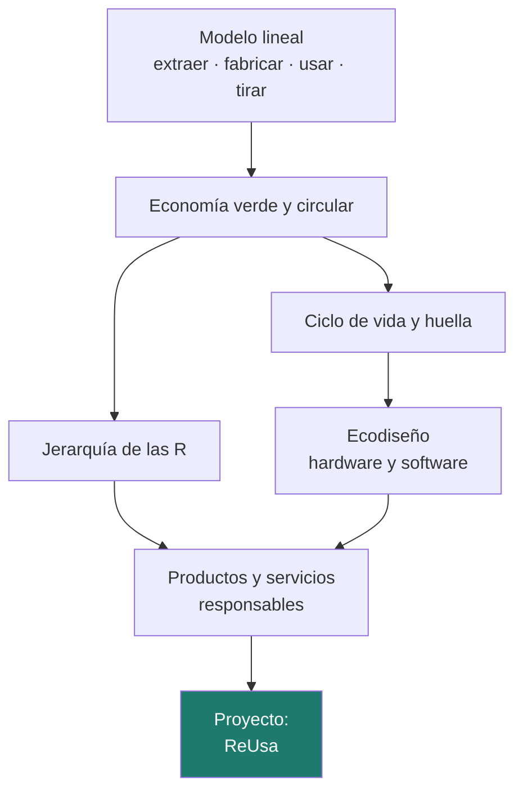
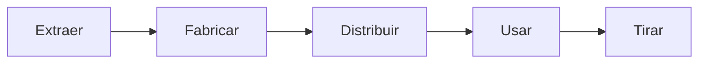
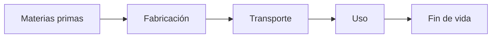
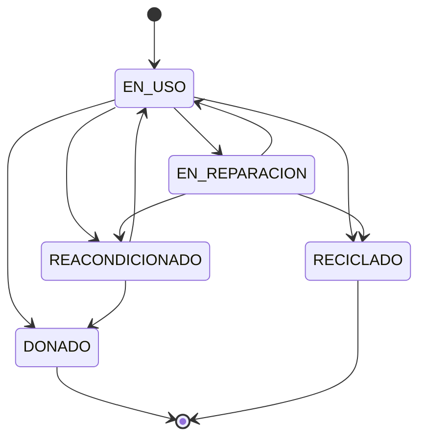

# Unidad 4 · Economía circular y ecodiseño

> **Módulo:** 1708 · Sostenibilidad aplicada al sistema productivo · **Resultado de aprendizaje:** RA4 · **Duración:** 4 h · **Peso:** 16 %
> **Herramienta principal:** Java 21 + Spring Boot (JPA, `enum` con transiciones, excepciones) · **Ciclo:** DAW

Un portátil nuevo llega a tu mesa con buena parte de su huella de carbono **ya emitida**: la de extraer materiales, fabricar sus componentes y transportarlo. Cada año que lo alargas, esa huella se reparte entre más años de uso. Esta unidad trata de pasar del modelo **extraer-fabricar-usar-tirar** a uno **circular**, en el que los productos y materiales se mantienen en uso el mayor tiempo posible. Verás los principios de la economía verde y circular, el **ciclo de vida** de un producto, el **ecodiseño** (también del software) y cómo proponer **productos y servicios responsables**. Al terminar habrás construido **ReUsa**, un servicio que gestiona los equipos informáticos de un centro con criterios circulares.

!!! info "Resultado de aprendizaje 4"
    Propone productos y servicios responsables teniendo en cuenta los principios de la economía circular.

---

## Mapa de la unidad



### Qué vas a saber hacer al terminar

- [ ] Caracterizar el **modelo de producción y consumo lineal** y sus consecuencias.
- [ ] Explicar los **principios de la economía verde y circular** y la **jerarquía de las R**.
- [ ] Contrastar los **beneficios** de la economía circular frente al modelo clásico.
- [ ] Analizar el **ciclo de vida** de un producto y calcular su **huella anualizada**.
- [ ] Aplicar principios de **ecodiseño** al hardware y al software.
- [ ] Modelar un **ciclo de vida** en Java con estados, transiciones y excepciones.
- [ ] **Proponer** un producto o servicio responsable y un indicador para medirlo.

### Cómo se trabaja esta unidad

| | Paso | Dónde |
|:---:|---|---|
| **1** | El profesor **explica** el concepto y ejecuta los ejemplos. | secciones 1–7 |
| **2** | Tú **lees** el apartado y **ejecutas los ejemplos** en tu equipo. | tu IDE |
| **3** | Haces los **retos rápidos** que aparecen entre la teoría. | en el texto |
| **4** | Practicas con **actividades que tienen la solución desplegable**. | sección 9 |
| **5** | Trabajas el **proyecto** hasta tener los tests en verde e interpretas el resultado. | `proyectos/ud4/` |
| **6** | Tarea práctica de evaluación, con la misma mecánica del paso 5. | examen del trimestre |

---

## 1. El modelo lineal y sus límites

El modelo de producción y consumo que ha dominado desde la revolución industrial es **lineal**: se extraen materias primas, se fabrican productos, se usan y se desechan.



Funciona mientras los recursos parecen infinitos y los residuos «desaparecen». No es el caso: los materiales se encarecen, su extracción tiene impactos ambientales y sociales, y los residuos se acumulan. En electrónica el problema es especialmente grave, porque los equipos contienen materiales valiosos y sustancias peligrosas.

Un motor del modelo lineal es la **obsolescencia**, que puede ser de varios tipos:

| Tipo | Qué es | Ejemplo digital |
|---|---|---|
| **Técnica o programada** | El producto deja de funcionar o no se puede reparar | Batería pegada que no se puede cambiar |
| **De software** | El hardware funciona, pero el software deja de soportarlo | Una app que exige la última versión del sistema operativo |
| **Percibida** | Se sustituye porque «parece viejo» | Cambiar de móvil cada año por el diseño |

!!! reto "Reto rápido 1"
    Piensa en el último dispositivo que tú o tu familia sustituisteis. ¿Qué tipo de obsolescencia fue? ¿Se podría haber alargado su vida?

---

## 2. Economía verde y economía circular

La **economía verde** busca que la actividad económica sea **baja en carbono, eficiente en el uso de recursos y socialmente inclusiva**. La **economía circular** se centra en los materiales: que los productos, componentes y materiales **mantengan su valor y sigan en uso** el mayor tiempo posible.

La Fundación Ellen MacArthur, una de las organizaciones de referencia, resume la economía circular en tres principios:

1. **Eliminar residuos y contaminación desde el diseño.**
2. **Mantener productos y materiales en uso**, con su mayor valor posible.
3. **Regenerar los sistemas naturales.**

### 2.1 La jerarquía de las R

No todas las opciones circulares valen lo mismo. Cuanto antes se actúe en la cadena, más valor se conserva:

| Orden | Opción | Qué significa | En equipos informáticos |
|:---:|---|---|---|
| 1 | **Reducir** | Necesitar menos productos | Compartir equipos, no comprar lo que no hace falta |
| 2 | **Reutilizar** | Otro usuario lo usa tal cual | Pasar un portátil a otro departamento o donarlo |
| 3 | **Reparar** | Arreglarlo para que siga funcionando | Cambiar la batería o el teclado |
| 4 | **Reacondicionar** | Revisarlo y actualizarlo para una nueva vida | Cambiar disco por SSD, ampliar RAM, reinstalar |
| 5 | **Reciclar** | Recuperar sus materiales | Entregarlo a un gestor autorizado de RAEE |
| 6 | **Valorizar** | Recuperar energía de lo que no se puede reciclar | Tratamiento energético de fracciones no reciclables |
| 7 | **Eliminar** | Vertedero: la última opción | — |

!!! analogia "Analogía"
    Piensa en una camiseta. Reutilizarla es dársela a tu hermano; repararla es coserle un botón; reciclarla es deshacerla en fibras para fabricar otra cosa. Las tres son mejores que tirarla, pero coser un botón conserva **muchísimo más** que deshilacharla.

!!! reto "Reto rápido 2"
    Un monitor funciona pero tiene un píxel muerto. Ordena de mejor a peor estas opciones: reciclarlo, donarlo a una asociación, repararlo, tirarlo.

---

## 3. Beneficios frente al modelo clásico

| Ámbito | Modelo lineal | Modelo circular |
|---|---|---|
| **Ambiental** | Más extracción, más residuos, más emisiones de fabricación | Menos materias primas y residuos; la huella de fabricación se reparte en más años |
| **Económico** | Dependencia de materias primas y de sus precios | Ahorro en compras, nuevos negocios de reparación, reacondicionado y alquiler |
| **Social** | Empleo concentrado donde se fabrica | Empleo local en reparación y reacondicionado; acceso a tecnología para más personas |
| **Riesgos** | Vulnerable a la escasez de materiales | Más resiliente, aunque exige logística inversa y calidad garantizada |

!!! warning "Circular no significa automáticamente mejor"
    Alargar la vida de un equipo muy ineficiente puede consumir más energía que sustituirlo por uno eficiente. Por eso las decisiones se toman **con números**: comparando la huella de fabricación con la del uso.

---

## 4. El ciclo de vida y la huella de un producto

El **análisis de ciclo de vida (ACV)**, regulado por las normas ISO 14040 e ISO 14044, estudia los impactos de un producto en **todas sus etapas**:



Muchos fabricantes publican fichas de **huella de carbono de producto (PCF)** de sus portátiles, monitores o servidores. En los equipos personales es habitual que **la fabricación sea la mayor parte** de la huella de todo el ciclo de vida, por delante del uso.

Esa huella de fabricación se «amortiza» durante los años de vida del equipo, igual que el precio de compra:

```text
huella anual = kg CO₂ de fabricación / años de vida  +  kg CO₂ de un año de uso
```

```java title="¿Cuánto se ahorra alargando la vida?"
double ahorroAnual(double kgFabricacion, int aniosActuales, int aniosExtra) {
    double antes = kgFabricacion / aniosActuales;                  // (1)!
    double despues = kgFabricacion / (aniosActuales + aniosExtra); // (2)!
    return antes - despues;
}
// Portátil de 300 kg CO2 de fabricación: de 4 a 6 años -> 75 - 50 = 25 kg CO2 al año
```

1.  Parte de la huella de fabricación que corresponde a cada año si el equipo dura lo previsto.
2.  Al durar más años, cada año carga con una parte menor. El uso no cambia, así que la diferencia es el ahorro.

!!! reto "Reto rápido 3"
    Un sobremesa tiene 350 kg de CO₂ de fabricación y 45 kg al año de uso. Calcula su huella anual si dura 3 años y si dura 5. ¿Cuánto pesa la fabricación en cada caso?

---

## 5. Ecodiseño: hardware y software

El **ecodiseño** integra los criterios ambientales **desde el diseño**, que es donde se decide la mayor parte del impacto de un producto.

### 5.1 En el hardware

- **Reparabilidad**: tornillos en lugar de pegamento, piezas de repuesto e información de reparación disponibles.
- **Modularidad**: poder cambiar la batería, la memoria o el disco.
- **Materiales**: menos sustancias peligrosas, más material reciclado, fáciles de separar.
- **Eficiencia energética** durante el uso.

La normativa europea empuja en esta dirección: el **Reglamento de Ecodiseño para Productos Sostenibles** (Reglamento (UE) 2024/1781), que prevé un **pasaporte digital de producto**; la **Directiva sobre el derecho a reparar** (Directiva (UE) 2024/1799); o el **cargador común USB-C** para muchos dispositivos. En España, la **Ley 7/2022 de residuos y suelos contaminados para una economía circular** y el **Real Decreto 110/2015** sobre residuos de aparatos eléctricos y electrónicos (RAEE).

### 5.2 En el software

El software también provoca obsolescencia. **Ecodiseñar software** es:

- Que la aplicación **funcione bien en equipos y navegadores antiguos**, sin exigir el último modelo.
- **Mantener compatibilidad** y dar actualizaciones de seguridad durante años.
- Evitar que cada versión necesite **más memoria y CPU** sin aportar nada a cambio.
- Diseñar **APIs estables** que no obliguen a rehacer los clientes.

!!! reto "Reto rápido 4"
    Tu aplicación de DWES carga 3 MB de JavaScript en la página principal. ¿Qué tiene que ver eso con la obsolescencia de los móviles de tus usuarios?

---

## 6. Modelar un ciclo de vida en Java

Un sistema que gestiona equipos con criterios circulares tiene que **impedir** transiciones sin sentido: un equipo reciclado no puede volver a estar en uso. Eso se modela con un `enum` de estados y una regla de transiciones.



```java title="Una transición no permitida es un error de estado"
public void retirar(Equipo equipo) {
    if (equipo.getEstado() == EstadoEquipo.RECICLADO) {
        throw new IllegalStateException(                             // (1)!
                "El equipo " + equipo.getEtiqueta() + " ya está RECICLADO");
    }
    equipo.setEstado(EstadoEquipo.RECICLADO);
}
```

1.  `IllegalStateException` es la excepción de Java para «el objeto no está en un estado que permita esta operación». Es el **criterio del RA4**. En el proyecto, el controlador la convierte en una respuesta **409 Conflict**.

!!! warning "Valida antes de cambiar"
    Comprueba la transición **antes** de modificar el estado. Si cambias el estado y después lanzas la excepción, el objeto queda en un estado incorrecto.

Para la jerarquía de las R, el **orden de declaración** del `enum` sirve de prioridad: `ordinal()` 0 es la mejor opción, y los `enum` son `Comparable` por ese orden.

```java
OpcionR mejor = viables.stream().min(Comparator.naturalOrder()).orElse(OpcionR.ELIMINAR);
```

---

## 7. Proponer productos y servicios responsables

La economía circular abre **modelos de negocio** en los que el sector digital tiene mucho que aportar:

| Modelo | Idea | Ejemplo con software |
|---|---|---|
| **Producto como servicio** | Se paga por usar, no por poseer; el fabricante recupera el equipo | Plataforma de alquiler de portátiles para empresas |
| **Reacondicionado** | Equipos revisados con garantía | Tienda online de reacondicionados con trazabilidad |
| **Reparación** | Alargar la vida útil | App que reserva citas y localiza repuestos |
| **Compartir** | Más uso por producto | Reserva de equipos compartidos en un centro |
| **Recuperación** | Cerrar el ciclo de materiales | Gestión de la recogida de RAEE con trazabilidad |

Una propuesta responsable no se queda en la idea: define **qué impacto reduce** y **cómo se mide**. Un indicador típico es la **tasa de circularidad**: de los equipos que salen de uso, qué porcentaje tiene una segunda vida (reacondicionado o donado) frente a los que van directamente a reciclaje.

!!! reto "Reto rápido 5"
    Propón en dos líneas un servicio digital circular para tu instituto y el indicador con el que medirías si funciona.

---

## 8. Errores frecuentes (para tener a mano)

| Error | Causa | Solución |
|---|---|---|
| Un equipo reciclado vuelve a `EN_USO` | No se validan las transiciones | Comprueba con `transicionPermitida` antes de cambiar |
| Estado cambiado aunque salta la excepción | Modificar antes de validar | Valida primero, cambia después |
| División entre cero en la huella anual | Años de vida 0 | Lanza `IllegalArgumentException` si no son positivos |
| Tasa de circularidad con los equipos en uso | Contar en el denominador los que no han salido | Solo cuentan reacondicionados, donados y reciclados |
| La mejor opción sale al revés | Ordenar por `max` en lugar de `min` | El ordinal 0 es la mejor opción |
| Columnas que no existen en `data.sql` | Nombres Java en camelCase | Spring los convierte a snake_case: `anioCompra` → `anio_compra` |

---

## 9. Practica **con** solución a la vista

> Estas actividades usan los **datos y tipos del proyecto**: inventario de equipos, huellas de fabricación de fichas PCF reales y la jerarquía de las R. Intenta cada una antes de desplegar la solución.

```java
public enum EstadoEquipo { EN_USO, EN_REPARACION, REACONDICIONADO, DONADO, RECICLADO }
public enum OpcionR { REDUCIR, REUTILIZAR, REPARAR, REACONDICIONAR, RECICLAR, VALORIZAR, ELIMINAR }

// Equipo: getEtiqueta(), getTipo(), getAnioCompra(), getEstado(),
//         getKgFabricacion(), getKgUsoAnual(), setEstado(...)
```

#### Actividad 1 — ¿Qué pesa más, fabricar o usar?
Escribe `String dondeEstaLaHuella(double kgFabricacion, double kgUsoAnual, int aniosVida)` que devuelva `"FABRICACIÓN (86 %)"` o `"USO (62 %)"` según cuál domine en el total del ciclo de vida.

<details class="sol"><summary>Solución</summary>

```java
String dondeEstaLaHuella(double kgFabricacion, double kgUsoAnual, int aniosVida) {
    if (aniosVida <= 0) throw new IllegalArgumentException("Años de vida no positivos");
    double uso = kgUsoAnual * aniosVida;
    double total = kgFabricacion + uso;
    double pctFabricacion = kgFabricacion / total * 100;
    return pctFabricacion >= 50
            ? String.format("FABRICACIÓN (%.0f %%)", pctFabricacion)
            : String.format("USO (%.0f %%)", 100 - pctFabricacion);
}
// Portátil (300 kg, 12 kg/año, 4 años) -> FABRICACIÓN (86 %)
// Sobremesa (350 kg, 45 kg/año, 6 años) -> FABRICACIÓN (56 %)
```

Cuanto más pesa la fabricación, más rentable en CO₂ es alargar la vida en lugar de sustituir.
</details>

#### Actividad 2 — Amortizar la huella de fabricación
Escribe `double huellaAnual(double kgFabricacion, double kgUsoAnual, int aniosVida)` con 1 decimal, y `Map<Integer, Double> tablaPorVida(double kgFabricacion, double kgUsoAnual, int desde, int hasta)` que devuelva la huella anual para cada duración posible, ordenada.

<details class="sol"><summary>Solución</summary>

```java
double huellaAnual(double kgFabricacion, double kgUsoAnual, int aniosVida) {
    if (aniosVida <= 0) throw new IllegalArgumentException("Años de vida no positivos");
    return Math.round((kgFabricacion / aniosVida + kgUsoAnual) * 10) / 10.0;
}

Map<Integer, Double> tablaPorVida(double kgFabricacion, double kgUsoAnual, int desde, int hasta) {
    Map<Integer, Double> tabla = new TreeMap<>();
    for (int a = desde; a <= hasta; a++) {
        tabla.put(a, huellaAnual(kgFabricacion, kgUsoAnual, a));
    }
    return tabla;
}
// 300 kg, 12 kg/año: 3 años -> 112.0 ; 4 -> 87.0 ; 5 -> 72.0 ; 6 -> 62.0 ; 7 -> 54.9
```

Fíjate en que el ahorro es **decreciente**: pasar de 3 a 4 años ahorra 25 kg/año; de 6 a 7, solo 7,1.
</details>

#### Actividad 3 — El punto en que compensa sustituir
Un equipo viejo consume mucho. Escribe `int aniosParaAmortizar(double kgFabricacionNuevo, double ahorroUsoAnual)` que devuelva cuántos años de uso hacen falta para que la fabricación del equipo nuevo se compense con lo que ahorra funcionando. Si no ahorra nada, devuelve `-1`.

<details class="sol"><summary>Solución</summary>

```java
int aniosParaAmortizar(double kgFabricacionNuevo, double ahorroUsoAnual) {
    if (ahorroUsoAnual <= 0) return -1;                 // nunca se amortiza
    return (int) Math.ceil(kgFabricacionNuevo / ahorroUsoAnual);
}
// Portátil nuevo de 280 kg que ahorra 4 kg/año -> 70 años: no compensa sustituirlo
// Servidor nuevo de 900 kg que ahorra 300 kg/año -> 3 años: sí compensa
```

Esta cuenta es la que impide aplicar «circular = siempre alargar» como dogma: en equipos muy ineficientes, sustituir puede ser lo correcto.
</details>

#### Actividad 4 — Proteger el ciclo de vida
Escribe `void cambiarEstado(Equipo e, EstadoEquipo nuevo)` que valide la transición y lance `IllegalStateException` con los dos estados en el mensaje. Recuerda que `DONADO` y `RECICLADO` son finales y que pasar al mismo estado no es una transición.

<details class="sol"><summary>Solución</summary>

```java
private static final Map<EstadoEquipo, Set<EstadoEquipo>> PERMITIDAS = Map.of(
        EstadoEquipo.EN_USO, Set.of(EstadoEquipo.EN_REPARACION, EstadoEquipo.REACONDICIONADO,
                                    EstadoEquipo.DONADO, EstadoEquipo.RECICLADO),
        EstadoEquipo.EN_REPARACION, Set.of(EstadoEquipo.EN_USO, EstadoEquipo.REACONDICIONADO,
                                           EstadoEquipo.RECICLADO),
        EstadoEquipo.REACONDICIONADO, Set.of(EstadoEquipo.EN_USO, EstadoEquipo.DONADO),
        EstadoEquipo.DONADO, Set.of(),
        EstadoEquipo.RECICLADO, Set.of());

void cambiarEstado(Equipo e, EstadoEquipo nuevo) {
    if (!PERMITIDAS.get(e.getEstado()).contains(nuevo)) {          // valida ANTES de tocar nada
        throw new IllegalStateException("No se puede pasar de " + e.getEstado() + " a " + nuevo);
    }
    e.setEstado(nuevo);
}
```

Validar primero y cambiar después evita dejar el objeto en un estado incorrecto si salta la excepción.
</details>

#### Actividad 5 — Elegir la mejor R
Un equipo llega al almacén y el técnico anota qué opciones son viables. Escribe `OpcionR mejorOpcion(Set<OpcionR> viables)` y `String justificacion(OpcionR elegida)` con una frase que explique por qué esa opción está por encima de las demás.

<details class="sol"><summary>Solución</summary>

```java
OpcionR mejorOpcion(Set<OpcionR> viables) {
    return viables.stream().min(Comparator.naturalOrder()).orElse(OpcionR.ELIMINAR);
}

String justificacion(OpcionR elegida) {
    return switch (elegida) {
        case REDUCIR -> "No hace falta otro equipo: es la opción que más recursos evita";
        case REUTILIZAR -> "El equipo sigue usándose tal cual: conserva todo su valor";
        case REPARAR -> "Una intervención pequeña devuelve el equipo al servicio";
        case REACONDICIONAR -> "Revisión y mejora para una nueva vida útil completa";
        case RECICLAR -> "Ya no es utilizable: al menos se recuperan sus materiales";
        case VALORIZAR -> "Solo recupera energía: última opción antes del vertedero";
        case ELIMINAR -> "No hay alternativa viable: es la peor opción posible";
    };
}
```

El `enum` ordena por declaración, así que `min` con el orden natural devuelve la R más alta de la jerarquía sin escribir ninguna comparación explícita.
</details>

#### Actividad 6 — Tasa de circularidad del centro
Escribe `double tasaCircularidad(List<Equipo> equipos)`: porcentaje de equipos **retirados** que tuvieron segunda vida, con 1 decimal. Los que siguen en uso o en reparación no cuentan en el denominador.

<details class="sol"><summary>Solución</summary>

```java
double tasaCircularidad(List<Equipo> equipos) {
    long segundaVida = equipos.stream()
            .filter(e -> e.getEstado() == EstadoEquipo.REACONDICIONADO
                      || e.getEstado() == EstadoEquipo.DONADO)
            .count();
    long reciclados = equipos.stream().filter(e -> e.getEstado() == EstadoEquipo.RECICLADO).count();
    long retirados = segundaVida + reciclados;
    if (retirados == 0) return 0.0;
    return Math.round(segundaVida * 1000.0 / retirados) / 10.0;
}
```

Incluir en el denominador los equipos aún en uso diluiría el indicador y daría una falsa sensación de buena gestión.
</details>

#### Actividad 7 — Plan de renovación del aula
Escribe `List<Equipo> candidatosReacondicionar(List<Equipo> equipos, int anioActual, int edadMinima)`: los que están en uso o en reparación y tienen al menos esa edad, del más antiguo al más nuevo y, a igual edad, por etiqueta.

<details class="sol"><summary>Solución</summary>

```java
List<Equipo> candidatosReacondicionar(List<Equipo> equipos, int anioActual, int edadMinima) {
    return equipos.stream()
            .filter(e -> e.getEstado() == EstadoEquipo.EN_USO
                      || e.getEstado() == EstadoEquipo.EN_REPARACION)
            .filter(e -> anioActual - e.getAnioCompra() >= edadMinima)
            .sorted(Comparator.comparingInt(Equipo::getAnioCompra)
                    .thenComparing(Equipo::getEtiqueta))
            .toList();
}
```

El desempate por etiqueta hace que la lista sea siempre la misma: importante si el informe se firma o se compara entre cursos.
</details>

#### Actividad 8 — Impacto de una campaña
El centro reacondiciona todos los candidatos para que duren 2 años más. Escribe `double co2EvitadoAnual(List<Equipo> candidatos, int anioActual, int aniosExtra)` que sume, para cada equipo, lo que se ahorra al repartir su fabricación entre más años.

<details class="sol"><summary>Solución</summary>

```java
double co2EvitadoAnual(List<Equipo> candidatos, int anioActual, int aniosExtra) {
    double total = 0;
    for (Equipo e : candidatos) {
        int vidaActual = Math.max(1, anioActual - e.getAnioCompra());
        total += e.getKgFabricacion() / vidaActual
               - e.getKgFabricacion() / (vidaActual + aniosExtra);
    }
    return Math.round(total * 10) / 10.0;
}
```

Es la cifra que convierte una propuesta en una decisión: «reacondicionar estos 12 equipos evita X kg de CO₂ al año» convence mucho más que «hay que ser circulares».
</details>

---

## Proyecto de la unidad

La práctica gruesa de la unidad se hace sobre **ReUsa**, un servicio que gestiona los equipos informáticos de un centro. Controla el **ciclo de vida** con transiciones permitidas, calcula la **huella anual** y el **ahorro por alargar la vida**, elige la **mejor opción** según la jerarquía de las R, obtiene la **tasa de circularidad** y propone **candidatos a reacondicionar**. Los datos se guardan con JPA en una base de datos H2 en memoria.

**[Proyecto ReUsa →](../proyectos/ud4/README.md)**

```
proyecto-ud4/
├── src/main/java/…/modelo/Equipo.java                ← entidad JPA (ya hecha)
├── src/main/java/…/servicio/CircularidadService.java ← tu código (métodos con TODO)
├── src/main/resources/data.sql                       ← inventario inicial
├── src/test/java/…/CircularidadServiceTest.java      ← los tests
└── INTERPRETACION.md
```

```bash
./mvnw test
./mvnw spring-boot:run   # http://localhost:8080/api/equipos
```

!!! warning "Los tests son la especificación"
    No los modifiques para que pasen: describen exactamente lo que tu código debe hacer, y el examen usará una batería equivalente.

---

## Retos de ampliación

- **R1.** Añade un endpoint `GET /api/equipos/{id}/huella?aniosExtra=2` que devuelva la huella anual actual y el ahorro de alargar su vida.
- **R2.** Guarda un **historial de cambios de estado** en una entidad `CambioEstado` (equipo, estado anterior, estado nuevo, fecha).
- **R3.** Añade la opción `OpcionR` recomendada a cada candidato a reacondicionar según su edad y estado.
- **R4.** Busca la ficha PCF de un portátil real de un fabricante y añádelo al `data.sql` con sus cifras y la fuente en un comentario.

---

## Más práctica

#### Actividad 9 — Inventario por tipo y estado
Escribe `Map<String, Map<EstadoEquipo, Long>> inventario(List<Equipo> equipos)` con el recuento por tipo de equipo y estado, para el informe anual del departamento.

<details class="sol"><summary>Solución</summary>

```java
Map<String, Map<EstadoEquipo, Long>> inventario(List<Equipo> equipos) {
    return equipos.stream().collect(Collectors.groupingBy(Equipo::getTipo, TreeMap::new,
            Collectors.groupingBy(Equipo::getEstado,
                    () -> new EnumMap<>(EstadoEquipo.class), Collectors.counting())));
}
```
</details>

#### Actividad 10 — Índice de reparabilidad
Con `record Modelo(String nombre, boolean bateriaSustituible, boolean memoriaAmpliable, boolean discoAccesible, boolean repuestosDisponibles, boolean manualPublico)`, escribe `int puntuacionEcodiseno(Modelo m)` de 0 a 10 (2 puntos por cada característica) y `String recomendacion(int puntos)`: a partir de 8 `"COMPRA RECOMENDADA"`, a partir de 5 `"ACEPTABLE"`, si no `"DESCARTAR"`.

<details class="sol"><summary>Solución</summary>

```java
int puntuacionEcodiseno(Modelo m) {
    int p = 0;
    if (m.bateriaSustituible()) p += 2;
    if (m.memoriaAmpliable()) p += 2;
    if (m.discoAccesible()) p += 2;
    if (m.repuestosDisponibles()) p += 2;
    if (m.manualPublico()) p += 2;
    return p;
}

String recomendacion(int puntos) {
    if (puntos >= 8) return "COMPRA RECOMENDADA";
    if (puntos >= 5) return "ACEPTABLE";
    return "DESCARTAR";
}
```

Un criterio así puede incorporarse a un pliego de compra pública: es la forma de que el ecodiseño influya de verdad en el mercado.
</details>

#### Actividad 11 — Coste total de propiedad frente a coste de compra
Escribe `double costeAnual(double precioCompra, double costeMantenimientoAnual, int aniosVida)` y compara un equipo barato que dura 3 años con otro más caro que dura 6.

<details class="sol"><summary>Solución</summary>

```java
double costeAnual(double precioCompra, double costeMantenimientoAnual, int aniosVida) {
    if (aniosVida <= 0) throw new IllegalArgumentException("Años no válidos");
    return Math.round((precioCompra / aniosVida + costeMantenimientoAnual) * 100) / 100.0;
}
// Barato: 600 € / 3 años + 40 = 240 €/año
// Caro reparable: 900 € / 6 años + 40 = 190 €/año
```

El mismo razonamiento que con el CO₂: lo que parece caro sale barato cuando se reparte entre los años que dura.
</details>

#### Actividad 12 — Historial de un equipo
Con `record Cambio(String etiqueta, EstadoEquipo desde, EstadoEquipo hasta, LocalDate fecha)`, escribe `boolean historialValido(List<Cambio> historial)` que compruebe que todas las transiciones son permitidas y que cada una parte del estado en que dejó la anterior.

<details class="sol"><summary>Solución</summary>

```java
boolean historialValido(List<Cambio> historial) {
    for (int i = 0; i < historial.size(); i++) {
        Cambio c = historial.get(i);
        if (!PERMITIDAS.get(c.desde()).contains(c.hasta())) return false;
        if (i > 0 && historial.get(i - 1).hasta() != c.desde()) return false;   // continuidad
    }
    return true;
}
```

Esta comprobación es la que permite auditar la trazabilidad: sin ella, un inventario puede «perder» equipos por el camino.
</details>

---

## Laboratorio

> El laboratorio se hace sobre la **aplicación arrancada** (`./mvnw spring-boot:run`). Necesitas tener el proyecto con los tests en verde.

### Laboratorio guiado (resuelto) — El inventario del aula

El fichero `data.sql` carga 7 equipos inventados. Vamos a gestionar su ciclo de vida.

**1) Consulta el inventario, la tasa de circularidad y los candidatos**

```bash
curl http://localhost:8080/api/equipos
curl http://localhost:8080/api/circularidad
curl "http://localhost:8080/api/candidatos?edadMinima=4"
```

**2) Prueba una transición válida y otra que no lo es**

```bash
curl -X PATCH "http://localhost:8080/api/equipos/1/estado?nuevo=EN_REPARACION"
curl -i -X PATCH "http://localhost:8080/api/equipos/6/estado?nuevo=EN_USO"
```

**3) Recicla un sobremesa y vuelve a pedir la tasa**

```bash
curl -X PATCH "http://localhost:8080/api/equipos/3/estado?nuevo=RECICLADO"
curl http://localhost:8080/api/circularidad
```

<details class="sol"><summary>Qué debe salir y por qué</summary>

- **Tasa de circularidad inicial: 66,7 %.** De los tres equipos retirados, SOBR-011 (reacondicionado) y MONI-003 (donado) tienen segunda vida; MONI-004 fue a reciclaje.
- **Candidatos en 2026 con 4 años o más**: SOBR-010 (2017), PORT-001 (2019) y PORT-002 (2021), del más antiguo al más nuevo. PORT-003 (2023) es demasiado nuevo; los monitores ya no están en uso.
- **El equipo 1** pasa a `EN_REPARACION` y la respuesta muestra el equipo actualizado.
- **El equipo 6** está `RECICLADO`: la API responde **409 Conflict** con el mensaje de tu `IllegalStateException`. El estado no cambia.
- **Tras reciclar el equipo 3**, la tasa baja a **50,0 %** (2 con segunda vida de 4 retirados). Reciclar un equipo que aún funcionaba empeora el indicador: justo lo que el indicador debe mostrar.

Con el servicio, alargar dos años la vida de PORT-001 (300 kg de fabricación, previstos 4 años) ahorra **25 kg de CO₂ al año**.
</details>

### Laboratorio propuesto (entregable) — Una propuesta circular para el centro

**Criterios de aceptación**

- Sustituyes `data.sql` por un inventario verosímil de **al menos 10 equipos** de tu centro o de una empresa conocida (puedes estimar años y huellas, indicando de dónde salen las cifras de fabricación: fichas PCF de fabricantes).
- Obtienes tasa de circularidad y candidatos, y calculas el **CO₂ anual evitado** si todos los candidatos se reacondicionan para durar 2 años más.
- Diseñas **un servicio o producto responsable** (por ejemplo, un programa de reacondicionado y donación) con el modelo de negocio, las R que aplica y su indicador.
- `INTERPRETACION.md` completo, con los números de tu programa.

---

## Banco de preguntas

> De aquí salen las preguntas cortas y de tipo test de los exámenes. Responde **antes** de desplegar.

### Tipo test

<details><summary><b>1.</b> El modelo lineal de producción se describe como…<br>a) reducir, reutilizar, reciclar · b) extraer, fabricar, distribuir, usar y tirar · c) diseñar, probar, desplegar · d) comprar, alquilar, devolver</summary><b>b</b>.</details>

<details><summary><b>2.</b> Que una batería vaya pegada y no se pueda sustituir es un ejemplo de obsolescencia…<br>a) percibida · b) técnica o programada · c) de software · d) natural</summary><b>b</b>.</details>

<details><summary><b>3.</b> Que un móvil funcione pero deje de recibir actualizaciones y las apps ya no arranquen es obsolescencia…<br>a) técnica · b) de software · c) percibida · d) circular</summary><b>b</b>. Es la que el desarrollo de software puede provocar o evitar.</details>

<details><summary><b>4.</b> ¿Cuál de estos **no** es un principio de la economía circular según la Fundación Ellen MacArthur?<br>a) eliminar residuos y contaminación desde el diseño · b) mantener productos y materiales en uso · c) regenerar los sistemas naturales · d) compensar las emisiones con créditos de carbono</summary><b>d</b>.</details>

<details><summary><b>5.</b> Ordena de mejor a peor: reciclar, reparar, reutilizar.<br>a) reciclar, reparar, reutilizar · b) reutilizar, reparar, reciclar · c) reparar, reutilizar, reciclar · d) todas valen lo mismo</summary><b>b</b>. Reutilizar conserva el producto entero sin intervención; reparar exige una intervención; reciclar solo recupera materiales.</details>

<details><summary><b>6.</b> En el `enum OpcionR`, `ELIMINAR` está declarado el último porque…<br>a) es el más frecuente · b) el orden de declaración marca la prioridad y es la peor opción · c) va en orden alfabético · d) es el valor por defecto de Java</summary><b>b</b>. Por eso `min(Comparator.naturalOrder())` devuelve la mejor opción viable.</details>

<details><summary><b>7.</b> Un portátil con 300 kg de fabricación y 12 kg/año de uso tiene, a 4 años de vida, una huella anual de…<br>a) 75,0 kg · b) 87,0 kg · c) 312 kg · d) 348 kg</summary><b>b</b>. 300/4 + 12 = 87. La opción a) olvida el uso; la d) es el total del ciclo de vida, no el anual.</details>

<details><summary><b>8.</b> Alargar de 4 a 6 años la vida de ese portátil ahorra al año…<br>a) 12 kg · b) 25 kg · c) 50 kg · d) 150 kg</summary><b>b</b>. 300/4 − 300/6 = 75 − 50 = 25.</details>

<details><summary><b>9.</b> En un portátil de oficina, la mayor parte de la huella del ciclo de vida suele corresponder a…<br>a) el transporte · b) la fabricación · c) el uso · d) el fin de vida</summary><b>b</b>. Por eso alargar su vida es tan eficaz.</details>

<details><summary><b>10.</b> La excepción adecuada cuando se intenta pasar un equipo RECICLADO a EN_USO es…<br>a) `IllegalArgumentException` · b) `IllegalStateException` · c) `NullPointerException` · d) `UnsupportedOperationException`</summary><b>b</b>. El argumento es válido; lo que no es válido es el **estado** del objeto.</details>

<details><summary><b>11.</b> En la API de ReUsa, esa excepción se traduce en el código HTTP…<br>a) 400 · b) 404 · c) 409 · d) 500</summary><b>c</b> Conflict: la petición es correcta pero choca con el estado actual del recurso.</details>

<details><summary><b>12.</b> Si se valida la transición **después** de cambiar el estado…<br>a) da igual, la excepción se lanza igual · b) el objeto queda en un estado incorrecto aunque salte la excepción · c) el compilador lo impide · d) mejora el rendimiento</summary><b>b</b>.</details>

<details><summary><b>13.</b> Un inventario con 2 reacondicionados, 1 donado, 3 reciclados y 5 en uso tiene una tasa de circularidad del…<br>a) 27,3 % · b) 50,0 % · c) 60,0 % · d) 33,3 %</summary><b>b</b>. 3 con segunda vida de 6 retirados. Los 5 en uso no cuentan: incluirlos daría la opción a).</details>

<details><summary><b>14.</b> El análisis de ciclo de vida está regulado por las normas…<br>a) ISO 9001 y 14001 · b) ISO 14040 y 14044 · c) ISO 27001 · d) ISO 50001</summary><b>b</b>.</details>

<details><summary><b>15.</b> Una ficha PCF publicada por un fabricante indica…<br>a) el precio del producto · b) la huella de carbono del producto y su reparto por etapas · c) el consumo eléctrico máximo · d) la garantía</summary><b>b</b>.</details>

<details><summary><b>16.</b> El «producto como servicio» consiste en…<br>a) vender más barato · b) pagar por el uso mientras el fabricante mantiene la propiedad y recupera el equipo · c) alquilar software · d) subcontratar el mantenimiento</summary><b>b</b>. Alinea el interés del fabricante con la durabilidad del producto.</details>

<details><summary><b>17.</b> Alargar la vida de un equipo es **siempre** la mejor opción ambiental.<br>a) verdadero · b) falso: hay que comparar la huella de fabricación del nuevo con el ahorro de uso · c) verdadero solo en portátiles · d) falso, nunca compensa</summary><b>b</b>. En equipos muy ineficientes y de uso intensivo, sustituir puede compensar en pocos años.</details>

<details><summary><b>18.</b> El ecodiseño de software incluye…<br>a) usar colores oscuros en la interfaz · b) que la aplicación siga funcionando en equipos y navegadores antiguos · c) comprimir el código fuente · d) reducir el número de clases</summary><b>b</b>. Junto con mantener compatibilidad y no exigir más recursos en cada versión.</details>

### Preguntas cortas

<details><summary><b>1.</b> Describe el modelo lineal y explica por qué deja de funcionar.</summary>Extraer, fabricar, distribuir, usar y tirar. Deja de funcionar porque supone recursos infinitos y residuos que desaparecen: los materiales se encarecen, su extracción tiene impactos graves y los residuos se acumulan, especialmente los electrónicos.</details>

<details><summary><b>2.</b> Explica los tres tipos de obsolescencia con un ejemplo digital de cada uno.</summary>Técnica o programada: batería pegada que no se puede cambiar. De software: el sistema deja de dar soporte a un modelo que funciona. Percibida: cambiar de móvil cada año por diseño o moda.</details>

<details><summary><b>3.</b> Enumera la jerarquía de las R en orden y explica por qué reparar va antes que reciclar.</summary>Reducir, reutilizar, reparar, reacondicionar, reciclar, valorizar, eliminar. Reparar conserva el producto completo y todo el valor incorporado en su fabricación; reciclar lo destruye para recuperar solo una parte de los materiales.</details>

<details><summary><b>4.</b> ¿Cómo se calcula la huella anual de un equipo y por qué se reparte la fabricación?</summary>Fabricación dividida entre los años de vida, más la huella de un año de uso. Se reparte porque la fabricación se emite una sola vez pero se «amortiza» durante toda la vida útil, igual que el precio de compra.</details>

<details><summary><b>5.</b> Una empresa duda entre reparar un portátil o comprar otro. ¿Qué dos cifras necesitas para decidir?</summary>La huella de fabricación del equipo nuevo y el ahorro anual de consumo que aportaría frente al viejo. Dividiendo la primera entre la segunda se obtiene en cuántos años se amortiza la sustitución.</details>

<details><summary><b>6.</b> ¿Qué es la tasa de circularidad de ReUsa y qué equipos entran en el denominador?</summary>El porcentaje de equipos retirados que tuvieron segunda vida (reacondicionados o donados). En el denominador solo entran los retirados: reacondicionados, donados y reciclados; los que siguen en uso o en reparación no.</details>

<details><summary><b>7.</b> Explica por qué `DONADO` y `RECICLADO` se modelan como estados finales.</summary>Porque el equipo sale del inventario del centro: ya no se puede actuar sobre él. Permitir salir de ellos haría que el historial dejara de ser trazable y falsearía el indicador de circularidad.</details>

<details><summary><b>8.</b> Cita tres características de ecodiseño de hardware y una norma europea que las impulse.</summary>Reparabilidad (tornillos en vez de pegamento), modularidad (batería, memoria y disco sustituibles), disponibilidad de repuestos y manuales, menos sustancias peligrosas. Impulsadas por el Reglamento (UE) 2024/1781 de Ecodiseño y la Directiva (UE) 2024/1799 sobre el derecho a reparar.</details>

<details><summary><b>9.</b> ¿Qué es el ecodiseño aplicado al software y qué relación tiene con la obsolescencia?</summary>Diseñar para que la aplicación funcione en equipos y navegadores antiguos, mantener compatibilidad y actualizaciones, y no aumentar los requisitos sin motivo. Evita que el software obligue a renovar hardware que todavía funciona.</details>

<details><summary><b>10.</b> Propón un modelo de negocio circular para el sector digital y di con qué indicador lo medirías.</summary>Por ejemplo, alquiler de equipos reacondicionados con recogida garantizada al final del contrato. Indicador: porcentaje de equipos que vuelven al circuito con segunda vida frente a los retirados, y años medios de vida útil alcanzados.</details>

<details><summary><b>11.</b> ¿Qué son los RAEE y qué norma española los regula?</summary>Residuos de aparatos eléctricos y electrónicos. En España los regula el Real Decreto 110/2015, dentro del marco de la Ley 7/2022 de residuos y suelos contaminados para una economía circular.</details>

<details><summary><b>12.</b> Un compañero afirma: «reciclamos el 100 % de los equipos, somos totalmente circulares». ¿Qué le responderías?</summary>Que reciclar es la penúltima opción de la jerarquía. Ser circular implica antes reducir, reutilizar, reparar y reacondicionar. Reciclar el 100 % puede significar que se están destruyendo equipos que aún podían usarse, lo que empeora la tasa de circularidad.</details>

---

## Glosario

| Término | Definición |
|---|---|
| **Economía lineal** | Modelo de extraer, fabricar, usar y tirar. |
| **Economía circular** | Modelo que mantiene productos y materiales en uso con su mayor valor posible. |
| **Economía verde** | Economía baja en carbono, eficiente en recursos y socialmente inclusiva. |
| **Jerarquía de las R** | Orden de preferencia de las opciones circulares: reducir, reutilizar, reparar, reacondicionar, reciclar… |
| **ACV** | Análisis de ciclo de vida: impactos de un producto en todas sus etapas (ISO 14040/14044). |
| **PCF** | *Product Carbon Footprint*: huella de carbono de producto. |
| **Ecodiseño** | Integración de criterios ambientales desde el diseño del producto. |
| **RAEE** | Residuos de aparatos eléctricos y electrónicos. |
| **Obsolescencia** | Pérdida de utilidad de un producto por causas técnicas, de software o percibidas. |

---

## Cómo se evalúa esta unidad (RA4)

Se evalúa con una **tarea práctica**: completar en Java un servicio que cumpla una especificación e interpretar su resultado, corregida con la rúbrica pública.

| # | Qué se valora | Cómo se mide | Puntos |
|:---:|---|---|:---:|
| 1 | **Que el programa funcione** | `(tests superados ÷ total) × 7` | **7,0** |
| 2 | **Ciclo de vida protegido** | Lanza `IllegalStateException` ante una transición no permitida | **1,0** |
| 3 | **Documentación** | Al menos 2 Javadoc o comentarios con contenido | **1,0** |
| 4 | **Interpretación** | `INTERPRETACION.md` con los 3 apartados y ≥ 40 palabras cada uno | **1,0** |
| | | **TOTAL** | **10** |

**Se supera con 5.** Los criterios 2–4 son **todo o nada**. La rúbrica no cambia: la conoces desde el primer día.
