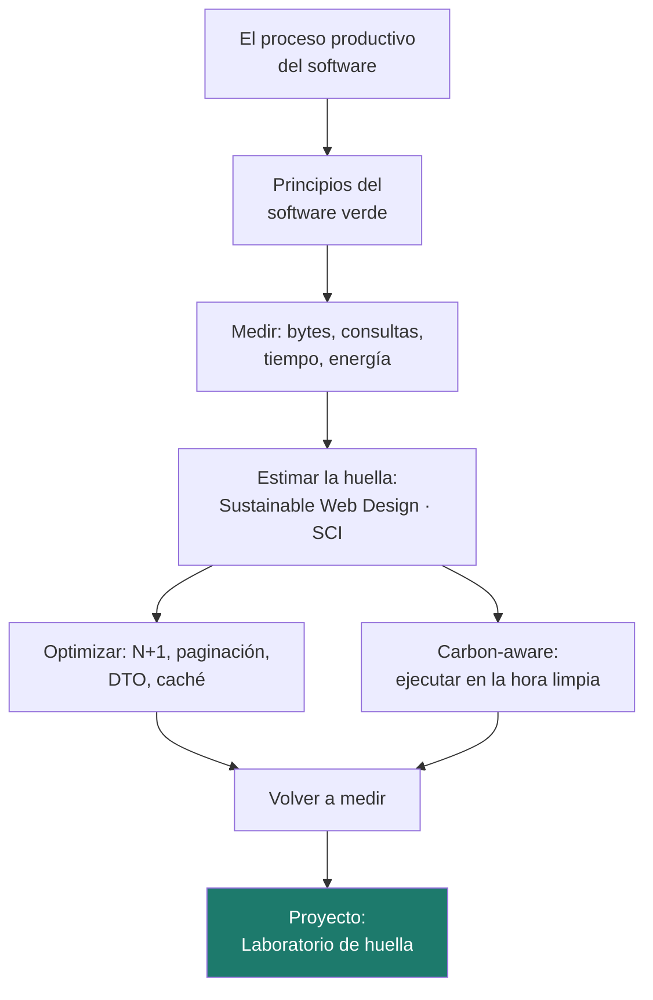

# Unidad 5 · Actividades sostenibles y huella del software

> **Módulo:** 1708 · Sostenibilidad aplicada al sistema productivo · **Resultado de aprendizaje:** RA5 · **Duración:** 5 h · **Peso:** 22 %
> **Herramienta principal:** Java 21 + Spring Boot (Actuator, JPA, `@EntityGraph`, `Pageable`, `@Scheduled`) · **Ciclo:** DAW

Esta es la unidad con más peso y la más cercana a tu futuro trabajo. El «proceso productivo» de un desarrollador es el software: se diseña, se programa, se prueba, se despliega y se ejecuta millones de veces. Aquí aprendes a **realizar esa actividad de forma sostenible**: medir su impacto, estimar su **huella de carbono** con modelos reconocidos, **optimizar** lo que más consume y ejecutar las tareas pesadas **cuando la electricidad es más limpia**. El método es el de cualquier ingeniería seria: **medir, cambiar, volver a medir**. Al terminar habrás trabajado en un **Laboratorio de huella** con una aplicación deliberadamente ineficiente que tú mismo mejorarás.

!!! info "Resultado de aprendizaje 5"
    Realiza actividades sostenibles minimizando el impacto de las mismas en el medio ambiente.

---

## Mapa de la unidad



### Qué vas a saber hacer al terminar

- [ ] Identificar dónde consume recursos el **proceso de producción del software**.
- [ ] Explicar los **principios del software verde**.
- [ ] **Medir** una aplicación Spring Boot: bytes, consultas SQL y tiempos.
- [ ] **Estimar** la huella de carbono con el modelo Sustainable Web Design y la especificación **SCI**.
- [ ] Detectar y corregir el **problema N+1**, paginar y enviar solo los datos necesarios.
- [ ] Programar tareas ***carbon-aware*** con `@Scheduled`.
- [ ] Calcular y comunicar la **reducción** conseguida con una optimización.

### Cómo se trabaja esta unidad

| | Paso | Dónde |
|:---:|---|---|
| **1** | El profesor **explica** el concepto y ejecuta los ejemplos. | secciones 1–7 |
| **2** | Tú **lees** el apartado y **ejecutas los ejemplos** en tu equipo. | tu IDE |
| **3** | Haces los **retos rápidos** que aparecen entre la teoría. | en el texto |
| **4** | Practicas con **actividades que tienen la solución desplegable**. | sección 9 |
| **5** | Trabajas el **proyecto** hasta tener los tests en verde, mides y optimizas. | `proyectos/ud5/` |
| **6** | Tarea práctica de evaluación, con la misma mecánica del paso 5. | examen del trimestre |

---

## 1. El proceso productivo del software

Aunque no haya chimeneas, desarrollar y operar software consume recursos en todas sus fases:

| Fase | Dónde consume | Criterio sostenible |
|---|---|---|
| **Diseño** | Decide cuánto trabajo hará el sistema durante años | No construir lo que nadie usa; definir requisitos de eficiencia |
| **Desarrollo** | Equipos del equipo de desarrollo | Alargar la vida del hardware |
| **Pruebas e integración continua** | Cada *commit* puede lanzar compilaciones y tests | Cachear dependencias, no ejecutar lo que no ha cambiado |
| **Despliegue** | Imágenes y artefactos que se transfieren y almacenan | Imágenes pequeñas, borrar versiones antiguas |
| **Operación** | Servidores, red y dispositivos, **24 horas al día** | Eficiencia, dimensionar bien, apagar lo que no se usa |
| **Datos** | Almacenamiento, copias, transferencias | Guardar solo lo necesario y durante el tiempo necesario |
| **Retirada** | Servidores y datos que siguen activos sin usarse | Apagar servicios obsoletos y borrar datos caducados |

!!! analogia "Analogía"
    Una aplicación en producción es como una **cocina de restaurante que nunca cierra**. Una receta ineficiente preparada una vez apenas se nota; preparada millones de veces al día, determina la factura de la luz y cuánto trabajan los fogones.

!!! reto "Reto rápido 1"
    En tu proyecto de DWES, ¿qué entorno o proceso sigue consumiendo aunque nadie lo esté usando? Propón cómo evitarlo.

---

## 2. Principios del software verde

La **Green Software Foundation** agrupa las prácticas de software sostenible en unas pocas ideas:

| Principio | Idea | Ejemplo |
|---|---|---|
| **Eficiencia de carbono** | Emitir el menor carbono posible por unidad de trabajo útil | Medir la huella **por petición** o **por usuario** |
| **Eficiencia energética** | Consumir la menor energía posible | Evitar consultas repetidas, comprimir |
| **Conciencia de carbono** (*carbon-aware*) | Hacer más cuando la electricidad es más limpia y menos cuando es más sucia | Aplazar un proceso nocturno a la hora de más renovables |
| **Eficiencia del hardware** | Aprovechar el hardware, cuya fabricación ya emitió carbono | Consolidar servidores infrautilizados, alargar su vida |
| **Medición** | Lo que no se mide no se puede mejorar | Métricas antes y después de cada cambio |

!!! reto "Reto rápido 2"
    Clasifica según el principio: (a) programar las copias de seguridad a las 14:00 porque hay mucha solar; (b) pasar tres servidores al 10 % de uso a uno solo; (c) eliminar una consulta duplicada.

---

## 3. Medir primero

Antes de optimizar hay que saber **dónde** se consume. En una aplicación Spring Boot tienes tres fuentes de medida a mano:

| Qué | Cómo | En el proyecto |
|---|---|---|
| **Bytes enviados** | Tamaño de cada respuesta | `MedicionFilter` lo registra en la consola |
| **Consultas SQL** | Estadísticas de Hibernate | `hibernate.generate_statistics=true` |
| **Tiempo de respuesta** | Métricas de Actuator | `/actuator/metrics/http.server.requests` |

```java title="Un filtro que mide cada respuesta"
@Override
protected void doFilterInternal(HttpServletRequest request, HttpServletResponse response,
                                FilterChain chain) throws ServletException, IOException {
    ContentCachingResponseWrapper envoltorio = new ContentCachingResponseWrapper(response); // (1)!
    long inicio = System.nanoTime();
    try {
        chain.doFilter(request, envoltorio);                                                // (2)!
    } finally {
        long bytes = envoltorio.getContentSize();
        log.info("[HUELLA] {} -> {} bytes, {} g CO2", request.getRequestURI(),
                 bytes, huella.gramosCo2(bytes, intensidad));                               // (3)!
        envoltorio.copyBodyToResponse();                                                    // (4)!
    }
}
```

1.  El envoltorio guarda en memoria el cuerpo de la respuesta para poder medir su tamaño.
2.  La petición sigue su camino normal hasta el controlador.
3.  Convierte los bytes en gramos de CO₂ con el servicio que programas tú.
4.  Imprescindible: sin esta línea el cliente recibiría una respuesta vacía.

!!! warning "Estimar no es medir"
    Los modelos de las secciones siguientes **estiman** la huella a partir de bytes o de energía media. Medir la energía real de la JVM requiere herramientas específicas (por ejemplo, JoularJX en equipos Linux con procesadores Intel o AMD) y no suele funcionar en máquinas virtuales. Para comparar un antes y un después, la estimación es suficiente si **usas el mismo método** en las dos medidas.

---

## 4. Del byte al CO₂: el modelo Sustainable Web Design

El modelo **Sustainable Web Design** estima la energía de transferir datos por internet sumando centros de datos, redes y dispositivos. En su versión 3, de forma simplificada, usa **0,81 kWh por GB** transferido.

```text
kWh      = bytes / 1 000 000 000 × 0,81
g CO₂    = kWh × intensidad de la red (g CO₂/kWh)        ← la que calculaste en la UD2
```

```java title="Huella de una respuesta"
public static final double KWH_POR_GB = 0.81;            // Sustainable Web Design v3, simplificado
public static final double BYTES_POR_GB = 1_000_000_000.0;

double gramosCo2(long bytes, double gramosPorKwh) {
    return bytes / BYTES_POR_GB * KWH_POR_GB * gramosPorKwh;
}
// Una respuesta de 2 MB con 150 g/kWh: 0.002 GB x 0.81 x 150 = 0.243 g
```

Una petición suelta emite muy poco. Lo que importa es **multiplicar por el tráfico**: 0,243 g por 10 000 peticiones al día durante un año son unos **887 kg de CO₂**.

!!! reto "Reto rápido 3"
    Una página pesa 3 MB y recibe 5 000 visitas al día. Con 120 g/kWh, ¿cuántos kg de CO₂ al año? ¿Y si la reduces a 1 MB?

---

## 5. La especificación SCI

La **Software Carbon Intensity (SCI)** de la Green Software Foundation, publicada también como norma ISO/IEC 21031, no da un total, sino una **tasa**: carbono por **unidad funcional** (por petición, por usuario, por informe…). Así se pueden comparar versiones aunque cambie el tráfico.

```text
SCI = (E × I + M) / R
```

| Letra | Qué es | Ejemplo |
|:---:|---|---|
| **E** | Energía consumida por el software (kWh) | 5 kWh en un día |
| **I** | Intensidad de carbono de la electricidad (g CO₂/kWh) | 150 g/kWh |
| **M** | Carbono **embebido**: parte de la fabricación del hardware asignada a ese periodo (g) | 4 250 g |
| **R** | Unidades funcionales atendidas | 10 000 peticiones |

Con esos valores: `(5 × 150 + 4250) / 10 000 = 0,5 g CO₂ por petición`.

!!! analogia "Analogía"
    El SCI es como el **consumo de un coche en litros cada 100 km**. El total de litros depende de cuánto conduzcas; los litros por 100 km dicen si el coche es eficiente. Una aplicación con más usuarios emitirá más en total, pero puede tener un SCI mejor.

!!! reto "Reto rápido 4"
    ¿Por qué el SCI incluye el término **M**, si el hardware ya estaba fabricado antes de desplegar el software?

---

## 6. Optimizar lo que más consume

### 6.1 El problema N+1

Es uno de los derroches más habituales con JPA. Traes una lista de N entidades y, al recorrerla, accedes a una relación *lazy* de cada una: Hibernate lanza **1 consulta** para la lista y **N consultas más**, una por elemento.

```java title="N+1 en acción"
List<Producto> productos = repositorio.findAll();          // 1 consulta
for (Producto p : productos) {
    p.getFicha().getKgCo2Fabricacion();                     // 1 consulta por producto
}
// 2000 productos -> 2001 consultas
```

La solución es traer la relación **en la misma consulta** con `@EntityGraph` (o `JOIN FETCH` en JPQL):

```java title="Una sola consulta, paginada"
public interface ProductoRepository extends JpaRepository<Producto, Long> {

    @EntityGraph(attributePaths = "ficha")                  // (1)!
    Page<Producto> findAllBy(Pageable pageable);            // (2)!
}
```

1.  Indica a Spring Data que cargue la ficha junto al producto con un `JOIN`.
2.  `Pageable` limita cuántos productos se traen: nadie lee 2000 productos de golpe.

### 6.2 Enviar solo lo necesario y no repetir trabajo

```java title="DTO + paginación + caché"
public record ProductoResumen(Long id, String nombre, double precio, double kgCo2) { }   // (1)!

@GetMapping("/api/v2/productos")
@Cacheable("productos")                                                                   // (2)!
public List<ProductoResumen> v2(@RequestParam(defaultValue = "0") int pagina) {
    return repositorio.findAllBy(PageRequest.of(pagina, 20)).stream()
            .map(p -> new ProductoResumen(p.getId(), p.getNombre(), p.getPrecio(),
                                          p.getFicha().getKgCo2Fabricacion()))
            .toList();
}
```

1.  Solo los campos que muestra la vista: menos bytes y ningún dato innecesario.
2.  La misma página no se vuelve a calcular mientras esté en caché. Requiere `@EnableCaching` (ya está en la aplicación) y pensar **cuándo** hay que invalidarla si los datos cambian.

!!! warning "Optimizar sin medir es adivinar"
    Una caché mal planteada puede **gastar más memoria** de lo que ahorra en CPU. Aplica un cambio cada vez y **mide** su efecto.

---

## 7. Carbon-aware: ejecutar cuando la red es más limpia

En la UD2 viste que la intensidad de la red cambia mucho entre días y horas. Muchas tareas **no tienen que ejecutarse en un momento exacto**: informes, copias de seguridad, reindexados, entrenamientos. Desplazarlas en el tiempo reduce sus emisiones sin cambiar ni una línea de su lógica.

```java title="Tarea carbon-aware"
@Component
public class TareaCarbonAware {

    @Scheduled(cron = "0 0 * * * *")                                  // (1)!
    public void generarInformeSiLaRedEstaLimpia() {
        double actual = intensidadActual();
        if (huella.ejecutarAhora(actual, umbral)) {                   // (2)!
            log.info("Red limpia ({} g/kWh): genero el informe", actual);
            generarInforme();
        } else {
            log.info("Red sucia ({} g/kWh): aplazo el informe", actual); // (3)!
        }
    }
}
```

1.  Se comprueba **cada hora en punto**. `@Scheduled` necesita `@EnableScheduling` en la aplicación. Programar esta tarea es el **criterio del RA5**.
2.  La decisión la toma el servicio, que es fácil de probar con tests.
3.  Deja constancia en el log: es la evidencia de que la estrategia funciona.

!!! warning "Siempre con un límite"
    Una tarea que se aplaza indefinidamente puede no ejecutarse nunca. En un sistema real se fija una **hora límite**: si a esa hora la red sigue sucia, se ejecuta igualmente.

!!! reto "Reto rápido 5"
    Una copia de seguridad consume 12 kWh. A las 3:00 la intensidad es de 180 g/kWh y a las 14:00 de 70 g/kWh. ¿Cuánto CO₂ se ahorra al moverla?

---

## 8. Errores frecuentes (para tener a mano)

| Error | Causa | Solución |
|---|---|---|
| La API va lenta y la consola se llena de `select` | Problema N+1 | `@EntityGraph` o `JOIN FETCH` |
| `LazyInitializationException` | Acceder a una relación *lazy* fuera de la sesión | Cargar la relación en la consulta o usar un DTO dentro de la transacción |
| La tarea programada no se ejecuta | Falta `@EnableScheduling` o la clase no es un `@Component` | Revisa ambas anotaciones |
| `@Cacheable` no hace nada | Falta `@EnableCaching` o se llama al método desde la misma clase | La llamada tiene que pasar por el proxy de Spring |
| Cifras de CO₂ absurdamente altas | Confundir MB con GB o g con kg | Revisa las unidades en cada paso |
| «Hemos reducido un 99 % las emisiones» | Comparar peticiones distintas (2000 productos frente a 20) | Compara la **misma unidad funcional** e indica qué cambió |

---

## 9. Practica **con** solución a la vista

> Estas actividades reproducen las medidas del laboratorio: bytes por respuesta, consultas SQL, intensidad de la red y unidades funcionales. Intenta cada una antes de desplegar la solución.

```java
public static final double KWH_POR_GB = 0.81;          // Sustainable Web Design v3, simplificado
public static final double BYTES_POR_GB = 1_000_000_000.0;
```

#### Actividad 1 — Del byte al gramo
Escribe `double gramosCo2(long bytes, double gramosPorKwh)` y comprueba cuántos gramos emite una respuesta de 274 kB con una intensidad de 150 g/kWh.

<details class="sol"><summary>Solución</summary>

```java
double kwhTransferencia(long bytes) {
    return bytes / BYTES_POR_GB * KWH_POR_GB;
}

double gramosCo2(long bytes, double gramosPorKwh) {
    return kwhTransferencia(bytes) * gramosPorKwh;
}
// 274 000 bytes a 150 g/kWh -> 0.000274 GB x 0.81 x 150 = 0.0333 g
```

Sin redondear: los redondeos intermedios en cifras tan pequeñas hacen desaparecer el resultado.
</details>

#### Actividad 2 — Lo que importa es la escala
Escribe `double kgAnuales(long bytesPorPeticion, long peticionesDia, double gramosPorKwh)` con 1 decimal. Aplícalo al endpoint `v1` (274 kB, 10 000 peticiones al día, 150 g/kWh) y a la `v2` (1,8 kB).

<details class="sol"><summary>Solución</summary>

```java
double kgAnuales(long bytesPorPeticion, long peticionesDia, double gramosPorKwh) {
    double gramos = gramosCo2(bytesPorPeticion, gramosPorKwh) * peticionesDia * 365;
    return Math.round(gramos / 1000 * 10) / 10.0;
}
// v1: unos 121.6 kg al año   ·   v2: unos 0.8 kg al año
```

Una petición emite una millonésima de gramo y parece irrelevante. Multiplicada por el tráfico de un año, deja de serlo: esa es la idea central de la unidad.
</details>

#### Actividad 3 — SCI: carbono por unidad funcional
Escribe `double sci(double energiaKwh, double gramosPorKwh, double embebidoGramos, long unidadesFuncionales)` y calcula el SCI de un servicio que consume 5 kWh al día con 150 g/kWh, tiene 4250 g de carbono embebido asignado al día y atiende 10 000 peticiones.

<details class="sol"><summary>Solución</summary>

```java
double sci(double energiaKwh, double gramosPorKwh, double embebidoGramos, long unidadesFuncionales) {
    if (unidadesFuncionales <= 0) throw new IllegalArgumentException("R debe ser positivo");
    return (energiaKwh * gramosPorKwh + embebidoGramos) / unidadesFuncionales;
}
// (5 x 150 + 4250) / 10 000 = 0.5 g CO2 por petición
```

Con el doble de tráfico y la misma infraestructura, el SCI **baja**: el hardware se aprovecha mejor. Por eso es una tasa y no un total.
</details>

#### Actividad 4 — Detectar el N+1 desde las métricas
Escribe `String diagnostico(long consultas, int elementosDevueltos)` que devuelva `"SOSPECHA N+1: 2001 consultas para 2000 elementos"` o `"OK: 2 consultas para 2000 elementos"`.

<details class="sol"><summary>Solución</summary>

```java
boolean sospechaNMasUno(long consultas, int elementos) {
    return elementos >= 2 && consultas >= elementos + 1L;
}

String diagnostico(long consultas, int elementos) {
    String plantilla = sospechaNMasUno(consultas, elementos) ? "SOSPECHA N+1" : "OK";
    return String.format("%s: %d consultas para %d elementos", plantilla, consultas, elementos);
}
```

Puesto en un filtro, este diagnóstico convierte un problema invisible en un aviso en el log.
</details>

#### Actividad 5 — Cuánto cuesta cada consulta de más
Si cada consulta a la base de datos supone del orden de 0,2 ms de CPU, escribe `double msDesperdiciados(long consultas, int elementos, double msPorConsulta)` que devuelva el tiempo perdido por el N+1 (las consultas que sobran respecto a las 2 ideales).

<details class="sol"><summary>Solución</summary>

```java
double msDesperdiciados(long consultas, int elementos, double msPorConsulta) {
    long ideales = 2;                                  // la lista y, si acaso, el conteo
    long sobrantes = Math.max(0, consultas - ideales);
    return Math.round(sobrantes * msPorConsulta * 10) / 10.0;
}
// 2001 consultas, 0.2 ms -> 399.8 ms desperdiciados en cada petición
```

Nota que el modelo por bytes **no ve** este coste: por eso nunca se mide una sola magnitud.
</details>

#### Actividad 6 — Reducción honesta
Escribe `String informeReduccion(String metrica, double antes, double despues)` que devuelva `"bytes: 274000 → 1800 (−99,3 %)"`. Si el valor de antes no es positivo, lanza `IllegalArgumentException`.

<details class="sol"><summary>Solución</summary>

```java
String informeReduccion(String metrica, double antes, double despues) {
    if (antes <= 0) throw new IllegalArgumentException("El valor de antes debe ser positivo");
    double r = Math.round((antes - despues) / antes * 1000) / 10.0;
    return String.format(Locale.ROOT, "%s: %.0f → %.0f (%s%.1f %%)",
            metrica, antes, despues, r >= 0 ? "−" : "+", Math.abs(r));
}
```

Cuidado con presumir de ese −99,3 %: si la `v2` muestra 20 productos y la `v1` mostraba 2000, la comparación no es justa. Ver la actividad 12.
</details>

#### Actividad 7 — La hora más limpia dentro de una ventana
Escribe `Optional<Integer> mejorHora(Map<Integer, Double> prevision, int desde, int hasta)`, ambos extremos incluidos, con la hora más temprana en caso de empate.

<details class="sol"><summary>Solución</summary>

```java
Optional<Integer> mejorHora(Map<Integer, Double> prevision, int desde, int hasta) {
    Integer mejor = null;
    for (int h = desde; h <= hasta; h++) {                  // recorrer el rango, no el mapa,
        Double v = prevision.get(h);                        // resuelve el empate y la ventana
        if (v != null && (mejor == null || v < prevision.get(mejor))) {
            mejor = h;
        }
    }
    return Optional.ofNullable(mejor);
}
```

Recorrer el mapa con `min` daría la hora correcta, pero no garantizaría cuál gana en un empate.
</details>

#### Actividad 8 — Planificar el lote nocturno
Con `record Tarea(String nombre, double kwh, int horaLimite)`, escribe `Map<String, Integer> planificar(List<Tarea> tareas, Map<Integer, Double> prevision)` que asigne a cada tarea la hora más limpia disponible antes de su límite, y `double gramosTotales(...)` para comparar el plan con ejecutarlo todo a medianoche.

<details class="sol"><summary>Solución</summary>

```java
Map<String, Integer> planificar(List<Tarea> tareas, Map<Integer, Double> prevision) {
    Map<String, Integer> plan = new LinkedHashMap<>();
    for (Tarea t : tareas) {
        int hora = mejorHora(prevision, 0, t.horaLimite()).orElse(t.horaLimite());
        plan.put(t.nombre(), hora);                         // si no hay previsión, al límite
    }
    return plan;
}

double gramosTotales(List<Tarea> tareas, Map<String, Integer> plan, Map<Integer, Double> prevision) {
    return tareas.stream()
            .mapToDouble(t -> t.kwh() * prevision.getOrDefault(plan.get(t.nombre()), 0.0))
            .sum();
}
```

Es una estrategia voraz y sencilla: suficiente para demostrar el ahorro frente a ejecutar todo a la misma hora.
</details>

---

## Proyecto de la unidad

La práctica gruesa de la unidad se hace en el **Laboratorio de huella del software**. El servicio que programas estima la energía y el CO₂ de las transferencias, calcula el **SCI**, la **reducción porcentual**, detecta la **sospecha de N+1**, elige la **mejor hora** y decide si **ejecutar ahora** una tarea. La aplicación trae un catálogo de 2000 productos con un endpoint **ineficiente a propósito** (`v1`) para medir, y un `v2` que optimizas tú.

**[Proyecto Laboratorio de huella →](../proyectos/ud5/README.md)**

```
proyecto-ud5/
├── src/main/java/…/servicio/HuellaService.java     ← tu código (métodos con TODO)
├── src/main/java/…/tarea/TareaCarbonAware.java     ← TODO RA5: @Scheduled
├── src/main/java/…/web/CatalogoController.java     ← TODO LAB: versión v2
├── src/main/java/…/web/MedicionFilter.java         ← mide cada respuesta (ya hecho)
├── src/test/java/…/HuellaServiceTest.java          ← los tests
└── INTERPRETACION.md
```

```bash
./mvnw test
./mvnw spring-boot:run   # http://localhost:8080/api/v1/productos
```

!!! warning "Los tests son la especificación"
    No los modifiques para que pasen: describen exactamente lo que tu código debe hacer, y el examen usará una batería equivalente.

---

## Retos de ampliación

- **R1.** Añade una **hora límite** a la tarea carbon-aware: si a las 6:00 no se ha ejecutado, se ejecuta igualmente.
- **R2.** Sustituye la intensidad simulada por la real de REE usando el cliente de la UD2 con `time_trunc=hour`.
- **R3.** Registra con Micrometer un contador propio `huella.gramos` que acumule los gramos estimados y consúltalo en `/actuator/metrics`.
- **R4.** Calcula el **SCI** del catálogo por petición con la energía estimada de las transferencias de una hora de tráfico simulado.

---

## Más práctica

#### Actividad 9 — Etiqueta energética de un endpoint
Escribe `String etiqueta(double gramosPorPeticion)` según los tramos del proyecto (A ≤ 0,1; B ≤ 0,2; C ≤ 0,4; D ≤ 0,8; E ≤ 1,6; F el resto) y explica en un comentario qué **no** mide esa etiqueta.

<details class="sol"><summary>Solución</summary>

```java
String etiqueta(double g) {
    // Solo mide la transferencia: un endpoint con 2000 consultas SQL puede salir "A"
    if (g <= 0.1) return "A";
    if (g <= 0.2) return "B";
    if (g <= 0.4) return "C";
    if (g <= 0.8) return "D";
    if (g <= 1.6) return "E";
    return "F";
}
```
</details>

#### Actividad 10 — Presupuesto de carbono mensual
Escribe `String controlPresupuesto(double gramosAcumulados, double presupuestoMensualGramos, int diaDelMes)` que avise si el consumo va por encima del ritmo previsto, tipo `"AL 118 % del ritmo previsto"`.

<details class="sol"><summary>Solución</summary>

```java
String controlPresupuesto(double gramosAcumulados, double presupuestoMensualGramos, int diaDelMes) {
    if (presupuestoMensualGramos <= 0 || diaDelMes <= 0) throw new IllegalArgumentException("Datos no válidos");
    double esperado = presupuestoMensualGramos * diaDelMes / 30.0;
    double ritmo = gramosAcumulados / esperado * 100;
    return String.format(Locale.ROOT, "AL %.0f %% del ritmo previsto", ritmo);
}
```
</details>

#### Actividad 11 — Umbral adaptativo
En lugar de un umbral fijo, ejecuta la tarea si la intensidad actual está en el **mejor tercio** de la previsión del día. Escribe `boolean enElMejorTercio(double actual, Collection<Double> prevision)`.

<details class="sol"><summary>Solución</summary>

```java
boolean enElMejorTercio(double actual, Collection<Double> prevision) {
    List<Double> ordenada = prevision.stream().sorted().toList();
    if (ordenada.isEmpty()) throw new IllegalArgumentException("Previsión vacía");
    double corte = ordenada.get(Math.max(0, ordenada.size() / 3 - 1));
    return actual <= corte;
}
```

Se adapta solo a días limpios y sucios, sin tener que retocar el umbral cada temporada.
</details>

#### Actividad 12 — Comparar sin hacer trampa
Escribe `double gramosPorElemento(long bytes, int elementosMostrados, double intensidad)` y úsalo para comparar la `v1` (274 kB, 2000 productos) con la `v2` (1,8 kB, 20 productos). ¿Sigue siendo una mejora del 99 %?

<details class="sol"><summary>Solución</summary>

```java
double gramosPorElemento(long bytes, int elementosMostrados, double intensidad) {
    if (elementosMostrados <= 0) throw new IllegalArgumentException("Sin elementos");
    return gramosCo2(bytes, intensidad) / elementosMostrados;
}
// v1: 0.0333 g / 2000 ≈ 1.7e-5 g por producto
// v2: 0.00022 g / 20  ≈ 1.1e-5 g por producto  ->  una mejora de en torno al 35 %, no del 99 %
```

Por petición la mejora es enorme, pero parte de ella viene de **no enviar** 1980 productos que nadie iba a mirar. La ganancia real por producto mostrado es menor, y a eso hay que sumar las 2000 consultas SQL eliminadas, que el modelo por bytes no ve. Contarlo así es lo que distingue un informe honesto de un titular.
</details>

---

## Laboratorio

> El laboratorio se hace sobre la **aplicación arrancada** (`./mvnw spring-boot:run`). Necesitas tener el proyecto con los tests en verde.

### Laboratorio guiado (resuelto) — Medir el «antes»

**1) Llama al endpoint ineficiente y mira la consola**

```bash
curl -s -o /dev/null -w "%{size_download} bytes, %{time_total} s\n" http://localhost:8080/api/v1/productos
```

Busca en la consola dos líneas: la del filtro (`[HUELLA] GET /api/v1/productos -> …`) y la de estadísticas de Hibernate (`Session Metrics`, con el número de sentencias JDBC ejecutadas).

**2) Consulta el tiempo medido por Actuator**

```bash
curl "http://localhost:8080/actuator/metrics/http.server.requests?tag=uri:/api/v1/productos"
```

**3) Comprueba con tu servicio lo que has visto**, por ejemplo en un test o con `jshell`: `sospechaNMasUno(2001, 2000)` y `gramosCo2(274_000, 150)`.

<details class="sol"><summary>Qué debe salir y por qué</summary>

- **Bytes**: unos **274 kB** por petición (2000 productos con su ficha).
- **Consultas**: unas **2001 sentencias JDBC**: 1 para la lista y 1 por cada ficha. `sospechaNMasUno(2001, 2000)` devuelve `true`.
- **CO₂ estimado por transferencia** con 150 g/kWh: unos **0,033 g** por petición, etiqueta **A**. Con 10 000 peticiones al día son unos **122 kg al año**.
- **Tiempo**: varía con el equipo; lo importante es compararlo con tu `v2` en la misma máquina.

La lección clave: **la etiqueta sale A aunque el endpoint es muy ineficiente**. El modelo por bytes solo ve la transferencia, no las 2000 consultas extra que hacen trabajar a la base de datos y a la CPU. Por eso nunca se mide una sola cosa.

Una `v2` con `@EntityGraph`, páginas de 20 y un DTO de 4 campos baja a **1 consulta** (más la de contar si usas `Page`) y unos **1,8 kB** por petición.
</details>

### Laboratorio propuesto (entregable) — Medir, optimizar, volver a medir

**Criterios de aceptación**

- Implementas `GET /api/v2/productos` con `@EntityGraph`, `Pageable` y un `record` DTO. Opcional: `@Cacheable`.
- Programas `TareaCarbonAware` con `@Scheduled` y la decisión de `ejecutarAhora`, y guardas un fragmento del log con decisiones de ejecutar y de aplazar.
- Registras en una tabla, para `v1` y `v2`: bytes, consultas SQL, tiempo medio de Actuator y gramos de CO₂ estimados, y calculas la **reducción porcentual** de cada métrica con tu servicio.
- En `INTERPRETACION.md` explicas **de dónde sale el ahorro**, lo proyectas a un año con un tráfico razonado y comparas de forma justa (misma unidad funcional).

---

## Banco de preguntas

> De aquí salen las preguntas cortas y de tipo test de los exámenes. Responde **antes** de desplegar.

### Tipo test

<details><summary><b>1.</b> El modelo Sustainable Web Design v3 simplificado estima…<br>a) 0,081 kWh/GB · b) 0,81 kWh/GB · c) 8,1 kWh/GB · d) 81 kWh/GB</summary><b>b</b>.</details>

<details><summary><b>2.</b> Una respuesta de 2 MB con la red a 150 g/kWh emite aproximadamente…<br>a) 0,024 g · b) 0,243 g · c) 2,43 g · d) 24,3 g</summary><b>b</b>. 0,002 GB × 0,81 × 150.</details>

<details><summary><b>3.</b> En la fórmula SCI = (E × I + M) / R, la **M** representa…<br>a) los megabytes transferidos · b) el carbono embebido del hardware asignado al periodo · c) los minutos de ejecución · d) la memoria consumida</summary><b>b</b>.</details>

<details><summary><b>4.</b> El SCI se expresa como…<br>a) un total de emisiones · b) una tasa: carbono por unidad funcional · c) un porcentaje · d) kWh por hora</summary><b>b</b>. Permite comparar versiones aunque cambie el tráfico.</details>

<details><summary><b>5.</b> Si `R` (unidades funcionales) es 0, el cálculo del SCI debe…<br>a) devolver 0 · b) lanzar `IllegalArgumentException` · c) devolver `Infinity` · d) devolver el numerador</summary><b>b</b>.</details>

<details><summary><b>6.</b> Recorrer 2000 productos accediendo a una relación *lazy* de cada uno provoca…<br>a) 1 consulta · b) 2 consultas · c) 2001 consultas · d) 4000 consultas</summary><b>c</b>. Una para la lista y una por elemento.</details>

<details><summary><b>7.</b> La anotación de Spring Data que carga una relación en la misma consulta es…<br>a) `@Transactional` · b) `@EntityGraph` · c) `@Cacheable` · d) `@ManyToOne`</summary><b>b</b>. También sirve un `JOIN FETCH` en JPQL.</details>

<details><summary><b>8.</b> `LazyInitializationException` aparece cuando…<br>a) la entidad no existe · b) se accede a una relación *lazy* fuera de la sesión de Hibernate · c) falta `@EnableCaching` · d) la consulta devuelve null</summary><b>b</b>.</details>

<details><summary><b>9.</b> Para que `@Scheduled` funcione hace falta…<br>a) nada más, funciona siempre · b) `@EnableScheduling` y que el método esté en un bean de Spring · c) un servidor con cron · d) `@Async`</summary><b>b</b>.</details>

<details><summary><b>10.</b> `@Cacheable` no surte efecto si el método se llama…<br>a) desde otro bean · b) desde la misma clase, sin pasar por el proxy de Spring · c) desde un test · d) desde un controlador</summary><b>b</b>.</details>

<details><summary><b>11.</b> Una tarea *carbon-aware* que se aplaza indefinidamente…<br>a) es el comportamiento correcto · b) es un error de diseño: hace falta una hora límite · c) ahorra el 100 % de las emisiones · d) se reinicia sola</summary><b>b</b>.</details>

<details><summary><b>12.</b> Una copia de seguridad de 12 kWh movida de 180 a 70 g/kWh ahorra…<br>a) 0,13 kg · b) 1,32 kg · c) 13,2 kg · d) 132 kg</summary><b>b</b>. 12 × 110 g = 1320 g.</details>

<details><summary><b>13.</b> Un endpoint con 2000 consultas SQL puede obtener etiqueta energética «A» porque…<br>a) la etiqueta mide solo la transferencia de bytes · b) las consultas no consumen energía · c) la etiqueta es aleatoria · d) Hibernate las agrupa</summary><b>a</b>. Por eso hay que medir bytes, consultas y tiempo a la vez.</details>

<details><summary><b>14.</b> Estimar la huella con un modelo por bytes y medir la energía real de la JVM…<br>a) son lo mismo · b) son cosas distintas: la estimación vale para comparar antes y después con el mismo método · c) la estimación no sirve para nada · d) la medición real es siempre posible</summary><b>b</b>.</details>

<details><summary><b>15.</b> El principio de «eficiencia del hardware» del software verde consiste en…<br>a) comprar hardware nuevo cada año · b) aprovechar al máximo el hardware existente, cuya fabricación ya emitió carbono · c) usar solo portátiles · d) apagar los monitores</summary><b>b</b>.</details>

<details><summary><b>16.</b> Consolidar tres servidores al 10 % de uso en uno solo responde al principio de…<br>a) conciencia de carbono · b) eficiencia del hardware · c) medición · d) eficiencia de carbono</summary><b>b</b>.</details>

<details><summary><b>17.</b> Anunciar «hemos reducido un 99 % las emisiones» comparando una respuesta de 2000 productos con otra de 20 es…<br>a) correcto, los bytes son los bytes · b) engañoso: no es la misma unidad funcional · c) imposible de calcular · d) obligatorio por la norma SCI</summary><b>b</b>.</details>

<details><summary><b>18.</b> `spring.jpa.properties.hibernate.generate_statistics=true` sirve para…<br>a) acelerar las consultas · b) registrar cuántas sentencias SQL lanza cada petición · c) activar la caché de segundo nivel · d) generar el esquema</summary><b>b</b>.</details>

### Preguntas cortas

<details><summary><b>1.</b> Nombra cuatro fases del proceso productivo del software y di dónde consume recursos cada una.</summary>Diseño (decide cuánto trabajo hará el sistema durante años), desarrollo (equipos del equipo), integración continua (compilaciones y tests en cada commit), despliegue (imágenes y artefactos), operación (servidores 24 h), datos (almacenamiento y copias) y retirada (servicios que siguen encendidos sin usarse).</details>

<details><summary><b>2.</b> Enumera los principios del software verde y pon un ejemplo de cada uno.</summary>Eficiencia de carbono (medir por petición), eficiencia energética (evitar consultas repetidas), conciencia de carbono (mover un proceso a la hora más limpia), eficiencia del hardware (consolidar servidores) y medición (métricas antes y después de cada cambio).</details>

<details><summary><b>3.</b> Escribe la fórmula para pasar de bytes transferidos a gramos de CO₂ y di de dónde sale la intensidad.</summary>bytes ÷ 1 000 000 000 × 0,81 kWh/GB × intensidad en g CO₂/kWh. La intensidad es la de la red eléctrica, calculada en la UD2 con los datos de Red Eléctrica.</details>

<details><summary><b>4.</b> Explica la fórmula del SCI término a término.</summary>E, energía consumida por el software; I, intensidad de carbono de la electricidad; M, carbono embebido del hardware asignado al periodo; R, unidades funcionales atendidas. El resultado es carbono por unidad funcional.</details>

<details><summary><b>5.</b> ¿Qué es el problema N+1, cómo se detecta y cómo se corrige?</summary>Una consulta para la lista y otra por cada elemento al acceder a una relación lazy. Se detecta comparando el número de sentencias SQL con el de elementos devueltos (estadísticas de Hibernate). Se corrige con `@EntityGraph` o `JOIN FETCH`, y se completa con paginación.</details>

<details><summary><b>6.</b> Cita tres medidas para reducir la huella de un endpoint que devuelve un catálogo y di qué ahorra cada una.</summary>Evitar el N+1 (trabajo de base de datos y CPU), paginar (bytes y memoria), devolver un DTO con los campos justos (bytes y datos innecesarios), cachear (repetir cálculos) y comprimir (bytes de red).</details>

<details><summary><b>7.</b> ¿Qué significa que una tarea sea *carbon-aware* y qué salvaguarda necesita?</summary>Que decide cuándo o cuánto trabajar según la intensidad de carbono de la red. Necesita una hora límite para que no se aplace indefinidamente.</details>

<details><summary><b>8.</b> ¿Por qué se dice que estimar no es medir? ¿Cuándo es suficiente estimar?</summary>Porque los modelos por bytes o por energía media no miden el consumo real del hardware. Es suficiente cuando se compara un antes y un después aplicando exactamente el mismo método y se identifica el resultado como estimación.</details>

<details><summary><b>9.</b> Describe tres fuentes de medida disponibles en una aplicación Spring Boot.</summary>Un filtro que registre los bytes de cada respuesta, las estadísticas de Hibernate para contar las consultas SQL y las métricas de Actuator en `/actuator/metrics/http.server.requests` para los tiempos.</details>

<details><summary><b>10.</b> ¿Qué es una unidad funcional y por qué es imprescindible al comparar versiones?</summary>La unidad de trabajo útil con la que se normaliza la huella: una petición, un usuario, un informe. Sin ella se comparan cosas distintas y cualquier «reducción» puede ser solo el efecto de haber devuelto menos datos.</details>

<details><summary><b>11.</b> Un compañero optimiza una consulta y añade una caché grande sin medir. ¿Qué le dirías?</summary>Que aplique un cambio cada vez y mida su efecto: una caché mal dimensionada puede gastar más memoria de la que ahorra en CPU, y sin medición no hay forma de saber cuál de los dos cambios ha servido.</details>

<details><summary><b>12.</b> Explica en dos frases por qué el software eficiente es también económicamente interesante para la empresa.</summary>Menos CPU, menos consultas y menos bytes significan menos servidores y menos factura de nube y energía. La sostenibilidad y el coste apuntan en la misma dirección, lo que hace fácil defender estas mejoras ante la dirección.</details>

---

## Glosario

| Término | Definición |
|---|---|
| **Software verde** | Software diseñado y operado para minimizar sus emisiones. |
| **Carbono embebido** | Emisiones de fabricar el hardware, asignadas a su uso. |
| **Unidad funcional** | Unidad de trabajo útil con la que se normaliza la huella: petición, usuario, informe… |
| **SCI** | *Software Carbon Intensity*: (E × I + M) / R. |
| **Sustainable Web Design** | Modelo que estima la energía y el CO₂ de las transferencias web. |
| **N+1** | Antipatrón de acceso a datos: 1 consulta para la lista y N para las relaciones. |
| **`@EntityGraph`** | Anotación de Spring Data JPA para cargar relaciones en la misma consulta. |
| **Carbon-aware** | Que adapta su ejecución a la intensidad de carbono de la red. |
| **Actuator** | Módulo de Spring Boot que expone salud y métricas de la aplicación. |

---

## Cómo se evalúa esta unidad (RA5)

Se evalúa con una **tarea práctica**: completar en Java un servicio que cumpla una especificación, programar la tarea carbon-aware e interpretar el resultado.

| # | Qué se valora | Cómo se mide | Puntos |
|:---:|---|---|:---:|
| 1 | **Que el programa funcione** | `(tests superados ÷ total) × 7` | **7,0** |
| 2 | **Actividad carbon-aware** | La tarea está programada con `@Scheduled` y decide con `ejecutarAhora` | **1,0** |
| 3 | **Documentación** | Al menos 2 Javadoc o comentarios con contenido | **1,0** |
| 4 | **Interpretación** | `INTERPRETACION.md` con los 3 apartados y ≥ 40 palabras cada uno | **1,0** |
| | | **TOTAL** | **10** |

**Se supera con 5.** Los criterios 2–4 son **todo o nada**. La rúbrica no cambia: la conoces desde el primer día.
