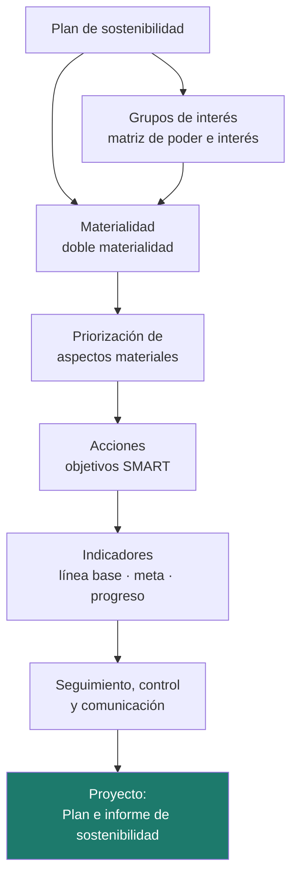
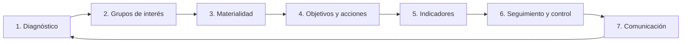
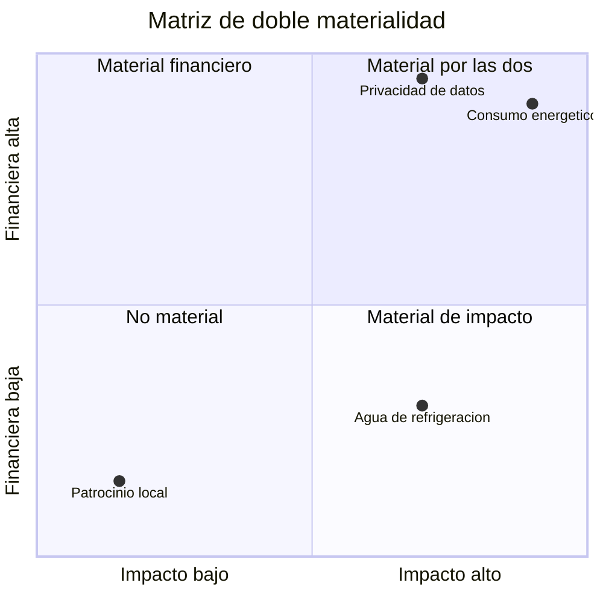

# Unidad 6 · Plan de sostenibilidad empresarial

> **Módulo:** 1708 · Sostenibilidad aplicada al sistema productivo · **Resultado de aprendizaje:** RA6 · **Duración:** 5 h · **Peso:** 20 %
> **Herramienta principal:** Java 21 + Spring Boot (`Comparator`, Thymeleaf) · **Ciclo:** DAW

La unidad final junta todas las piezas. Una empresa no se vuelve sostenible con acciones sueltas: necesita un **plan** que diga **con quién** tiene que contar (sus grupos de interés), **qué asuntos son de verdad importantes** para ella (la materialidad), **qué va a hacer** con cada uno y **cómo va a medir** si lo consigue. En esta unidad aprendes a analizar ese plan con las herramientas que usan las empresas y los auditores: la matriz de poder e interés, la **doble materialidad**, los objetivos con indicadores y el seguimiento del progreso. Los indicadores ASG de la UD1, la intensidad de la UD2, la tasa de circularidad de la UD4 o la huella de la UD5 son justo el tipo de medida que acaba en un plan. Al terminar tendrás una aplicación que genera el **informe de sostenibilidad** de una empresa.

!!! info "Resultado de aprendizaje 6"
    Analiza un plan de sostenibilidad de una empresa del sector, identificando sus grupos de interés, los aspectos ASG materiales y justificando acciones para su gestión y medición.

---

## Mapa de la unidad



### Qué vas a saber hacer al terminar

- [ ] Describir las **fases** de un plan de sostenibilidad.
- [ ] Identificar los **grupos de interés** de una empresa del sector y decidir cómo relacionarse con cada uno.
- [ ] Analizar los **aspectos ASG materiales** con el enfoque de **doble materialidad**.
- [ ] **Priorizar** aspectos en relación con las expectativas de los grupos y los objetivos de la empresa.
- [ ] Definir **acciones** que minimicen impactos negativos y aprovechen oportunidades.
- [ ] Medir el **progreso** con indicadores, línea base y meta.
- [ ] Generar un **informe** con Spring Boot y Thymeleaf.

### Cómo se trabaja esta unidad

| | Paso | Dónde |
|:---:|---|---|
| **1** | El profesor **explica** el concepto y ejecuta los ejemplos. | secciones 1–6 |
| **2** | Tú **lees** el apartado y **ejecutas los ejemplos** en tu equipo. | tu IDE |
| **3** | Haces los **retos rápidos** que aparecen entre la teoría. | en el texto |
| **4** | Practicas con **actividades que tienen la solución desplegable**. | sección 8 |
| **5** | Trabajas el **proyecto** hasta tener los tests en verde e interpretas el informe. | `proyectos/ud6/` |
| **6** | Tarea práctica de evaluación, con la misma mecánica del paso 5. | examen del trimestre |

---

## 1. Qué es un plan de sostenibilidad

Un **plan de sostenibilidad** es la hoja de ruta con la que una organización gestiona sus impactos ambientales, sociales y de gobernanza. Sigue un ciclo de mejora continua:



| Fase | Pregunta que responde |
|---|---|
| **Diagnóstico** | ¿Dónde estamos? ¿Qué impactos tenemos hoy? |
| **Grupos de interés** | ¿A quién afectamos y quién nos afecta? ¿Qué esperan? |
| **Materialidad** | ¿Qué asuntos son realmente importantes? |
| **Objetivos y acciones** | ¿Qué vamos a hacer con cada asunto importante? |
| **Indicadores** | ¿Cómo sabremos si lo conseguimos? |
| **Seguimiento y control** | ¿Vamos bien? ¿Quién lo revisa? |
| **Comunicación** | ¿Cómo lo contamos de forma transparente y verificable? |

!!! analogia "Analogía"
    Un plan de sostenibilidad se parece a la **planificación de un proyecto de software**: análisis de requisitos (diagnóstico y grupos de interés), priorización del *backlog* (materialidad), tareas (acciones), criterios de aceptación medibles (indicadores) y revisiones periódicas (seguimiento).

---

## 2. Grupos de interés

Los **grupos de interés** (*stakeholders*) son las personas y organizaciones que **afectan a la empresa o se ven afectadas por ella**. Para una empresa tecnológica suelen ser:

| Grupo | Qué suele esperar en sostenibilidad |
|---|---|
| **Clientes** | Servicios fiables, seguros, accesibles y con datos protegidos; información sobre su huella |
| **Plantilla** | Condiciones dignas, igualdad, formación, conciliación |
| **Inversores** | Gestión de riesgos ASG, transparencia, rentabilidad a largo plazo |
| **Administración** | Cumplimiento normativo: datos, accesibilidad, información de sostenibilidad |
| **Proveedores** | Relaciones estables y pagos en plazo; requisitos claros |
| **Comunidad local** | Empleo, uso responsable del agua y la energía, poco ruido |

### 2.1 La matriz de poder e interés

No se gestiona igual a todos. La **matriz de Mendelow** cruza la **influencia** del grupo sobre la empresa con su **interés** en lo que hace:

| | **Interés bajo** | **Interés alto** |
|---|---|---|
| **Influencia alta** | Mantener satisfecho | Gestionar de cerca |
| **Influencia baja** | Monitorizar | Mantener informado |

```java title="Estrategia según influencia e interés"
String estrategia(int influencia, int interes) {                  // valores de 1 a 5
    boolean influyente = influencia >= 3;
    boolean interesado = interes >= 3;
    if (influyente && interesado) return "GESTIONAR DE CERCA";
    if (influyente) return "MANTENER SATISFECHO";
    if (interesado) return "MANTENER INFORMADO";
    return "MONITORIZAR";
}
```

!!! reto "Reto rápido 1"
    Para una empresa de alojamiento web, sitúa en la matriz: el vecindario de su centro de datos, un gran banco que es su principal cliente y una asociación de personas con discapacidad visual. Justifica cada posición.

---

## 3. Materialidad y doble materialidad

Un **aspecto material** es un asunto de sostenibilidad lo bastante importante como para que la empresa lo gestione e informe sobre él. No todo es material: una tecnológica probablemente no tenga como asunto material la biodiversidad marina, pero sí el consumo energético de sus servidores.

Las normas europeas de información sobre sostenibilidad (ESRS, vinculadas a la CSRD) usan la **doble materialidad**. Un aspecto es material si lo es desde **cualquiera** de estas dos perspectivas:

| Perspectiva | Pregunta | Ejemplo en una tecnológica |
|---|---|---|
| **Materialidad de impacto** (de dentro hacia fuera) | ¿Cuánto afecta la empresa a las personas y al planeta? | Las emisiones de sus centros de datos |
| **Materialidad financiera** (de fuera hacia dentro) | ¿Cuánto afecta el asunto al negocio: riesgos, costes, oportunidades? | La subida del precio de la electricidad |



### 3.1 Priorizar

Entre los aspectos materiales hay que decidir por dónde empezar. Una forma sencilla es combinar la **mayor de las dos materialidades** con la **importancia que le dan los grupos de interés**, y ordenar con un `Comparator`:

```java title="Aspectos materiales priorizados"
List<AspectoMaterial> prioritarios = aspectos.stream()
        .filter(a -> a.impacto() >= umbral || a.financiero() >= umbral)          // (1)!
        .sorted(Comparator.comparingDouble(this::prioridad).reversed()           // (2)!
                .thenComparing(AspectoMaterial::nombre))                         // (3)!
        .toList();
```

1.  Doble materialidad: basta con que **una** de las dos perspectivas alcance el umbral.
2.  `comparingDouble` ordena de menor a mayor; `reversed()` lo invierte para que la prioridad más alta vaya primero. Usar `Comparator` es el **criterio del RA6**.
3.  Desempate por nombre: el orden es siempre el mismo y el informe no cambia entre ejecuciones.

!!! warning "La materialidad no se inventa en un despacho"
    Las valoraciones de impacto, riesgo e importancia deben salir de datos y de **consultar a los grupos de interés** (encuestas, entrevistas), no de la intuición de quien redacta el informe. Y el umbral elegido cambia el resultado: hay que justificarlo.

!!! reto "Reto rápido 2"
    La accesibilidad de los servicios tiene impacto 3 y materialidad financiera 2 en una empresa. Con umbral 3,5 no es material. Con la normativa de accesibilidad aplicable desde 2025, ¿crees que esa valoración financiera es correcta? ¿Qué pasaría con el umbral en 3?

---

## 4. Acciones: minimizar impactos y aprovechar oportunidades

Cada aspecto material necesita **al menos una acción**. Las acciones deben **reducir impactos negativos** o **aprovechar oportunidades**, y estar alineadas con los objetivos de la empresa.

Una buena acción tiene un objetivo **SMART**:

| Letra | Significado | Mal | Bien |
|:---:|---|---|---|
| **S** | Específico | «Ser más verdes» | «Contratar electricidad con garantía de origen renovable» |
| **M** | Medible | «Mejorar la eficiencia» | «Bajar el PUE del centro de datos» |
| **A** | Alcanzable | «Cero emisiones el año que viene» | «100 % renovable en 3 años» |
| **R** | Relevante | Un patrocinio sin relación con los impactos | Una acción sobre un aspecto material |
| **T** | Temporal | «Algún día» | «Antes de diciembre de 2028» |

| Aspecto material | Acción que minimiza un impacto | Acción que aprovecha una oportunidad |
|---|---|---|
| Consumo energético | Consolidar servidores infrautilizados | Ofrecer a los clientes un panel de huella de sus servicios |
| Residuos electrónicos | Acuerdo de reacondicionamiento | Vender equipos reacondicionados con garantía |
| Privacidad de datos | Certificación de seguridad de la información | Usar la certificación como ventaja en concursos |

!!! reto "Reto rápido 3"
    Reescribe como objetivo SMART: «Vamos a trabajar para que nuestra web sea más accesible».

---

## 5. Indicadores, seguimiento y control

Un objetivo sin indicador es un deseo. Cada acción se mide con un **indicador** que tiene:

- **Línea base**: el valor al empezar.
- **Meta**: el valor que se quiere alcanzar (puede ser **mayor o menor** que la base).
- **Valor actual**: la última medición.

```text
progreso = (valor actual − línea base) / (meta − línea base)      acotado entre 0 y 1
```

La misma fórmula sirve para metas que **suben** y para metas que **bajan**:

| Indicador | Base | Meta | Actual | Progreso |
|---|:---:|:---:|:---:|:---:|
| Electricidad renovable (%) | 40 | 100 | 72 | (72 − 40) / (100 − 40) = **0,53** |
| PUE del centro de datos | 1,8 | 1,4 | 1,6 | (1,6 − 1,8) / (1,4 − 1,8) = **0,50** |

El **PUE** (*Power Usage Effectiveness*) es un indicador típico del sector: energía total del centro de datos dividida entre la energía de los equipos informáticos. Cuanto más cerca de 1, menos energía se va en refrigeración y otras instalaciones.

El **control** de las políticas se hace con revisiones periódicas, responsables asignados a cada indicador, auditorías internas y, cada vez más, **verificación externa** de la información publicada.

!!! reto "Reto rápido 4"
    Una acción busca reducir la brecha salarial del 9 % al 3 %; este año está en el 6 %. Calcula su progreso. ¿Y si el año que viene sube al 10 %?

---

## 6. Comunicar: el informe de sostenibilidad

El plan termina en un **informe** para los grupos de interés. En España, determinadas empresas deben publicar el **estado de información no financiera** (Ley 11/2018), y la CSRD europea amplía y detalla esta obligación con las ESRS (con el calendario y el alcance modificados por la simplificación de 2025). Muchas empresas usan además los estándares **GRI**.

Un buen informe es **equilibrado** (cuenta también lo que va mal), **comparable** (mismos indicadores año tras año), **preciso** (con fuentes y métodos) y, si es posible, **verificado** por un tercero. Justo lo contrario del greenwashing.

En el proyecto, el informe se genera con **Thymeleaf** a partir de los datos del plan:

```html title="templates/informe.html (fragmento)"
<tr th:each="a : ${acciones}">                                          <!-- una fila por acción -->
  <td th:text="${a.descripcion}"></td>
  <td th:text="${a.lineaBase} + ' → ' + ${a.meta}"></td>
  <td th:text="${a.progreso} + ' %'"></td>
  <td th:text="${a.estado}"></td>
</tr>
<div th:unless="${#lists.isEmpty(sinAccion)}">                          <!-- aviso honesto -->
  <p>Estos aspectos son materiales pero el plan no les da respuesta todavía:</p>
  <ul><li th:each="s : ${sinAccion}" th:text="${s}"></li></ul>
</div>
```

!!! tip "Genera el PDF desde el navegador"
    La plantilla trae estilos de impresión: abre `/informe` y usa **Guardar como PDF**. No hace falta ninguna librería de PDF en el servidor.

---

## 7. Errores frecuentes (para tener a mano)

| Error | Causa | Solución |
|---|---|---|
| El aspecto más prioritario sale el último | Olvidar `reversed()` | `Comparator.comparingDouble(…).reversed()` |
| El orden cambia entre ejecuciones | No hay desempate | `.thenComparing(AspectoMaterial::nombre)` |
| Progreso negativo o mayor que 100 % | No acotar | `Math.max(0, Math.min(1, p))` |
| Progreso siempre 0 en metas que bajan | Restar al revés | Usa la misma fórmula `(actual − base) / (meta − base)` |
| Material solo si lo son las dos perspectivas | Usar `&&` en lugar de `\|\|` | Doble materialidad: basta con una |
| Un aspecto material queda sin acción y nadie lo ve | No se comprueba la cobertura del plan | Lista los aspectos sin acción en el informe |

---

## 8. Practica **con** solución a la vista

> Estas actividades trabajan con los datos del plan de una empresa: valoraciones de grupos de interés, materialidad e indicadores con línea base y meta. Intenta cada una antes de desplegar la solución.

```java
public record GrupoInteres(String nombre, int influencia, int interes) { }                 // 1 a 5

public record AspectoMaterial(String nombre, Dimension dimension,
                              double impacto, double financiero, double importanciaGrupos) { }

public record Accion(String aspecto, String descripcion, String indicador,
                     double lineaBase, double meta, double valorActual) { }
```

#### Actividad 1 — Estrategia con cada grupo de interés
Escribe `String estrategia(GrupoInteres g)` según la matriz de poder e interés (alto = 3 o más), validando que los dos valores están entre 1 y 5.

<details class="sol"><summary>Solución</summary>

```java
String estrategia(GrupoInteres g) {
    if (g.influencia() < 1 || g.influencia() > 5 || g.interes() < 1 || g.interes() > 5) {
        throw new IllegalArgumentException("Valores fuera de rango para " + g.nombre());
    }
    boolean influyente = g.influencia() >= 3;
    boolean interesado = g.interes() >= 3;
    if (influyente && interesado) return "GESTIONAR DE CERCA";
    if (influyente) return "MANTENER SATISFECHO";
    if (interesado) return "MANTENER INFORMADO";
    return "MONITORIZAR";
}
// Clientes (5, 4) -> GESTIONAR DE CERCA ; Inversores (5, 2) -> MANTENER SATISFECHO
// Vecindario del CPD (2, 4) -> MANTENER INFORMADO
```
</details>

#### Actividad 2 — Agenda de comunicación
Escribe `Map<String, List<String>> agenda(List<GrupoInteres> grupos)` que agrupe los nombres por estrategia, para saber a quién hay que convocar a una reunión y a quién basta con enviarle el informe.

<details class="sol"><summary>Solución</summary>

```java
Map<String, List<String>> agenda(List<GrupoInteres> grupos) {
    return grupos.stream().collect(Collectors.groupingBy(this::estrategia, TreeMap::new,
            Collectors.mapping(GrupoInteres::nombre, Collectors.toList())));
}
```

El plan de sostenibilidad no se comunica igual a todo el mundo: esta agrupación es literalmente el plan de comunicación.
</details>

#### Actividad 3 — Doble materialidad
Escribe `String tipoMaterialidad(AspectoMaterial a, double umbral)` que devuelva `"AMBAS"`, `"IMPACTO"`, `"FINANCIERA"` o `"NO MATERIAL"`, y `boolean esMaterial(AspectoMaterial a, double umbral)`.

<details class="sol"><summary>Solución</summary>

```java
boolean esMaterial(AspectoMaterial a, double umbral) {
    return a.impacto() >= umbral || a.financiero() >= umbral;      // basta con una de las dos
}

String tipoMaterialidad(AspectoMaterial a, double umbral) {
    boolean i = a.impacto() >= umbral;
    boolean f = a.financiero() >= umbral;
    if (i && f) return "AMBAS";
    if (i) return "IMPACTO";
    if (f) return "FINANCIERA";
    return "NO MATERIAL";
}
// Uso de agua (impacto 4, financiero 2) con umbral 3.5 -> IMPACTO: material aunque apenas afecte al negocio
```

Usar `&&` en lugar de `||` dejaría fuera justo los asuntos en los que la empresa impacta sin sufrir consecuencias económicas, que son los que más suelen callarse.
</details>

#### Actividad 4 — Priorizar la lista
Escribe `List<AspectoMaterial> prioritarios(List<AspectoMaterial> aspectos, double umbral)`: solo los materiales, de mayor a menor prioridad y, a igual prioridad, por nombre. La prioridad es la media entre la mayor de las dos materialidades y la importancia de los grupos.

<details class="sol"><summary>Solución</summary>

```java
double prioridad(AspectoMaterial a) {
    double p = (Math.max(a.impacto(), a.financiero()) + a.importanciaGrupos()) / 2;
    return Math.round(p * 10) / 10.0;
}

List<AspectoMaterial> prioritarios(List<AspectoMaterial> aspectos, double umbral) {
    return aspectos.stream()
            .filter(a -> esMaterial(a, umbral))
            .sorted(Comparator.comparingDouble(this::prioridad).reversed()
                    .thenComparing(AspectoMaterial::nombre))
            .toList();
}
```

Sin `reversed()` la lista sale del revés; sin `thenComparing` el orden puede cambiar entre ejecuciones y el informe no sería reproducible.
</details>

#### Actividad 5 — Progreso de un indicador que baja
Escribe `double progreso(Accion a)` entre 0 y 1 con 2 decimales, válido tanto si la meta sube como si baja. Compruébalo con el PUE (base 1,8, meta 1,4, actual 1,6) y con las renovables (40 → 100, actual 72).

<details class="sol"><summary>Solución</summary>

```java
double progreso(Accion a) {
    double recorrido = a.meta() - a.lineaBase();
    if (recorrido == 0) throw new IllegalArgumentException("La meta es igual a la línea base");
    double p = (a.valorActual() - a.lineaBase()) / recorrido;
    p = Math.max(0.0, Math.min(1.0, p));
    return Math.round(p * 100) / 100.0;
}
// PUE: (1.6 − 1.8) / (1.4 − 1.8) = −0.2 / −0.4 = 0.50
// Renovables: (72 − 40) / (100 − 40) = 0.53
```

Los dos signos negativos se cancelan: una sola fórmula sirve para los dos tipos de meta.
</details>

#### Actividad 6 — Semáforo del plan
Escribe `String estado(double progreso)` (`COMPLETADA`, `AVANZADA`, `INICIADA`, `SIN EMPEZAR`) y `boolean vaEnPlazo(double progreso, int mesesTranscurridos, int mesesTotales)`, que compare el avance con el tiempo consumido.

<details class="sol"><summary>Solución</summary>

```java
String estado(double progreso) {
    if (progreso >= 1.0) return "COMPLETADA";
    if (progreso >= 0.5) return "AVANZADA";
    if (progreso > 0) return "INICIADA";
    return "SIN EMPEZAR";
}

boolean vaEnPlazo(double progreso, int mesesTranscurridos, int mesesTotales) {
    if (mesesTotales <= 0) throw new IllegalArgumentException("Plazo no válido");
    double tiempoConsumido = Math.min(1.0, (double) mesesTranscurridos / mesesTotales);
    return progreso >= tiempoConsumido;
}
// Renovables al 53 % con 18 de 36 meses -> va en plazo, justo
```

Una acción «avanzada» puede ir tarde: el estado no basta, hay que cruzarlo con el calendario.
</details>

#### Actividad 7 — Los huecos del plan
Escribe `List<String> aspectosSinAccion(List<AspectoMaterial> materiales, List<Accion> acciones)` respetando el orden de entrada y sin distinguir mayúsculas, y `double cobertura(...)` con el porcentaje de aspectos materiales que sí tienen acción.

<details class="sol"><summary>Solución</summary>

```java
List<String> aspectosSinAccion(List<AspectoMaterial> materiales, List<Accion> acciones) {
    return materiales.stream()
            .map(AspectoMaterial::nombre)
            .filter(n -> acciones.stream().noneMatch(a -> a.aspecto().equalsIgnoreCase(n)))
            .toList();
}

double cobertura(List<AspectoMaterial> materiales, List<Accion> acciones) {
    if (materiales.isEmpty()) return 0.0;
    long sin = aspectosSinAccion(materiales, acciones).size();
    return Math.round((materiales.size() - sin) * 1000.0 / materiales.size()) / 10.0;
}
```

Publicar esta lista es lo que distingue un informe honesto de un folleto: reconoce qué asuntos importantes siguen sin respuesta.
</details>

#### Actividad 8 — ¿Es un objetivo SMART?
Con `record Objetivo(String descripcion, String indicador, Double meta, String plazo)`, escribe `List<String> queLeFalta(Objetivo o)` que devuelva los defectos: sin indicador, sin meta numérica, sin plazo o descripción genérica (contiene «mejorar», «apostar» o «ser más» sin nada más).

<details class="sol"><summary>Solución</summary>

```java
private static final Set<String> VAGAS = Set.of("mejorar", "apostar", "ser más", "concienciar");

List<String> queLeFalta(Objetivo o) {
    List<String> fallos = new ArrayList<>();
    String d = o.descripcion() == null ? "" : o.descripcion().toLowerCase();
    if (VAGAS.stream().anyMatch(d::contains) && d.length() < 60) fallos.add("descripción genérica");
    if (o.indicador() == null || o.indicador().isBlank()) fallos.add("sin indicador");
    if (o.meta() == null) fallos.add("sin meta numérica");
    if (o.plazo() == null || o.plazo().isBlank()) fallos.add("sin plazo");
    return fallos;
}
// "Apostar por la sostenibilidad", sin indicador, sin meta, sin plazo -> cuatro defectos
```
</details>

---

## Proyecto de la unidad

La práctica gruesa de la unidad se hace sobre el **Plan de sostenibilidad**. El servicio decide la **estrategia** con cada grupo de interés, aplica la **doble materialidad**, calcula la **prioridad** y ordena los aspectos materiales, obtiene el **progreso** y el **estado** de cada acción y detecta los **aspectos materiales sin acción**. La aplicación genera el **informe** en HTML con Thymeleaf.

**[Proyecto Plan de sostenibilidad →](../proyectos/ud6/README.md)**

```
proyecto-ud6/
├── src/main/java/…/servicio/PlanService.java     ← tu código (métodos con TODO)
├── src/main/java/…/web/PlanRepositorio.java      ← datos del plan (empresa inventada)
├── src/main/resources/templates/informe.html     ← informe Thymeleaf
├── src/test/java/…/PlanServiceTest.java          ← los tests
└── INTERPRETACION.md
```

```bash
./mvnw test
./mvnw spring-boot:run   # http://localhost:8080/informe
```

!!! warning "Los tests son la especificación"
    No los modifiques para que pasen: describen exactamente lo que tu código debe hacer, y el examen usará una batería equivalente.

---

## Retos de ampliación

- **R1.** Añade al informe la **cobertura del plan** (porcentaje de aspectos materiales con acción) con su propio test.
- **R2.** Pinta la matriz de doble materialidad en el informe con un SVG generado desde Thymeleaf.
- **R3.** Pasa los datos del plan a JPA con H2 y un formulario para dar de alta acciones.
- **R4.** Añade a una acción un indicador que venga de otra unidad: la tasa de circularidad de ReUsa (UD4) o la reducción de huella del laboratorio (UD5).

---

## Más práctica

#### Actividad 9 — Reparto por dimensión ASG
Escribe `Map<Dimension, Long> aspectosPorDimension(List<AspectoMaterial> materiales)` con un `EnumMap` y las tres dimensiones siempre presentes, para comprobar que el plan no se centra solo en lo ambiental.

<details class="sol"><summary>Solución</summary>

```java
Map<Dimension, Long> aspectosPorDimension(List<AspectoMaterial> materiales) {
    Map<Dimension, Long> cuenta = new EnumMap<>(Dimension.class);
    for (Dimension d : Dimension.values()) cuenta.put(d, 0L);
    for (AspectoMaterial a : materiales) cuenta.merge(a.dimension(), 1L, Long::sum);
    return cuenta;
}
```

Un plan con cinco aspectos ambientales y ninguno social suele indicar que la consulta a los grupos de interés no se ha hecho o no se ha escuchado.
</details>

#### Actividad 10 — Sensibilidad al umbral
Escribe `Map<Double, Integer> sensibilidad(List<AspectoMaterial> aspectos, double desde, double hasta, double paso)` que devuelva cuántos aspectos resultan materiales con cada umbral, para justificar el elegido.

<details class="sol"><summary>Solución</summary>

```java
Map<Double, Integer> sensibilidad(List<AspectoMaterial> aspectos, double desde, double hasta, double paso) {
    Map<Double, Integer> tabla = new TreeMap<>();
    for (double u = desde; u <= hasta + 1e-9; u += paso) {
        double umbral = Math.round(u * 10) / 10.0;
        tabla.put(umbral, (int) aspectos.stream().filter(a -> esMaterial(a, umbral)).count());
    }
    return tabla;
}
// Con el plan de NubeVerde: umbral 3.0 -> 6 aspectos ; 3.5 -> 4 ; 4.0 -> 4 ; 4.5 -> 2
```

Esta tabla es la mejor respuesta a «¿por qué 3,5?»: enseña qué entra y qué sale con cada valor.
</details>

#### Actividad 11 — Cuadro de mando del plan
Escribe `String cuadroMando(List<AspectoMaterial> materiales, List<Accion> acciones)` que devuelva un resumen de una línea: número de aspectos materiales, cobertura, acciones completadas y progreso medio.

<details class="sol"><summary>Solución</summary>

```java
String cuadroMando(List<AspectoMaterial> materiales, List<Accion> acciones) {
    long completadas = acciones.stream().filter(a -> progreso(a) >= 1.0).count();
    double medio = acciones.stream().mapToDouble(this::progreso).average().orElse(0.0);
    return String.format(Locale.ROOT,
            "%d aspectos materiales · cobertura %.1f %% · %d/%d acciones completadas · progreso medio %.0f %%",
            materiales.size(), cobertura(materiales, acciones), completadas, acciones.size(), medio * 100);
}
```
</details>

#### Actividad 12 — Enlazar con las unidades anteriores
Crea una `Accion` para cada uno de estos indicadores de las unidades previas y di a qué aspecto material respondería: tasa de circularidad (UD4), gramos de CO₂ por petición (UD5) y puntuación ASG (UD1).

<details class="sol"><summary>Solución</summary>

```java
List<Accion> accionesDelCurso() {
    return List.of(
        new Accion("Residuos electrónicos",
                "Programa de reacondicionamiento de equipos retirados",
                "Tasa de circularidad (%)", 50, 80, 66.7),            // UD4
        new Accion("Consumo energético del CPD",
                "Optimizar los endpoints del catálogo y paginar",
                "g CO2 por petición", 0.033, 0.010, 0.0002),          // UD5
        new Accion("Gobernanza y transparencia",
                "Publicar el radar ASG en la memoria anual",
                "Puntuación ASG global", 65, 85, 73.2));              // UD1
}
```

Aquí se cierra el módulo: cada unidad ha producido un indicador, y el plan es lo que los convierte en decisiones con responsable, meta y plazo.
</details>

---

## Laboratorio

> El laboratorio se hace sobre la **aplicación arrancada** (`./mvnw spring-boot:run`). Necesitas tener el proyecto con los tests en verde.

### Laboratorio guiado (resuelto) — El plan de NubeVerde Hosting

`PlanRepositorio` contiene el plan de una empresa de alojamiento web **inventada**: 5 grupos de interés, 7 aspectos candidatos y 4 acciones.

**1) Genera el informe con el umbral por defecto (3,5)**

Abre `http://localhost:8080/informe` en el navegador.

**2) Cambia el umbral de materialidad**

Abre `http://localhost:8080/informe?umbral=3` y compara las secciones 2 y 4.

<details class="sol"><summary>Qué debe salir y por qué</summary>

**Grupos de interés**: Clientes (5, 4) y Plantilla (3, 5) → *gestionar de cerca*; Inversores (5, 2) → *mantener satisfecho*; Vecindario del CPD (2, 4) → *mantener informado*; Proveedores de hardware (2, 2) → *monitorizar*.

**Aspectos materiales con umbral 3,5**, por prioridad:

| Aspecto | Impacto | Financiero | Prioridad |
|---|:---:|:---:|:---:|
| Privacidad y seguridad de los datos | 4 | 5 | 5,0 |
| Consumo energético del CPD | 5 | 5 | 4,8 |
| Uso de agua en refrigeración | 4 | 2 | 3,8 |
| Residuos electrónicos | 4 | 3 | 3,5 |

El agua es material **solo por su impacto**: la doble materialidad la incluye aunque apenas afecte a las finanzas.

**Acciones**: renovables 53 % y PUE 50 % (*avanzada*), reacondicionamiento 56 % (*avanzada*) e ISO/IEC 27001 100 % (*completada*).

**Sin acción**: *Uso de agua en refrigeración*. El plan tiene un hueco en un aspecto material.

**Con umbral 3** entran también *Accesibilidad de los servicios* (prioridad 3,3) y *Formación de la plantilla* (3,0), y la lista de aspectos sin acción crece a tres. El umbral no es un detalle técnico: **decide qué asuntos atiende la empresa**, y por eso hay que justificarlo.
</details>

### Laboratorio propuesto (entregable) — Analiza el plan de una empresa real

Elige una **empresa tecnológica que publique su informe de sostenibilidad** o su estado de información no financiera.

**Criterios de aceptación**

- Sustituyes los datos de `PlanRepositorio` por los de la empresa: **al menos 5 grupos de interés**, **6 aspectos** y **4 acciones con indicador, línea base, meta y valor actual** tomados del informe.
- Cuando el informe no dé una valoración numérica (influencia, impacto…), la estimas y **justificas** en `INTERPRETACION.md` con lo que dice el propio informe.
- Justificas el **umbral** de materialidad elegido.
- Generas el informe, lo guardas como PDF y en `INTERPRETACION.md` analizas: aspectos materiales, acciones que van peor y aspectos sin respuesta, con **una acción SMART** propuesta para cada uno.

---

## Banco de preguntas

> De aquí salen las preguntas cortas y de tipo test de los exámenes. Responde **antes** de desplegar.

### Tipo test

<details><summary><b>1.</b> Un grupo de interés es…<br>a) solo los accionistas · b) quien afecta a la empresa o se ve afectado por ella · c) el comité de dirección · d) los clientes que más facturan</summary><b>b</b>.</details>

<details><summary><b>2.</b> Un grupo con influencia 5 e interés 2 debe…<br>a) gestionarse de cerca · b) mantenerse satisfecho · c) mantenerse informado · d) solo monitorizarse</summary><b>b</b>. Típico de los inversores: pueden decidir mucho aunque el asunto no les ocupe el día a día.</details>

<details><summary><b>3.</b> El vecindario del centro de datos, con influencia 2 e interés 4, debe…<br>a) gestionarse de cerca · b) mantenerse satisfecho · c) mantenerse informado · d) monitorizarse</summary><b>c</b>.</details>

<details><summary><b>4.</b> La doble materialidad considera material un asunto cuando…<br>a) lo es por impacto Y por finanzas · b) lo es por impacto O por finanzas · c) lo pide un grupo de interés · d) aparece en los ODS</summary><b>b</b>. Con `&&` se caerían los asuntos en los que la empresa impacta sin consecuencias económicas.</details>

<details><summary><b>5.</b> La materialidad de impacto mira…<br>a) de fuera hacia dentro: cómo afecta el asunto al negocio · b) de dentro hacia fuera: cómo afecta la empresa a las personas y al planeta · c) solo el corto plazo · d) la rentabilidad</summary><b>b</b>.</details>

<details><summary><b>6.</b> Un aspecto con impacto 4, financiero 2 e importancia de grupos 3 tiene una prioridad de…<br>a) 3,0 · b) 3,5 · c) 4,0 · d) 2,5</summary><b>b</b>. (max(4, 2) + 3) / 2 = 3,5.</details>

<details><summary><b>7.</b> Al ordenar por prioridad, `Comparator.comparingDouble(...)` **sin** `reversed()` deja…<br>a) el más prioritario primero · b) el menos prioritario primero · c) el orden alfabético · d) un orden aleatorio</summary><b>b</b>.</details>

<details><summary><b>8.</b> El desempate con `.thenComparing(AspectoMaterial::nombre)` sirve para…<br>a) mejorar el rendimiento · b) que el orden sea el mismo en cada ejecución y el informe reproducible · c) ordenar alfabéticamente todo · d) evitar nulos</summary><b>b</b>.</details>

<details><summary><b>9.</b> Un indicador con base 1,8, meta 1,4 y valor actual 1,6 tiene un progreso de…<br>a) 0,0 · b) 0,5 · c) 0,89 · d) no se puede calcular porque la meta baja</summary><b>b</b>. (1,6 − 1,8) / (1,4 − 1,8) = 0,5.</details>

<details><summary><b>10.</b> Si la meta es igual a la línea base, el cálculo del progreso debe…<br>a) devolver 1,0 · b) lanzar `IllegalArgumentException` · c) devolver 0,0 · d) devolver `NaN`</summary><b>b</b>. No hay recorrido que medir.</details>

<details><summary><b>11.</b> Una acción con progreso 0,53 y 18 de 36 meses consumidos…<br>a) va retrasada · b) va en plazo, aunque justo · c) está completada · d) no se puede valorar</summary><b>b</b>. 0,53 ≥ 0,50.</details>

<details><summary><b>12.</b> ¿Qué significa la «T» de SMART?<br>a) técnico · b) temporal: con plazo definido · c) transversal · d) trazable</summary><b>b</b>.</details>

<details><summary><b>13.</b> «Vamos a ser más sostenibles» falla como objetivo porque…<br>a) es demasiado largo · b) no es específico, ni medible, ni tiene plazo · c) no menciona un ODS · d) no lo firma la dirección</summary><b>b</b>.</details>

<details><summary><b>14.</b> El PUE de un centro de datos mide…<br>a) el porcentaje de energía renovable · b) la energía total dividida entre la de los equipos informáticos · c) las emisiones por servidor · d) la potencia contratada</summary><b>b</b>. Cuanto más cerca de 1, mejor.</details>

<details><summary><b>15.</b> La obligación de publicar el estado de información no financiera en España procede de…<br>a) la Ley 11/2018 · b) el RGPD · c) la Ley 7/2022 · d) el RD 110/2015</summary><b>a</b>. La CSRD europea la amplía con las normas ESRS.</details>

<details><summary><b>16.</b> Un informe de sostenibilidad equilibrado…<br>a) solo cuenta los logros · b) cuenta también lo que va mal y los aspectos sin respuesta · c) evita las cifras · d) se publica cada cinco años</summary><b>b</b>.</details>

<details><summary><b>17.</b> Subir el umbral de materialidad de 3,0 a 3,5…<br>a) no cambia nada · b) reduce el número de aspectos que la empresa se compromete a gestionar · c) aumenta la cobertura del plan · d) es obligatorio por la CSRD</summary><b>b</b>. Por eso el umbral hay que justificarlo: decide de qué responde la empresa.</details>

<details><summary><b>18.</b> Las valoraciones de impacto e importancia de un análisis de materialidad deberían salir de…<br>a) la intuición de quien redacta · b) datos y consulta a los grupos de interés · c) lo que haga la competencia · d) los ODS</summary><b>b</b>.</details>

### Preguntas cortas

<details><summary><b>1.</b> Enumera las fases de un plan de sostenibilidad.</summary>Diagnóstico, identificación de grupos de interés, análisis de materialidad, objetivos y acciones, indicadores, seguimiento y control, y comunicación. Es un ciclo de mejora continua que vuelve a empezar.</details>

<details><summary><b>2.</b> Explica la matriz de poder e interés y sus cuatro estrategias.</summary>Cruza la influencia del grupo sobre la empresa con su interés en lo que hace. Influencia e interés altos: gestionar de cerca. Influencia alta e interés bajo: mantener satisfecho. Influencia baja e interés alto: mantener informado. Ambos bajos: monitorizar.</details>

<details><summary><b>3.</b> Define doble materialidad y pon un ejemplo de un aspecto material solo por impacto.</summary>Un asunto es material si lo es por su impacto en personas y planeta o por su efecto financiero en la empresa. Ejemplo: el uso de agua para refrigerar el centro de datos puede tener impacto alto y efecto financiero bajo, y aun así es material.</details>

<details><summary><b>4.</b> ¿Por qué hay que justificar el umbral de materialidad?</summary>Porque determina qué asuntos entran en el plan. Subirlo reduce los compromisos de la empresa y bajarlo los amplía, así que sin justificación el análisis se puede ajustar para que salga lo que conviene.</details>

<details><summary><b>5.</b> Escribe la fórmula del progreso de un indicador y explica por qué sirve tanto si la meta sube como si baja.</summary>(valor actual − línea base) / (meta − línea base), acotado entre 0 y 1. Si la meta baja, numerador y denominador son ambos negativos y el cociente sale positivo igualmente.</details>

<details><summary><b>6.</b> Convierte en objetivo SMART: «vamos a trabajar la accesibilidad de nuestra web».</summary>Por ejemplo: «Alcanzar el 100 % de las páginas del área de clientes conformes con WCAG 2.2 nivel AA, medido con auditoría externa anual, antes de diciembre de 2027, partiendo del 55 % actual».</details>

<details><summary><b>7.</b> ¿Qué información mínima necesita un indicador para servir de seguimiento?</summary>Nombre y unidad, línea base, meta, valor actual, periodicidad de medición, fuente del dato y persona responsable.</details>

<details><summary><b>8.</b> ¿Por qué el informe debe listar los aspectos materiales sin acción?</summary>Porque es la prueba de que el análisis se ha hecho en serio: señala los huecos del plan y permite a los grupos de interés exigir respuesta. Ocultarlos convierte el informe en publicidad.</details>

<details><summary><b>9.</b> Cita cuatro características de un buen informe de sostenibilidad.</summary>Equilibrado (cuenta también lo negativo), comparable (mismos indicadores año tras año), preciso (con fuentes y métodos) y, si es posible, verificado por un tercero independiente.</details>

<details><summary><b>10.</b> Nombra dos acciones para un mismo aspecto material: una que reduzca un impacto y otra que aproveche una oportunidad.</summary>Para «consumo energético del CPD»: consolidar servidores infrautilizados reduce el impacto; ofrecer a los clientes un panel con la huella de sus servicios aprovecha la oportunidad comercial.</details>

<details><summary><b>11.</b> Relaciona un indicador de cada unidad anterior con un aspecto material de un plan.</summary>Puntuación ASG (UD1) con transparencia y gobernanza; intensidad de la red y consumo (UD2 y UD5) con consumo energético; auditoría web y accesibilidad (UD3) con accesibilidad de los servicios; tasa de circularidad (UD4) con residuos electrónicos.</details>

<details><summary><b>12.</b> Una empresa publica un informe con 30 páginas de fotos y dos cifras sin fuente. ¿Qué le falta y cómo se llama lo que está haciendo?</summary>Le faltan indicadores con línea base, meta y método de cálculo, el análisis de materialidad que justifique los asuntos tratados, los aspectos sin respuesta y una verificación. Es greenwashing: aparentar compromiso ambiental sin pruebas verificables.</details>

---

## Glosario

| Término | Definición |
|---|---|
| **Plan de sostenibilidad** | Hoja de ruta para gestionar los impactos ASG de una organización. |
| **Grupo de interés** | Quien afecta a la organización o se ve afectado por ella. |
| **Matriz de Mendelow** | Herramienta que cruza influencia e interés para decidir cómo gestionar cada grupo. |
| **Aspecto material** | Asunto de sostenibilidad lo bastante relevante como para gestionarlo e informar de él. |
| **Doble materialidad** | Material por impacto o por efecto financiero. |
| **Objetivo SMART** | Específico, medible, alcanzable, relevante y temporal. |
| **Línea base / meta** | Valor de partida / valor que se quiere alcanzar. |
| **PUE** | *Power Usage Effectiveness*: eficiencia energética de un centro de datos. |
| **Verificación externa** | Revisión por un tercero independiente de la información publicada. |

---

## Cómo se evalúa esta unidad (RA6)

Se evalúa con una **tarea práctica**: completar en Java un servicio que cumpla una especificación e interpretar su resultado, corregida con la rúbrica pública.

| # | Qué se valora | Cómo se mide | Puntos |
|:---:|---|---|:---:|
| 1 | **Que el programa funcione** | `(tests superados ÷ total) × 7` | **7,0** |
| 2 | **Priorización de aspectos materiales** | Ordena con un `Comparator` | **1,0** |
| 3 | **Documentación** | Al menos 2 Javadoc o comentarios con contenido | **1,0** |
| 4 | **Interpretación** | `INTERPRETACION.md` con los 3 apartados y ≥ 40 palabras cada uno | **1,0** |
| | | **TOTAL** | **10** |

**Se supera con 5.** Los criterios 2–4 son **todo o nada**. La rúbrica no cambia: la conoces desde el primer día.
