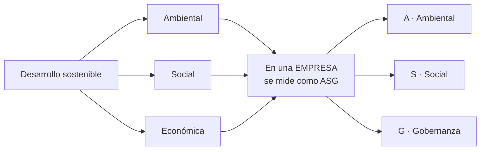
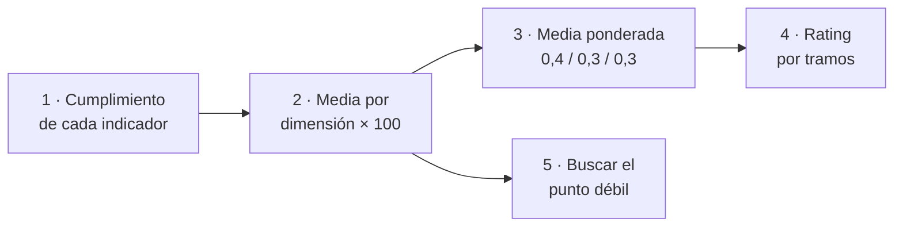

# UT1 · Sostenibilidad, ODS y criterios ASG

> **RA1** · 4 h · 12 % · Clase `Ut1Asg.java` · `mvn test -Dtest=Ut1AsgTest`

Al terminar esta unidad sabrás **poner nota a una empresa** en sostenibilidad, igual que hacen las agencias a las que miran los fondos de inversión. Con código, no con opiniones.

---

## 1. Teoría en cinco minutos

**Desarrollo sostenible** (Informe Brundtland, 1987): el que atiende las necesidades actuales **sin comprometer** las de las generaciones futuras.



La dimensión económica se convierte en **gobernanza**: cómo se dirige y controla la empresa.

| Dimensión | Qué mide | Ejemplo real |
|---|---|---|
| **A**mbiental | Emisiones, energía, agua, residuos | % de electricidad renovable del CPD |
| **S**ocial | Empleo, igualdad, formación, accesibilidad | Brecha salarial de género |
| **G**obernanza | Ética, transparencia, cumplimiento | Plantilla formada en el código ético |

**La Agenda 2030** (ONU, 2015) fija **17 ODS** y 169 metas. Los que más tocan al desarrollo web: **7** energía, **10** desigualdades y accesibilidad, **12** consumo responsable, **13** clima, **16** transparencia y datos.

**El concepto que más se falla:** cada indicador tiene una **dirección**.

| Indicador | Dirección | Si el número sube… |
|---|---|---|
| % electricidad renovable | mayor es mejor | mejora |
| Toneladas de CO₂ emitidas | menor es mejor | **empeora** |
| Brecha salarial (%) | menor es mejor | **empeora** |

!!! warning "Rigor"
    Toda cifra lleva su fuente. Decir «somos una empresa verde» sin datos es **greenwashing**, y la normativa europea lo persigue.

---

## 2. Batería de ejercicios

> Seis ejercicios en orden. Cada uno prepara una pieza del reto final: si los haces todos, el reto lo tendrás medio hecho. Cada ejercicio tiene **enunciado, datos y el resultado que debe salir**, para que puedas comprobarte solo.

---

### Ejercicio 1 · ¿Este indicador ha mejorado?

**Qué tienes que hacer.** Para cada indicador, di si **conviene que suba o que baje** y después si ha mejorado o empeorado de 2024 a 2025.

| Indicador | 2024 | 2025 |
|---|---:|---:|
| Electricidad renovable (%) | 65 | 72 |
| Emisiones (t CO₂e) | 380 | 410 |
| Horas de formación por persona | 24 | 28 |
| Brecha salarial de género (%) | 11 | 9 |

<details class="sol"><summary>Solución</summary>

| Indicador | Dirección | 2024 → 2025 | ¿Mejora? |
|---|---|---|:-:|
| Electricidad renovable | **mayor es mejor** | 65 → 72 (sube) | **Sí** |
| Emisiones | **menor es mejor** | 380 → 410 (sube) | **No** |
| Horas de formación | **mayor es mejor** | 24 → 28 (sube) | **Sí** |
| Brecha salarial | **menor es mejor** | 11 → 9 (baja) | **Sí** |

**Lo importante:** en tres de los cuatro el número sube, pero solo en dos eso es una buena noticia. Un programa que no sepa la dirección de cada indicador dará resultados al revés. Por eso todos los métodos de esta unidad llevan el parámetro `mayorEsMejor`.
</details>

---

### Ejercicio 2 · Calcular el cumplimiento a mano

El **cumplimiento** dice qué parte del camino hacia la meta se ha recorrido, en una escala de **0 a 1**. Se calcula así:

| Caso | Fórmula |
|---|---|
| Mayor es mejor | `valor / meta`, con **tope 1,0** |
| Mayor es mejor y la meta es 0 | `1,0` (no hay nada que alcanzar) |
| Menor es mejor y ya se ha alcanzado (`valor ≤ meta`) | `1,0` |
| Menor es mejor y se ha pasado | `meta / valor` |

**Qué tienes que hacer.** Calcula el cumplimiento de estos cuatro casos, con dos decimales.

| # | Valor | Meta | Dirección |
|:-:|---:|---:|---|
| a | 72 | 100 | mayor es mejor |
| b | 95 | 80 | mayor es mejor |
| c | 410 | 350 | menor es mejor |
| d | 10 | 0 | menor es mejor |

<details class="sol"><summary>Solución</summary>

| # | Cuenta | Resultado |
|:-:|---|---:|
| a | `72 / 100` | **0,72** |
| b | `95 / 80 = 1,19` → tope | **1,00** |
| c | 410 > 350, así que `350 / 410` | **0,85** |
| d | 10 > 0, así que `0 / 10` | **0,00** |

**El caso b** se acota porque no existe el 119 % de cumplimiento: si no, una empresa taparía tres indicadores malos con uno espectacular.

**El caso d** es una meta de «cero residuos a vertedero» y se enviaron 10 t: el cumplimiento es 0, correcto. Ojo con hacerlo al revés (`valor / meta = 10/0`): en Java eso no lanza excepción, devuelve `Infinity` y se propaga por todo el informe sin avisar.
</details>

---

### Ejercicio 3 · Escribir `cumplimiento` en Java

**Qué tienes que hacer.** Escribe este método:

```java
double cumplimiento(double valor, double meta, boolean mayorEsMejor)
```

Debe devolver exactamente los resultados del ejercicio 2. Es el **método 2 del reto final**, así que lo que escribas aquí te vale tal cual.

<details class="sol"><summary>Solución</summary>

```java
double cumplimiento(double valor, double meta, boolean mayorEsMejor) {
    if (mayorEsMejor) {
        if (meta == 0) return 1.0;              // (1) caso límite ANTES de dividir
        return Math.min(1.0, valor / meta);     // (2) tope en 1
    }
    if (valor <= meta) return 1.0;              // (3) ya se ha alcanzado
    return meta / valor;                        // (4) se ha pasado
}
```

1. Si no compruebas la meta 0 aquí, la línea 2 divide entre cero.
2. `Math.min` es más limpio que un `if` para poner el tope.
3. Con «menor es mejor», estar **por debajo** de la meta es cumplir del todo.
4. Aquí `valor` siempre es mayor que 0 (porque es mayor que `meta`, que es ≥ 0), así que esta división es segura.

**Compruébalo** con los cuatro casos del ejercicio 2 antes de seguir.
</details>

---

### Ejercicio 4 · El semáforo del cuadro de mando

La dirección no quiere ver decimales, quiere colores:

| Cumplimiento | Color |
|---|---|
| Desde 0,90 | VERDE |
| Desde 0,70 hasta 0,89 | AMBAR |
| Por debajo de 0,70 | ROJO |

**Qué tienes que hacer.** Escribe `String semaforo(double cumplimiento)`. Si el valor no está entre 0 y 1, lanza `IllegalArgumentException`. Después aplícalo a los cuatro resultados del ejercicio 2.

<details class="sol"><summary>Solución</summary>

```java
String semaforo(double cumplimiento) {
    if (cumplimiento < 0 || cumplimiento > 1) {                     // (1)
        throw new IllegalArgumentException("Fuera de rango: " + cumplimiento);
    }
    if (cumplimiento >= 0.90) return "VERDE";                        // (2)
    if (cumplimiento >= 0.70) return "AMBAR";
    return "ROJO";
}
```

1. Validar primero evita tener que repetir comprobaciones después.
2. Los tramos se comprueban **de mayor a menor**. Si los pusieras al revés, el primer `if` se tragaría todos los casos.

Aplicado al ejercicio 2: 0,72 → **AMBAR** · 1,00 → **VERDE** · 0,85 → **AMBAR** · 0,00 → **ROJO**.
</details>

---

### Ejercicio 5 · Puntuar una dimensión entera

La puntuación de una dimensión es la **media de los cumplimientos de sus indicadores, multiplicada por 100** y redondeada a un decimal.

**Qué tienes que hacer.** Escribe `double puntuacionDimension(double[] cumplimientos)` y calcula la dimensión ambiental con estos tres indicadores:

| Indicador | Cumplimiento |
|---|---:|
| Renovables | 0,720 |
| Emisiones | 0,854 |
| Residuos reutilizados | 0,633 |

Si el array llega vacío, el método debe devolver `0.0` (no lanzar excepción).

<details class="sol"><summary>Solución</summary>

```java
double puntuacionDimension(double[] cumplimientos) {
    if (cumplimientos.length == 0) return 0.0;          // (1)
    double suma = 0;
    for (double c : cumplimientos) suma += c;
    double media = suma / cumplimientos.length;
    return Math.round(media * 100 * 10) / 10.0;         // (2)
}
```

1. Sin esto, dividirías entre cero. Devolver 0 es lo correcto: una dimensión sin indicadores no ha demostrado nada.
2. El truco del redondeo a un decimal: multiplicas por 10, redondeas al entero y divides entre 10,0. El `.0` es imprescindible, o Java haría una división entera.

**Resultado:** `(0,720 + 0,854 + 0,633) / 3 = 0,736` → **73,6**

```text
Renovables      ███████████████████████████████████░░░░░░░░░░░░░  72,0
Emisiones       ██████████████████████████████████████████░░░░░░  85,4
Residuos        ███████████████████████████░░░░░░░░░░░░░░░░░░░░░  63,3
                ────────────────────────────────────────────────
DIMENSIÓN A     ████████████████████████████████████░░░░░░░░░░░░  73,6
```
</details>

---

### Ejercicio 6 · La nota global y el rating

La puntuación global **no** es la media de las tres dimensiones: la ambiental pesa más.

```text
global = ambiental × 0,4 + social × 0,3 + gobernanza × 0,3
```

Y el rating sale de esa nota: **≥ 85 AAA · ≥ 70 AA · ≥ 55 A · ≥ 40 BBB · ≥ 25 BB · resto B**.

**Qué tienes que hacer.** Una empresa saca 50 en ambiental, 80 en social y 90 en gobernanza.

1. Calcula la global ponderada y su rating.
2. Calcula también la **media simple** de las tres.
3. Explica en una frase por qué la diferencia importa.

<details class="sol"><summary>Solución</summary>

1. `50 × 0,4 + 80 × 0,3 + 90 × 0,3 = 20 + 24 + 27 = ` **71,0** → rating **AA**
2. Media simple: `(50 + 80 + 90) / 3 = ` **73,3**
3. Son **2,3 puntos de diferencia** solo por cómo se pondera. Con otros pesos, la misma empresa podría quedarse en **A**. Por eso las agencias publican su metodología: sin saber cómo se pondera, un rating no se puede interpretar ni comparar con el de otra agencia.

```java
double puntuacionAsg(double ambiental, double social, double gobernanza) {
    double total = ambiental * 0.4 + social * 0.3 + gobernanza * 0.3;
    return Math.round(total * 10) / 10.0;
}
```
</details>

---

## 3. Reto ejemplo (resuelto)

> Aquí se juntan los seis ejercicios en un programa que hace el trabajo completo. Léelo entero: el reto que tienes que entregar es exactamente igual, con otra empresa.

### El encargo

Una consultora te pasa los indicadores de **NubeVerde Hosting S.L.** y te pide su **radar ASG**: la nota de cada dimensión, la nota global, el rating y cuál es el punto más débil.

| Indicador | Dim. | Valor | Meta | Dirección |
|---|:-:|---:|---:|---|
| Electricidad renovable en el CPD (%) | A | 72 | 100 | mayor |
| Emisiones alcance 1 y 2 (t CO₂e) | A | 410 | 350 | menor |
| Residuos electrónicos reutilizados (%) | A | 38 | 60 | mayor |
| Horas de formación por persona | S | 28 | 40 | mayor |
| Brecha salarial de género (%) | S | 9 | 5 | menor |
| Plantilla formada en código ético (%) | G | 91 | 100 | mayor |

### Cómo se resuelve, paso a paso



1. **Cada indicador** pasa por `cumplimiento(valor, meta, dirección)` y da un número entre 0 y 1.
2. **Los de cada dimensión** se agrupan en un array y se resumen con `puntuacionDimension`.
3. **Las tres notas** se combinan con `puntuacionAsg`, que aplica los pesos.
4. **La nota global** se traduce a letras con `rating`.
5. **El punto débil** se busca aplicando `semaforo` al peor indicador.

### El programa

```java
public class DemoUt1 {
    public static void main(String[] args) {
        // Paso 1 y 2: cumplimientos agrupados por dimensión
        double[] amb = {
            Ut1Asg.cumplimiento(72, 100, true),      // renovables      -> 0,720
            Ut1Asg.cumplimiento(410, 350, false),    // emisiones       -> 0,854
            Ut1Asg.cumplimiento(38, 60, true)};      // residuos        -> 0,633
        double[] soc = {
            Ut1Asg.cumplimiento(28, 40, true),       // formación       -> 0,700
            Ut1Asg.cumplimiento(9, 5, false)};       // brecha salarial -> 0,556
        double[] gob = {
            Ut1Asg.cumplimiento(91, 100, true)};     // código ético    -> 0,910

        double a = Ut1Asg.puntuacionDimension(amb);
        double s = Ut1Asg.puntuacionDimension(soc);
        double g = Ut1Asg.puntuacionDimension(gob);

        // Paso 3 y 4: nota global y rating
        double total = Ut1Asg.puntuacionAsg(a, s, g);

        System.out.printf("A=%.1f  S=%.1f  G=%.1f%n", a, s, g);
        System.out.printf("ASG=%.1f  rating=%s%n", total, Ut1Asg.rating(total));

        // Paso 5: el punto débil
        double peor = Ut1Asg.cumplimiento(9, 5, false);
        System.out.printf("Peor indicador: brecha salarial (%.3f) -> %s%n",
                peor, Ut1Asg.semaforo(peor));
    }
}
```

### La salida

```text
A=73,6  S=62,8  G=91,0
ASG=75,6  rating=AA
Peor indicador: brecha salarial (0,556) -> ROJO
```

```text
Ambiental    ████████████████████████████████████░░░░░░░░░░░░  73,6
Social       ███████████████████████████████░░░░░░░░░░░░░░░░░  62,8
Gobernanza   ████████████████████████████████████████████░░░░  91,0
──────────────────────────────────────────────────────────────
GLOBAL                                                          75,6 → AA
```

### Qué significa este resultado

**La nota que irá en la portada es un AA**, y suena muy bien. Pero mira el detalle:

- La **gobernanza va 28 puntos por encima** de lo social. Es lo más barato de cumplir: formar a la plantilla en un código ético cuesta una tarde.
- Lo **social es la dimensión más débil** (62,8), y dentro de ella la **brecha salarial está en rojo**: 0,556 de cumplimiento, el peor indicador de la empresa con diferencia.
- La **ponderación ayuda a la empresa**: lo ambiental, que pesa un 40 %, va mejor que lo social, que pesa un 30 %. Con pesos iguales la nota bajaría.

**La conclusión profesional:** la acción prioritaria de esta empresa no es la que sale en su portada. Es la brecha salarial. Y eso solo se ve bajando del rating global al indicador concreto, que es exactamente lo que hace un analista ASG y lo que acabas de programar.

---

## 4. Reto a realizar (entregable)

> Dos partes. La primera es el código; la segunda, aplicarlo a una empresa. Nada más.

### Parte 1 · Completa la clase `Ut1Asg.java`

Escribe los 8 métodos hasta que pasen los 16 tests:

```bash
mvn test -Dtest=Ut1AsgTest
```

Cuatro de los ocho ya los has hecho en la batería. Estos son los otros cuatro:

| # | Método | Qué debe hacer | Pista |
|:-:|---|---|---|
| 1 | `clasificar` | Devuelve `"AMBIENTAL"`, `"SOCIAL"`, `"GOBERNANZA"` o `"SIN CLASIFICAR"` según el texto del tema | Llama a `normalizar(tema)`, que ya está escrito, y recorre los tres arrays de palabras **en ese orden** usando `texto.contains(palabra)` |
| 6 | `rating` | Traduce la nota a letras | Valida el rango 0-100 y después seis `if` de mayor a menor |
| 7 | `haMejorado` | Compara dos años en la dirección correcta | Una sola línea con un ternario y `mayorEsMejor` |
| 8 | `odsCubiertos` | Devuelve los ODS válidos (1-17), ordenados y sin repetir | `TreeSet<Integer>` ordena y quita duplicados solo; después vuélcalo a `int[]` con un bucle y un contador |

!!! tip "No te atasques"
    Lanza los tests **antes** de escribir nada: verás 16 fallos, cada uno con el nombre del ejercicio al que corresponde (`E2 · cumplimiento cuando mayor es mejor`). Ve resolviéndolos de uno en uno.

### Parte 2 · Calcula el radar de esta empresa

Cuando los tests estén en verde, copia el programa `DemoUt1` del reto ejemplo, cambia los datos por los de **Datalia Software S.L.** y ejecútalo:

| Indicador | Dim. | Valor | Meta | Dirección |
|---|:-:|---:|---:|---|
| Electricidad renovable (%) | A | 45 | 100 | mayor |
| Emisiones alcance 1 y 2 (t CO₂e) | A | 520 | 500 | menor |
| Agua reciclada en refrigeración (%) | A | 20 | 50 | mayor |
| Horas de formación por persona | S | 35 | 40 | mayor |
| Web conforme a WCAG 2.2 AA (%) | S | 60 | 100 | mayor |
| Consejo con miembros independientes (%) | G | 30 | 50 | mayor |
| Plantilla formada en código ético (%) | G | 100 | 100 | mayor |

**Entrega un documento de una página con:**

1. La **tabla de cumplimientos** de los siete indicadores, con su semáforo.
2. Las **tres notas de dimensión**, la **nota global** y el **rating**.
3. **Tres frases** respondiendo a estas tres preguntas:
      - ¿Cuál es la dimensión más débil?
      - ¿Cuál es el peor indicador concreto y qué semáforo tiene?
      - Si la empresa solo pudiera mejorar **un** indicador el año que viene, ¿cuál elegirías y por qué?

!!! warning "Pista para la tercera pregunta"
    El peor indicador y el más rentable de mejorar **no tienen por qué ser el mismo**. Piensa qué dimensión pesa más en la nota global y cuánto margen hay hasta la meta en cada caso.

---

## 5. Autoevaluación

<details><summary><b>1.</b> El desarrollo sostenible atiende las necesidades actuales…<br>a) eliminando toda emisión · b) sin comprometer las de las generaciones futuras · c) priorizando lo ambiental · d) solo en países ricos</summary><b>b</b></details>
<details><summary><b>2.</b> La Agenda 2030 tiene…<br>a) 15 ODS · b) 17 ODS y 169 metas · c) 20 ODS · d) 17 metas</summary><b>b</b></details>
<details><summary><b>3.</b> En ASG, la «G» es…<br>a) gestión · b) globalización · c) gobernanza · d) garantía</summary><b>c</b></details>
<details><summary><b>4.</b> «Brecha salarial de género» pertenece a la dimensión…<br>a) ambiental · b) social · c) gobernanza · d) financiera</summary><b>b</b></details>
<details><summary><b>5.</b> «Plantilla formada en el código ético» pertenece a…<br>a) ambiental · b) social · c) gobernanza · d) no es ASG</summary><b>c</b>. Mide cumplimiento y ética.</details>
<details><summary><b>6.</b> Las emisiones pasan de 380 a 410 t. Han…<br>a) mejorado · b) empeorado · c) no se sabe · d) da igual</summary><b>b</b></details>
<details><summary><b>7.</b> `cumplimiento(95, 80, true)` devuelve…<br>a) 1,19 · b) 1,0 · c) 0,84 · d) 0,0</summary><b>b</b>. Se acota a 1,0.</details>
<details><summary><b>8.</b> `cumplimiento(125, 100, false)` devuelve…<br>a) 1,25 · b) 0,8 · c) 1,0 · d) 0,0</summary><b>b</b>. meta/valor.</details>
<details><summary><b>9.</b> Meta 0, valor 10, menor es mejor. El cumplimiento es…<br>a) 1,0 · b) 0,0 · c) Infinity · d) excepción</summary><b>b</b></details>
<details><summary><b>10.</b> Dividir dos `double` entre cero en Java…<br>a) lanza ArithmeticException · b) devuelve Infinity o NaN sin avisar · c) devuelve 0 · d) no compila</summary><b>b</b>. Por eso hay que tratar el caso antes.</details>
<details><summary><b>11.</b> Cumplimientos 0,72 · 0,854 · 0,633 dan una puntuación de dimensión de…<br>a) 63,3 · b) 73,6 · c) 85,4 · d) 220,7</summary><b>b</b></details>
<details><summary><b>12.</b> A=50, S=80, G=90 con pesos 0,4/0,3/0,3 dan…<br>a) 73,3 · b) 71,0 · c) 80,0 · d) 66,7</summary><b>b</b>. La a) es la media simple.</details>
<details><summary><b>13.</b> En el reto ejemplo, la puntuación global fue 75,6. El rating es…<br>a) AAA · b) AA · c) A · d) BBB</summary><b>b</b></details>
<details><summary><b>14.</b> En ese mismo reto, la dimensión más débil era…<br>a) ambiental · b) social · c) gobernanza · d) todas iguales</summary><b>b</b>, con 62,8.</details>
<details><summary><b>15.</b> Y el indicador peor parado era…<br>a) los residuos electrónicos · b) la brecha salarial · c) las emisiones · d) el código ético</summary><b>b</b>, con 0,556 de cumplimiento (semáforo rojo).</details>
<details><summary><b>16.</b> Que una empresa tenga rating AA significa que…<br>a) todo va bien · b) la nota global es alta, pero puede esconder dimensiones muy débiles · c) cumple la ley · d) no emite CO₂</summary><b>b</b></details>
<details><summary><b>17.</b> Dos agencias dan ratings distintos a la misma empresa porque…<br>a) una miente · b) usan indicadores y ponderaciones distintas · c) es aleatorio · d) no sirven</summary><b>b</b></details>
<details><summary><b>18.</b> «Hosting ecológico», sin datos, es…<br>a) una afirmación válida · b) greenwashing · c) un indicador ASG · d) un ODS</summary><b>b</b></details>
