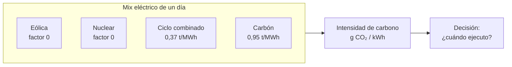

# UT2 · Retos ambientales y la huella de la electricidad

> **RA2** · 4 h · 15 % · Clase `Ut2Energia.java` · `mvn test -Dtest=Ut2EnergiaTest`

Aquí descubrirás algo que casi nadie sabe: **el mismo servidor, consumiendo lo mismo, puede emitir cinco veces más un martes que un jueves**. Y aprenderás a calcularlo.

---

## 1. Teoría en cinco minutos

**Retos ambientales:** cambio climático, pérdida de biodiversidad, contaminación, escasez de agua, agotamiento de recursos. **Sociales:** desigualdad, brecha digital, trabajo precario, desigualdad de género. Van juntos: una ola de calor golpea más a quien trabaja al aire libre. De ahí la **transición justa**.

**El sector digital no es inmaterial:**

| Impacto | Dato de referencia |
|---|---|
| Electricidad | Los centros de datos rondaban el **1,5 %** de la electricidad mundial en 2024 (IEA, *Energy and AI*, 2025) |
| Residuos electrónicos | **62 Mt** generadas en 2022, solo el **22,3 %** recogido formalmente (Global E-waste Monitor 2024) |
| Agua | Refrigeración de centros de datos, crítica en zonas con sequía |

**La clave técnica:** un kWh no siempre emite lo mismo.



```text
            Σ (MWh × factor t/MWh)
intensidad = ──────────────────────── × 1000   → g CO₂/kWh
                  Σ MWh totales
```

El `× 1000` sale de que **1 t/MWh = 1 000 000 g ÷ 1000 kWh = 1000 g/kWh**.

**Para reducir impactos, en este orden:**


Compensar es **el último** paso. Anunciarse como «neutro en carbono» solo comprando créditos, sin reducir, es greenwashing.

---

## 2. Batería de ejercicios

> Seis ejercicios en orden. Cada uno prepara una pieza del reto final. Todos traen **enunciado, datos y el resultado que debe salir**.

---

### Ejercicio 1 · El nombre que no coincide

**Qué tienes que hacer.** La API de Red Eléctrica devuelve los nombres así, y tu tabla de factores los tiene en minúsculas y sin tildes. Di, para cada uno, si `equals` los encontraría y qué factor saldría.

| Viene de la API | Está en la tabla como | ¿`equals` los encuentra? | Factor que saldría |
|---|---|:-:|---|
| `"Carbón"` | `"carbon"` | ? | ? |
| `"COGENERACIÓN"` | `"cogeneracion"` | ? | ? |
| `"ciclo combinado"` | `"ciclo combinado"` | ? | ? |

<details class="sol"><summary>Solución</summary>

| Viene de la API | ¿Coincide? | Factor que saldría | Factor correcto |
|---|:-:|---:|---:|
| `"Carbón"` | **No** (tilde y mayúscula) | 0,00 | 0,95 |
| `"COGENERACIÓN"` | **No** | 0,00 | 0,38 |
| `"ciclo combinado"` | Sí | 0,37 | 0,37 |

**Lo importante:** el fallo **no rompe el programa**. Devuelve un número perfectamente creíble, solo que el carbón habría emitido cero. En un cálculo de emisiones, un error silencioso es peor que una excepción.

La solución es `Ut1Asg.normalizar(...)`, que ya escribiste en la UT1:

```java
String t = Ut1Asg.normalizar(tecnologia);   // "Carbón" -> "carbon"
```
</details>

---

### Ejercicio 2 · Toneladas emitidas en un día

Cada tecnología tiene un **factor de emisión** en toneladas de CO₂ por MWh generado:

| Tecnología | Factor (t/MWh) |
|---|---:|
| Carbón | 0,95 |
| Motores diésel | 0,77 |
| Cogeneración | 0,38 |
| Ciclo combinado | 0,37 |
| Eólica, solar, hidráulica, nuclear | 0,00 |

**Qué tienes que hacer.** Calcula las toneladas emitidas en este día:

| Tecnología | MWh |
|---|---:|
| Eólica | 300 |
| Ciclo combinado | 200 |
| Nuclear | 500 |

<details class="sol"><summary>Solución</summary>

```text
300 × 0,00  =    0 t   (eólica)
200 × 0,37  =   74 t   (ciclo combinado)
500 × 0,00  =    0 t   (nuclear)
                ─────
                 74 t
```

**Cuidado con un error frecuente:** los 800 MWh que no emiten **no se descartan**. Siguen contando, y mucho, en el ejercicio siguiente: son los que bajan la media.
</details>

---

### Ejercicio 3 · De toneladas por MWh a gramos por kWh

La **intensidad de carbono** es la media: cuánto CO₂ hay detrás de **cada kWh** consumido.

```text
            toneladas totales
intensidad = ───────────────── × 1000     → g CO₂/kWh
              MWh totales
```

El `× 1000` sale de que **1 t/MWh = 1 000 000 g ÷ 1 000 kWh = 1 000 g/kWh**.

**Qué tienes que hacer.**

1. Calcula la intensidad del día del ejercicio 2.
2. Escribe `double intensidad(String[] tecnologias, double[] mwh)`, que es el **método 4 del reto final**.
3. Explica qué debe devolver si el total de MWh es 0.

<details class="sol"><summary>Solución</summary>

1. `74 t / 1000 MWh = 0,074 t/MWh → ` **74,0 g/kWh**

2. ```java
   double intensidad(String[] tecnologias, double[] mwh) {
       double totalMwh = 0;
       for (double m : mwh) totalMwh += m;
       if (totalMwh == 0) return 0.0;                     // (1)
       double t = toneladas(tecnologias, mwh);            // (2)
       return Math.round(t / totalMwh * 1000 * 10) / 10.0;
   }
   ```

      1. Sin esta línea, dividirías entre cero y obtendrías `NaN`. Y `NaN` es contagioso: cualquier cuenta posterior también da `NaN`.
      2. Reutiliza el método del ejercicio 2 en lugar de repetir el bucle.

3. **0.0**. No hay generación, así que no hay intensidad que calcular.
</details>

---

### Ejercicio 4 · El día sucio

**Qué tienes que hacer.** Calcula la intensidad y el porcentaje renovable de este día, y compáralo con el del ejercicio 3.

| Tecnología | MWh | ¿Renovable? |
|---|---:|:-:|
| Carbón | 100 | No |
| Ciclo combinado | 300 | No |
| Solar fotovoltaica | 100 | Sí |

<details class="sol"><summary>Solución</summary>

**Toneladas:** `100 × 0,95 + 300 × 0,37 = 95 + 111 = 206 t`
**Intensidad:** `206 / 500 × 1000 = ` **412,0 g/kWh** → semáforo **ROJO**
**Renovable:** `100 / 500 = ` **20,0 %**

```text
Día con viento  ████████░░░░░░░░░░░░░░░░░░░░░░░░░░░░░░░░░░░░░░░░   74,0 g/kWh  VERDE
Día sin viento  ████████████████████████████████████████████████  412,0 g/kWh  ROJO
```

**5,6 veces más CO₂ por cada kWh.** Y fíjate: el día sucio genera **menos** MWh en total (500 frente a 1000). No se trata de cuánta electricidad hay, sino de **con qué se ha fabricado**.
</details>

---

### Ejercicio 5 · Nuclear: dos preguntas distintas

**Qué tienes que hacer.** Responde para la energía nuclear:

1. ¿Emite CO₂ al generar electricidad?
2. ¿Es renovable?
3. ¿Por qué el código tiene dos métodos separados, `factorEmision` y `esRenovable`, en lugar de uno solo?

<details class="sol"><summary>Solución</summary>

1. **No emite CO₂ al generar.** Por eso no está en la tabla de factores y `factorEmision("Nuclear")` devuelve 0,0.
2. **No es renovable.** El uranio es un recurso finito, así que no está en `RENOVABLES`.
3. Porque son **dos propiedades independientes**. Si las juntaras en un método tipo `esLimpia()`, tendrías que decidir qué responder con la nuclear y **cualquier respuesta sería incorrecta** en uno de los dos sentidos. Dos preguntas, dos métodos.

| Tecnología | ¿Emite? | ¿Renovable? |
|---|:-:|:-:|
| Eólica | No | Sí |
| Nuclear | No | **No** |
| Ciclo combinado | Sí | No |
</details>

---

### Ejercicio 6 · Lo que emite tu servidor

**Qué tienes que hacer.** Un servidor del instituto consume **250 kWh al mes**. Calcula los kilos de CO₂ que emite si todo ese consumo ocurriera:

- un mes con la red a **74 g/kWh** (como el día limpio),
- un mes con la red a **412 g/kWh** (como el día sucio).

Escribe también `double kgCo2(double kwh, double gramosPorKwh)`, redondeando a 2 decimales.

<details class="sol"><summary>Solución</summary>

```text
250 kWh × 74 g/kWh  = 18 500 g = 18,5 kg
250 kWh × 412 g/kWh = 103 000 g = 103,0 kg
```

```java
double kgCo2(double kwh, double gramosPorKwh) {
    return Math.round(kwh * gramosPorKwh / 1000 * 100) / 100.0;   // (1)
}
```

1. Se divide entre 1000 para pasar de gramos a kilos. El `* 100 … / 100.0` es el redondeo a dos decimales.

**84,5 kg de diferencia** por el mismo consumo, la misma máquina y el mismo código. Lo único que cambia es **cuándo**. Ese es el dato que justifica toda la unidad.
</details>

---

## 3. Reto ejemplo (resuelto)

> Los seis ejercicios juntos en un programa que toma una decisión de verdad.

### El encargo

El departamento de sistemas ejecuta cada semana un **proceso de copias de seguridad** que consume **40 kWh** y puede lanzarse cualquier día. Te pasan la intensidad de la red de la semana pasada y te preguntan: **¿qué día conviene lanzarlo y cuánto se ahorra?**

| Día | Intensidad (g/kWh) | |
|---|---:|---|
| Lunes | 72,1 | ███████████████████████░░░░░░░░░░░░░░ |
| Martes | 83,8 | ███████████████████████████░░░░░░░░░░ |
| Miércoles | 113,0 | ████████████████████████████████████░ |
| Jueves | 131,9 | ██████████████████████████████████████ |
| Viernes | 104,8 | ██████████████████████████████░░░░░░░ |
| **Sábado** | **64,4** | ████████████████████░░░░░░░░░░░░░░░░░ |
| Domingo | 78,8 | █████████████████████████░░░░░░░░░░░░ |

### Cómo se resuelve, paso a paso


1. `diaMasLimpio` devuelve la **posición** del menor del array, no el valor. Con esa posición sacamos el nombre del día y su intensidad.
2. El peor se busca con el mismo bucle pero comparando al revés.
3. `kgCo2(40, intensidad)` da los kilos en cada caso.
4. La diferencia es el ahorro; el porcentaje sale de dividirlo entre el peor.
5. Es el paso que casi nadie da y el que cambia la conversación.

### El programa

```java
public class DemoUt2 {
    public static void main(String[] args) {
        double[] semana = {72.1, 83.8, 113.0, 131.9, 104.8, 64.4, 78.8};
        String[] nombres = {"lunes", "martes", "miércoles", "jueves",
                            "viernes", "sábado", "domingo"};
        double kwh = 40;

        int mejor = Ut2Energia.diaMasLimpio(semana);      // paso 1
        int peor = 0;                                     // paso 2
        for (int i = 1; i < semana.length; i++) {
            if (semana[i] > semana[peor]) peor = i;
        }

        double kgMejor = Ut2Energia.kgCo2(kwh, semana[mejor]);   // paso 3
        double kgPeor = Ut2Energia.kgCo2(kwh, semana[peor]);

        System.out.printf("Mejor día: %s (%.1f g/kWh, %s)%n",
                nombres[mejor], semana[mejor], Ut2Energia.semaforoRed(semana[mejor]));
        System.out.printf("Peor día:  %s (%.1f g/kWh, %s)%n",
                nombres[peor], semana[peor], Ut2Energia.semaforoRed(semana[peor]));
        System.out.printf("El proceso emite %.2f kg el sábado y %.2f kg el jueves%n",
                kgMejor, kgPeor);
        System.out.printf("Ahorro semanal: %.2f kg (%.0f %% menos)%n",          // paso 4
                kgPeor - kgMejor, (kgPeor - kgMejor) / kgPeor * 100);
        System.out.printf("Ahorro anual (52 semanas): %.0f kg%n",               // paso 5
                (kgPeor - kgMejor) * 52);
    }
}
```

### La salida

```text
Mejor día: sábado (64,4 g/kWh, VERDE)
Peor día:  jueves (131,9 g/kWh, AMBAR)
El proceso emite 2,58 kg el sábado y 5,28 kg el jueves
Ahorro semanal: 2,70 kg (51 % menos)
Ahorro anual (52 semanas): 140 kg
```

### Qué significa este resultado

**2,70 kg suena a nada.** Si presentas eso en una reunión, te dirán que no merece la pena tocar el planificador.

**140 kg al año ya es otra conversación.** Y si la empresa tiene 50 procesos por lotes parecidos, son **7 toneladas al año** por cambiar unas líneas en el `cron`, sin comprar nada ni renunciar a nada.

Dos matices honestos que conviene decir en voz alta:

- **El peor día era ámbar, no rojo.** La red española es bastante limpia comparada con otras. En un país con más carbón, el mismo cambio ahorraría mucho más.
- **La intensidad de la semana pasada no garantiza la de la próxima.** Esto sirve para decidir una política («los procesos pesados, en fin de semana»), no para adivinar el futuro.

---

## 4. Reto a realizar (entregable)

### Parte 1 · Completa la clase `Ut2Energia.java`

```bash
mvn test -Dtest=Ut2EnergiaTest
```

Tres de los ocho ya los has hecho en la batería (`intensidad`, `kgCo2` y la idea de `factorEmision`). Estos son los demás:

| # | Método | Qué debe hacer | Pista |
|:-:|---|---|---|
| 1 | `factorEmision` | Factor de una tecnología; 0,0 si no está en la tabla | Normaliza y recorre `TECNOLOGIAS`; cuando `TECNOLOGIAS[i]` coincida, devuelve `FACTORES[i]` |
| 2 | `esRenovable` | Si la tecnología está en `RENOVABLES` | Mismo patrón, pero solo hace falta `true` o `false` |
| 3 | `toneladas` | Suma de `mwh[i] × factor` | Un bucle; los dos arrays van en paralelo |
| 5 | `porcentajeRenovable` | Qué parte de la generación es renovable | **Un solo bucle** acumulando dos sumas: el total y la parte renovable |
| 6 | `semaforoRed` | VERDE < 100, AMBAR < 200, ROJO desde 200 | Valida el negativo primero |
| 8 | `diaMasLimpio` | **Posición** del menor; −1 si el array está vacío | Guarda el índice del mínimo y cambia solo si encuentras uno **estrictamente menor** |

### Parte 2 · Decide cuándo lanzar el proceso

Con los tests en verde, copia el programa del reto ejemplo y aplícalo a estos cinco días **reales de generación** (en MWh):

| Tecnología | Lunes | Martes | Miércoles | Jueves | Viernes |
|---|---:|---:|---:|---:|---:|
| Eólica | 400 | 120 | 80 | 500 | 200 |
| Ciclo combinado | 150 | 350 | 400 | 100 | 300 |
| Carbón | 0 | 50 | 120 | 0 | 0 |
| Cogeneración | 0 | 0 | 100 | 0 | 0 |
| Nuclear | 450 | 450 | 400 | 450 | 450 |
| Solar fotovoltaica | 100 | 80 | 0 | 0 | 150 |
| Hidráulica | 0 | 0 | 0 | 150 | 0 |

El proceso a planificar consume **60 kWh** y se ejecuta una vez al día, todos los días laborables.

**Entrega un documento de una página con:**

1. Una **tabla** con la intensidad, el semáforo y el porcentaje renovable de cada día.
2. El **día más limpio** y el **más sucio**, con sus cifras.
3. **Tres frases** respondiendo a:
      - ¿Cuántos kg emite el proceso el mejor día y cuántos el peor?
      - ¿Cuánto se ahorraría al año si en lugar de ejecutarlo siempre el miércoles se ejecutara siempre el jueves? (52 semanas)
      - El miércoles es el día con más generación de carbón **y** el de menos eólica. ¿Cuál de las dos cosas crees que pesa más en su intensidad? Compruébalo quitando el carbón del cálculo.

!!! tip "La tercera pregunta"
    No la respondas de memoria: cambia el dato en tu programa y mira el número. Es exactamente lo que harías en un trabajo real para justificar una recomendación.

---

## 5. Autoevaluación

<details><summary><b>1.</b> La transición justa es…<br>a) repartir emisiones por igual · b) descarbonizar sin dejar atrás a trabajadores y territorios · c) una tasa · d) un juicio</summary><b>b</b></details>
<details><summary><b>2.</b> Del residuo electrónico de 2022 se recicló formalmente cerca del…<br>a) 5 % · b) 22 % · c) 50 % · d) 78 %</summary><b>b</b></details>
<details><summary><b>3.</b> La intensidad de carbono se mide en…<br>a) kWh/GB · b) g CO₂/kWh · c) t/año · d) €/MWh</summary><b>b</b></details>
<details><summary><b>4.</b> 0,37 t CO₂/MWh son…<br>a) 3,7 g/kWh · b) 37 g/kWh · c) 370 g/kWh · d) 3700 g/kWh</summary><b>c</b></details>
<details><summary><b>5.</b> 300 MWh eólicos + 200 de ciclo combinado + 500 nucleares emiten…<br>a) 0 t · b) 74 t · c) 185 t · d) 370 t</summary><b>b</b></details>
<details><summary><b>6.</b> Y su intensidad es…<br>a) 7,4 g/kWh · b) 74,0 g/kWh · c) 370 g/kWh · d) 740 g/kWh</summary><b>b</b></details>
<details><summary><b>7.</b> 100 MWh de carbón + 300 de ciclo combinado + 100 solares dan…<br>a) 206 g/kWh · b) 412 g/kWh · c) 515 g/kWh · d) 95 g/kWh</summary><b>b</b>. 206 t entre 500 MWh.</details>
<details><summary><b>8.</b> ¿Es renovable la nuclear?<br>a) sí · b) no, aunque no emita al generar · c) depende del país · d) solo de noche</summary><b>b</b></details>
<details><summary><b>9.</b> El factor de emisión de la eólica en la tabla es…<br>a) 0,95 · b) 0,37 · c) 0,0 · d) da error</summary><b>c</b>. No está en la tabla.</details>
<details><summary><b>10.</b> Si no normalizas `"COGENERACIÓN"`…<br>a) salta una excepción · b) el factor sale 0 y el resultado es falso pero creíble · c) no compila · d) se ordena mal</summary><b>b</b></details>
<details><summary><b>11.</b> Con el total de MWh a 0, `intensidad` debe devolver…<br>a) NaN · b) 0.0 · c) excepción · d) Infinity</summary><b>b</b></details>
<details><summary><b>12.</b> 250 kWh a 120 g/kWh emiten…<br>a) 3 kg · b) 30 kg · c) 300 kg · d) 0,3 kg</summary><b>b</b></details>
<details><summary><b>13.</b> Una intensidad de 150 g/kWh da semáforo…<br>a) VERDE · b) AMBAR · c) ROJO · d) depende</summary><b>b</b></details>
<details><summary><b>14.</b> En el reto ejemplo, mover el proceso del jueves al sábado ahorraba…<br>a) 0,27 kg · b) 2,70 kg · c) 27 kg · d) 270 kg</summary><b>b</b>, un 51 % menos.</details>
<details><summary><b>15.</b> Ese ahorro semanal, a lo largo de un año, supone unos…<br>a) 14 kg · b) 140 kg · c) 1,4 t · d) nada apreciable</summary><b>b</b>. La escala es lo que convierte lo pequeño en relevante.</details>
<details><summary><b>16.</b> En `diaMasLimpio`, un empate lo gana…<br>a) el último · b) el primero, porque solo se cambia si es estrictamente menor · c) es aleatorio · d) lanza excepción</summary><b>b</b></details>
<details><summary><b>17.</b> El orden correcto de actuación es…<br>a) compensar, sustituir, reducir, evitar · b) evitar, reducir, sustituir, compensar · c) reducir, compensar, evitar · d) sustituir, evitar, compensar</summary><b>b</b></details>
<details><summary><b>18.</b> Comprar créditos sin reducir y anunciarse «neutro en carbono» es…<br>a) correcto · b) greenwashing · c) adaptación · d) alcance 3</summary><b>b</b></details>
