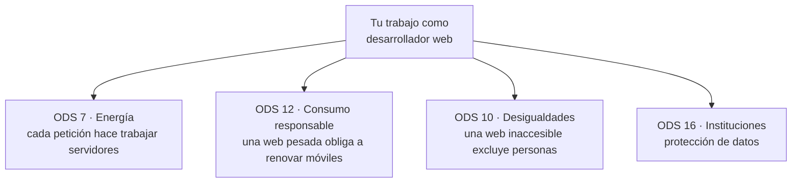
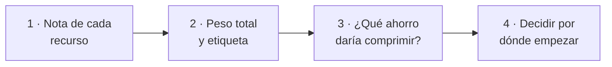
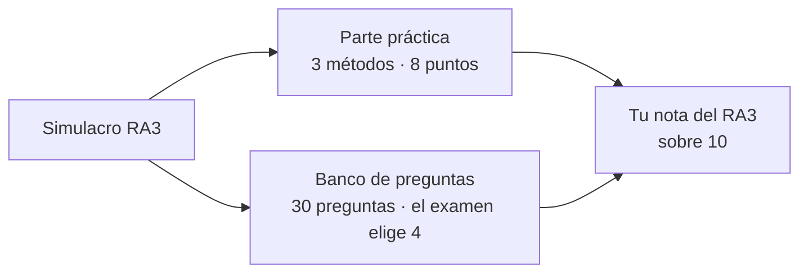

# UT3 · Sostenibilidad en tu trabajo y en tu vida

> **RA3** · 4 h · 15 % · Clase `Ut3Desarrollo.java` · `mvn test -Dtest=Ut3DesarrolloTest`

Esta unidad va de ti. De las decisiones que tomarás cada día como desarrollador y de una línea de configuración que puede ahorrar más CO₂ que un año entero de reciclar papel en la oficina.

---

## 1. Teoría en cinco minutos

**Tus ODS**, los que tocas directamente con tu trabajo:



**Las cuatro palancas de una web sostenible:**

| Palanca | Qué ahorra | Cómo |
|---|---|---|
| Comprimir | Bytes de red: más del 90 % en JSON | gzip o Brotli |
| Cachear | Descargas repetidas | `Cache-Control: max-age=…` |
| Aligerar imágenes | Suelen ser el grueso del peso | WebP o AVIF |
| Enviar solo lo necesario | Bytes y trabajo de base de datos | Solo los campos que usa la vista |

Solo se comprime **texto**. Un JPEG o un PNG ya vienen comprimidos: volver a comprimirlos gasta CPU y no ahorra nada.

**Accesibilidad y privacidad** también son sostenibilidad (la social y la de gobernanza). Las **WCAG 2.2** marcan los requisitos y, desde el 28 de junio de 2025, son exigibles a muchos servicios digitales dirigidos a consumidores (Ley 11/2023). El RGPD añade la **minimización de datos**: menos datos es menos riesgo **y** menos bytes.

**Y tu vida cuenta:** ir a trabajar es una de las mayores fuentes de emisiones directas de mucha gente.

| Medio | kg CO₂ por km | |
|---|---:|---|
| Coche | 0,16 | ████████████████ |
| Moto | 0,10 | ██████████ |
| Autobús | 0,08 | ████████ |
| Metro / tren | 0,03 | ███ |
| Bici / a pie | 0,00 | |

---

## 2. Batería de ejercicios

> Seis ejercicios en orden, cada uno con **enunciado, datos y resultado esperado**. Al terminarlos tendrás medio reto hecho.

---

### Ejercicio 1 · El tipo de contenido que engaña

El navegador no devuelve `"text/html"` a secas, sino lo que el servidor le mande. Por ejemplo:

```text
Content-Type: text/html; charset=UTF-8
Content-Type: Text/CSS
Content-Type: application/json
Content-Type: image/jpeg
```

**Qué tienes que hacer.** Di cuáles de esos cuatro son **comprimibles** (merece la pena aplicarles gzip) y qué pasa si comparas el primero directamente con `"text/html"` usando `equals`.

??? success "Solución"

    | Content-Type | ¿Comprimible? | Por qué |
    |---|:-:|---|
    | `text/html; charset=UTF-8` | **Sí** | Es texto |
    | `Text/CSS` | **Sí** | Es texto, aunque venga en mayúsculas |
    | `application/json` | **Sí** | Texto muy repetitivo: comprime genial |
    | `image/jpeg` | **No** | Ya viene comprimido |

    Con `equals` directo, `"text/html; charset=UTF-8"` **no coincide** con `"text/html"`. Resultado: el HTML se daría por no comprimible y perderías el hallazgo más importante de la auditoría.

    La línea que lo arregla:

    ```java
    String tipo = tipoContenido.split(";")[0].trim().toLowerCase();
    //                          └ corta en ';'   └ quita espacios  └ ignora mayúsculas
    ```


---

### Ejercicio 2 · Leer la cabecera de caché

`Cache-Control` dice cuántos segundos puede el navegador reutilizar un recurso sin volver a pedirlo.

**Qué tienes que hacer.** Di qué `max-age` tiene cada una de estas cabeceras.

| # | Cabecera | max-age |
|:-:|---|---|
| a | `public, max-age=31536000, immutable` | ? |
| b | `max-age=3600` | ? |
| c | `no-store, max-age=3600` | ? |
| d | `no-cache` | ? |
| e | *(la cabecera no viene)* → `null` | ? |

??? success "Solución"

    | # | max-age | Por qué |
    |:-:|---:|---|
    | a | **31 536 000** | Un año entero |
    | b | **3 600** | Una hora |
    | c | **0** | `no-store` **prohíbe** guardar la respuesta y gana sobre cualquier `max-age` que venga detrás |
    | d | **0** | No hay `max-age` |
    | e | **0** | Si no compruebas el `null`, aquí tienes un `NullPointerException` en producción |

    ```java
    long maxAge(String cacheControl) {
        if (cacheControl == null) return 0;                          // (1)
        long segundos = 0;
        for (String parte : cacheControl.toLowerCase().split(",")) { // (2)
            String p = parte.trim();
            if (p.equals("no-store")) return 0;                      // (3)
            if (p.startsWith("max-age=")) segundos = Long.parseLong(p.substring(8));
        }
        return segundos;
    }
    ```

    1. El caso `null` es el primero, siempre.
    2. La cabecera trae varias directivas separadas por comas.
    3. `return` inmediato: `no-store` anula lo demás aunque aparezca antes.


---

### Ejercicio 3 · Poner nota a un recurso

El auditor parte de 100 puntos y resta:

| Problema | Resta |
|---|---:|
| Es comprimible pero no viene comprimido | −30 |
| Su `max-age` es 0 | −20 |
| Pesa más de 500 000 bytes | −25 |

**Qué tienes que hacer.** Calcula la puntuación de estos tres recursos.

| Recurso | Tipo | Bytes | ¿Comprimido? | Cache-Control |
|---|---|---:|:-:|---|
| a | text/css | 12 000 | Sí | max-age=31536000 |
| b | application/json | 650 000 | No | *(nada)* |
| c | image/png | 3 000 | No | *(nada)* |

??? success "Solución"

    | Recurso | Restas | Puntuación |
    |---|---|---:|
    | a | ninguna | **100** |
    | b | −30 (sin comprimir) −20 (sin caché) −25 (pesa) | **25** |
    | c | −20 (sin caché). **No** resta por compresión: un PNG no es comprimible | **80** |

    El recurso **c** es el que más se falla. Un PNG sin comprimir **no es un problema**: no tiene sentido comprimirlo. Penalizarlo sería como reñir a alguien por no hacer algo que no debe hacer.


---

### Ejercicio 4 · Cuánto ahorra comprimir

**Qué tienes que hacer.** Un endpoint JSON pesa **366 000 bytes**. Al activar gzip pasa a **26 000**.

1. Calcula el porcentaje de reducción, con un decimal.
2. Escribe `double reduccion(long antes, long despues)`.
3. ¿Qué debe pasar si `antes` vale 0?

??? success "Solución"

    1. `(366000 − 26000) / 366000 × 100 = ` **92,9 %**

    ```text
    Sin comprimir  ████████████████████████████████████████████████  366 kB
    Comprimido     ███░░░░░░░░░░░░░░░░░░░░░░░░░░░░░░░░░░░░░░░░░░░░░   26 kB
    ```

    2. ```java
       double reduccion(long antes, long despues) {
           if (antes <= 0) throw new IllegalArgumentException("Tamaño no válido");
           return Math.round((antes - despues) * 100.0 / antes * 10) / 10.0;   // (1)
       }
       ```

          1. El `100.0` con decimal es **imprescindible**: con `100` a secas, Java haría una división entera y te devolvería 0.

    3. **Lanzar `IllegalArgumentException`.** Un recurso de 0 bytes no existe, así que no tiene sentido calcular su reducción: es un dato erróneo y hay que avisar.

    El JSON comprime tantísimo porque repite miles de veces las mismas claves. Y esto se consigue con **una línea de configuración en el servidor**.


---

### Ejercicio 5 · La huella de ir a trabajar

Cada medio tiene un factor en kg de CO₂ por km y persona:

| Medio | kg/km | |
|---|---:|---|
| Coche | 0,16 | ████████████████ |
| Moto | 0,10 | ██████████ |
| Autobús | 0,08 | ████████ |
| Metro / tren | 0,03 | ███ |
| Bici / a pie | 0,00 | |

**Qué tienes que hacer.** Calcula lo que emite al año alguien que vive a **12 km** del trabajo, va **5 días** a la semana durante **42 semanas**:

1. en coche,
2. en autobús,
3. ¿qué factor se olvida casi todo el mundo en esta cuenta?

??? success "Solución"

    ```text
    Coche:   0,16 × 12 × 2 × 5 × 42 = 806,4 kg/año
    Autobús: 0,08 × 12 × 2 × 5 × 42 = 403,2 kg/año
                          ↑
                      ¡LA VUELTA!
    ```

    3. El **× 2**. Se cuenta solo el viaje de ida y el resultado sale **a la mitad**. En una auditoría real, presentar la mitad de las emisiones de la plantilla no es un despiste menor: invalida el informe.

    ```text
    Coche    ████████████████████████████████████████████████  806,4 kg
    Autobús  ████████████████████████░░░░░░░░░░░░░░░░░░░░░░░░  403,2 kg
    Bici     ░░░░░░░░░░░░░░░░░░░░░░░░░░░░░░░░░░░░░░░░░░░░░░░░    0,0 kg
    ```


---

### Ejercicio 6 · El método del desplazamiento

**Qué tienes que hacer.** Escribe:

```java
double kgDesplazamiento(String medio, double kmIda, int diasPorSemana, int semanas)
```

Requisitos:

- Si algún número es negativo → `IllegalArgumentException`.
- Si el medio no existe en la tabla → `IllegalArgumentException`.
- El resultado se redondea a 1 decimal.
- `"AUTOBÚS"` y `"autobus"` deben funcionar igual.

??? success "Solución"

    ```java
    double kgDesplazamiento(String medio, double kmIda, int diasPorSemana, int semanas) {
        if (kmIda < 0 || diasPorSemana < 0 || semanas < 0) {                    // (1)
            throw new IllegalArgumentException("Los datos no pueden ser negativos");
        }
        String m = Ut1Asg.normalizar(medio);                                    // (2)
        for (int i = 0; i < MEDIOS.length; i++) {
            if (MEDIOS[i].equals(m)) {
                double kg = KG_POR_KM[i] * kmIda * 2 * diasPorSemana * semanas; // (3)
                return Math.round(kg * 10) / 10.0;
            }
        }
        throw new IllegalArgumentException("Medio desconocido: " + medio);      // (4)
    }
    ```

    1. Las validaciones simples, al principio.
    2. Otra vez `normalizar`: `"AUTOBÚS"` → `"autobus"`. Tercera unidad que lo reutilizas.
    3. El `× 2` de la vuelta.
    4. Si el bucle termina sin encontrar el medio, es que no existe. La excepción va **fuera** del bucle: si la pones dentro, saltaría en la primera fila que no coincida.


---

## 3. Reto ejemplo (resuelto)

### El encargo

Un cliente te pide auditar la página principal de su tienda: **cuánto pesa, qué falla y por dónde empezar a arreglar**.

Abres las herramientas de desarrollo (**F12 → pestaña Red**), recargas la página y anotas lo que ves:

| Recurso | Tipo | Bytes | ¿Comprimido? | Cache-Control |
|---|---|---:|:-:|---|
| `/` | text/html | 1 250 | No | *(nada)* |
| `/estilo.css` | text/css | 520 | No | *(nada)* |
| `/api/catalogo` | application/json | 366 000 | No | *(nada)* |
| `/cabecera.png` | image/png | 780 000 | No | max-age=600 |

### Cómo se resuelve, paso a paso



1. `puntuacionRecurso` aplica las tres penalizaciones a cada uno.
2. `pesoTotal` suma los bytes y `etiquetaPeso` los clasifica.
3. `reduccion` estima lo que se ahorraría comprimiendo el recurso más pesado que sí sea comprimible.
4. Este paso **no lo hace el programa**: lo haces tú, mirando los números.

### El programa

```java
public class DemoUt3 {
    public static void main(String[] args) {
        String[] urls  = {"/", "/estilo.css", "/api/catalogo", "/cabecera.png"};
        String[] tipos = {"text/html", "text/css", "application/json", "image/png"};
        long[] bytes   = {1250, 520, 366000, 780000};
        String[] cache = {null, null, null, "max-age=600"};

        for (int i = 0; i < urls.length; i++) {                     // paso 1
            System.out.printf("%-16s %7d bytes  puntuación %3d%n", urls[i], bytes[i],
                    Ut3Desarrollo.puntuacionRecurso(tipos[i], bytes[i], false, cache[i]));
        }
        long total = Ut3Desarrollo.pesoTotal(bytes);                 // paso 2
        System.out.printf("TOTAL %d bytes -> %s%n", total, Ut3Desarrollo.etiquetaPeso(total));
        System.out.printf("Comprimiendo el catálogo: -%.1f %%%n",    // paso 3
                Ut3Desarrollo.reduccion(366000, 26000));
    }
}
```

### La salida

```text
/                   1250 bytes  puntuación  50
/estilo.css          520 bytes  puntuación  50
/api/catalogo     366000 bytes  puntuación  50
/cabecera.png     780000 bytes  puntuación  75
TOTAL 1147770 bytes -> NORMAL
Comprimiendo el catálogo: -92,9 %
```

```text
/cabecera.png   ████████████████████████████████░░░░░░░░░░░░░░░░  780 kB  (68 % del peso)
/api/catalogo   ███████████████░░░░░░░░░░░░░░░░░░░░░░░░░░░░░░░░░  366 kB  (32 %)
/  y  /estilo.css                                                   2 kB  (0,2 %)
```

### Qué significa este resultado

**Fíjate en la trampa: el PNG de 780 kB saca la mejor nota de la página.** Un 75, mejor que el HTML de 1,2 kB.

Y el programa **no está mal**: el PNG no es comprimible (correcto) y tiene caché (correcto), así que solo penaliza por peso. Pero ese recurso es **el 68 % del peso de toda la página**.

Si te limitas a subir la puntuación, arreglarás el HTML y el CSS, que juntos pesan 2 kB, y la página seguirá tardando lo mismo en cargar.

**La decisión correcta, por orden:**

1. **Convertir la cabecera a WebP** y ajustar su tamaño: de 780 kB a unos 90 kB.
2. **Comprimir el catálogo**: de 366 kB a 26 kB, con una línea de configuración.
3. Ya luego, la caché del CSS.

Resultado: de **1,1 MB a unos 120 kB**. Una décima parte.

**La lección de la unidad:** una puntuación automática **orienta, no decide**. Sirve para detectar problemas, no para ordenarlos por importancia. Eso lo haces tú mirando qué pesa de verdad.

---

## 4. Reto a realizar (entregable)

### Parte 1 · Completa la clase `Ut3Desarrollo.java`

```bash
mvn test -Dtest=Ut3DesarrolloTest
```

Cuatro ya los has hecho en la batería (`esComprimible`, `maxAge`, `reduccion`, `kgDesplazamiento`). Faltan estos:

| # | Método | Qué debe hacer | Pista |
|:-:|---|---|---|
| 3 | `puntuacionRecurso` | 100 menos las tres penalizaciones | Tres `if` independientes y `Math.max(0, puntos)` al final: nunca puede salir negativo |
| 4 | `pesoTotal` | Suma de todos los bytes | Un bucle `for` sobre el array; array vacío → 0 |
| 7 | `ahorroCambio` | Diferencia entre dos medios | Llama dos veces a `kgDesplazamiento` y resta. Si el nuevo contamina más, el resultado es **negativo**, y está bien |
| 8 | `etiquetaPeso` | LIGERA ≤ 500 kB, NORMAL ≤ 2 MB, PESADA por encima | Tres tramos de menor a mayor |

### Parte 2 · Audita esta página

Con los tests en verde, aplica tu programa a esta página, medida con F12:

| Recurso | Tipo | Bytes | ¿Comprimido? | Cache-Control |
|---|---|---:|:-:|---|
| `/` | text/html | 2 400 | No | *(nada)* |
| `/app.js` | application/javascript | 480 000 | **Sí** | max-age=31536000 |
| `/api/productos` | application/json | 720 000 | No | *(nada)* |
| `/banner.jpg` | image/jpeg | 1 100 000 | No | max-age=86400 |
| `/logo.png` | image/png | 45 000 | No | max-age=86400 |

Y calcula además tu propia huella: alguien que va **8 km** al trabajo **en moto**, 5 días a la semana, 40 semanas, y se plantea cambiar al **metro**.

**Entrega un documento de una página con:**

1. La **tabla de puntuaciones** de los cinco recursos, el **peso total** y su **etiqueta**.
2. Los kg anuales **en moto**, **en metro** y el **ahorro**.
3. **Tres frases** respondiendo a:
      - ¿Qué recurso tiene la peor puntuación?
      - ¿Qué recurso pesa más? ¿Son el mismo?
      - Si solo pudieras arreglar **uno**, ¿cuál arreglarías y cuántos kB ahorrarías? Justifícalo con los números, no con la puntuación.

!!! warning "Ojo con `/app.js`"
    Tiene 480 000 bytes y saca **100 puntos**: viene comprimido, tiene caché de un año y no llega al umbral de 500 000. ¿Significa eso que medio mega de JavaScript está bien? Coméntalo en tu entrega.

---

## 5. Simulacro de examen

> **Esta es la evaluación de la unidad.** Tiene el mismo formato que la parte de RA3 del examen del trimestre, y **las preguntas de test del examen salen de este banco**. Si dominas esta sección, tienes el RA3 preparado.



### Parte práctica · 8 puntos

Hazla **en 40 minutos**, sin mirar la batería ni tu reto. Abre `src/main/java/simulacro/SimulacroRa3.java`, completa los 3 métodos y lanza:

```bash
mvn test -Dtest=SimulacroRa3Test
```

```text
nota práctica = (tests superados ÷ 12) × 8
```

!!! warning "Las reglas no son las de clase"
    Cambian pesos, umbrales o redondeos, y el Javadoc lo avisa en mayúsculas. Es el fallo número uno del examen: código correcto con las constantes de clase.

### Banco de preguntas · 2 puntos

En el examen salen **4 preguntas de este banco**, a 0,5 puntos cada una. Para practicar, tápate las respuestas y hazlas todas.

#### A · Teoría y cálculo

**1.** La cabecera que dice que una respuesta viene comprimida es…

a) Accept-Encoding · b) Content-Encoding · c) Content-Type · d) Cache-Control

??? success "Respuesta"

    **b**. Accept-Encoding la manda el cliente.

**2.** ¿Cuál **no** conviene comprimir?

a) text/css · b) application/json · c) image/svg+xml · d) image/jpeg

??? success "Respuesta"

    **d**

**3.** `"Text/CSS"` debe dar…

a) false · b) true, tras pasar a minúsculas · c) depende del tamaño · d) error

??? success "Respuesta"

    **b**

**4.** `"text/html; charset=UTF-8"` comparado sin cortar por el `;`…

a) coincide igual · b) no coincide y el HTML se daría por no comprimible · c) lanza excepción · d) da true por defecto

??? success "Respuesta"

    **b**

**5.** `maxAge("no-store, max-age=3600")` vale…

a) 3600 · b) 0 · c) 86400 · d) error

??? success "Respuesta"

    **b**

**6.** `maxAge(null)` vale…

a) 0 · b) −1 · c) NullPointerException · d) 3600

??? success "Respuesta"

    **a**, si compruebas el null.

**7.** Un CSS de 12 kB comprimido y con caché de un año puntúa…

a) 100 · b) 70 · c) 50 · d) 25

??? success "Respuesta"

    **a**

**8.** Un JSON de 366 kB sin comprimir y sin caché puntúa…

a) 25 · b) 50 · c) 70 · d) 100

??? success "Respuesta"

    **b**. 100 − 30 − 20. No penaliza por peso: no llega a 500 kB.

**9.** Un PNG de 780 kB con `max-age=600` puntúa…

a) 25 · b) 50 · c) 75 · d) 100

??? success "Respuesta"

    **c**. Solo penaliza el peso.

**10.** Que ese PNG saque mejor nota que el HTML demuestra que…

a) el código está mal · b) una puntuación automática orienta pero no decide · c) el PNG está bien optimizado · d) hay que subir los umbrales

??? success "Respuesta"

    **b**

**11.** De 366 000 a 26 000 bytes, la reducción es del…

a) 92,9 % · b) 7,1 % · c) 14,1 % · d) 34 %

??? success "Respuesta"

    **a**

**12.** Una página de 1,1 MB tiene etiqueta…

a) LIGERA · b) NORMAL · c) PESADA · d) sin etiqueta

??? success "Respuesta"

    **b**

**13.** 12 km de ida en coche, 5 días, 42 semanas dan…

a) 403,2 kg · b) 806,4 kg · c) 100,8 kg · d) 1008 kg

??? success "Respuesta"

    **b**. La a) es olvidar la vuelta.

**14.** El mismo trayecto en autobús ahorra…

a) 0 kg · b) 403,2 kg · c) 806,4 kg · d) 202 kg

??? success "Respuesta"

    **b**

**15.** `ahorroCambio("autobus", "coche", …)` devuelve…

a) positivo · b) negativo · c) cero · d) excepción

??? success "Respuesta"

    **b**. El nuevo contamina más.

**16.** El principio del RGPD de tratar solo lo necesario es…

a) exactitud · b) minimización · c) integridad · d) limitación del plazo

??? success "Respuesta"

    **b**

**17.** Las pautas de accesibilidad del W3C son…

a) WSG · b) WCAG · c) RGPD · d) GRI

??? success "Respuesta"

    **b**

**18.** Devolver solo los campos que usa la vista mejora…

a) solo la privacidad · b) solo el rendimiento · c) las dos cosas · d) ninguna

??? success "Respuesta"

    **c**

**19.** En el simulacro, `esComprimible("image/svg+xml")` devuelve…

a) true, como en clase · b) false, porque el enunciado lo excluye · c) excepción · d) depende del tamaño

??? success "Respuesta"

    b. Es la trampa del simulacro: la regla cambia respecto a clase.

**20.** Un CSS comprimido de 10 kB con `max-age` de 600 segundos puntúa…

a) 100 · b) 75 · c) 50 · d) 25

??? success "Respuesta"

    b. 600 < 3600: la caché dura menos de una hora y resta 25.

**21.** 10 km en coche (0,16), 5 días con 2 de teletrabajo, 40 semanas dan…

a) 640 kg · b) 384 kg · c) 192 kg · d) 256 kg

??? success "Respuesta"

    b. 0,16 × 10 × 2 × 3 × 40 = 384. La a) ignora el teletrabajo.

**22.** Si `diasTeletrabajo` es mayor que `diasPorSemana`, el método debe…

a) devolver 0 · b) devolver un número negativo · c) lanzar IllegalArgumentException · d) ignorar el teletrabajo

??? success "Respuesta"

    c. Es un dato imposible y hay que avisar.

#### B · ¿Qué devuelve este código?

Sin ejecutarlo. Razona con las reglas de la unidad, no con las del simulacro.

**23.** ¿Qué devuelve `Ut3Desarrollo.esComprimible("IMAGE/SVG+XML")`?

a) `false` · b) `true` · c) excepción · d) depende del tamaño

??? success "Respuesta"

    **b**. Se pasa a minúsculas y `image/svg+xml` está en la lista: el SVG es texto.

**24.** ¿Qué devuelve `Ut3Desarrollo.maxAge("private, max-age=600")`?

a) `0` · b) `3600` · c) `600` · d) excepción

??? success "Respuesta"

    **c**. Se recorren las partes separadas por comas y se lee el número tras `max-age=`.

**25.** ¿Qué devuelve `Ut3Desarrollo.puntuacionRecurso("text/css", 600_000, true, "max-age=60")`?

a) `100` · b) `75` · c) `55` · d) `25`

??? success "Respuesta"

    **b**. Comprimido y con caché: solo resta 25 por superar los 500 000 bytes.

**26.** ¿Qué devuelve `Ut3Desarrollo.puntuacionRecurso("image/webp", 50_000, false, null)`?

a) `50` · b) `70` · c) `80` · d) `100`

??? success "Respuesta"

    **c**. No es comprimible, así que no resta 30. Solo resta 20 por no tener caché.

**27.** ¿Qué devuelve `Ut3Desarrollo.reduccion(1000, 250)`?

a) `25.0` · b) `75.0` · c) `750.0` · d) `0.75`

??? success "Respuesta"

    **b**. (1000 − 250) / 1000 × 100.

**28.** ¿Qué devuelve `Ut3Desarrollo.kgDesplazamiento("tren", 20, 5, 40)`?

a) `120.0` · b) `240.0` · c) `480.0` · d) `0.0`

??? success "Respuesta"

    **b**. 0,03 × 20 × 2 × 5 × 40. La a) olvida la vuelta.

**29.** ¿Qué devuelve `Ut3Desarrollo.ahorroCambio("moto", "bici", 10, 5, 40)`?

a) `400.0` · b) `200.0` · c) `-400.0` · d) `0.0`

??? success "Respuesta"

    **a**. La moto emite 400 kg y la bici 0: se ahorran 400.

**30.** ¿Qué devuelve `Ut3Desarrollo.etiquetaPeso(2_000_000)`?

a) `"LIGERA"` · b) `"PESADA"` · c) `"NORMAL"` · d) excepción

??? success "Respuesta"

    **c**. NORMAL llega **hasta** 2 000 000 incluido.

### Tu nota del simulacro

```text
nota RA3 = (tests superados ÷ 12) × 8  +  aciertos en 4 preguntas × 0,5
```

Si sale por debajo de 5, vuelve a la batería de la unidad antes del examen del trimestre.
