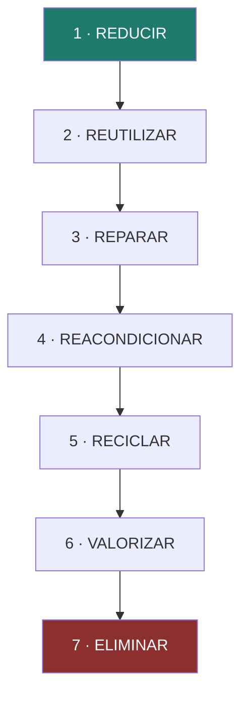
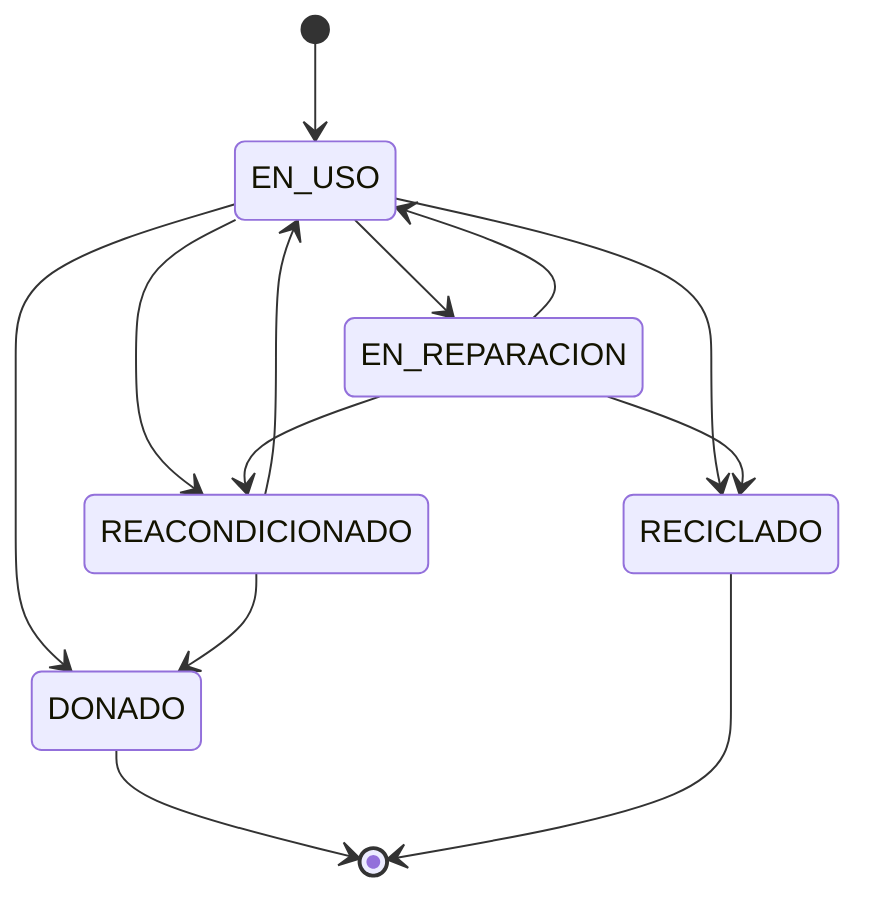
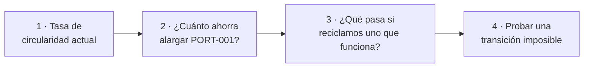

# UT4 · Economía circular y ecodiseño

> **RA4** · 4 h · 16 % · Clase `Ut4Circular.java` · `mvn test -Dtest=Ut4CircularTest`

Un portátil llega a tu mesa con **el 86 % de su huella ya emitida**, antes de encenderlo por primera vez. Esta unidad va de qué se hace con ese dato.

---

## 1. Teoría en cinco minutos

El modelo **lineal** es extraer → fabricar → usar → **tirar**. Lo alimenta la **obsolescencia**:

| Tipo | Qué pasa | Ejemplo |
|---|---|---|
| Técnica | El producto falla o no se puede reparar | Batería pegada |
| **De software** | El hardware funciona, el software ya no lo soporta | App que exige la última versión del SO |
| Percibida | Se cambia por moda | Móvil nuevo cada año |

La **economía circular** mantiene productos y materiales en uso. Sus opciones no valen lo mismo:



**El dato clave de la unidad.** Portátil típico: 300 kg CO₂ de fabricación, 12 kg al año de uso.

```text
Fabricación (una sola vez)  ████████████████████████████████████████████  300 kg
Uso, 4 años                 ███████░░░░░░░░░░░░░░░░░░░░░░░░░░░░░░░░░░░░░   48 kg
                                                          fabricación = 86 %
```

```text
huella anual = fabricación / años de vida + uso anual
```

Alargar la vida reparte esa fabricación entre más años. Pero el ahorro es **decreciente**:

| Vida útil | Huella anual | |
|:-:|---:|---|
| 3 años | 112,0 kg | ████████████████████████████████████████████████ |
| 4 años | 87,0 kg | █████████████████████████████████████ |
| 5 años | 72,0 kg | ███████████████████████████████ |
| 6 años | 62,0 kg | ██████████████████████████ |
| 7 años | 54,9 kg | ███████████████████████ |

De 3 a 4 años se ahorran 25 kg/año. De 6 a 7, solo 7,1.

!!! warning "Circular no es «alargar siempre»"
    Si un equipo es muy ineficiente, sustituirlo puede compensar. La cuenta: **fabricación del nuevo ÷ ahorro anual de consumo = años en amortizarse**.

Y en el inventario, un equipo **reciclado no puede volver a estar en uso**. En Java eso es `IllegalStateException`: el argumento es válido; lo que no lo es es el **estado** del objeto.



---

## 2. Batería de ejercicios

> Seis ejercicios en orden, con **enunciado, datos y resultado esperado**.

---

### Ejercicio 1 · ¿Qué se hace con este equipo?

La jerarquía de las R va de la mejor opción a la peor: **reducir, reutilizar, reparar, reacondicionar, reciclar, valorizar, eliminar**.

**Qué tienes que hacer.** Para cada equipo, elige la mejor opción **entre las que son viables**.

| Equipo | Opciones viables |
|---|---|
| a) Portátil que funciona, ya no lo usa nadie | reutilizar, reciclar |
| b) Portátil con el teclado roto, repuesto disponible | reparar, reacondicionar, reciclar |
| c) Monitor de 2010 que no enciende y sin repuestos | reciclar, valorizar |
| d) Se plantean comprar 20 portátiles nuevos y solo hacen falta 12 | reducir, reutilizar, reparar |

<details class="sol"><summary>Solución</summary>

| Equipo | Mejor opción | Por qué |
|---|---|---|
| a | **Reutilizar** | El producto entero sigue vivo sin gastar nada |
| b | **Reparar** | Va antes que reacondicionar: es una intervención menor |
| c | **Reciclar** | No hay opción mejor viable; al menos se recuperan materiales |
| d | **Reducir** | La mejor R siempre es **no necesitar** el producto |

**Lo importante:** la opción d no exige tocar ningún equipo. La R más eficaz es la que evita la compra, y es la que casi nunca se plantea.
</details>

---

### Ejercicio 2 · Escribir `mejorOpcionR`

**Qué tienes que hacer.** Escribe `String mejorOpcionR(String[] viables)` usando el array `OPCIONES_R`, que ya está declarado **en orden de mejor a peor**. Si `viables` está vacío, devuelve `"ELIMINAR"`.

Comprueba tu método con los cuatro casos del ejercicio 1.

<details class="sol"><summary>Solución</summary>

```java
String mejorOpcionR(String[] viables) {
    for (String o : OPCIONES_R) {            // (1) recorre la JERARQUÍA, no las viables
        for (String v : viables) {
            if (o.equals(v)) return o;       // (2) la primera coincidencia es la mejor
        }
    }
    return "ELIMINAR";                       // (3)
}
```

1. **La clave del ejercicio.** Recorriendo la jerarquía en orden, la primera coincidencia **es necesariamente la mejor**. Si recorrieras `viables` tendrías que ir comparando posiciones, mucho más lío.
2. Por eso basta con un `return`: no hay nada mejor por detrás.
3. Sin opciones viables, la única salida es el vertedero.

**Ventaja de hacerlo así:** si mañana añaden una R nueva a la jerarquía, solo tocas el array. El método no cambia.
</details>

---

### Ejercicio 3 · Dónde está la huella de un portátil

La huella de un equipo tiene dos partes: la **fabricación**, que se emite una sola vez, y el **uso**, que se emite cada año.

**Qué tienes que hacer.** Un portátil tiene **300 kg** de fabricación y **12 kg al año** de uso. Calcula, si dura 4 años:

1. La huella **total** de todo su ciclo de vida.
2. Qué porcentaje de esa huella es la fabricación.
3. La huella **anual** (`fabricación / años + uso anual`).

<details class="sol"><summary>Solución</summary>

1. `300 + 12 × 4 = 300 + 48 = ` **348 kg** en total
2. `300 / 348 = ` **86,2 %** es fabricación
3. `300 / 4 + 12 = 75 + 12 = ` **87,0 kg/año**

```text
Fabricación (una vez)  ████████████████████████████████████████████  300 kg
Uso durante 4 años     ███████░░░░░░░░░░░░░░░░░░░░░░░░░░░░░░░░░░░░░   48 kg
```

**El dato que cambia la conversación:** el 86 % de la huella de ese portátil **ya se había emitido antes de que lo encendieras por primera vez**. Apagarlo por las noches ahorra sobre el 14 % restante; alargar su vida reparte el 86 %.
</details>

---

### Ejercicio 4 · Alargar la vida: cuánto ahorra de verdad

Alargar la vida de un equipo reparte su fabricación entre más años.

**Qué tienes que hacer.** Con ese mismo portátil (300 kg de fabricación), calcula el ahorro **anual** de:

| Caso | De | A | Ahorro |
|:-:|:-:|:-:|---|
| a | 4 años | 6 años | ? |
| b | 6 años | 8 años | ? |

<details class="sol"><summary>Solución</summary>

| Caso | Cuenta | Ahorro |
|:-:|---|---:|
| a | `300/4 − 300/6 = 75 − 50` | **25,0 kg/año** |
| b | `300/6 − 300/8 = 50 − 37,5` | **12,5 kg/año** |

**El mismo esfuerzo, dos años más de vida, ahorra la mitad en el segundo caso.**

```text
3 años  ████████████████████████████████████████████████  112,0 kg/año
4 años  █████████████████████████████████████░░░░░░░░░░░   87,0
5 años  ███████████████████████████████░░░░░░░░░░░░░░░░░   72,0
6 años  ██████████████████████████░░░░░░░░░░░░░░░░░░░░░░   62,0
7 años  ███████████████████████░░░░░░░░░░░░░░░░░░░░░░░░░   54,9
```

La curva se aplana. **Conclusión práctica:** la política de vida útil hay que decidirla **pronto**. Alargar de 3 a 5 años vale mucho más que de 7 a 9.
</details>

---

### Ejercicio 5 · ¿Reparar o comprar uno nuevo?

Comprar un equipo nuevo emite su fabricación de golpe, pero puede ahorrar consumo cada año. La cuenta es:

```text
años en amortizarse = fabricación del nuevo ÷ ahorro anual de consumo
```

**Qué tienes que hacer.** Decide en estos dos casos si compensa sustituir:

| Caso | Fabricación del nuevo | Ahorro anual que aporta |
|---|---:|---:|
| a) Portátil de oficina | 280 kg | 4 kg/año |
| b) Servidor antiguo | 900 kg | 300 kg/año |

<details class="sol"><summary>Solución</summary>

| Caso | Cuenta | Años | ¿Compensa? |
|---|---|---:|---|
| a | `280 / 4` | **70 años** | **No**, ni de lejos |
| b | `900 / 300` | **3 años** | **Sí**, claramente |

**Por qué la diferencia:** un portátil de oficina consume muy poco funcionando, así que un modelo nuevo apenas ahorra nada y su fabricación no se recupera nunca. Un servidor antiguo trabaja 24 horas al día: ahí el consumo pesa mucho más que la fabricación.

**La regla no es «alargar siempre» ni «renovar siempre»: es calcular.** Y en equipos de usuario, la cuenta casi siempre dice alargar.
</details>

---

### Ejercicio 6 · Medir si el centro es circular

La **tasa de circularidad** mide qué parte de los equipos **retirados** tuvo una segunda vida:

```text
(REACONDICIONADO + DONADO)
────────────────────────────────────── × 100
(REACONDICIONADO + DONADO + RECICLADO)
```

**Qué tienes que hacer.** Con este almacén:

| Estado | Equipos |
|---|:-:|
| EN_USO | 5 |
| REACONDICIONADO | 2 |
| DONADO | 1 |
| RECICLADO | 3 |

1. Calcula la tasa.
2. ¿Qué pasaría si incluyeras los 5 en uso en el denominador?
3. ¿Y si mañana reciclas uno de los que están en uso, porque «ya tiene años»?

<details class="sol"><summary>Solución</summary>

1. Segunda vida: `2 + 1 = 3`. Retirados: `3 + 3 = 6`. → `3/6 × 100 = ` **50,0 %**

2. `3 / 11 = ` **27,3 %**, un número **falso y pesimista**. Los equipos en uso no han salido del circuito: todavía no se sabe si tendrán segunda vida. En el denominador solo van los que ya han salido.

3. Segunda vida sigue en 3, reciclados pasan a 4, retirados a 7 → `3/7 = ` **42,9 %**. **La tasa baja.**

Y eso es exactamente lo que debe pasar: reciclar un equipo que aún funciona es una mala decisión circular, y el indicador tiene que penalizarla. Un indicador que subiera al reciclar más estaría premiando lo contrario de lo que busca la economía circular.
</details>

---

## 3. Reto ejemplo (resuelto)

### El encargo

El jefe de departamento quiere renovar equipos y te pide un informe: **cómo de circular es el centro, si merece la pena alargar la vida de los portátiles y qué pasa con los equipos que se retiran**.

| Etiqueta | Compra | Estado | Fabricación | Uso anual |
|---|:-:|---|---:|---:|
| PORT-001 | 2019 | EN_USO | 300 | 12 |
| PORT-002 | 2021 | EN_REPARACION | 300 | 12 |
| SOBR-010 | 2017 | EN_USO | 350 | 45 |
| SOBR-011 | 2016 | REACONDICIONADO | 350 | 45 |
| MONI-003 | 2015 | DONADO | 400 | 20 |
| MONI-004 | 2014 | RECICLADO | 400 | 20 |

### Cómo se resuelve, paso a paso



1. `tasaCircularidad` sobre el array de estados.
2. PORT-001 se compró en 2019, así que en 2026 lleva **7 años**. `ahorroAlargarVida(300, 7, 2)`.
3. Se repite el cálculo del paso 1 cambiando un `EN_USO` por `RECICLADO`.
4. `cambiarEstado` debe **negarse** a resucitar un equipo reciclado.

### El programa

```java
public class DemoUt4 {
    public static void main(String[] args) {
        String[] estados = {"EN_USO", "EN_REPARACION", "EN_USO",
                            "REACONDICIONADO", "DONADO", "RECICLADO"};
        System.out.printf("Tasa de circularidad: %.1f %%%n",          // paso 1
                Ut4Circular.tasaCircularidad(estados));

        System.out.printf("PORT-001 huella anual hoy (7 años): %.1f kg%n",   // paso 2
                Ut4Circular.huellaAnual(300, 12, 7));
        System.out.printf("Alargándolo 2 años más ahorra: %.1f kg/año%n",
                Ut4Circular.ahorroAlargarVida(300, 7, 2));
        System.out.printf("De su huella total, la fabricación es el %.1f %%%n",
                Ut4Circular.porcentajeFabricacion(300, 12, 7));

        String[] despues = {"EN_USO", "EN_REPARACION", "RECICLADO",   // paso 3
                            "REACONDICIONADO", "DONADO", "RECICLADO"};
        System.out.printf("Si reciclamos SOBR-010, que funciona: %.1f %%%n",
                Ut4Circular.tasaCircularidad(despues));

        try {                                                          // paso 4
            Ut4Circular.cambiarEstado("RECICLADO", "EN_USO");
        } catch (IllegalStateException e) {
            System.out.println("Bloqueado: " + e.getMessage());
        }
    }
}
```

### La salida

```text
Tasa de circularidad: 66,7 %
PORT-001 huella anual hoy (7 años): 54,9 kg
Alargándolo 2 años más ahorra: 9,5 kg/año
De su huella total, la fabricación es el 78,1 %
Si reciclamos SOBR-010, que funciona: 50,0 %
Bloqueado: No se puede pasar de RECICLADO a EN_USO
```

### Qué significa este resultado

**Primer hallazgo: alargar PORT-001 casi no sirve.** Solo 9,5 kg al año, porque el equipo ya lleva 7 años y la curva está plana (lo viste en el ejercicio 4). Con un portátil **nuevo**, la misma decisión ahorraría 25 kg al año.

La recomendación correcta no es «alargar PORT-001 dos años más». Es:

- **Para PORT-001:** donarlo o reacondicionarlo, para que siga vivo en otro sitio.
- **Para los equipos nuevos:** fijar desde hoy una política de 6 años en vez de 4. Ahí es donde está el ahorro de verdad.

**Segundo hallazgo: reciclar un equipo que funciona baja la tasa del 66,7 % al 50 %.** El indicador está bien construido, porque penaliza una mala decisión. Muchos informes reales presumen de «porcentaje de equipos reciclados», que sube cuando destruyes equipos útiles. **El indicador que eliges determina el comportamiento que premias.**

**Tercer hallazgo: el sistema se niega a mentir.** Un equipo reciclado ya no existe en el inventario. Si el software permitiera resucitarlo, la trazabilidad se rompería y la tasa de circularidad dejaría de significar nada.

---

## 4. Reto a realizar (entregable)

### Parte 1 · Completa la clase `Ut4Circular.java`

```bash
mvn test -Dtest=Ut4CircularTest
```

Tres ya los has hecho en la batería (`mejorOpcionR`, `huellaAnual` y `tasaCircularidad`). Faltan estos:

| # | Método | Qué debe hacer | Pista |
|:-:|---|---|---|
| 1 | `transicionPermitida` | Si se puede pasar de un estado a otro | Un `switch` sobre `desde` que devuelva un `String[]` con los destinos válidos; `DONADO` y `RECICLADO` devuelven `new String[]{}` |
| 2 | `cambiarEstado` | Cambia, o lanza `IllegalStateException` | Valida **antes** de devolver nada. El mensaje tiene que **contener los dos estados**: el test lo comprueba con `contains` |
| 4 | `ahorroAlargarVida` | `fab/actuales − fab/(actuales+extra)` | Valida que `aniosActuales > 0` y `aniosExtra >= 0` |
| 5 | `porcentajeFabricacion` | Qué parte del ciclo de vida es fabricar | Total = fabricación + uso × años |
| 8 | `aniosParaAmortizar` | Años en recuperar la fabricación del nuevo | `(int) Math.ceil(...)`. Si el ahorro anual es 0 o menos, devuelve `-1`: no compensa nunca |

### Parte 2 · Informe de renovación

Con los tests en verde, aplica tu programa a este inventario de una pyme en **2026**:

| Etiqueta | Compra | Estado | Fabricación | Uso anual |
|---|:-:|---|---:|---:|
| PORT-101 | 2023 | EN_USO | 280 | 10 |
| PORT-102 | 2022 | EN_USO | 280 | 10 |
| PORT-103 | 2020 | EN_REPARACION | 300 | 12 |
| SOBR-201 | 2019 | EN_USO | 350 | 45 |
| SERV-301 | 2016 | EN_USO | 1 200 | 800 |
| MONI-401 | 2018 | REACONDICIONADO | 400 | 20 |
| MONI-402 | 2017 | DONADO | 400 | 20 |
| MONI-403 | 2015 | RECICLADO | 400 | 20 |

La empresa se plantea comprar un **servidor nuevo** para sustituir a SERV-301: fabricación **1 100 kg**, y ahorraría **500 kg al año** de consumo.

**Entrega un documento de una página con:**

1. La **tasa de circularidad** actual del inventario.
2. El **ahorro anual** de alargar 2 años la vida de PORT-101 (comprado en 2023) y de SOBR-201 (comprado en 2019).
3. **Tres frases** respondiendo a:
      - ¿En cuál de los dos equipos del punto 2 compensa más aplicar una política de vida larga, y por qué?
      - ¿Compensa sustituir el servidor SERV-301? Da la cuenta y el número de años.
      - MONI-403 se recicló en 2015 con solo 7 años de vida. Si en lugar de reciclarlo se hubiera donado, ¿cómo cambiaría la tasa de circularidad? Da el número nuevo.

!!! tip "La segunda pregunta tiene truco"
    El servidor es el único equipo del inventario donde el **uso** pesa más que la **fabricación**. Compruébalo con `porcentajeFabricacion` antes de responder: es la razón de que la respuesta sea distinta a la de los portátiles.

---

## 5. Autoevaluación

<details><summary><b>1.</b> El modelo lineal es…<br>a) reducir, reutilizar, reciclar · b) extraer, fabricar, usar, tirar · c) diseñar, probar, desplegar · d) comprar, alquilar, devolver</summary><b>b</b></details>
<details><summary><b>2.</b> Un móvil que funciona pero cuyas apps ya no arrancan sufre obsolescencia…<br>a) técnica · b) de software · c) percibida · d) natural</summary><b>b</b></details>
<details><summary><b>3.</b> Ordena de mejor a peor: reciclar, reparar, reutilizar.<br>a) reciclar, reparar, reutilizar · b) reutilizar, reparar, reciclar · c) reparar, reutilizar, reciclar · d) valen lo mismo</summary><b>b</b></details>
<details><summary><b>4.</b> `mejorOpcionR({"RECICLAR","REPARAR","VALORIZAR"})` devuelve…<br>a) RECICLAR · b) REPARAR · c) VALORIZAR · d) ELIMINAR</summary><b>b</b></details>
<details><summary><b>5.</b> `mejorOpcionR({})` devuelve…<br>a) null · b) "" · c) ELIMINAR · d) excepción</summary><b>c</b></details>
<details><summary><b>6.</b> Portátil de 300 kg de fabricación y 12 kg/año a 4 años: huella anual…<br>a) 75 kg · b) 87 kg · c) 312 kg · d) 348 kg</summary><b>b</b>. La a) olvida el uso.</details>
<details><summary><b>7.</b> En ese portátil la fabricación supone el…<br>a) 50 % · b) 66 % · c) 86 % · d) 95 %</summary><b>c</b></details>
<details><summary><b>8.</b> Alargarlo de 4 a 6 años ahorra al año…<br>a) 12 kg · b) 25 kg · c) 50 kg · d) 150 kg</summary><b>b</b></details>
<details><summary><b>9.</b> Alargarlo de 6 a 8 ahorra…<br>a) lo mismo, 25 kg · b) 12,5 kg · c) 50 kg · d) nada</summary><b>b</b>. El ahorro es decreciente.</details>
<details><summary><b>10.</b> Un equipo de 280 kg de fabricación que ahorra 4 kg/año se amortiza en…<br>a) 4 años · b) 70 años · c) nunca · d) 1 año</summary><b>b</b>. No compensa.</details>
<details><summary><b>11.</b> Un servidor de 900 kg que ahorra 300 kg/año se amortiza en…<br>a) 3 años · b) 30 años · c) nunca · d) 300 años</summary><b>a</b>. Sí compensa.</details>
<details><summary><b>12.</b> Si el ahorro anual es 0, `aniosParaAmortizar` devuelve…<br>a) 0 · b) −1 · c) infinito · d) excepción</summary><b>b</b></details>
<details><summary><b>13.</b> Pasar un equipo RECICLADO a EN_USO debe lanzar…<br>a) IllegalArgumentException · b) IllegalStateException · c) NullPointerException · d) nada</summary><b>b</b></details>
<details><summary><b>14.</b> ¿Por qué esa excepción y no la otra?<br>a) es más corta · b) el argumento es válido; lo inválido es el estado del objeto · c) da igual · d) lo exige JUnit</summary><b>b</b></details>
<details><summary><b>15.</b> ¿Es válida EN_REPARACION → DONADO?<br>a) sí · b) no, hay que pasar antes por EN_USO o REACONDICIONADO · c) solo si está reparado · d) solo en 2026</summary><b>b</b></details>
<details><summary><b>16.</b> 2 reacondicionados, 1 donado, 3 reciclados y 5 en uso dan una tasa de…<br>a) 27,3 % · b) 50,0 % · c) 60,0 % · d) 33,3 %</summary><b>b</b>. La a) sale de incluir los 5 en uso.</details>
<details><summary><b>17.</b> Reciclar un equipo que aún funciona hace que la tasa…<br>a) suba · b) baje · c) no cambie · d) se anule</summary><b>b</b></details>
<details><summary><b>18.</b> En el reto ejemplo, alargar PORT-001 dos años ahorraba solo 9,5 kg/año porque…<br>a) el equipo es pequeño · b) ya lleva 7 años y la curva está muy plana · c) el cálculo está mal · d) los monitores no cuentan</summary><b>b</b></details>
