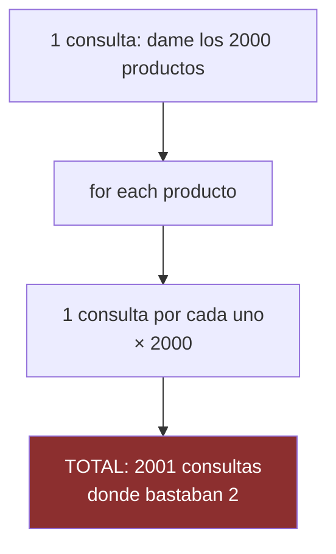
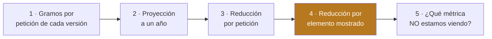

# UT5 · La huella de carbono del software

> **RA5** · 5 h · 22 % · Clase `Ut5Huella.java` · `mvn test -Dtest=Ut5HuellaTest`

La unidad con más peso del módulo. Aquí vas a medir tu propio código y a descubrir dos cosas incómodas: que una métrica puede darte un sobresaliente mientras el servidor sufre, y que el «−99 %» del que presumen muchos informes suele ser mentira.

---

## 1. Teoría en cinco minutos

Tu proceso productivo es el software, y consume en todas sus fases:


**Principios del software verde** (Green Software Foundation): eficiencia de carbono, eficiencia energética, **conciencia de carbono** (hacer más cuando la red está limpia), **eficiencia del hardware** (aprovechar lo ya fabricado) y **medición**, porque lo que no se mide no se mejora.

**Del byte al CO₂.** El modelo *Sustainable Web Design* estima **0,81 kWh por GB** transferido:

```text
kWh   = bytes / 1 000 000 000 × 0,81
g CO₂ = kWh × intensidad de la red        ← la que calculaste en la UT2
```

**El SCI** (norma ISO/IEC 21031) no da un total, sino una **tasa por unidad funcional**:

```text
SCI = (E × I + M) / R
```

| Letra | Qué es | Ejemplo |
|:-:|---|---|
| **E** | Energía del software (kWh) | 5 kWh al día |
| **I** | Intensidad de la red (g/kWh) | 150 |
| **M** | Carbono embebido del hardware (g) | 4 250 |
| **R** | Unidades funcionales | 10 000 peticiones |

Es el «litros a los 100 km» del software: con más tráfico emites más en total, pero puedes ser **más eficiente**.

**El derroche más común: el problema N+1.**



**Carbon-aware.** Informes, copias y reindexados no tienen hora fija: moverlos a la hora limpia reduce emisiones sin tocar su lógica. Siempre con **hora límite**, o la tarea no se ejecuta nunca.

---

## 2. Batería de ejercicios

> Seis ejercicios en orden, con **enunciado, datos y resultado esperado**. Aquí las cifras son diminutas: no te asustes, el sentido llega en el ejercicio 3.

---

### Ejercicio 1 · De bytes a kilovatios hora

El modelo *Sustainable Web Design* estima que transferir **1 GB** por internet consume **0,81 kWh** (sumando centros de datos, redes y dispositivos).

```text
kWh = bytes ÷ 1 000 000 000 × 0,81
```

**Qué tienes que hacer.** Calcula los kWh de transferir:

| # | Datos | kWh |
|:-:|---|---|
| a | 1 GB (1 000 000 000 bytes) | ? |
| b | 2 MB (2 000 000 bytes) | ? |
| c | 274 kB (274 000 bytes) | ? |

<details class="sol"><summary>Solución</summary>

| # | Cuenta | kWh |
|:-:|---|---|
| a | `1 × 0,81` | **0,81** |
| b | `0,002 × 0,81` | **0,00162** |
| c | `0,000274 × 0,81` | **0,000222** |

```java
double kwhTransferencia(long bytes) {
    return bytes / BYTES_POR_GB * KWH_POR_GB;    // sin redondear
}
```

**No redondees aquí.** Si redondeas a dos decimales, los casos b y c se convierten en **0,00** y todo lo que venga después dará cero. En esta unidad solo se redondea al final, en `kgAnuales`.
</details>

---

### Ejercicio 2 · De kilovatios hora a gramos de CO₂

Ya tienes la energía. Para pasarla a CO₂ hace falta la **intensidad de la red**, que es justo lo que calculaste en la UT2.

```text
g CO₂ = kWh × intensidad (g CO₂/kWh)
```

**Qué tienes que hacer.** Con la red a **150 g/kWh**, calcula los gramos de una respuesta de 2 MB y de otra de 274 kB.

<details class="sol"><summary>Solución</summary>

```text
2 MB:    0,00162  × 150 = 0,243 g
274 kB:  0,000222 × 150 = 0,0333 g
```

**Una respuesta emite tres centésimas de gramo.** Ridículo, ¿no? Pasa al ejercicio 3.
</details>

---

### Ejercicio 3 · El truco de la escala

**Qué tienes que hacer.** Esa respuesta de 274 kB (0,0333 g) se sirve **10 000 veces al día**.

1. ¿Cuánto emite al día?
2. ¿Y al año?
3. Escribe `double kgAnuales(long bytesPorPeticion, long peticionesDia, double gramosPorKwh)`, redondeando a 1 decimal.

<details class="sol"><summary>Solución</summary>

1. `0,0333 × 10 000 = 333 g al día` (un tercio de kilo)
2. `333 × 365 = 121 512 g = ` **121,5 kg al año**

3. ```java
   double kgAnuales(long bytesPorPeticion, long peticionesDia, double gramosPorKwh) {
       double gramos = gramosCo2(bytesPorPeticion, gramosPorKwh) * peticionesDia * 365;
       return Math.round(gramos / 1000 * 10) / 10.0;     // gramos -> kilos, 1 decimal
   }
   ```

```text
Una petición  ·                                        0,0333 g
Un día        ███                                       333 g
Un año        ████████████████████████████████████  121 512 g = 121,5 kg
```

**De 0,03 gramos a 121 kilos.** La huella del software casi nunca está en una operación: está en **multiplicarla por la escala a la que ocurre**. Esta es la idea central de la unidad.
</details>

---

### Ejercicio 4 · El SCI: emitir menos por cada cosa que haces

El **SCI** no mide un total, sino una **tasa por unidad funcional** (por petición, por usuario, por informe):

```text
SCI = (E × I + M) ÷ R
```

| Letra | Qué es |
|:-:|---|
| **E** | Energía del software en el periodo (kWh) |
| **I** | Intensidad de la red (g CO₂/kWh) |
| **M** | Carbono embebido: parte de la fabricación del hardware asignada a ese periodo (g) |
| **R** | Unidades funcionales atendidas |

**Qué tienes que hacer.** Un servicio consume **5 kWh** al día con la red a **150 g/kWh**, tiene **4 250 g** de carbono embebido asignado al día y atiende **10 000 peticiones**.

1. Calcula su SCI.
2. Mañana atiende **20 000 peticiones** con el mismo hardware y la misma energía. ¿Cuál es el nuevo SCI?
3. ¿Ha emitido más o menos en total? ¿Y es más o menos eficiente?

<details class="sol"><summary>Solución</summary>

1. `(5 × 150 + 4250) / 10 000 = 5 000 / 10 000 = ` **0,5 g por petición**
2. `5 000 / 20 000 = ` **0,25 g por petición**
3. **Emite exactamente lo mismo en total** (5 000 g), pero es **el doble de eficiente**: el mismo hardware, que ya estaba fabricado, sirve para el doble de trabajo útil.

Por eso el SCI es una **tasa** y no un total: es el «litros a los 100 km» del software. Un servicio con más usuarios emitirá más en total, y aun así puede estar mucho mejor diseñado.

Y por eso **R nunca puede ser 0**: sin trabajo útil, la tasa no significa nada. El método debe lanzar `IllegalArgumentException`.
</details>

---

### Ejercicio 5 · Detectar el problema N+1

Traes una lista de elementos de la base de datos y, al recorrerla, pides un dato relacionado de cada uno. Resultado: **1 consulta para la lista + 1 por cada elemento**.

**Qué tienes que hacer.** Di si hay sospecha de N+1 en cada caso y cuántas consultas sobran.

| # | Consultas lanzadas | Elementos devueltos | ¿N+1? |
|:-:|---:|---:|---|
| a | 2 001 | 2 000 | ? |
| b | 2 | 2 000 | ? |
| c | 21 | 20 | ? |
| d | 2 | 2 | ? |

<details class="sol"><summary>Solución</summary>

| # | ¿N+1? | Sobran |
|:-:|---|---|
| a | **Sí** | 1 999 consultas |
| b | No | Es el caso ideal |
| c | **Sí** | 19 consultas |
| d | No | Con 2 elementos harían falta 3 para sospechar |

```java
boolean hayNMasUno(long consultas, int elementos) {
    return elementos >= 2 && consultas >= elementos + 1L;   // (1)
}
```

1. El `L` convierte la suma a `long`: con muchos elementos, `elementos + 1` en `int` podría desbordar. Y el `elementos >= 2` evita falsos positivos con listas de un solo elemento.

**Lo que hay que retener:** el coste del N+1 **no aparece en los bytes**. La respuesta puede pesar exactamente lo mismo mientras la base de datos hace 2 000 veces más trabajo. Lo verás en el reto.
</details>

---

### Ejercicio 6 · Ejecutar cuando la red está limpia

Muchas tareas (copias, informes, reindexados) **no tienen hora fija**. Moverlas a la hora más limpia reduce sus emisiones sin tocar su lógica.

**Qué tienes que hacer.** Una tarea consume **12 kWh**. La red está a **180 g/kWh** a las 3:00 y a **70 g/kWh** a las 14:00.

1. ¿Cuánto CO₂ se ahorra moviéndola?
2. Si la tarea es diaria, ¿cuánto al año?
3. ¿Qué salvaguarda hay que añadir para que la idea no falle?

<details class="sol"><summary>Solución</summary>

1. `12 × (180 − 70) = 1 320 g = ` **1,32 kg** por ejecución
2. `1,32 × 365 = ` **482 kg al año**
3. Una **hora límite**. Si a las 6:00 la red sigue sucia, la tarea **se ejecuta igualmente**.

Sin ese límite, una tarea que espera el momento perfecto puede no ejecutarse nunca. Y una copia de seguridad que no se hace no es una optimización: es una avería.
</details>

---

## 3. Reto ejemplo (resuelto)

### El encargo

Tu API tiene un endpoint que devuelve **2 000 productos** con un dato relacionado de cada uno. Lo mides y sale:

| | v1 (actual) |
|---|---|
| Bytes por respuesta | 274 000 |
| Consultas SQL | 2 001 |
| Elementos devueltos | 2 000 |

Lo optimizas: traes el dato en la misma consulta y **paginas de 20 en 20**.

| | v2 (optimizada) |
|---|---|
| Bytes por respuesta | 1 800 |
| Consultas SQL | 2 |
| Elementos devueltos | 20 |

El endpoint recibe **10 000 peticiones al día** y la red está a **150 g/kWh**. Te piden que **cuantifiques la mejora** para ponerla en el informe anual.

### Cómo se resuelve, paso a paso



Los pasos 1 a 3 son la cuenta obvia. **El paso 4 es el que casi nadie hace** y el que decide si tu informe es honesto.

### El programa

```java
public class DemoUt5 {
    public static void main(String[] args) {
        double intensidad = 150;
        long peticiones = 10_000;
        long bytesV1 = 274_000, bytesV2 = 1_800;

        double gV1 = Ut5Huella.gramosCo2(bytesV1, intensidad);      // paso 1
        double gV2 = Ut5Huella.gramosCo2(bytesV2, intensidad);
        double kgV1 = Ut5Huella.kgAnuales(bytesV1, peticiones, intensidad);  // paso 2
        double kgV2 = Ut5Huella.kgAnuales(bytesV2, peticiones, intensidad);

        System.out.printf("v1: %.4f g/petición  %.1f kg/año  etiqueta %s  N+1: %b%n",
                gV1, kgV1, Ut5Huella.etiqueta(gV1), Ut5Huella.hayNMasUno(2001, 2000));
        System.out.printf("v2: %.4f g/petición  %.1f kg/año  etiqueta %s  N+1: %b%n",
                gV2, kgV2, Ut5Huella.etiqueta(gV2), Ut5Huella.hayNMasUno(2, 20));

        System.out.printf("Reducción POR PETICIÓN: %.1f %%%n",       // paso 3
                Ut5Huella.reduccionPorcentual(kgV1, kgV2));

        double porElementoV1 = gV1 / 2000;                           // paso 4
        double porElementoV2 = gV2 / 20;
        System.out.printf("Reducción POR PRODUCTO MOSTRADO: %.1f %%%n",
                Ut5Huella.reduccionPorcentual(porElementoV1, porElementoV2));
    }
}
```

### La salida

```text
v1: 0,0333 g/petición  121,5 kg/año  etiqueta A  N+1: true
v2: 0,0002 g/petición    0,8 kg/año  etiqueta A  N+1: false
Reducción POR PETICIÓN: 99,3 %
Reducción POR PRODUCTO MOSTRADO: 34,3 %
```

```text
v1  ████████████████████████████████████████████████  121,5 kg/año
v2  ░░░░░░░░░░░░░░░░░░░░░░░░░░░░░░░░░░░░░░░░░░░░░░░░    0,8 kg/año
```

### Qué significa este resultado

**Hallazgo 1: las dos versiones sacan etiqueta A.** La que lanzaba 2 001 consultas y la que lanza 2 obtienen **la misma nota**. No es un fallo del código: el modelo por bytes **solo ve la transferencia**. No ve la base de datos, ni la CPU, ni la memoria. Por eso el programa también imprime el N+1: **nunca midas una sola magnitud**.

**Hallazgo 2: el 99,3 % no es del todo honesto.** La v2 muestra 20 productos y la v1 mostraba 2 000. Comparando **por producto mostrado**, la mejora real es del **34,3 %**.

¿Significa eso que la optimización no vale? Todo lo contrario: **es excelente**. Pero el ahorro tiene dos orígenes distintos y hay que separarlos:

| De dónde viene el ahorro | Cuánto |
|---|---|
| Servir cada producto de forma más eficiente | **34,3 %** |
| **No enviar** 1 980 productos que nadie iba a mirar | El resto, hasta el 99,3 % |

Los dos son mejoras reales. Pero si escribes en el informe «hemos reducido un 99 % nuestras emisiones» sin decir que cambiaste la unidad funcional, estás haciendo greenwashing con datos técnicos. La forma honesta de contarlo es: **«hemos reducido un 99 % el tráfico del endpoint, un tercio por mayor eficiencia y el resto por dejar de enviar datos que nadie consultaba»**.

---

## 4. Reto a realizar (entregable)

### Parte 1 · Completa la clase `Ut5Huella.java`

```bash
mvn test -Dtest=Ut5HuellaTest
```

Cinco ya los has hecho en la batería. Faltan estos:

| # | Método | Qué debe hacer | Pista |
|:-:|---|---|---|
| 5 | `reduccionPorcentual` | `(antes − después) / antes × 100`, 1 decimal | Puede salir **negativa** si ha empeorado, y está bien. Valida que `antes > 0` |
| 7 | `mejorHora` | Posición de la hora más limpia en el rango `[desde, hasta]` | Recorre **el rango**, no el array entero. Empieza con `mejor = desde` y cambia solo si encuentras una **estrictamente menor**: así los empates los gana la más temprana. Devuelve `-1` si `desde > hasta` o si `hasta` se sale del array |
| 8 | `etiqueta` | A, B, C, D, E o F según los gramos | Seis `if` de menor a mayor: `<= 0.1`, `<= 0.2`, `<= 0.4`, `<= 0.8`, `<= 1.6`, resto |

### Parte 2 · Cuantifica una optimización

Con los tests en verde, aplica el programa del reto ejemplo a estas medidas de **otro endpoint**:

| | v1 (actual) | v2 (optimizada) |
|---|---:|---:|
| Bytes por respuesta | 180 000 | 4 000 |
| Consultas SQL | 1 501 | 2 |
| Elementos devueltos | 1 500 | 25 |

Tráfico: **8 000 peticiones al día**. Red a **180 g/kWh**.

**Entrega un documento de una página con:**

1. Los **gramos por petición**, los **kg al año** y la **etiqueta** de cada versión.
2. La **reducción por petición** y la **reducción por elemento mostrado**.
3. **Tres frases** respondiendo a:
      - ¿Hay problema N+1 en la v1? ¿Cuántas consultas sobran en cada petición?
      - La reducción por elemento mostrado sale **negativa**. ¿Qué significa eso exactamente?
      - ¿Recomendarías igualmente la v2? Justifícalo en dos líneas.

!!! warning "La segunda pregunta es el examen de honestidad de la unidad"
    Sí, el número sale negativo. No es un error tuyo ni del enunciado: paginar de 25 en 25 tiene más sobrecarga por elemento que enviar 1 500 de golpe. Tu trabajo es explicar ese dato incómodo, no esconderlo. Y después decidir, con criterio, si la optimización sigue mereciendo la pena.

---

## 5. Autoevaluación

<details><summary><b>1.</b> El modelo Sustainable Web Design estima…<br>a) 0,081 kWh/GB · b) 0,81 kWh/GB · c) 8,1 kWh/GB · d) 81 kWh/GB</summary><b>b</b></details>
<details><summary><b>2.</b> Una respuesta de 2 MB a 150 g/kWh emite…<br>a) 0,024 g · b) 0,243 g · c) 2,43 g · d) 24,3 g</summary><b>b</b></details>
<details><summary><b>3.</b> Una de 274 kB servida 10 000 veces al día emite al año…<br>a) 12,2 kg · b) 121,5 kg · c) 1215 kg · d) 0,03 kg</summary><b>b</b></details>
<details><summary><b>4.</b> En SCI = (E × I + M) / R, la **M** es…<br>a) los megabytes · b) el carbono embebido del hardware · c) los minutos · d) la memoria</summary><b>b</b></details>
<details><summary><b>5.</b> `sci(5, 150, 4250, 10000)` vale…<br>a) 0,075 · b) 0,5 · c) 5,0 · d) 50</summary><b>b</b></details>
<details><summary><b>6.</b> Si el tráfico se duplica con la misma infraestructura, el SCI…<br>a) sube · b) baja · c) no cambia · d) se duplica</summary><b>b</b></details>
<details><summary><b>7.</b> Si R es 0, `sci` debe…<br>a) devolver 0 · b) lanzar IllegalArgumentException · c) devolver Infinity · d) devolver el numerador</summary><b>b</b></details>
<details><summary><b>8.</b> Recorrer 2000 elementos pidiendo un dato de cada uno genera…<br>a) 1 consulta · b) 2 · c) 2001 · d) 4000</summary><b>c</b></details>
<details><summary><b>9.</b> `hayNMasUno(2, 2)` devuelve…<br>a) true · b) false · c) excepción · d) depende</summary><b>b</b>. Hacen falta al menos elementos + 1.</details>
<details><summary><b>10.</b> En el reto ejemplo, la v1 con 2001 consultas sacó etiqueta…<br>a) A · b) C · c) E · d) F</summary><b>a</b>. Y ese es justo el problema.</details>
<details><summary><b>11.</b> Que las dos versiones saquen A demuestra que…<br>a) la etiqueta está mal calculada · b) el modelo por bytes no ve base de datos ni CPU · c) la v1 era buena · d) hay que subir los umbrales</summary><b>b</b></details>
<details><summary><b>12.</b> La reducción por petición fue del 99,3 %, pero por producto mostrado fue del…<br>a) 99,3 % · b) 66 % · c) 34,3 % · d) 0 %</summary><b>c</b></details>
<details><summary><b>13.</b> Presumir del 99,3 % sin decir que cambió la unidad funcional es…<br>a) correcto · b) engañoso · c) obligatorio · d) irrelevante</summary><b>b</b></details>
<details><summary><b>14.</b> `reduccionPorcentual(100, 150)` devuelve…<br>a) 50 · b) −50 · c) 0 · d) excepción</summary><b>b</b>. Ha empeorado.</details>
<details><summary><b>15.</b> En `mejorHora`, un empate lo gana…<br>a) la hora más tardía · b) la más temprana · c) es aleatorio · d) la última del array</summary><b>b</b></details>
<details><summary><b>16.</b> Una tarea de 12 kWh movida de 180 a 70 g/kWh ahorra…<br>a) 0,13 kg · b) 1,32 kg · c) 13,2 kg · d) 132 kg</summary><b>b</b></details>
<details><summary><b>17.</b> Una tarea carbon-aware necesita siempre…<br>a) ejecutarse de noche · b) una hora límite para no aplazarse indefinidamente · c) internet · d) un servidor dedicado</summary><b>b</b></details>
<details><summary><b>18.</b> Consolidar tres servidores al 10 % de uso en uno responde al principio de…<br>a) conciencia de carbono · b) eficiencia del hardware · c) medición · d) compensación</summary><b>b</b></details>
