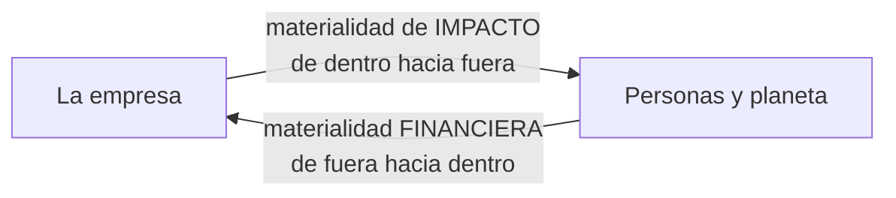

# UT6 · El plan de sostenibilidad de una empresa

> **RA6** · 4 h · 20 % · Clase `Ut6Plan.java` · `mvn test -Dtest=Ut6PlanTest`

La unidad que lo junta todo. Vas a construir el plan de una empresa y a descubrir, con tu propio código, que el asunto **más importante de su plan no tiene ninguna acción asignada**.

---

## 1. Teoría en cinco minutos


**Grupos de interés:** quien afecta a la empresa o se ve afectado por ella. No se gestionan igual. La **matriz de poder e interés**:

| | Interés bajo | Interés alto |
|---|---|---|
| **Influencia alta** | Mantener satisfecho *(inversores)* | Gestionar de cerca *(clientes)* |
| **Influencia baja** | Monitorizar *(proveedores)* | Mantener informado *(vecindario)* |

**Materialidad.** No todo importa a todas las empresas. Las normas europeas usan la **doble materialidad**, y basta con **una** de las dos perspectivas:



El agua de refrigeración de un centro de datos puede tener impacto alto y efecto financiero bajo, **y aun así ser material**. Si programas eso con `&&` en vez de `||`, dejas fuera justo los asuntos que las empresas tienden a callar.

**Acciones e indicadores.** Cada aspecto material necesita una acción con objetivo **SMART** y un indicador con línea base, meta y valor actual:

```text
progreso = (actual − base) / (meta − base)      acotado entre 0 y 1
```

La misma fórmula sirve si la meta sube **o baja**: los dos signos negativos se cancelan.

| Indicador | Base | Meta | Actual | Progreso |
|---|:-:|:-:|:-:|:-:|
| Renovables (%) | 40 | 100 | 72 | 0,53 |
| PUE del CPD | 1,8 | 1,4 | 1,6 | 0,50 |

**Comunicar.** Un informe honesto es equilibrado (cuenta lo que va mal), comparable, preciso con sus fuentes y, si puede, verificado por un tercero. Publicar los **aspectos materiales sin acción** es lo que lo distingue de un folleto.

---

## 2. Batería de ejercicios

> Seis ejercicios en orden, con **enunciado, datos y resultado esperado**.

---

### Ejercicio 1 · ¿Cómo trato a cada grupo de interés?

La **matriz de poder e interés** cruza cuánta **influencia** tiene un grupo sobre la empresa con cuánto **interés** tiene en lo que hace. Alto significa **3 o más** en una escala de 1 a 5.

| | Interés bajo | Interés alto |
|---|---|---|
| **Influencia alta** | MANTENER SATISFECHO | GESTIONAR DE CERCA |
| **Influencia baja** | MONITORIZAR | MANTENER INFORMADO |

**Qué tienes que hacer.** Clasifica estos cuatro grupos de una empresa de alojamiento web.

| Grupo | Influencia | Interés | Estrategia |
|---|:-:|:-:|---|
| Clientes | 5 | 4 | ? |
| Inversores | 5 | 2 | ? |
| Vecindario del centro de datos | 2 | 4 | ? |
| Proveedores de material de oficina | 2 | 2 | ? |

<details class="sol"><summary>Solución</summary>

| Grupo | Estrategia | Por qué |
|---|---|---|
| Clientes | **GESTIONAR DE CERCA** | Deciden mucho y les importa mucho |
| Inversores | **MANTENER SATISFECHO** | Pueden cambiarlo todo, pero el tema no les ocupa el día a día |
| Vecindario | **MANTENER INFORMADO** | Les afecta mucho y pueden hacer poco |
| Proveedores de oficina | **MONITORIZAR** | Ni influyen ni les afecta demasiado |

**La matriz no es burocracia: es el plan de comunicación.** A los clientes se les convoca a una reunión; al vecindario se le manda el informe y se le abre un canal; a los proveedores de folios, nada especial.
</details>

---

### Ejercicio 2 · Doble materialidad: el `||` que lo cambia todo

Un asunto es **material** si merece que la empresa lo gestione e informe de él. Las normas europeas miran **dos** perspectivas y basta con **una**:

- **De impacto:** cuánto afecta la empresa a las personas y al planeta.
- **Financiera:** cuánto afecta ese asunto al negocio.

**Qué tienes que hacer.** Con un umbral de **3,5**, di si cada aspecto es material y de qué tipo.

| Aspecto | Impacto | Financiero | ¿Material? | Tipo |
|---|:-:|:-:|---|---|
| a) Consumo energético del CPD | 5 | 5 | ? | ? |
| b) Uso de agua en refrigeración | 4 | 2 | ? | ? |
| c) Riesgo regulatorio de protección de datos | 2 | 5 | ? | ? |
| d) Patrocinio deportivo local | 1 | 1 | ? | ? |

<details class="sol"><summary>Solución</summary>

| Aspecto | ¿Material? | Tipo |
|---|:-:|---|
| a | Sí | **AMBAS** |
| b | **Sí** | **IMPACTO** |
| c | Sí | **FINANCIERA** |
| d | No | NO MATERIAL |

```java
boolean esMaterial(double impacto, double financiero, double umbral) {
    return impacto >= umbral || financiero >= umbral;    // (1)
}
```

1. **Con `&&` en vez de `||`**, el caso b desaparecería del informe.

Y el caso b es justo el que importa: la empresa **daña** un recurso de su comarca sin sufrir ninguna consecuencia económica por ello. Esos son los asuntos que las empresas tienden a callar, y un operador lógico mal elegido los borra del mapa. Es, literalmente, la diferencia entre rendir cuentas y no hacerlo.
</details>

---

### Ejercicio 3 · Priorizar: no todo lo material es igual de urgente

Entre los aspectos materiales hay que decidir por dónde empezar. La prioridad combina lo que dice la empresa con lo que dicen sus grupos de interés:

```text
prioridad = (la mayor de las dos materialidades + importancia para los grupos) ÷ 2
```

**Qué tienes que hacer.** Calcula la prioridad de estos dos y di cuál va primero.

| Aspecto | Impacto | Financiero | Importancia para los grupos |
|---|:-:|:-:|:-:|
| Consumo energético | 5 | 5 | 4,5 |
| Privacidad de datos | 4 | 5 | 5 |

<details class="sol"><summary>Solución</summary>

```text
Consumo energético:  (max(5, 5) + 4,5) / 2 = 9,5 / 2 = 4,75 → 4,8
Privacidad de datos: (max(4, 5) + 5)   / 2 = 10  / 2 = 5,00 → 5,0
```

**Gana la privacidad de datos**, aunque su impacto sea menor (4 frente a 5).

¿Por qué? Porque **los grupos de interés la puntúan más alto**. La prioridad no es solo lo que la empresa cree que importa: es también lo que le están exigiendo clientes, reguladores y plantilla. Una empresa que solo se mira a sí misma prioriza mal.
</details>

---

### Ejercicio 4 · El progreso, suba o baje la meta

Cada acción se mide con un indicador que tiene **línea base**, **meta** y **valor actual**:

```text
progreso = (actual − base) ÷ (meta − base)      acotado entre 0 y 1
```

**Qué tienes que hacer.** Calcula el progreso de estas cuatro acciones, con dos decimales.

| # | Indicador | Base | Meta | Actual |
|:-:|---|---:|---:|---:|
| a | Electricidad renovable (%) | 40 | 100 | 72 |
| b | PUE del centro de datos | 1,8 | 1,4 | 1,6 |
| c | Equipos con segunda vida (%) | 10 | 60 | 75 |
| d | Equipos con segunda vida (%) | 10 | 60 | 5 |

<details class="sol"><summary>Solución</summary>

| # | Cuenta | Progreso |
|:-:|---|---:|
| a | `(72 − 40) / (100 − 40) = 32/60 = 0,533` | **0,53** |
| b | `(1,6 − 1,8) / (1,4 − 1,8) = (−0,2)/(−0,4)` | **0,50** |
| c | `(75 − 10) / 50 = 1,3` → acotado | **1,00** |
| d | `(5 − 10) / 50 = −0,1` → acotado | **0,00** |

**El caso b es la clave de todo el ejercicio.** La meta **baja** (un PUE menor es mejor), y sin embargo **la fórmula es exactamente la misma**: los dos signos negativos se cancelan.

Mucha gente escribe un `if` para distinguir los dos casos y se equivoca en una de las dos ramas. No hace falta:

```java
double progreso(double lineaBase, double meta, double valorActual) {
    double recorrido = meta - lineaBase;
    if (recorrido == 0) throw new IllegalArgumentException("Meta igual a la línea base");
    double p = (valorActual - lineaBase) / recorrido;
    return Math.round(Math.max(0, Math.min(1, p)) * 100) / 100.0;
}
```
</details>

---

### Ejercicio 5 · Avanzada no significa en plazo

**Qué tienes que hacer.** Una acción de renovables va por un progreso de **0,53**. El plazo es de **36 meses** y han pasado **18**.

1. ¿Qué **estado** tiene? (≥ 1,0 COMPLETADA · ≥ 0,5 AVANZADA · > 0 INICIADA · 0 SIN EMPEZAR)
2. ¿Va **en plazo**?
3. Otra acción está en 0,30 con esos mismos 18 de 36 meses. ¿Estado y plazo?

<details class="sol"><summary>Solución</summary>

Tiempo consumido: `18 / 36 = 0,50`.

| Acción | Progreso | Estado | ¿En plazo? |
|---|---:|---|---|
| Renovables | 0,53 | **AVANZADA** | **Sí**, por 0,03 |
| La otra | 0,30 | **INICIADA** | **No**: 0,30 < 0,50 |

**Estado y plazo son dos preguntas distintas.** Una acción puede estar «AVANZADA» y llegar tarde igualmente si el reloj corre más deprisa que ella. En un informe hay que dar las dos cosas, porque «avanzada» suena bien y puede estar tapando un retraso.
</details>

---

### Ejercicio 6 · Los huecos del plan

**Qué tienes que hacer.** Estos son los aspectos materiales de una empresa y estas las acciones que tiene en marcha:

```text
Aspectos materiales:  "Consumo energético", "Privacidad de datos", "Uso de agua"
Acciones del plan:    "CONSUMO ENERGÉTICO"
```

1. ¿Qué aspectos se quedan sin acción?
2. ¿Qué pasaría si compararas los nombres con `equals` en lugar de `equalsIgnoreCase`?

<details class="sol"><summary>Solución</summary>

1. **Privacidad de datos** y **Uso de agua**.

2. Con `equals`, `"CONSUMO ENERGÉTICO"` no casaría con `"Consumo energético"` y el informe diría que **los tres** aspectos están sin acción. Un falso positivo que arruina la credibilidad del análisis entero: estarías acusando a la empresa de no hacer algo que sí hace.

```java
for (String c : aspectosConAccion) {
    if (c.equalsIgnoreCase(a)) tiene = true;
}
```

Los nombres llegan de sitios distintos (una hoja de cálculo, un informe en PDF, un formulario) y cada uno con sus mayúsculas. **Comparar texto que viene de varias fuentes siempre exige normalizarlo.** Es la misma lección de la UT2 con las tecnologías eléctricas.
</details>

---

## 3. Reto ejemplo (resuelto)

**Situación.** Plan de *NubeVerde Hosting S.L.* Umbral de materialidad: **3,5**.

| Aspecto | Impacto | Financiero | Grupos |
|---|:-:|:-:|:-:|
| Consumo energético del CPD | 5 | 5 | 4,5 |
| Privacidad y seguridad de datos | 4 | 5 | 5 |
| Uso de agua en refrigeración | 4 | 2 | 3,5 |
| Residuos electrónicos | 4 | 3 | 3 |
| Patrocinio deportivo local | 1 | 1 | 2 |

Acciones en marcha: **renovables** (base 40 %, meta 100 %, actual 72 %, lleva 18 de 36 meses) y **reacondicionamiento** (base 10 %, meta 60 %, actual 38 %).

```java
public class DemoUt6 {
    public static void main(String[] args) {
        String[] aspectos = {"Consumo energético", "Privacidad de datos",
                             "Uso de agua", "Residuos electrónicos", "Patrocinio local"};
        double[] imp = {5, 4, 4, 4, 1};
        double[] fin = {5, 5, 2, 3, 1};
        double[] gru = {4.5, 5, 3.5, 3, 2};
        double umbral = 3.5;

        System.out.println("ASPECTO                 TIPO           PRIORIDAD");
        for (int i = 0; i < aspectos.length; i++) {
            if (!Ut6Plan.esMaterial(imp[i], fin[i], umbral)) continue;
            System.out.printf("%-22s  %-13s  %.1f%n", aspectos[i],
                    Ut6Plan.tipoMaterialidad(imp[i], fin[i], umbral),
                    Ut6Plan.prioridad(imp[i], fin[i], gru[i]));
        }

        double pReno = Ut6Plan.progreso(40, 100, 72);
        double pReac = Ut6Plan.progreso(10, 60, 38);
        System.out.printf("%nRenovables: %.0f %% (%s), en plazo: %b%n",
                pReno * 100, Ut6Plan.estado(pReno), Ut6Plan.vaEnPlazo(pReno, 18, 36));
        System.out.printf("Reacondicionamiento: %.0f %% (%s)%n",
                pReac * 100, Ut6Plan.estado(pReac));

        String[] materiales = {"Consumo energético", "Privacidad de datos",
                               "Uso de agua", "Residuos electrónicos"};
        String[] conAccion = {"CONSUMO ENERGÉTICO", "Residuos electrónicos"};
        System.out.println("\nSIN ACCIÓN:");
        for (String s : Ut6Plan.aspectosSinAccion(materiales, conAccion)) {
            System.out.println("  - " + s);
        }
    }
}
```

**Salida:**

```text
ASPECTO                 TIPO           PRIORIDAD
Consumo energético      AMBAS          4,8
Privacidad de datos     AMBAS          5,0
Uso de agua             IMPACTO        3,8
Residuos electrónicos   IMPACTO        3,5

Renovables: 53 % (AVANZADA), en plazo: true
Reacondicionamiento: 56 % (AVANZADA)

SIN ACCIÓN:
  - Privacidad de datos
  - Uso de agua
```

```text
Privacidad de datos     ████████████████████████████████████████  5,0  ← SIN ACCIÓN
Consumo energético      ██████████████████████████████████████░░  4,8
Uso de agua             ██████████████████████████████░░░░░░░░░░  3,8  ← SIN ACCIÓN
Residuos electrónicos   ████████████████████████████░░░░░░░░░░░░  3,5
Patrocinio local        ████████████░░░░░░░░░░░░░░░░░░░░░░░░░░░░  1,5  (no material)
```

**La lectura que importa.** Tres hallazgos que el código saca a la luz y una portada bonita taparía:

**El aspecto más prioritario de todo el plan (5,0) no tiene ninguna acción.** Las dos acciones en marcha atacan el segundo y el cuarto. Un informe que no diga esto en la primera página no vale nada.

**El agua es material solo por impacto.** Le afecta poco al negocio pero mucho al entorno. Con `&&` habría desaparecido del análisis, y con ella toda la responsabilidad de la empresa sobre el acuífero de su comarca.

**El umbral decide de qué responde la empresa.** Si lo subes a 4,0, el agua y los residuos salen del informe sin que nadie haya hecho nada. Por eso el umbral se justifica, no se elige.

---

## 4. Reto a realizar (entregable)

### Parte 1 · Completa la clase `Ut6Plan.java`

```bash
mvn test -Dtest=Ut6PlanTest
```

Cinco ya los has hecho en la batería. Faltan estos:

| # | Método | Qué debe hacer | Pista |
|:-:|---|---|---|
| 1 | `estrategiaGrupo` | Las cuatro casillas de la matriz | Valida el rango 1-5 primero. Después dos booleanos (`influyente`, `interesado`) y tres `if`: el cuarto caso es el `return` final |
| 3 | `tipoMaterialidad` | AMBAS, IMPACTO, FINANCIERA o NO MATERIAL | Los mismos dos booleanos del método anterior de la batería |
| 6 | `estado` | COMPLETADA, AVANZADA, INICIADA, SIN EMPEZAR | Cuatro tramos **de mayor a menor** |
| 7 | `vaEnPlazo` | Si el progreso alcanza al tiempo consumido | `Math.min(1.0, (double) meses / total)`. Ese `(double)` es obligatorio: sin él, `18/36` en enteros da **0** |
| 8 | `aspectosSinAccion` | Los aspectos que nadie está atendiendo | Dos bucles anidados y `equalsIgnoreCase`. Recoge en `ArrayList<String>` y termina con `toArray(new String[0])` |

### Parte 2 · Analiza el plan de esta empresa

Con los tests en verde, aplica tu programa al plan de **Códex Cloud S.L.**, con umbral de materialidad **4,0**:

| Aspecto | Impacto | Financiero | Importancia grupos |
|---|:-:|:-:|:-:|
| Consumo energético del CPD | 5 | 4 | 5 |
| Seguridad de los datos de clientes | 3 | 5 | 5 |
| Residuos electrónicos | 4 | 2 | 3 |
| Formación y retención del talento | 3 | 4 | 4 |
| Patrocinio de un club deportivo | 1 | 1 | 2 |

Grupos de interés:

| Grupo | Influencia | Interés |
|---|:-:|:-:|
| Clientes corporativos | 5 | 5 |
| Plantilla técnica | 3 | 4 |
| Inversores | 4 | 2 |
| Ayuntamiento | 2 | 3 |

Acciones en marcha:

| Acción | Responde al aspecto | Indicador | Base | Meta | Actual | Meses / plazo |
|---|---|---|---:|---:|---:|---|
| Contratar electricidad renovable | Consumo energético del CPD | % renovable | 30 | 100 | 65 | 24 / 48 |
| Certificación de seguridad | Seguridad de los datos de clientes | % controles implantados | 20 | 100 | 65 | 30 / 36 |

**Entrega un documento de una página con:**

1. Una **tabla de aspectos materiales** con su tipo de materialidad y su prioridad, **ordenados de mayor a menor**.
2. La **estrategia** de cada grupo de interés.
3. El **progreso, estado y si va en plazo** de las dos acciones.
4. **Tres frases** respondiendo a:
      - ¿Qué aspectos materiales se quedan **sin acción**?
      - Una de las dos acciones va **en plazo** y la otra **no**, aunque las dos estén «AVANZADA». ¿Cuál y por qué?
      - Escribe una **acción SMART** para el aspecto material sin acción de mayor prioridad: qué se hace, con qué indicador se mide, línea base, meta y plazo.

!!! tip "Sobre el umbral"
    Fíjate en qué pasa con «Formación y retención del talento» (impacto 3, financiero 4): entra por los pelos. Si el umbral fuera 4,5, saldría del informe **sin que la empresa hubiera hecho nada**. Por eso el umbral se justifica, no se elige.

---

## 5. Autoevaluación

<details><summary><b>1.</b> Un grupo de interés es…<br>a) solo los accionistas · b) quien afecta a la empresa o se ve afectado por ella · c) la dirección · d) los clientes grandes</summary><b>b</b></details>
<details><summary><b>2.</b> Influencia 5, interés 2 →<br>a) gestionar de cerca · b) mantener satisfecho · c) mantener informado · d) monitorizar</summary><b>b</b></details>
<details><summary><b>3.</b> Influencia 2, interés 4 →<br>a) gestionar de cerca · b) mantener satisfecho · c) mantener informado · d) monitorizar</summary><b>c</b></details>
<details><summary><b>4.</b> La doble materialidad considera material un asunto si…<br>a) lo es por impacto Y por finanzas · b) lo es por impacto O por finanzas · c) lo pide un cliente · d) sale en los ODS</summary><b>b</b></details>
<details><summary><b>5.</b> Impacto 4, financiero 2, umbral 3,5. Es…<br>a) no material · b) material por impacto · c) material financiero · d) material por ambas</summary><b>b</b></details>
<details><summary><b>6.</b> Programar `esMaterial` con `&&` haría que…<br>a) diera igual · b) desaparecieran los asuntos con impacto alto y efecto financiero bajo · c) no compilara · d) todo fuera material</summary><b>b</b></details>
<details><summary><b>7.</b> Impacto 4, financiero 5, grupos 5. La prioridad es…<br>a) 4,5 · b) 4,7 · c) 5,0 · d) 4,0</summary><b>c</b></details>
<details><summary><b>8.</b> Base 40, meta 100, actual 72. El progreso es…<br>a) 0,72 · b) 0,53 · c) 0,60 · d) 0,40</summary><b>b</b></details>
<details><summary><b>9.</b> Base 1,8, meta 1,4, actual 1,6 (PUE). El progreso es…<br>a) 0,0 · b) 0,5 · c) 0,89 · d) no se puede, la meta baja</summary><b>b</b></details>
<details><summary><b>10.</b> ¿Hace falta un `if` distinto para las metas que bajan?<br>a) sí · b) no, los dos signos negativos se cancelan · c) solo si el valor es negativo · d) sí, con valor absoluto</summary><b>b</b></details>
<details><summary><b>11.</b> Si meta y línea base son iguales, `progreso` debe…<br>a) devolver 1,0 · b) lanzar IllegalArgumentException · c) devolver 0,0 · d) devolver NaN</summary><b>b</b></details>
<details><summary><b>12.</b> Un progreso de 0,53 da estado…<br>a) COMPLETADA · b) AVANZADA · c) INICIADA · d) SIN EMPEZAR</summary><b>b</b></details>
<details><summary><b>13.</b> Ese 0,53 con 18 de 36 meses consumidos…<br>a) va retrasada · b) va en plazo, muy justa · c) está completada · d) no se puede valorar</summary><b>b</b></details>
<details><summary><b>14.</b> En el reto ejemplo, el aspecto de mayor prioridad era…<br>a) consumo energético · b) privacidad de datos · c) uso de agua · d) residuos electrónicos</summary><b>b</b>, con 5,0.</details>
<details><summary><b>15.</b> Y lo llamativo de ese aspecto era que…<br>a) ya estaba resuelto · b) no tenía ninguna acción asignada · c) no era material · d) lo llevaba otro departamento</summary><b>b</b></details>
<details><summary><b>16.</b> Subir el umbral de 3,5 a 4,0 haría que…<br>a) no cambiara nada · b) el agua y los residuos salieran del informe sin hacer nada · c) mejorara la cobertura · d) fuera obligatorio</summary><b>b</b></details>
<details><summary><b>17.</b> En `aspectosSinAccion` se usa `equalsIgnoreCase` porque…<br>a) es más rápido · b) los nombres llegan con mayúsculas dispares según la fuente · c) lo exige Java · d) para ordenar</summary><b>b</b></details>
<details><summary><b>18.</b> Publicar los aspectos materiales sin acción…<br>a) perjudica a la empresa · b) es la señal de que el informe es honesto · c) está prohibido · d) es opcional y poco útil</summary><b>b</b></details>
